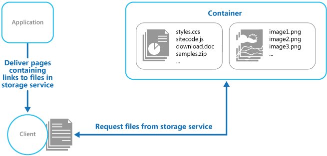

Deploy static content to a cloud-based storage service that can deliver them directly to the client. This can reduce the need for potentially expensive compute instances.

## Context and problem

Web applications typically include some elements of static content. This static content might include HTML pages and other resources such as images and documents that are available to the client, either as part of an HTML page (such as inline images, style sheets, and client-side JavaScript files) or as separate downloads (such as PDF documents).

Although web servers are optimized for dynamic rendering and output caching, they still have to handle requests to download static content. This consumes processing cycles that could often be put to better use.

## Solution

In most cloud hosting environments, you can put some of an application's resources and static pages in a storage service. The storage service can serve requests for these resources, reducing load on the compute resources that handle other web requests. The cost for cloud-hosted storage is typically much less than for compute instances.

When hosting some parts of an application in a storage service, the main considerations are related to deployment of the application and to securing resources that aren't intended to be available to anonymous users.

## Issues and considerations

Consider the following points when deciding how to implement this pattern:

- The hosted storage service must expose an HTTP endpoint that users can access to download the static resources. Some storage services also support HTTPS, so it's possible to host resources in storage services that require SSL.

- For maximum performance and availability, consider using a content delivery network (CDN) to cache the contents of the storage container in multiple datacenters around the world. However, you'll likely have to pay for using the CDN.

- Storage accounts are often geo-replicated by default to provide resiliency against events that might affect a datacenter. This means that the IP address might change, but the URL will remain the same.

- When some content is located in a storage account and other content is in a hosted compute instance, it becomes more challenging to deploy and update the application. You might have to perform separate deployments, and version the application and content to manage it more easily&mdash;especially when the static content includes script files or UI components. However, if only static resources have to be updated, they can simply be uploaded to the storage account without needing to redeploy the application package.

- Storage services might not support the use of custom domain names. In this case it's necessary to specify the full URL of the resources in links because they'll be in a different domain from the dynamically-generated content containing the links.

- The storage containers must be configured for public read access, but it's vital to ensure that they aren't configured for public write access to prevent users being able to upload content.

- Consider using a valet key or token to control access to resources that shouldn't be available anonymously. See the [Valet Key pattern](./valet-key.yml) for more information.

## When to use this pattern

This pattern is useful for:

- Minimizing the hosting cost for websites and applications that contain some static resources.

- Minimizing the hosting cost for websites that consist of only static content and resources. Depending on the capabilities of the hosting provider's storage system, it might be possible to entirely host a fully static website in a storage account.

- Exposing static resources and content for applications running in other hosting environments or on-premises servers.

- Locating content in more than one geographical area using a content delivery network that caches the contents of the storage account in multiple datacenters around the world.

- Monitoring costs and bandwidth usage. Using a separate storage account for some or all of the static content allows the costs to be more easily separated from hosting and runtime costs.

This pattern might not be useful in the following situations:

- The application needs to perform some processing on the static content before delivering it to the client. For example, it might be necessary to add a timestamp to a document.

- The volume of static content is very small. The overhead of retrieving this content from separate storage can outweigh the cost benefit of separating it out from the compute resource.

## Example

Azure Storage supports serving static content directly from a storage container. Files are served through anonymous access requests. By default, files have a URL in a subdomain of `core.windows.net`, such as `https://contoso.z4.web.core.windows.net/image.png`. You can configure a custom domain name, and use Azure CDN to access the files over HTTPS. For more information, see [Static website hosting in Azure Storage](/azure/storage/blobs/storage-blob-static-website).



Static website hosting makes the files available for anonymous access. If you need to control who can access the files, you can store files in Azure blob storage and then generate [shared access signatures](/azure/storage/common/storage-dotnet-shared-access-signature-part-1) to limit access.

The links in the pages delivered to the client must specify the full URL of the resource. If the resource is protected with a valet key, such as a shared access signature, this signature must be included in the URL.

A sample application that demonstrates using external storage for static resources is available on [GitHub][sample-app]. This sample uses configuration files to specify the storage account and container that holds the static content.

```xml
<Setting name="StaticContent.StorageConnectionString"
         value="UseDevelopmentStorage=true" />
<Setting name="StaticContent.Container" value="static-content" />
```

The `Settings` class in the file Settings.cs of the StaticContentHosting.Web project contains methods to extract these values and build a string value containing the cloud storage account container URL.

```csharp
public class Settings
{
  public static string StaticContentStorageConnectionString {
    get
    {
      return RoleEnvironment.GetConfigurationSettingValue(
                              "StaticContent.StorageConnectionString");
    }
  }

  public static string StaticContentContainer
  {
    get
    {
      return RoleEnvironment.GetConfigurationSettingValue("StaticContent.Container");
    }
  }

  public static string StaticContentBaseUrl
  {
    get
    {
        var blobServiceClient = new BlobServiceClient(StaticContentStorageConnectionString);

        return string.Format("{0}/{1}", blobServiceClient.Uri.ToString().TrimEnd('/'), StaticContentContainer.TrimStart('/'));
    }
  }
}
```

The `StaticContentUrlHtmlHelper` class in the file StaticContentUrlHtmlHelper.cs exposes a method named `StaticContentUrl` that generates a URL containing the path to the cloud storage account if the URL passed to it starts with the ASP.NET root path character (~).

```csharp
public static class StaticContentUrlHtmlHelper
{
  public static string StaticContentUrl(this HtmlHelper helper, string contentPath)
  {
    if (contentPath.StartsWith("~"))
    {
      contentPath = contentPath.Substring(1);
    }

    contentPath = string.Format("{0}/{1}", Settings.StaticContentBaseUrl.TrimEnd('/'),
                                contentPath.TrimStart('/'));

    var url = new UrlHelper(helper.ViewContext.RequestContext);

    return url.Content(contentPath);
  }
}
```

The file Index.cshtml in the Views\Home folder contains an image element that uses the `StaticContentUrl` method to create the URL for its `src` attribute.

```html

```

## Next steps

- [Static Content Hosting sample][sample-app]. A sample application that demonstrates this pattern.

## Related resources

- [Valet Key pattern](./valet-key.yml). If the target resources aren't supposed to be available to anonymous users, use this pattern to restrict direct access.
- [Serverless web application on Azure](../web-apps/serverless/architectures/web-app.yml). A reference architecture that uses static website hosting with Azure Functions to implement a serverless web app.

[sample-app]: https://github.com/mspnp/cloud-design-patterns/tree/master/static-content-hosting
