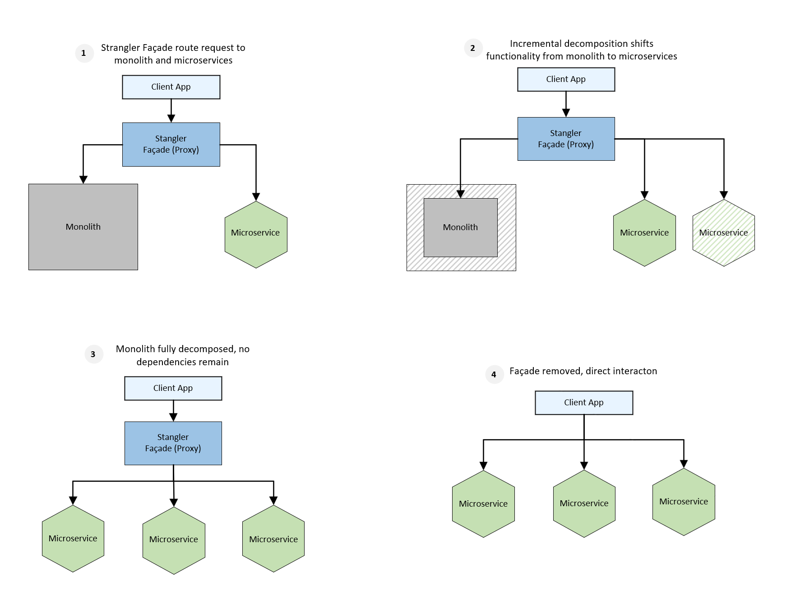
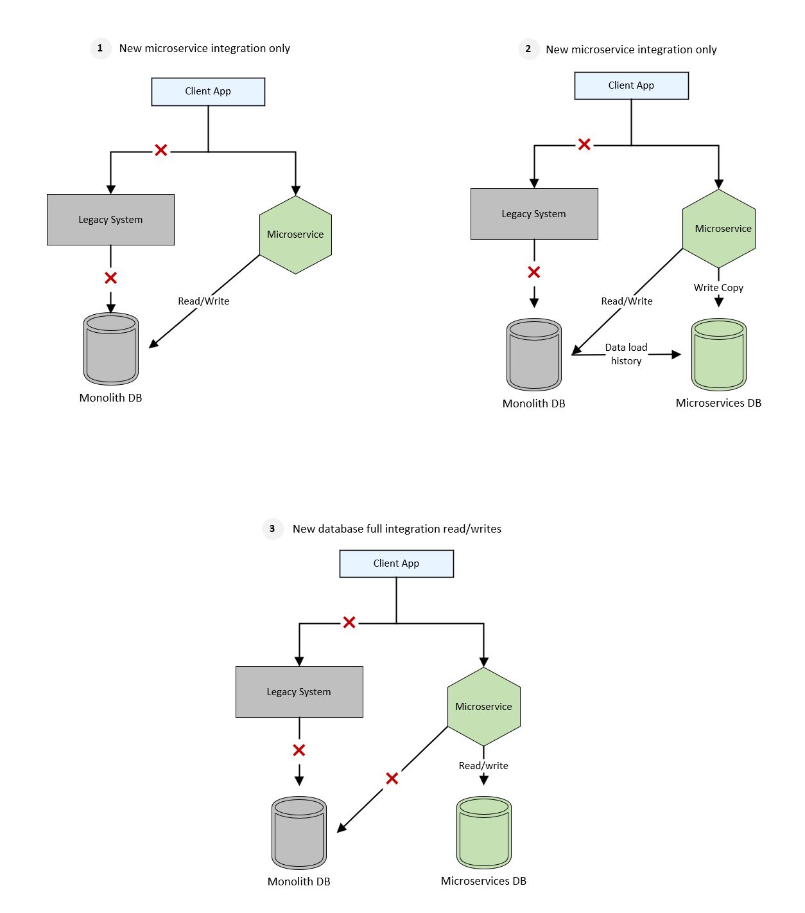

Incrementally migrate a legacy system by gradually replacing specific pieces of functionality with new applications and services. As features from the legacy system are replaced, the new system eventually replaces all of the old system's features, strangling the old system and allowing you to decommission it.

## Context and problem

As systems age, the development tools, hosting technology, and even system architectures they were built on can become obsolete. As new features and functionality are added, the complexity of these applications can increase and making them harder to maintain or add new features.

Completely replacing a complex system can be a huge undertaking. Often, you will need a gradual migration to a new system, while keeping the old system to handle features that haven't been migrated yet. However, running two separate versions of an application means that clients have to know where particular features are located. Every time a feature or service is migrated, clients need to be updated to point to the new location.

To address these challenges, an approach that enables seamless incremental migration while minimizing disruption to clients is essential. The strangler fig pattern can help guide this process, providing a pathway to modern architectures, such as microservices, over time.

Before applying this pattern, it's crucial to understand the system architecture and decompose it into manageable, independent components. This involves aligning stakeholders on clear migration goals and identifying key integration points, as well as areas where functionality can be isolated and migrated incrementally without disrupting the overall system.

## Solution

The Strangler Fig Pattern suggests incrementally replacing specific pieces of functionality with new applications and services. To facilitate this, a façade layer is introduced to intercept requests going to the backend legacy system. The façade then routes these requests to the legacy application and the new services. This allows the existing features to be gradually migrated while maintaining the same interface for consumers, ensuring they remain unaware of the ongoing migration.

The Strangler façade serves as an intermediary that ensures smooth transitions between the legacy system and the new services. It helps mitigate the risks associated with large-scale migration by spreading the effort over time, enabling teams to move forward at a pace that suits the complexity of the project. Over time, as features are migrated, the legacy system is gradually "strangled" and can eventually be decommissioned.

The Strangler Fig pattern begins by introducing a Strangler Facade (proxy) in front of the monolithic application and new services. This proxy acts as an intermediary, allowing the client application to continue interacting with the monolith while also facilitating the integration of new microservices. Initially, the proxy routes most requests to the monolith (as shown in Step 1), but as new microservices are developed, specific functionalities of the monolith can be offloaded to these microservices. This setup ensures that the system remains functional while the decomposition process begins.

As the system evolves (Step 2), the Strangler Facade continues to route requests to both the monolith and the microservices. With each iteration, additional pieces of functionality are extracted from the monolith and implemented in microservices. This incremental approach enables a gradual reduction in the monolith’s responsibilities while expanding the scope of the microservices. The process is iterative, allowing the team to address complexities and dependencies in manageable stages, ensuring that the system remains stable and functional throughout.

Once all the monolith’s functionality is migrated to microservices (Step 3), the monolith is left without any dependencies. The Strangler Facade now routes all requests exclusively to the microservices, and the monolith becomes obsolete. This marks the completion of the monolith’s decomposition, as it no longer plays a role in the system's operation. The client application interacts with the microservices entirely through the proxy, ensuring seamless functionality during the transition.

Finally (Step 4), the Strangler Facade is removed, as the monolith has been completely replaced by microservices. The client application is reconfigured to communicate directly with the microservices, eliminating the need for the proxy. This marks the transition to a full microservices architecture, where the system achieves greater scalability, flexibility, and independence. The timeline for this process depends on the complexity and size of the monolith, but the gradual approach ensures minimal disruption to the application throughout the migration.

This pattern allows a gradual transition from monolith to microservices, ensuring that the existing application continues to function throughout the migration process. With the façade safely routing users to the correct application, you can add functionality to the new system at whatever pace you like, while ensuring the legacy application continues to function. Over time, as features are migrated to the new system, the legacy system is eventually "strangled" and is no longer necessary. Once this process is complete, the legacy system can safely be retired.

## Strangler Fig Implementation for Database

Traditional applications typically rely on a monolithic database. Over time, this database can become increasingly complex and centralized, much like its monolithic counterpart, with tangled dependencies that are difficult to untangle.

There are various database patterns that can be used when breaking up monolithic databases. Strangler Fig pattern can also be applied to the database level as well. The migration from a monolithic database to microservices involves routing traffic to new microservices while syncing data between the old and new databases. Once both databases are in sync and validated, the system fully transitions to the new database, deprecating the old one.

The Strangler Fig pattern for database migration begins with introducing a new microservice that integrates with the existing system while relying on the monolithic database as the system of record. The client app routes specific requests to the new microservice, which reads and writes data directly to the monolithic database (as shown in Step 1). The legacy system remains fully functional at this stage, and no changes are made to the database structure, ensuring minimal disruption.

In the next phase, a new microservices database is introduced. Historical data is prefilled into this database using an ETL (Extract, Transform, Load) process to synchronize it with the monolithic database (Step 2). The new microservice starts performing shadow writes, updating both databases in parallel to ensure data consistency. The monolithic database remains the SOR (system of record) during this phase, allowing a safe transition and validation of database writes and relationships.

Finally, the microservices database takes over as the primary system of record (Step 3). The new microservice handles all read and write operations exclusively through the microservices database, while the legacy system and monolithic database are deprecated for this domain. At this stage, the domain-specific tables in the monolithic database can be retired, completing the migration process.

## Issues and considerations

- Consider how to handle services and data stores that are potentially used by both new and legacy systems. Make sure both can access these resources side-by-side.
- Structure new applications and services in a way that they can easily be intercepted and replaced in future strangler fig migrations.
- At some point, when the migration is complete, the strangler fig façade will either go away or evolve into an adaptor for legacy clients.
- Make sure the façade keeps up with the migration.
- Make sure the façade doesn't become a single point of failure or a performance bottleneck.

## When to use this pattern

Use this pattern when gradually migrating a back-end application to a new architecture.

This pattern may not be suitable:

- When requests to the back-end system cannot be intercepted.
- For smaller systems where the complexity of wholesale replacement is low.

## Workload design

An architect should evaluate how the Strangler Fig pattern can be used in their workload's design to address the goals and principles covered in the [Azure Well-Architected Framework pillars](/azure/well-architected/pillars). For example:

| Pillar | How this pattern supports pillar goals |
| :----- | :------------------------------------- |
| [Reliability](/azure/well-architected/reliability/checklist) design decisions help your workload become **resilient** to malfunction and to ensure that it **recovers** to a fully functioning state after a failure occurs. | This pattern's incremental approach can help mitigate risks during a component transition vs large systemic changes.   - [RE:08 Testing](/azure/well-architected/reliability/testing-strategy) |
| [Cost Optimization](/azure/well-architected/cost-optimization/checklist) is focused on **sustaining and improving** your workload's **return on investment**. |  The goal of this approach is to maximize the use of existing investments in the currently running system while modernizing incrementally, as such it enables you to perform high-ROI replacements before low-ROI replacements.   - [CO:07 Component costs](/azure/well-architected/cost-optimization/optimize-component-costs)  - [CO:08 Environment costs](/azure/well-architected/cost-optimization/optimize-environment-costs) |
| [Operational Excellence](/azure/well-architected/operational-excellence/checklist) helps deliver **workload quality** through **standardized processes** and team cohesion. | This pattern provides a continuous improvement approach, in which incremental replacement with small changes over time is preferred rather than large systemic changes that are riskier to implement.   - [OE:06 Workload development](/azure/well-architected/operational-excellence/workload-supply-chain)  - [OE:11 Safe deployment practices](/azure/well-architected/operational-excellence/safe-deployments) |

As with any design decision, consider any tradeoffs against the goals of the other pillars that might be introduced with this pattern.

## Next steps

- Martin Fowler's blog post on [StranglerFigApplication](https://martinfowler.com/bliki/StranglerFigApplication.html)

## Related resources

- [Messaging Bridge pattern](./messaging-bridge.yml)