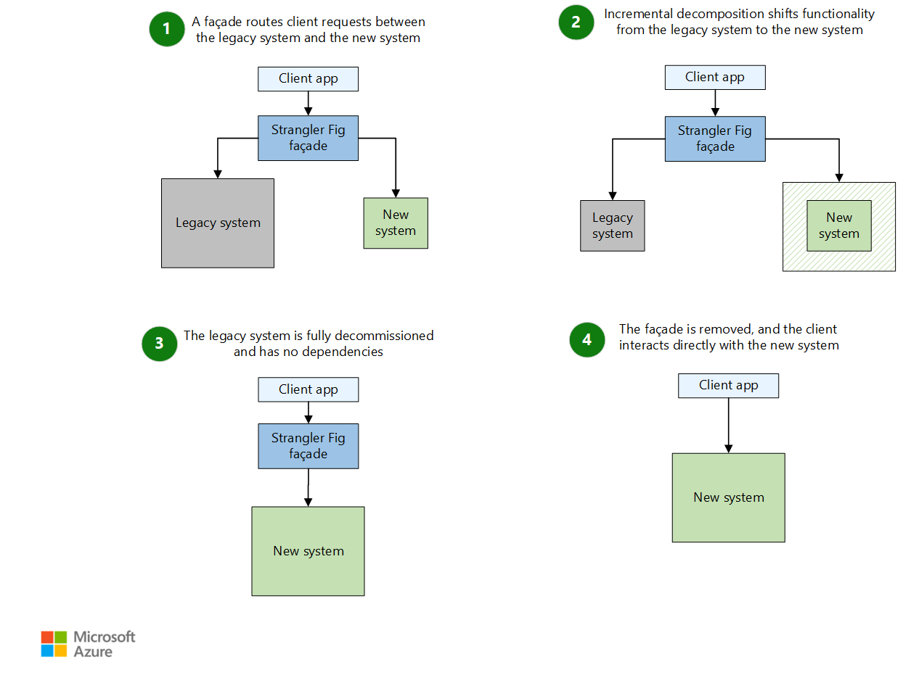

# Strangler Pattern

Use the strangler pattern to migrate legacy services to new ones. This pattern is useful when you want to incrementally move features from legacy systems to more modern systems, while allowing the new system to add features in the meantime. As features from the legacy system are replaced, the new system eventually replaces all of the old systems features, strangling the old system and allowing you to de-commissioned it. 

## Context and Problem

As systems age the development tools, hosting technology, and even system architectures that they were built on can become increasingly obsolete. Over time, and with the continual addition of new features and functionality, the complexity of these applications can also increase dramatically, making maintenance more difficult, and adding additional challenges to any further feature additions.

Replacing a complex system wholesale can be a huge undertaking. In many scenarios, you will need to gradually migrate to a new system, retaining the old system to handle features not yet added to the new system. However, maintaining two versions of your application or services means clients need to know where particular features are located. Every time a feature or service is migrated, clients need to be updated to point to the new resource location.

## Solution

Minimize risk and spread development effort over time by using the strangler pattern. Incrementally migrate a legacy system by gradually replacing specific pieces of functionality with new applications and services. 

Using the strangler pattern, new features are deployed behind a façade that intercepts requests going to the backend legacy system. The façade routes these requests to be handled either by the legacy service or the new service. Existing features can be migrated from the legacy system to the new system gradually and, since the changes are hidden behind the façade, the consumers continue to use the same interface, unaware that any migration has taken place.

  

With the façade safely routing users to the correct application, you can add or replace functionality on the new system at whatever pace you like while ensuring the legacy app continues to function. As more and more features are handled by the new system rather than the legacy implementations, the legacy system is eventually "strangled" and is no longer necessary. Once this process of replacing all legacy features with newer replacements is complete, the legacy system can be safely retired.

## Issues and Considerations

- Consider how to handle services and data stores that are potentially used by both new and legacy systems. Make sure both can access these resources side-by-side.
- Make sure to structure new applications and services in a way that they can easily be intercepted and replaced in future strangler migrations.
- At some point when the migration is complete, the strangler façade will either go away or evolve into an adaptor for legacy clients.
- Make sure the strangler façade keeps up with the migration.
- Make sure the strangler doesn't become a single point of failure or a performance bottleneck.

## When to Use this Pattern

Use this pattern gradually migrating a back-end application to a new architecture.

This pattern may not be suitable:

- When requests to the back-end system cannot be intercepted.
- For smaller systems where the complexity of wholesale replacement is low.

## Related guidance

- Anti-corruption Pattern
- Gateway Routing Pattern

 

