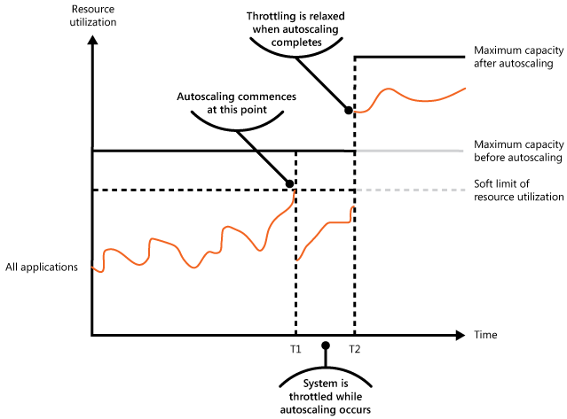
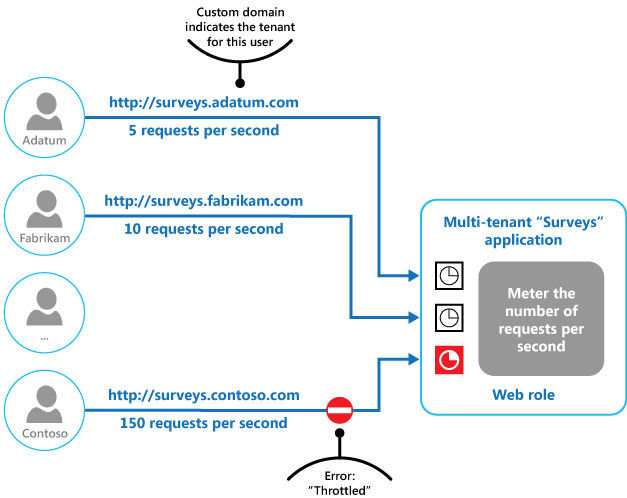

Control the consumption of resources used by an application instance, an individual tenant, or an entire service. With this pattern, the system continues to function and meets service-level objectives (SLOs) under sudden or sustained load.

## Context and problem

The load on a cloud application varies over time based on active users and the work that they do. More users sign in during business hours, and the system runs computationally expensive analytics at the end of each month. Sudden bursts also occur. If processing demand exceeds available capacity, the system slows or fails. When the system has an agreed service level, that failure violates the SLO.

Several strategies handle varying load, depending on the application's business goals. One strategy is [autoscaling](../best-practices/auto-scaling.md), which matches provisioned resources to current demand and controls cost. But provisioning new resources takes time and adds cost. Demand that exceeds capacity growth or budget creates a resource deficit.

## Solution

An alternative to autoscaling is to cap resource use and throttle requests when usage crosses the cap. The workload monitors its own resource use and throttles requests from one or more users when usage exceeds the threshold. The system keeps functioning and continues to meet its SLOs.

Throttling is a control loop, not a single admission decision. The system needs low-latency signals at three layers: infrastructure utilization, application state, and per-principal counters. It continuously measures saturation, enforces limits at well-defined boundaries, and adapts those limits as traffic patterns change. Overload is a normal operating mode that a mature system detects and recovers from. Throttling provides [self-preservation](/azure/well-architected/reliability/self-preservation) capabilities in your workload.

The system could implement several throttling or related strategies, including:

- **Per-principal rate limits:** Reject requests from a user who's already exceeded the configured rate over a defined window. This strategy requires the system to attribute each request to a principal and meter resource use against that principal. For multitenant workloads, see [Measure the consumption of each tenant](../guide/multitenant/considerations/measure-consumption.md).

- **Graceful feature degradation:** Turn off or degrade nonessential features so that essential features have enough resources. This strategy trades response completeness for availability. For example, a video-streaming application can drop to a lower resolution.

- **Load leveling:** [Smooth activity volume by using a queue](./queue-based-load-leveling.yml). In a multitenant environment, leveling reduces performance for every tenant. When tenants have different service-level agreements (SLAs), process work for high-value tenants immediately and hold lower-priority work until the backlog eases. Implement this approach with the [Priority Queue pattern](./priority-queue.yml) or by exposing separate endpoints per priority tier.

- **Priority-based deferral:** Defer operations on behalf of lower-priority applications or tenants. Suspend or limit operations, and return an exception that tells the tenant to retry later.

- **Outbound rate limits:** Cap your own outbound calls when an external dependency fails or returns errors. Lower the in-flight request count to stop flooding logs and to avoid retry costs against an unhealthy dependency. Restore normal request flow after the dependency recovers. For example, [NServiceBus](https://docs.particular.net/nservicebus/recoverability/#automatic-rate-limiting) implements this functionality.

The following chart shows resource use (a combination of memory, CPU, bandwidth, and other factors) over time for an application that uses three features, labeled A, B, and C. A feature is a specific area of functionality, such as a component that performs a specific set of tasks, a piece of code that performs a complex calculation, or an element that provides a service such as an in-memory cache.

:::image type="complex" border="false" source="./_images/throttling-resource-utilization.png" alt-text="Graph that shows resource use against time for applications that run on behalf of three users." lightbox="./_images/throttling-resource-utilization.png":::

:::image-end:::

The chart is a stacked area chart. The area below Feature A's line shows the resources that Feature A consumes, the area between Feature A's and Feature B's lines shows the resources that Feature B consumes, and the area between Feature B's and Feature C's lines shows the resources that Feature C consumes. Feature C's line sits at the top of the stack, so it also shows total system resource use over time.

The chart illustrates graceful feature degradation. Just before time T1, total resource use approaches the threshold and risks exhausting available capacity. Feature B is less critical than Feature A or Feature C, so the system turns off Feature B and releases its resources. Between times T1 and T2, Feature A and Feature C continue normally. By time T2, total resource use has fallen enough to turn Feature B back on.

You can combine autoscaling, graceful degradation, and throttling to keep applications responsive and within SLAs. When you expect demand to stay high, throttling holds the line while the system scales out. After scaling completes, the system restores full functionality.

The next chart shows total resource use over time and illustrates how throttling combines with autoscaling and other compensating controls.

At time T1, the system reaches the soft limit and starts to scale out. If new resources don't arrive in time, demand can exhaust the existing resources, and the system can fail. Throttling rejects excess requests during scale-out to keep resource use below the hard limit, then lifts those restrictions after new capacity comes online.

> [!TIP]
> Edge controls and the Throttling pattern address different problems. Edge controls, such as [Azure DDoS Protection](/azure/ddos-protection/ddos-protection-overview) and web application firewall (WAF) rate-limit rules, run at the network boundary and drop volumetric or abusive traffic before it reaches your application. The Throttling pattern runs inside your application and meters *legitimate* traffic against application-defined limits. Use both layers together. DDoS protection doesn't stop a legitimate user from running a runaway job, and application throttling doesn't absorb a volumetric attack.

## Problems and considerations

Consider the following points as you decide how to implement this pattern:

- Throttling is an architectural decision that affects the whole system, so decide on it early. Retrofitting it later is expensive.

- Align throttling limits with the component that saturates first.

  Request rate is the most familiar dimension to limit, but the real bottleneck is often concurrent in-flight requests, queue depth, CPU or memory utilization, or a downstream dependency's own limits. A requests-per-second limit doesn't protect a system whose bottleneck is concurrency at a fan-out point.

  At each throttling enforcement boundary, such as the gateway, the service, a partition, or a downstream dependency, identify what saturates first and set the limit on that dimension. For concurrency-bounded protection at fan-out points, see the [Bulkhead pattern](./bulkhead.md), which complements throttling.

- Pick a limiting algorithm intentionally. Match it to the tolerance of the component that you're protecting.

  | Algorithm | Behavior and best fit |
  | :-------- | :-------------------- |
  | Token bucket | Supports bursts up to a configured size while enforcing a steady refill rate. Fits gateways that need to absorb short spikes. |
  | Leaky bucket | Emits at a constant rate. Fits back ends that need a steady ingress rate. |
  | Fixed window | Simple to implement, but admits back-to-back bursts at window boundaries. |
  | Sliding window | Smooths the window-boundary problem of fixed windows at the cost of more state. |

- Decide who feels the limit. Throttling at a coarse boundary, such as a regional gateway, can affect many unrelated users when only a few drive the load.

- Decide where the counter lives when one limit spans multiple nodes. Local counters are fast but undercount when the same caller hits multiple replicas. A centralized counter in a shared store like Redis sees every request but adds latency to each decision. You can approximate a global rate by dividing the limit among replicas and reconciling periodically.

- Make throttling decisions quickly. The system must detect rising load, react, and return to normal after load eases. This process requires continuous performance instrumentation.

- Shed load proactively, not at the edge of collapse. A throttle that only rejects after a component saturates causes latency to spike before callers see any back-pressure.

  As utilization approaches the hard limit, start rejecting a growing fraction of requests. Early rejection signals callers to back off and prevents the latency collapse that abrupt limits often trigger. Use p99 latency against your SLO as the primary trigger. Average utilization can look healthy while p99 has already breached.

  Where you can distinguish request value, shed lower-value or more retryable work first. FOr more information, see the [Priority Queue pattern](./priority-queue.yml).

- When a service rejects a request temporarily, return a status code that tells the client that the rejection is because of throttling:

  - HTTP 429 Too Many Requests: The caller exceeded a configured request rate over a defined window.
  - HTTP 503 Service Unavailable: The service can't handle the request right now, often because of an unexpected load spike.

  Include a `Retry-After` HTTP header so that the client can pick a retry strategy. Return enough context for the caller to retry deliberately instead of guessing. For example, name the limit that was exceeded, clarify the affected scope, or suggest a rate that would succeed. Unexplained rejections don't help callers adapt.

- Propagate overload signals from your dependencies instead of absorbing them. A service that throttles its callers must also honor the throttling responses that it receives from its own downstream dependencies. If your service hides a downstream 429 or 503 response by retrying silently or by returning a generic 500 response, callers can't slow down, retries amplify, and the overload cascades back upstream. The [Retry Storm antipattern](../antipatterns/retry-storm/index.md) describes this failure mode. Surface back-pressure to upstream callers so that the entire call chain sheds load together.

- Make rejection cheaper than the work that it prevents. If refusing a request requires heavy authentication, deep parsing, or complex policy evaluation, a flood of rejections can still saturate the system. Reject as early in the request pipeline as possible, and load test the rejection path itself.

- Throttling can't always buy enough time for autoscale. If demand grows faster than new capacity comes online, even a throttled system can fail. If that outcome is unacceptable, keep larger capacity reserves and configure more aggressive autoscaling.

- Don't use caching as a substitute for throttling. A cache lowers average load on the origin but doesn't bound peak load. Cache misses pass through to the origin, and a popular key expiring under heavy traffic can cause many callers to race to refill it. Use caching to reduce normal pressure and throttling to bound the worst case. For more information, see the [Cache-Aside pattern](./cache-aside.yml).

- Normalize resource costs for different operations because they generally don't carry equal execution costs. For example, throttling limits might be higher for read operations and lower for write operations. Ignoring per-operation cost can exhaust capacity and create an attack vector.

- Make throttling configuration changeable at runtime. When abnormal load arrives, you need to adjust limits without a deployment. Deployments are slow and risky during an incident. The [External Configuration Store pattern](./external-configuration-store.md) externalizes the configuration so that you can change it at runtime.

- Consider adaptive limits instead of static ones. Some throttling SDKs react to latency or queue-depth signals so that the limit tracks actual component conditions. Always pair an adaptive limiter with an absolute maximum.

- Revisit your limits as the workload evolves. Adaptive limiters can't track every kind of drift, such as SLO changes, changes in dependency capacity, or shifts in per-operation cost. Schedule periodic operator review against those inputs.

## When to use this pattern

Use this pattern:

- To keep a system within its service-level objectives (SLOs).

- To prevent a single tenant from monopolizing application resources.

- To handle bursts in activity.

- To cap the maximum resource level a system needs.

- To reduce low value compute during periods of high grid carbon intensity.

## Workload design

An architect should evaluate how the Throttling pattern can be used in their workload's design to address the goals and principles covered in the [Azure Well-Architected Framework pillars](/azure/well-architected/pillars). For example:

| Pillar | How this pattern supports pillar goals |
| :----- | :------------------------------------- |
| [Reliability](/azure/well-architected/reliability/checklist) design decisions help your workload become **resilient** to malfunction and to ensure that it **recovers** to a fully functioning state after a failure occurs. | You design the limits to help prevent resource exhaustion that might lead to malfunctions. You can also use this pattern as a control mechanism in a graceful degradation plan.   - [RE:07 Self-preservation](/azure/well-architected/reliability/self-preservation) |
| [Security](/azure/well-architected/security/checklist) design decisions help ensure the **confidentiality**, **integrity**, and **availability** of your workload's data and systems. | You can design the limits to help prevent resource exhaustion that could result from automated abuse of the system.   - [SE:06 Network controls](/azure/well-architected/security/networking)  - [SE:08 Hardening resources](/azure/well-architected/security/harden-resources) |
| [Cost Optimization](/azure/well-architected/cost-optimization/checklist) is focused on **sustaining and improving** your workload's **return on investment**. | The enforced limits can inform cost modeling and can be directly tied to the business model of your application. They also put clear upper bounds on utilization, which can be factored into resource sizing.   - [CO:02 Cost model](/azure/well-architected/cost-optimization/cost-model)  - [CO:12 Scaling costs](/azure/well-architected/cost-optimization/optimize-scaling-costs) |
| [Performance Efficiency](/azure/well-architected/performance-efficiency/checklist) helps your workload **efficiently meet demands** through optimizations in scaling, data, code. | When the system is under high demand, this pattern helps mitigate congestion that can lead to performance bottlenecks. You can also use it to proactively avoid noisy neighbor scenarios.   - [PE:02 Capacity planning](/azure/well-architected/performance-efficiency/capacity-planning)  - [PE:05 Scaling and partitioning](/azure/well-architected/performance-efficiency/scale-partition) |

As with any design decision, consider any tradeoffs against the goals of the other pillars that might be introduced with this pattern.

## Example

The final figure illustrates how throttling can be implemented in a multitenant system. Users from each of the tenant organizations access a cloud-hosted application where they fill out and submit surveys. The application contains instrumentation that monitors the rate at which these users are submitting requests to the application.

In order to prevent the users from one tenant affecting the responsiveness and availability of the application for all other users, a limit is applied to the number of requests per second the users from any one tenant can submit. The application blocks requests that exceed this limit.

## Next steps

The following guidance might also be relevant when implementing this pattern:

- [Architecture strategies for designing a monitoring system](/azure/well-architected/operational-excellence/observability). Throttling depends on continuous, low-latency signals about resource use and saturation. This guidance describes how to design the instrumentation, collection, and alerting that your throttling control loop relies on.
- [Measure the consumption of each tenant](../guide/multitenant/considerations/measure-consumption.md). Per-tenant throttling requires attributing each request to a principal and metering its resource use. This guidance covers the per-tenant signals and approaches you need before you can enforce per-tenant limits.
- [Autoscaling in Azure](../best-practices/auto-scaling.md). Throttling can hold the line while a system autoscales, or remove the need for autoscaling. This guidance covers autoscaling strategies.

## Related resources

The following patterns might also be relevant when implementing this pattern:

- [Queue-based Load Leveling pattern](./queue-based-load-leveling.yml). A common mechanism for implementing throttling. The queue buffers incoming requests and evens out the rate at which they reach the service.
- [Priority Queue pattern](./priority-queue.yml). Use priority queuing as part of throttling to preserve performance for critical or higher-value work and degrade lower-value work.
- [External Configuration Store pattern](./external-configuration-store.md). Centralize the throttling policy so you can change it at runtime without redeploying. Services can subscribe to configuration changes and apply new limits immediately to stabilize the system.
