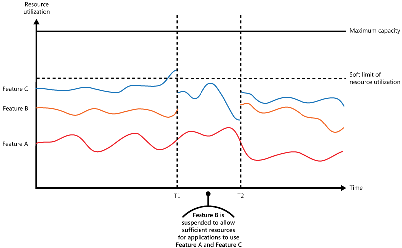

Control the consumption of resources used by an application instance, an individual tenant, or an entire service. This lets the system continue to function and meet service-level objectives (SLOs) under sudden or sustained load.

## Context and problem

The load on a cloud application varies over time based on active users and the work they're doing. Users concentrate during business hours, or the system runs computationally expensive analytics at the end of each month. Sudden bursts also occur. If processing demand exceeds available capacity, the system slows or fails. When the system has an agreed service level, that failure violates the SLO.

Several strategies handle varying load, depending on the application's business goals. One is [autoscaling](../best-practices/auto-scaling.md), which matches provisioned resources to current demand and controls cost. But provisioning new resources takes time and adds cost. When demand grows faster than capacity arrives or cost allows, there's a window of resource deficit.

## Solution

An alternative to autoscaling is to cap resource use and throttle requests when usage crosses the cap. The workload monitors its own resource use and throttles requests from one or more users when usage exceeds the threshold. The system keeps functioning and continues to meet its SLOs.

Throttling is a control loop, not a single admission decision. The system needs low-latency signals at three layers: infrastructure utilization, application state, and per-principal counters. It continuously measures saturation, enforces limits at well-defined boundaries, and adapts those limits as traffic patterns change. Overload is a normal operating mode that a mature system detects and recovers from. Throttling provides [self-preservation](/azure/well-architected/reliability/self-preservation) capabilities in your workload.

The system could implement several throttling or related strategies, including:

- Reject requests from a user who's already exceeded the configured rate over a defined window. This requires the system to attribute each request to a principal and meter resource use against that principal. For multitenant workloads, see [Measure the consumption of each tenant](../guide/multitenant/considerations/measure-consumption.md).

- Disable or degrade nonessential features so essential features have enough resources. This trades response completeness for availability. For example, a video-streaming application can drop to a lower resolution.

- Use load leveling to smooth activity volume; see the [Queue-based Load Leveling pattern](./queue-based-load-leveling.yml). In a multitenant environment, leveling reduces performance for every tenant. When tenants have different SLAs, process work for high-value tenants immediately and hold lower-priority work until the backlog eases. Implement this with the [Priority Queue pattern](./priority-queue.yml) or by exposing separate endpoints per priority tier.

- Defer operations on behalf of lower-priority applications or tenants. Suspend or limit them and return an exception telling the tenant to retry later.

- Rate limit your own outbound calls when an external dependency is failing or returning errors. Lower the in-flight request count to stop flooding logs and to avoid retry costs against an unhealthy dependency. Restore normal request flow once the dependency recovers. [NServiceBus](https://docs.particular.net/nservicebus/recoverability/#automatic-rate-limiting) is one library that implements this.

The figure shows an area graph for resource use (a combination of memory, CPU, bandwidth, and other factors) against time for applications that are making use of three features. A feature is an area of functionality, such as a component that performs a specific set of tasks, a piece of code that performs a complex calculation, or an element that provides a service such as an in-memory cache. These features are labeled A, B, and C.

> The area immediately below the line for a feature indicates the resources that are used by applications when they invoke this feature. For example, the area below the line for Feature A shows the resources used by applications that are making use of Feature A, and the area between the lines for Feature A and Feature B indicates the resources used by applications invoking Feature B. Aggregating the areas for each feature shows the total resource use of the system.

The figure shows the effects of deferring operations. Just before time T1, total resource use reaches the threshold and the applications risk exhausting available resources. Feature B is less critical than Feature A or Feature C, so the system disables Feature B and releases its resources. Between times T1 and T2, applications using Feature A and Feature C continue normally. By time T2, their resource use has fallen enough to re-enable Feature B.

You can combine autoscaling, graceful degradation, and throttling to keep applications responsive and within SLAs. When demand is expected to stay high, throttling holds the line while the system scales out. After scaling completes, the system restores full functionality.

The next figure shows total resource use over time and illustrates how throttling combines with autoscaling and other compensating control.

At time T1, the system reaches the soft limit and starts to scale out. If new resources don't arrive in time, the existing resources can be exhausted and the system can fail. Throttling holds the line until scaling completes, then relaxes.

> [!TIP]
> Edge controls such as [Azure DDoS Protection](/azure/ddos-protection/ddos-protection-overview) and web application firewall (WAF) rate-limit rules sit above this pattern. They drop volumetric or abusive traffic at the network boundary before requests reach your application. The Throttling pattern meters *legitimate* traffic against application-defined limits, and doesn't replace those edge controls. Use both layers together: DDoS protection won't stop a user from running a runaway job, and application throttling isn't designed to absorb a volumetric attack.

## Issues and considerations

You should consider the following points when deciding how to implement this pattern:

- Throttling, and the strategy you pick, is an architectural decision that affects the whole system. Decide on it early, retrofitting throttling into an existing system is expensive.

- Align your throttling limits with the component that saturates first.

  Request rate is the most familiar dimension to limit, but the real bottleneck is often concurrent in-flight requests, queue depth, CPU or memory utilization, or a downstream dependency's own limitations. A requests-per-second limit doesn't protect a system whose bottleneck is concurrency at a fan-out point.

  Identify the saturation point at each boundary where you enforce throttling; for example, the gateway, the service, a partition, or a specific downstream dependency. Then set the limit on that dimension. For concurrency-bounded protection at fan-out points, see the [Bulkhead pattern](./bulkhead.md), which complements throttling.

- Pick a limiting algorithm intentionally. Match the algorithm to the tolerance of the component you're protecting.

  | Algorithm | Behavior and best fit |
  | :-------- | :-------------------- |
  | Token bucket | Allows bursts up to a configured size while enforcing a steady refill rate. Fits gateways that need to absorb short spikes. |
  | Leaky bucket | Emits at a constant rate. Fits backends that need a steady ingress rate. |
  | Fixed window | Simple to implement, but allows back-to-back bursts at window boundaries. |
  | Sliding window | Smooths the window-boundary problem of fixed windows at the cost of more state. |

- Decide who feels the limit. Throttling at a coarse boundary, like a regional gateway, can affect many unrelated users when only a few are causing the load.

- Decide where the counter lives when the throttle spans multiple nodes. Local counters are fast but under count when the same caller hits multiple replicas. A centralized counter, stored in a shared dependency like Redis, sees all requests but adds latency to every decision. You can approximate a global rate by dividing the limit among replicas with periodic reconciliation.

- Throttling decisions must be performed quickly. The system must be capable to detect load increases, react, and revert to its original state once load eases. This requires continuous performance instrumentation.

- Shed load proactively, not at the edge of collapse. A throttle that only rejects after a component is fully saturated lets latency spike before callers see any back-pressure.

  As utilization approaches the hard limit, start rejecting a growing fraction of requests; this gives callers earlier signals to back off and avoids the latency collapse that abrupt limits often trigger. Use p99 latency against your SLO as the primary trigger; average utilization can look healthy while p99 has already breached.

  Where you can distinguish request value, shed lower value or more retryable work first; see the [Priority Queue pattern](./priority-queue.yml).

- When a service rejects a request temporarily, it should return a specific status code like 429 ("Too Many Requests") or 503 ("Service Unavailable") so the client knows the rejection is due to throttling.

  - HTTP 429 indicates the calling application sent too many requests in a time window and exceeded a predetermined limit.
  - HTTP 503 indicates the service isn't ready to handle the request, often because of an unexpected load spike.

  The client waits before retrying. Include a `Retry-After` HTTP header so the client can pick a retry strategy.

  Beyond `Retry-After`, return enough context for the caller to retry deliberately rather than blindly. For example, include the limit that was exceeded, clarify the affected scope, or suggest a rate that would succeed. Opaque rejections don't help callers adapt.

- Propagate important overload signals from your dependencies; don't absorb them. A service that throttles its callers should also respect the throttling responses it receives from its own downstream dependencies. If your service masks a downstream's 429 or 503 response by retrying silently or by translating it into an opaque 500, callers can't slow down appropriately, retries amplify, and the overload cascades back through the system. This is the failure mode described by the [Retry Storm antipattern](../antipatterns/retry-storm/index.md). Surface back-pressure to upstream callers so the entire call chain can shed load together.

- Make rejection cheaper than the work it prevents. If refusing a request involves heavy authentication, deep parsing, or complex policy evaluation, a flood of rejected requests can still saturate the system. Reject as early in the request pipeline as you can, and load test the rejection path itself.

- Throttling can't always buy enough time for autoscale. If demand grows faster than new capacity comes online, even a throttled system can fail. Where this is unacceptable, keep larger capacity reserves and configure more aggressive autoscaling.

- Don't substitute caching for throttling. A cache lowers average load on the origin but doesn't bound peak load. Cache misses pass through to the origin, and a popular key expiring under heavy traffic can cause many callers to race to refill it. Use caching to reduce normal pressure and throttling to bound the worst case; see the [Cache-Aside pattern](./cache-aside.yml).

- Normalize resource costs for different operations as they generally don't carry equal execution costs. For example, throttling limits might be higher for read operations and lower for write operations. Ignoring per-operation cost can exhaust capacity and create an attack vector.

- Make throttling configuration changeable at runtime. When abnormal load arrives, you need to adjust limits without a deployment. Deployments are slow and risky during an incident. The [External Configuration Store pattern](./external-configuration-store.md) externalizes the configuration so you can change it on the fly.

- Consider adaptive limits as an alternative to static ones. Some throttling SDKs react to latency or queue depth signals so the limit tracks actual component conditions. Always pair an adaptive limiter with a hard ceiling.

- Revisit your limits as the workload evolves. Adaptive limiters can't track every kind of drift, such as SLO changes, changes in dependency capacity, or shifts in per-operation cost. Schedule periodic operator review against those inputs.

## When to use this pattern

Use this pattern:

- To keep a system within its service-level objectives (SLOs).

- To prevent a single tenant from monopolizing application resources.

- To handle bursts in activity.

- To cap the maximum resource level a system needs.

- To reduce low value compute during periods of high grid carbon intensity.

## Workload design

An architect should evaluate how the Throttling pattern can be used in their workload's design to address the goals and principles covered in the [Azure Well-Architected Framework pillars](/azure/well-architected/pillars). For example:

| Pillar | How this pattern supports pillar goals |
| :----- | :------------------------------------- |
| [Reliability](/azure/well-architected/reliability/checklist) design decisions help your workload become **resilient** to malfunction and to ensure that it **recovers** to a fully functioning state after a failure occurs. | You design the limits to help prevent resource exhaustion that might lead to malfunctions. You can also use this pattern as a control mechanism in a graceful degradation plan.   - [RE:07 Self-preservation](/azure/well-architected/reliability/self-preservation) |
| [Security](/azure/well-architected/security/checklist) design decisions help ensure the **confidentiality**, **integrity**, and **availability** of your workload's data and systems. | You can design the limits to help prevent resource exhaustion that could result from automated abuse of the system.   - [SE:06 Network controls](/azure/well-architected/security/networking)  - [SE:08 Hardening resources](/azure/well-architected/security/harden-resources) |
| [Cost Optimization](/azure/well-architected/cost-optimization/checklist) is focused on **sustaining and improving** your workload's **return on investment**. | The enforced limits can inform cost modeling and can be directly tied to the business model of your application. They also put clear upper bounds on utilization, which can be factored into resource sizing.   - [CO:02 Cost model](/azure/well-architected/cost-optimization/cost-model)  - [CO:12 Scaling costs](/azure/well-architected/cost-optimization/optimize-scaling-costs) |
| [Performance Efficiency](/azure/well-architected/performance-efficiency/checklist) helps your workload **efficiently meet demands** through optimizations in scaling, data, code. | When the system is under high demand, this pattern helps mitigate congestion that can lead to performance bottlenecks. You can also use it to proactively avoid noisy neighbor scenarios.   - [PE:02 Capacity planning](/azure/well-architected/performance-efficiency/capacity-planning)  - [PE:05 Scaling and partitioning](/azure/well-architected/performance-efficiency/scale-partition) |

As with any design decision, consider any tradeoffs against the goals of the other pillars that might be introduced with this pattern.

## Example

The final figure illustrates how throttling can be implemented in a multitenant system. Users from each of the tenant organizations access a cloud-hosted application where they fill out and submit surveys. The application contains instrumentation that monitors the rate at which these users are submitting requests to the application.

In order to prevent the users from one tenant affecting the responsiveness and availability of the application for all other users, a limit is applied to the number of requests per second the users from any one tenant can submit. The application blocks requests that exceed this limit.

## Next steps

The following guidance might also be relevant when implementing this pattern:

- [Architecture strategies for designing a monitoring system](/azure/well-architected/operational-excellence/observability). Throttling depends on continuous, low-latency signals about resource use and saturation. This guidance describes how to design the instrumentation, collection, and alerting that your throttling control loop relies on.
- [Measure the consumption of each tenant](../guide/multitenant/considerations/measure-consumption.md). Per-tenant throttling requires attributing each request to a principal and metering its resource use. This guidance covers the per-tenant signals and approaches you need before you can enforce per-tenant limits.
- [Autoscaling in Azure](../best-practices/auto-scaling.md). Throttling can hold the line while a system autoscales, or remove the need for autoscaling. This guidance covers autoscaling strategies.

## Related resources

The following patterns might also be relevant when implementing this pattern:

- [Queue-based Load Leveling pattern](./queue-based-load-leveling.yml). A common mechanism for implementing throttling. The queue buffers incoming requests and evens out the rate at which they reach the service.
- [Priority Queue pattern](./priority-queue.yml). Use priority queuing as part of throttling to preserve performance for critical or higher-value work and degrade lower-value work.
- [External Configuration Store pattern](./external-configuration-store.md). Centralize the throttling policy so you can change it at runtime without redeploying. Services can subscribe to configuration changes and apply new limits immediately to stabilize the system.
