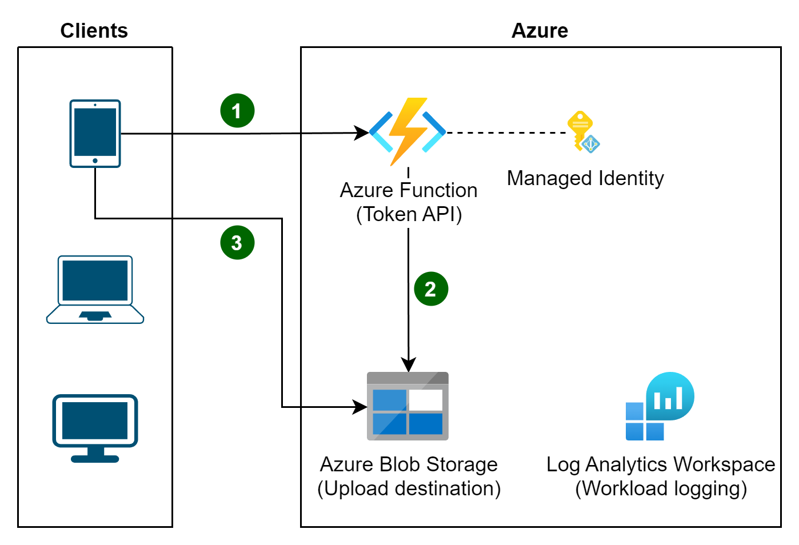

Use a token that provides clients with restricted direct access to a specific resource, in order to offload data transfer from the application. This is particularly useful in applications that use cloud-hosted storage systems or queues, and can minimize cost and maximize scalability and performance.

## Context and problem

Client programs and web browsers often need to read and write files or data streams to and from an application's storage. Typically, the application will handle the movement of the data &mdash; either by fetching it from storage and streaming it to the client, or by reading the uploaded stream from the client and storing it in the data store. However, this approach absorbs valuable resources such as compute, memory, and bandwidth.

Data stores have the ability to handle upload and download of data directly, without requiring that the application perform any processing to move this data. But, this typically requires the client to have access to the security credentials for the store. This can be a useful technique to minimize data transfer costs and the requirement to scale out the application, and to maximize performance. It means, though, that the application is no longer able to manage the security of the data. After the client has a connection to the data store for direct access, the application can't act as the gatekeeper. It's no longer in control of the process and can't prevent subsequent uploads or downloads from the data store.

This isn't a realistic approach in distributed systems that need to serve untrusted clients. Instead, applications must be able to securely control access to data in a granular way, but still reduce the load on the server by setting up this connection and then allowing the client to communicate directly with the data store to perform the required read or write operations.

## Solution

You need to resolve the problem of controlling access to a data store where the store can't manage authentication and authorization of clients. One typical solution is to restrict access to the data store's public connection and provide the client with a key or token that the data store can validate.

This key or token is usually referred to as a valet key. It provides time-limited access to specific resources and allows only predefined operations with granular control such as writing to storage but not reading, or uploading and downloading in a web browser. Applications can create and issue valet keys to client devices and web browsers quickly and easily, allowing clients to perform the required operations without requiring the application to directly handle the data transfer. This removes the processing overhead, and the impact on performance and scalability, from the application and the server.

The client uses this token to access a specific resource in the data store for only a specific period, and with specific restrictions on access permissions, as shown in the figure. After the specified period, the key becomes invalid and won't allow access to the resource.

:::image type="complex" source="./_images/valet-key-pattern.png" alt-text="Diagram of a typical valet key pattern workflow.":::
    Diagram showing an example of the workflow for a system using the valet key pattern. Step 1 shows the user requesting the target resource. Step 2 shows the valet key application checking the validity of the request and generating an access token. Step 3 shows the token being returned to the user. Step 4 shows the user accessing the target resource using the token.
:::image-end:::

It's also possible to configure a key that has other dependencies, such as the scope of the data. For example, depending on the data store capabilities, the key can specify a complete table in a data store, or only specific rows in a table. In cloud storage systems the key can specify a container, or just a specific item within a container.

The key can also be invalidated by the application. This is a useful approach if the client notifies the server that the data transfer operation is complete. The server can then invalidate that key to prevent further access.

Using this pattern can simplify managing access to resources because there's no requirement to create and authenticate a user, grant permissions, and then remove the user again, or worse leave that permission as a standing permission. It also makes it easy to limit the location, the permission, and the validity period&mdash;all by simply generating a key at runtime. The important factors are to limit the validity period, and especially the location of the resource, as tightly as possible so that the recipient can only use it for the intended purpose.

## Issues and considerations

Consider the following points when deciding how to implement this pattern:

**Manage the validity status and period of the key**. If leaked or compromised, the key effectively unlocks the target item and makes it available for malicious use during the validity period. A key can usually be revoked or disabled, depending on how it was issued. Server-side policies can be changed or, the server key it was signed with can be invalidated. Specify a short validity period to minimize the risk of allowing unauthorized operations to take place against the data store. However, if the validity period is too short, the client might not be able to complete the operation before the key expires. Allow authorized users to renew the key before the validity period expires if multiple accesses to the protected resource are required.

**Control the level of access the key will provide**. Typically, the key should allow the user to only perform the actions necessary to complete the operation, such as read-only access if the client shouldn't be able to upload data to the data store. For file uploads, it's common to specify a key that provides write-only permission, as well as the location and the validity period. It's critical to accurately specify the resource or the set of resources to which the key applies.

**Consider how to control users' behavior**. Implementing this pattern means some loss of control over the resources users are granted access to. The level of control that can be exerted is limited by the capabilities of the policies and permissions available for the service or the target data store. For example, it's usually not possible to create a key that limits the size of the data to be written to storage, or the number of times the key can be used to access a file. This can result in huge unexpected costs for data transfer, even when used by the intended client, and might be caused by an error in the code that causes repeated upload or download. To limit the number of times a file can be uploaded, where possible, force the client to notify the application when one operation has completed. For example, some data stores raise events the application code can use to monitor operations and control user behavior. However, it's hard to enforce quotas for individual users in a multitenant scenario where the same key is used by all the users from one tenant. Granting users *create* permissions can help you control the amount of data being updated by making tokens effectively single-use. The *create* permission doesn't allow overwrites, so each token can only be used for one write activity.

**Validate, and optionally sanitize, all uploaded data**. A malicious user that gains access to the key could upload data designed to compromise the system. Alternatively, authorized users might upload data that's invalid and, when processed, could result in an error or system failure. To protect against this, ensure that all uploaded data is validated and checked for malicious content before use.

**Audit all operations**. Many key-based mechanisms can log operations such as uploads, downloads, and failures. These logs can usually be incorporated into an audit process, and also used for billing if the user is charged based on file size or data volume. Use the logs to detect authentication failures that might be caused by issues with the key provider, or accidental removal of a stored access policy.

**Deliver the key securely**. It can be embedded in a URL that the user activates in a web page, or it can be used in a server redirection operation so that the download occurs automatically. Always use HTTPS to deliver the key over a secure channel.

**Protect sensitive data in transit**. Sensitive data delivered through the application will usually take place using TLS, and this should be enforced for clients accessing the data store directly.

Other issues to be aware of when implementing this pattern are:

- If the client doesn't, or can't, notify the server of completion of the operation, and the only limit is the expiration period of the key, the application won't be able to perform auditing operations such as counting the number of uploads or downloads, or preventing multiple uploads or downloads.

- The flexibility of key policies that can be generated might be limited. For example, some mechanisms only allow the use of a timed expiration period. Others aren't able to specify a sufficient granularity of read/write permissions.

- If the start time for the key or token validity period is specified, ensure that it's a little earlier than the current server time to allow for client clocks that might be slightly out of synchronization. The default, if not specified, is usually the current server time.

- The URL containing the key might be recorded in server log files. While the key will typically have expired before the log files are used for analysis, ensure that you limit access to them. If log data is transmitted to a monitoring system or stored in another location, consider implementing a delay to prevent leakage of keys until after their validity period has expired.

- If the client code runs in a web browser, the browser might need to support cross-origin resource sharing (CORS) to enable code that executes within the web browser to access data in a different domain from the one that served the page. Some older browsers and some data stores don't support CORS, and code that runs in these browsers might not be able to use a valet key to provide access to data in a different domain, such as a cloud storage account.

- While the client doesn't need to have pre-configured authentication for to the end resource, the client does need to preestablish means of authentication to the valet key service.

- Keys should only be handed out to authenticated clients with proper authorization.

- The generation of access tokens is privileged action, so the valet key service must be secured with strict access policies. The service might allow access to sensitive systems by third parties, making the security of this service of particular importance.

## When to use this pattern

This pattern is useful for the following situations:

- To minimize resource loading and maximize performance and scalability. Using a valet key doesn't require the resource to be locked, no remote server call is required, there's no limit on the number of valet keys that can be issued, and it avoids a single point of failure resulting from performing the data transfer through the application code. Creating a valet key is typically a simple cryptographic operation of signing a string with a key.

- To minimize operational cost. Enabling direct access to stores and queues is resource and cost efficient, can result in fewer network round trips, and might allow for a reduction in the number of compute resources required.

- When clients regularly upload or download data, particularly where there's a large volume or when each operation involves large files.

- When the application has limited compute resources available, either due to hosting limitations or cost considerations. In this scenario, the pattern is even more helpful if there are many concurrent data uploads or downloads because it relieves the application from handling the data transfer.

- When the data is stored in a remote data store or a different region. If the application was required to act as a gatekeeper, there might be a charge for the additional bandwidth of transferring the data between regions, or across public or private networks between the client and the application, and then between the application and the data store.

This pattern might not be useful in the following situations:

- If clients can already uniquely authenticate to your backend service, with Azure role-based access control (Azure RBAC) for example, don't use this pattern.

- If the application must perform some task on the data before it's stored or before it's sent to the client. For example, if the application needs to perform validation, log access success, or execute a transformation on the data. However, some data stores and clients are able to negotiate and carry out simple transformations such as compression and decompression (for example, a web browser can usually handle gzip formats).

- If the design of an existing application makes it difficult to incorporate the pattern. Using this pattern typically requires a different architectural approach for delivering and receiving data.

- If it's necessary to maintain audit trails or control the number of times a data transfer operation is executed, and the valet key mechanism in use doesn't support notifications that the server can use to manage these operations.

- If it's necessary to limit the size of the data, especially during upload operations. The only solution to this is for the application to check the data size after the operation is complete, or check the size of uploads after a specified period or on a scheduled basis.

## Workload design

An architect should evaluate how the Valet Key pattern can be used in their workload's design to address the goals and principles covered in the [Azure Well-Architected Framework pillars](/azure/well-architected/pillars). For example:

| Pillar | How this pattern supports pillar goals |
| :----- | :------------------------------------- |
| [Security](/azure/well-architected/security/checklist) design decisions help ensure the **confidentiality**, **integrity**, and **availability** of your workload's data and systems. | This pattern enables a client to directly access a resource without needing long-lasting or standing credentials. All access requests start with an auditable transaction. The granted access is then limited in both scope and duration. This pattern also makes it easier to revoke the granted access.<br/><br/> - [SE:05 Identity and access management](/azure/well-architected/security/identity-access) |
| [Cost Optimization](/azure/well-architected/cost-optimization/checklist) is focused on **sustaining and improving** your workload's **return on investment**. | This design offloads processing as an exclusive relationship between the client and the resource without adding a component to directly handle all client requests. The benefit is most dramatic when client requests are frequent or large enough to require significant proxy resources.<br/><br/> - [CO:09 Flow costs](/azure/well-architected/cost-optimization/optimize-flow-costs) |
| [Performance Efficiency](/azure/well-architected/performance-efficiency/checklist) helps your workload **efficiently meet demands** through optimizations in scaling, data, code. | Not using an intermediary resource to proxy the access offloads processing as an exclusive relationship between the client and the resource without requiring an ambassador component that needs to handle all client requests in a performant way. The benefit of using this pattern is most significant when the proxy doesn't add value to the transaction.<br/><br/> - [PE:07 Code and infrastructure](/azure/well-architected/performance-efficiency/optimize-code-infrastructure) |

As with any design decision, consider any tradeoffs against the goals of the other pillars that might be introduced with this pattern.

## Example

Azure supports shared access signatures on Azure Storage for granular access control to data in blobs, tables, and queues, and for Service Bus queues and topics. A shared access signature token can be configured to provide specific access rights such as read, write, update, and delete to a specific table; a key range within a table; a queue; a blob; or a blob container. The validity can be a specified time period. This functionality is well suited for using a valet key for access.

Consider a workload that has hundreds of mobile or desktop clients frequently uploading large binaries. Without this pattern, the workload has essentially two options. The first is to provide standing access and configuration to all the clients to perform uploads directly to a storage account. The other is to implement the [Gateway Routing pattern](./gateway-routing.yml) to set up an endpoint where clients use proxied access to storage, but this might not be adding additional value to the transaction. Both approaches suffer problems addressed in the pattern context:

- Long lived, preshared secrets. Potentially without much way to provide different keys to different clients.
- Added expense for running a compute service that has sufficient resources to deal with currently receiving large files.
- Potentially slowing up client interactions by adding an extra layer of compute and network hop to the upload process.

Using the Valet Key pattern addresses the security, cost optimization, and performance concerns.



1. Clients, at the last responsible moment, authenticate to a light weight, scale-to-zero Azure Function hosted API to request access.
1. The API validates the request and then obtains and returns a time & scope limited SaS token.

   The token generated by the API restricts the client to the following limitations:

   - Which storage account to use. Meaning, the client doesn't need to know this information ahead of time.
   - A specific container and filename to use; ensuring that the token can be used with, at most, one file.
   - A short, window of operation, such as three minutes. This short time period ensures that tokens have a TTL that doesn't extend past its utility.
   - Permissions to only *create* a blob; not download, update, or delete.

1. That token is then used by the client, within the narrow time window, to upload the file directly to the storage account.

The API generates these tokens to authorized clients using a *user delegation key* based on the API's own Microsoft Entra ID managed identity. Logging is enabled on both the storage account(s) and the token generation API allow correlation between token requests and token usage. The API can use client authentication information or other data available to it to decide which storage account or container to use, such as in a multitenant situation.

A complete sample is available on GitHub at [Valet Key pattern example](https://github.com/mspnp/cloud-design-patterns/tree/main/valet-key). The following code snippets are adapted from that example. This first one shows how the Azure Function (found in **ValetKey.Web**) generates a user delegated shared access signature token using the Azure Function's own managed identity.

```csharp
[Function("FileServices")]
public async Task<StorageEntitySas> GenerateTokenAsync([HttpTrigger(...)] HttpRequestData req, ..., 
                                                        CancellationToken cancellationToken)
{
  // Authorize the caller, select a blob storage account, container, and file name.
  // Authenticate to the storage account with the Azure Function's managed identity.
  ...

  return await GetSharedAccessReferenceForUploadAsync(blobContainerClient, blobName, cancellationToken);
}

/// <summary>
/// Return an access key that allows the caller to upload a blob to this
/// specific destination for about three minutes.
/// </summary>
private async Task<StorageEntitySas> GetSharedAccessReferenceForUploadAsync(BlobContainerClient blobContainerClient, 
                                                                            string blobName,
                                                                            CancellationToken cancellationToken)
{
  var blobServiceClient = blobContainerClient.GetParentBlobServiceClient();
  var blobClient = blobContainerClient.GetBlockBlobClient(blobName);

  // Allows generating a SaS token that is evaluated as the union of the RBAC permissions on the managed identity
  // (for example, Blob Data Contributor) and then narrowed further by the specific permissions in the SaS token.
  var userDelegationKey = await blobServiceClient.GetUserDelegationKeyAsync(DateTimeOffset.UtcNow.AddMinutes(-3),
                                                                            DateTimeOffset.UtcNow.AddMinutes(3),
                                                                            cancellationToken);

  // Limit the scope of this SaS token to the following parameters:
  var blobSasBuilder = new BlobSasBuilder
  {
      BlobContainerName = blobContainerClient.Name,     // - Specific container
      BlobName = blobClient.Name,                       // - Specific filename
      Resource = "b",                                   // - Blob only
      StartsOn = DateTimeOffset.UtcNow.AddMinutes(-3),  // - For about three minutes (+/- for clock drift)
      ExpiresOn = DateTimeOffset.UtcNow.AddMinutes(3),  // - For about three minutes (+/- for clock drift)
      Protocol = SasProtocol.Https                      // - Over HTTPS
  };
  blobSasBuilder.SetPermissions(BlobSasPermissions.Create);

  return new StorageEntitySas
  {
      BlobUri = blobClient.Uri,
      Signature = blobSasBuilder.ToSasQueryParameters(userDelegationKey, blobServiceClient.AccountName).ToString();
  };
}
```

The following snippet is the data transfer object (DTO) used by both the API and the client.

```csharp
public class StorageEntitySas
{
  public Uri? BlobUri { get; internal set; }
  public string? Signature { get; internal set; }
}
```

The client (found in **ValetKey.Client**) then uses the URI and token returned from the API to perform the upload without requiring additional resources and at full client-to-storage performance.

```csharp
...

// Get the SaS token (valet key)
var blobSas = await httpClient.GetFromJsonAsync<StorageEntitySas>(tokenServiceEndpoint);
var sasUri = new UriBuilder(blobSas.BlobUri)
{
    Query = blobSas.Signature
};

// Create a blob client using the SaS token as credentials
var blob = new BlobClient(sasUri.Uri);

// Upload the file directly to blob storage
using (var stream = await GetFileToUploadAsync(cancellationToken))
{
    await blob.UploadAsync(stream, cancellationToken);
}

...
```

## Next steps

The following guidance might be relevant when implementing this pattern:

- The implementation of the example is available on GitHub at [Valet Key pattern example](https://github.com/mspnp/cloud-design-patterns/tree/main/valet-key).
- [Grant limited access to Azure Storage resources using shared access signatures (SAS)](/azure/storage/common/storage-sas-overview)
- [Shared Access Signature Authentication with Service Bus](/azure/service-bus-messaging/service-bus-sas)

## Related resources

The following patterns might also be relevant when implementing this pattern:

- [Gatekeeper pattern](./gatekeeper.yml). This pattern can be used in conjunction with the Valet Key pattern to protect applications and services by using a dedicated host instance that acts as a broker between clients and the application or service. The gatekeeper validates and sanitizes requests, and passes requests and data between the client and the application. Can provide an additional layer of security, and reduce the attack surface of the system.
- [Static Content Hosting pattern](./static-content-hosting.yml). Describes how to deploy static resources to a cloud-based storage service that can deliver these resources directly to the client to reduce the requirement for expensive compute instances. Where the resources aren't intended to be publicly available, the Valet Key pattern can be used to secure them.
