This article describes how a development team used metrics to find bottlenecks and improve the performance of a distributed system. The article is based on actual load testing that was did for a sample application. The application is from the [Azure Kubernetes Service (AKS) Baseline for microservices](../reference-architectures/containers/aks-microservices/aks-microservices-advanced.yml), along with a [Visual Studio load test project](/visualstudio/test/quickstart-create-a-load-test-project) used to generate the results.

*This article is part of a series. Read the first part [here](./index.md).*

**Scenario**: Call multiple backend services to retrieve information and then aggregate the results.

This scenario involves a drone delivery application. Clients can query a REST API to get their latest invoice information. The invoice includes a summary of the customer's deliveries, packages, and total drone utilization. This application uses a microservices architecture running on AKS, and the information needed for the invoice is spread across several microservices.

Rather than the client calling each service directly, the application implements the [Gateway Aggregation](../patterns/gateway-aggregation.yml) pattern. Using this pattern, the client makes a single request to a gateway service. The gateway in turn calls the backend services in parallel, and then aggregates the results into a single response payload.

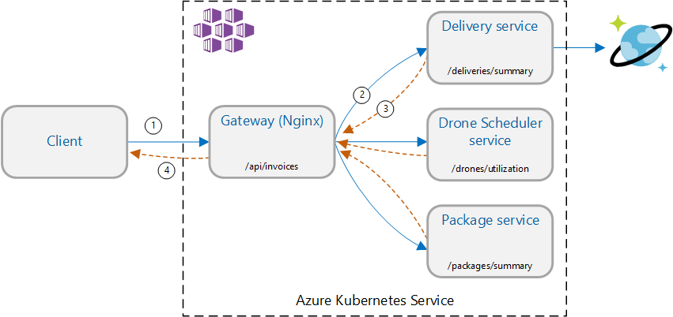

## Test 1: Baseline performance

To establish a baseline, the development team started with a step-load test, ramping the load from one simulated user up to 40 users, over a total duration of 8 minutes. The following chart, taken from Visual Studio, shows the results. The purple line shows the user load, and the orange line shows throughput (average requests per second).

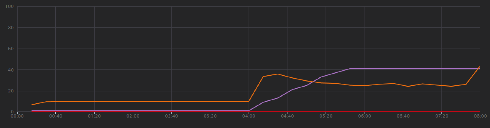

The red line along the bottom of the chart shows that no errors were returned to the client, which is encouraging. However, the average throughput peaks about half way through the test, and then drops off for the remainder, even while the load continues to increase. That indicates the back end is not able to keep up. The pattern seen here is common when a system starts to reach resource limits &mdash; after reaching a maximum, throughput actually falls significantly. Resource contention, transient errors, or an increase in the rate of exceptions can all contribute to this pattern.

Let's dig into the monitoring data to learn what's happening inside the system. The next chart is taken from Application Insights. It shows the average durations of the HTTP calls from the gateway to the backend services.

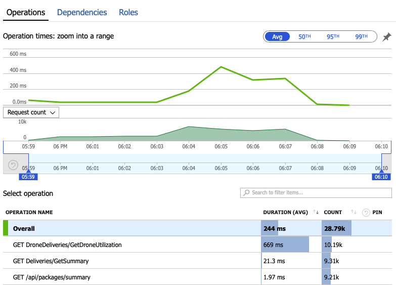

This chart shows that one operation in particular, `GetDroneUtilization`, takes much longer on average &mdash; by an order of magnitude. The gateway makes these calls in parallel, so the slowest operation determines how long it takes for the entire request to complete.

Clearly the next step is dig into the `GetDroneUtilization` operation and look for any bottlenecks. One possibility is resource exhaustion. Perhaps this particular backend service is running out of CPU or memory. For an AKS cluster, this information is available in the Azure portal through the [Azure Monitor container insights](/azure/azure-monitor/insights/container-insights-overview) feature. The following graphs show resource utilization at the cluster level:

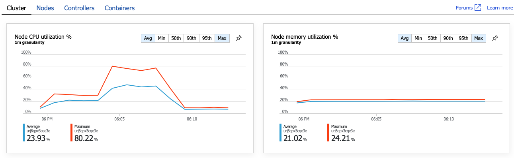

In this screenshot, both the average and maximum values are shown. It's important to look at more than just the average, because the average can hide spikes in the data. Here, the average CPU utilization stays below 50%, but there are a couple of spikes to 80%. That's close to capacity but still within tolerances. Something else is causing the bottleneck.

The next chart reveals the true culprit. This chart shows HTTP response codes from the Delivery service's backend database, which in this case is Azure Cosmos DB. The blue line represents success codes (HTTP 2xx), while the green line represents HTTP 429 errors. An HTTP 429 return code means that Azure Cosmos DB is temporarily throttling requests, because the caller is consuming more resource units (RU) than provisioned.

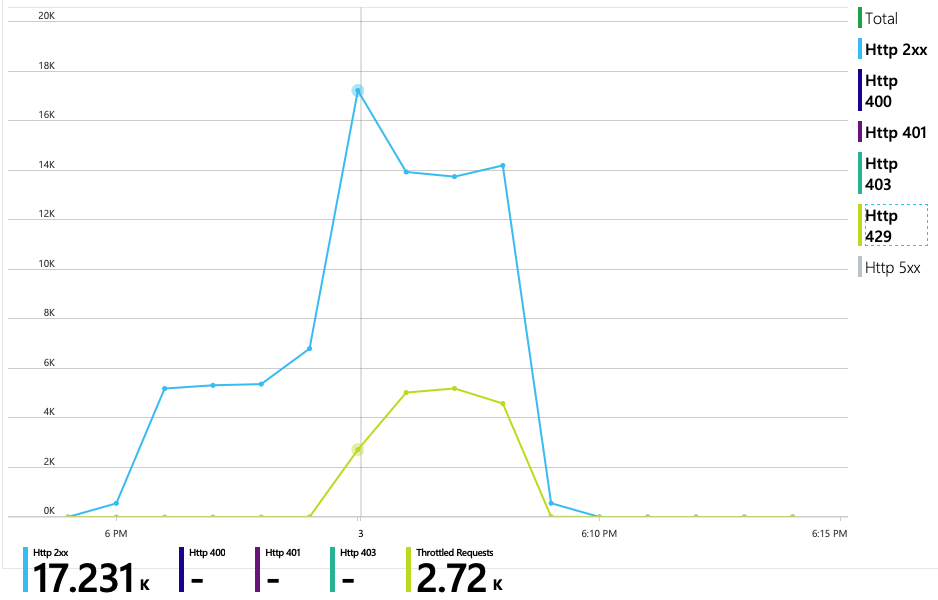

To get further insight, the development team used Application Insights to view the end-to-end telemetry for a representative sample of requests. Here is one instance:

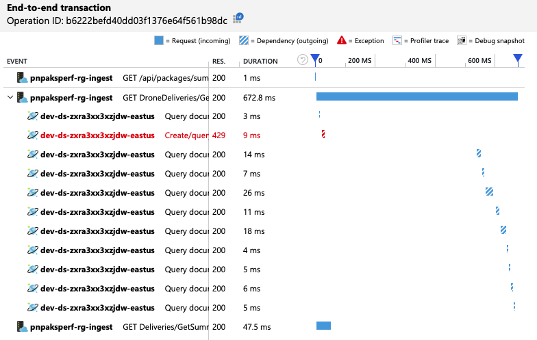

This view shows the calls related to a single client request, along with timing information and response codes. The top-level calls are from the gateway to the backend services. The call to `GetDroneUtilization` is expanded to show calls to external dependencies &mdash; in this case, to Azure Cosmos DB. The call in red returned an HTTP 429 error.

Note the large gap between the HTTP 429 error and the next call. When the Azure Cosmos DB client library receives an HTTP 429 error, it automatically backs off and waits to retry the operation. What this view shows is that during the 672 ms this operation took, most of that time was spent waiting to retry Azure Cosmos DB.

Here's another interesting graph for this analysis. It shows RU consumption per physical partition versus provisioned RUs per physical partition:

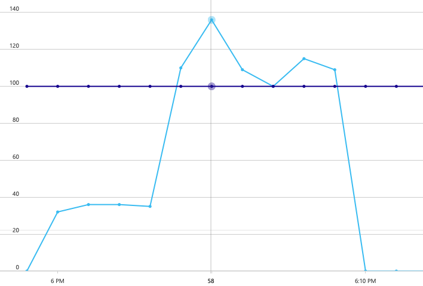

To make sense of this graph, you need to understand how Azure Cosmos DB manages partitions. Collections in Azure Cosmos DB can have a *partition key*. Each possible key value defines a logical partition of the data within the collection. Azure Cosmos DB distributes these logical partitions across one or more *physical* partitions. The management of physical partitions is handled automatically by Azure Cosmos DB. As you store more data, Azure Cosmos DB might move logical partitions into new physical partitions, in order to spread load across the physical partitions.

For this load test, the Azure Cosmos DB collection was provisioned with 900 RUs. The chart shows 100 RU per physical partition, which implies a total of nine physical partitions. Although Azure Cosmos DB automatically handles the sharding of physical partitions, knowing the partition count can give insight into performance. The development team will use this information later, as they continue to optimize. Where the blue line crosses the purple horizontal line, RU consumption has exceeded the provisioned RUs. That's the point where Azure Cosmos DB will begin to throttle calls.

## Test 2: Increase resource units

For the second load test, the team scaled out the Azure Cosmos DB collection from 900 RU to 2500 RU. Throughput increased from 19 requests/second to 23 requests/second, and average latency dropped from 669 ms to 569 ms.

| Metric | Test 1 | Test 2 |
|--------|--------|--------|
| Throughput (req/sec) | 19 | 23 |
| Average latency (ms) | 669 | 569 |
| Successful requests | 9.8 K | 11 K |

These aren't huge gains, but looking at the graph over time shows a more complete picture:

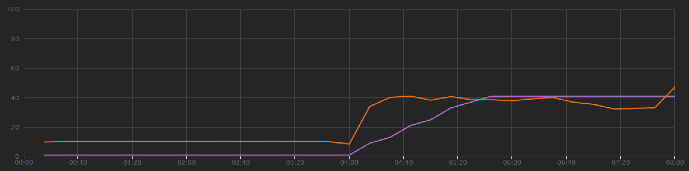

Whereas the previous test showed an initial spike followed by a sharp drop, this test shows more consistent throughput. However, the maximum throughput is not significantly higher.

All requests to Azure Cosmos DB returned a 2xx status, and the HTTP 429 errors went away:

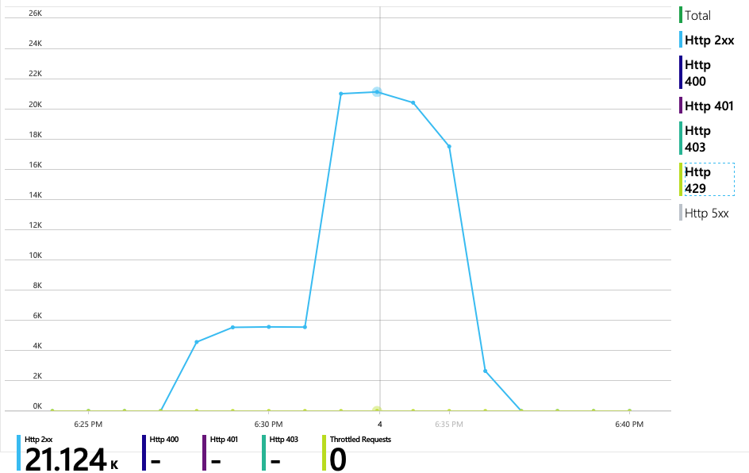

The graph of RU consumption versus provisioned RUs shows there is plenty of headroom. There are about 275 RUs per physical partition, and the load test peaked at about 100 RUs consumed per second.


Another interesting metric is the number of calls to Azure Cosmos DB per successful operation:

| Metric | Test 1 | Test 2 |
|--------|--------|--------|
| Calls per operation | 11 | 9 |

Assuming no errors, the number of calls should match the actual query plan. In this case, the operation involves a cross-partition query that hits all nine physical partitions. The higher value in the first load test reflects the number of calls that returned a 429 error.

This metric was calculated by running a custom Log Analytics query:

```kusto
let start=datetime("2020-06-18T20:59:00.000Z");
let end=datetime("2020-07-24T21:10:00.000Z");
let operationNameToEval="GET DroneDeliveries/GetDroneUtilization";
let dependencyType="Azure DocumentDB";
let dataset=requests
| where timestamp > start and timestamp < end
| where success == true
| where name == operationNameToEval;
dataset
| project reqOk=itemCount
| summarize
    SuccessRequests=sum(reqOk),
    TotalNumberOfDepCalls=(toscalar(dependencies
    | where timestamp > start and timestamp < end
    | where type == dependencyType
    | summarize sum(itemCount)))
| project
    OperationName=operationNameToEval,
    DependencyName=dependencyType,
    SuccessRequests,
    AverageNumberOfDepCallsPerOperation=(TotalNumberOfDepCalls/SuccessRequests)
```

To summarize, the second load test shows improvement. However, the `GetDroneUtilization` operation still takes about an order of magnitude longer than the next-slowest operation. Looking at the end-to-end transactions helps to explain why:

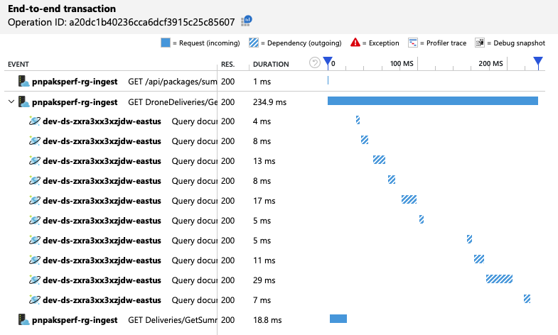

As mentioned earlier, the `GetDroneUtilization` operation involves a cross-partition query to Azure Cosmos DB. This means the Azure Cosmos DB client has to fan out the query to each physical partition and collect the results. As the end-to-end transaction view shows, these queries are being performed in serial. The operation takes as long as the sum of all the queries &mdash; and this problem will only get worse as the size of the data grows and more physical partitions are added.

## Test 3: Parallel queries

Based on the previous results, an obvious way to reduce latency is to issue the queries in parallel. The Azure Cosmos DB client SDK has a setting that controls the maximum degree of parallelism.

| Value | Description |
| ----- | ----------- |
| 0 | No parallelism (default) |
| > 0 | Maximum number of parallel calls |
| -1 | The client SDK selects an optimal degree of parallelism |

For the third load test, this setting was changed from 0 to -1. The following table summarizes the results:

| Metric | Test 1 | Test 2 | Test 3 |
|--------|--------|--------|--------|
| Throughput (req/sec) | 19 | 23 | 42 |
| Average latency (ms) | 669 | 569 | 215 |
| Successful requests | 9.8 K | 11 K | 20 K |
| Throttled requests | 2.72 K | 0 | 0 |

From the load test graph, not only is the overall throughput much higher (the orange line), but throughput also keeps pace with the load (the purple line).

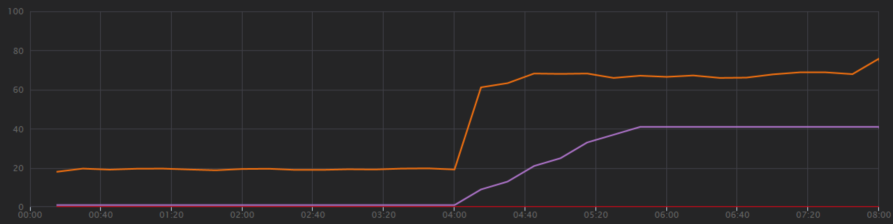

We can verify that the Azure Cosmos DB client is making queries in parallel by looking at the end-to-end transaction view:

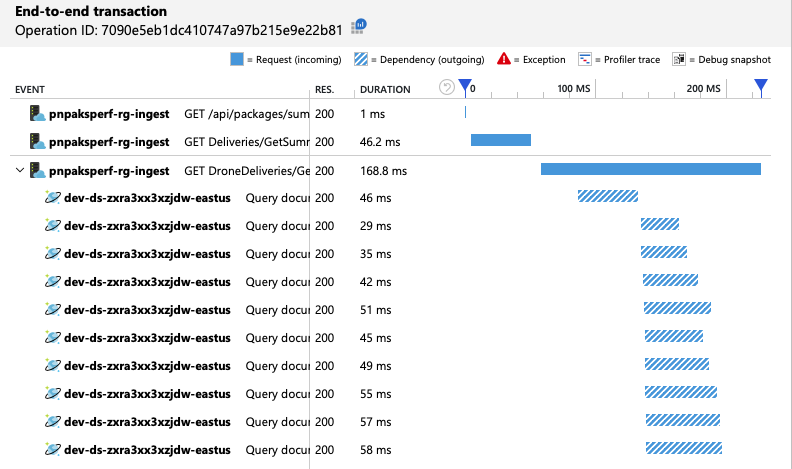

Interestingly, a side effect of increasing the throughput is that the number of RUs consumed per second also increases. Although Azure Cosmos DB did not throttle any requests during this test, the consumption was close to the provisioned RU limit:

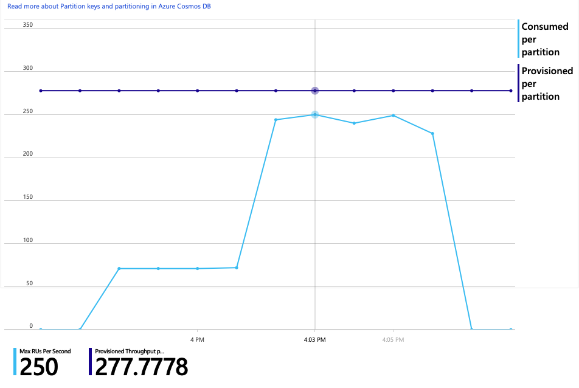

This graph might be a signal to further scale out the database. However, it turns out that we can optimize the query instead.

## Step 4: Optimize the query

The previous load test showed better performance in terms of latency and throughput. Average request latency was reduced by 68% and throughput increased 220%. However, the cross-partition query is a concern.

The problem with cross-partition queries is that you pay for RU across every partition. If the query is only run occasionally &mdash; say, once an hour &mdash; it might not matter. But whenever you see a read-heavy workload that involves a cross-partition query, you should see whether the query can be optimized by including a partition key. (You might need to redesign the collection to use a different partition key.)

Here's the query for this particular scenario:

```sql
SELECT * FROM c
WHERE c.ownerId = <ownerIdValue> and
      c.year = <yearValue> and
      c.month = <monthValue>
```

This query selects records that match a particular owner ID and month/year. In the original design, none of these properties is the partition key. That requires the client to fan out the query to each physical partition and gather the results. To improve query performance, the development team changed the design so that owner ID is the partition key for the collection. That way, the query can target a specific physical partition. (Azure Cosmos DB handles this automatically; you don't have to manage the mapping between partition key values and physical partitions.)

After switching the collection to the new partition key, there was a dramatic improvement in RU consumption, which translates directly into lower costs.

| Metric | Test 1 | Test 2 | Test 3 | Test 4 |
|--------|--------|--------|--------|--------|
| RUs per operation | 29 | 29 | 29 | 3.4 |
| Calls per operation | 11 | 9 | 10 | 1 |

The end-to-end transaction view shows that as predicted, the query reads only one physical partition:

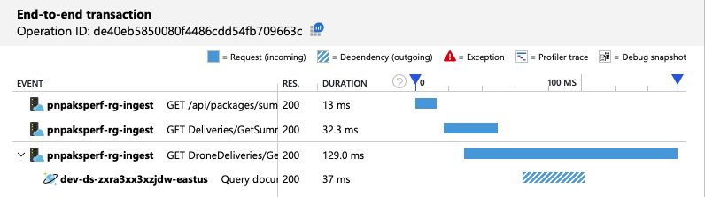

The load test shows improved throughput and latency:

| Metric | Test 1 | Test 2 | Test 3 | Test 4 |
|--------|--------|--------|--------|--------|
| Throughput (req/sec) | 19 | 23 | 42 | 59 |
| Average latency (ms) | 669 | 569 | 215 | 176 |
| Successful requests | 9.8 K | 11 K | 20 K | 29 K |
| Throttled requests | 2.72 K | 0 | 0 | 0 |

A consequence of the improved performance is that node CPU utilization becomes very high:

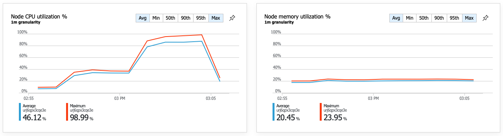

Toward the end of the load test, average CPU reached about 90%, and maximum CPU reached 100%. This metric indicates that CPU is the next bottleneck in the system. If higher throughput is needed, the next step might be scaling out the Delivery service to more instances.

## Summary

For this scenario, the following bottlenecks were identified:

- Azure Cosmos DB throttling requests due to insufficient RUs provisioned.
- High latency caused by querying multiple database partitions in serial.
- Inefficient cross-partition query, because the query did not include the partition key.

In addition, CPU utilization was identified as a potential bottleneck at higher scale. To diagnose these issues, the development team looked at:

- Latency and throughput from the load test.
- Azure Cosmos DB errors and RU consumption.
- The end-to-end transaction view in Application Insight.
- CPU and memory utilization in Azure Monitor container insights.

## Next steps

Review [performance antipatterns](../antipatterns/index.md)
