# Performance tuning scenario: Distributed business transactions

This article describes how a development team used metrics to find bottlenecks and improve the performance of a distributed system. The article is based on actual load testing that we did for a sample application. The application code is available on [GitHub](https://github.com/mspnp/microservices-reference-implementation).

*This article is part of a series. Read the first part [here](./index.md).*

**Scenario**: A client application initiates a business transaction that involves multiple steps.

This scenario involves a drone delivery application that runs on Azure Kubernetes Service (AKS). Customers use a web app to schedule deliveries by drone. Each transaction requires multiple steps that are performed by separate microservices on the back end:

- The Delivery service manages deliveries.
- The Drone Scheduler service schedules drones for pickup.
- The Package service manages packages.

There are two other services: An Ingestion service that accepts client requests and puts them on a queue for processing, and a Workflow service that coordinates the steps in the workflow.


For more information about this scenario, see [Designing a microservices architecture](../microservices/design/index.md).

## Test 1: Baseline

For the first load test, the team created a 6-node AKS cluster and deployed three replicas of each microservice. The load test was a step-load test, starting at two simulated users and ramping up to 40 simulated users. 

| Setting | Value |
|---------|-------|
| Cluster nodes | 6 |
| Pods | 3 per service |

The following graph shows the results of the load test, as shown in Visual Studio. The purple line plots user load, and the orange line plots total requests.

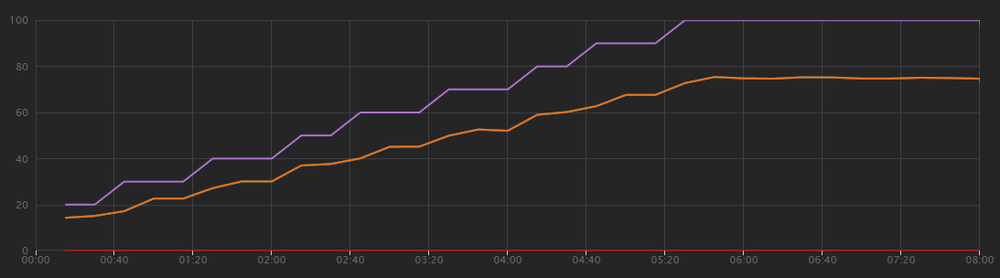

The first thing to realize about this scenario is that client requests per second is not a useful metric of performance. That's because the application processes requests asynchronously, so the client gets a response right away. The response code is always HTTP 202 (Accepted), meaning the request was accepted but processing is not complete. 

What we really want to know is whether the backend is keeping up with the request rate. The Service Bus queue can absorb spikes, but if the backend cannot handle a sustained load, processing will fall further and further behind.

Here's a more informative graph. It plots the number incoming and outgoing messages on the Service Bus queue. Incoming messages are shown in light blue, and outgoing messages are shown in dark blue:


This chart is showing that the rate of incoming messages increases, reaching a peak and then dropping back to zero at the end of the load test. But the number of outgoing messages peaks early in the test and then actually drops. That means the Workflow service, which handles the requests, isn't keeping up. Even after the load test ends (around 9:22 on the graph), messages are still being processed as the Workflow service continues to drain the queue.

What's slowing down the processing? The first thing to look for is errors or exceptions that might indicate a systematic issue. The [Application Map](/azure/azure-monitor/app/app-map) in Azure Monitor shows the graph of calls between components, and is a quick way to spot issues and then click through to get more details. 

Sure enough, the Application Map shows that the Workflow service is getting errors from the Delivery service:

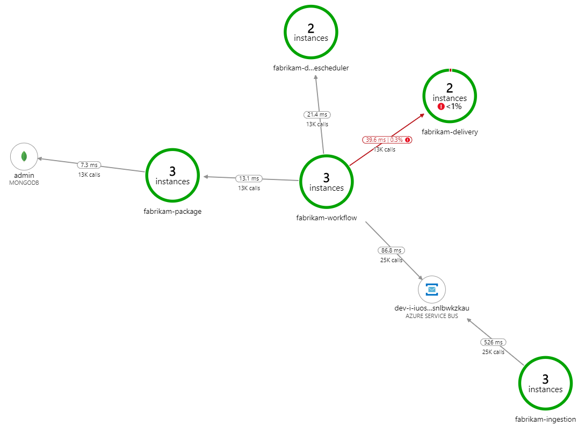

To see more details, you can select a node in the graph and click into an end-to-end transaction view. In this case, it shows that the Delivery service is returning HTTP 500 errors. The error messages indicate that an exception is being thrown due to memory limits in Azure Cache for Redis.

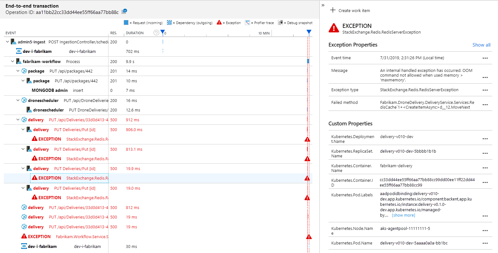

You may notice that these calls to Redis don't appear in the Application Map. That's because the .NET library for Application Insights doesn't have built-in support for tracking Redis as a dependency. (For a list of what's supported out of the box, see [Dependency auto-collection](/azure/azure-monitor/app/auto-collect-dependencies).) As a fallback, you can use the [TrackDependency](/azure/azure-monitor/app/api-custom-events-metrics#trackdependency) API to track any dependency. Load testing often reveals these kinds of gaps in the telemetry, which can be remediated.

## Test 2: Increased cache size

For the second load test, the development team increased the cache size in Azure Cache for Redis. (See [How to Scale Azure Cache for Redis](/azure/azure-cache-for-redis/cache-how-to-scale).) This change resolved the out-of-memory exceptions, and now the Application Map shows zero errors:

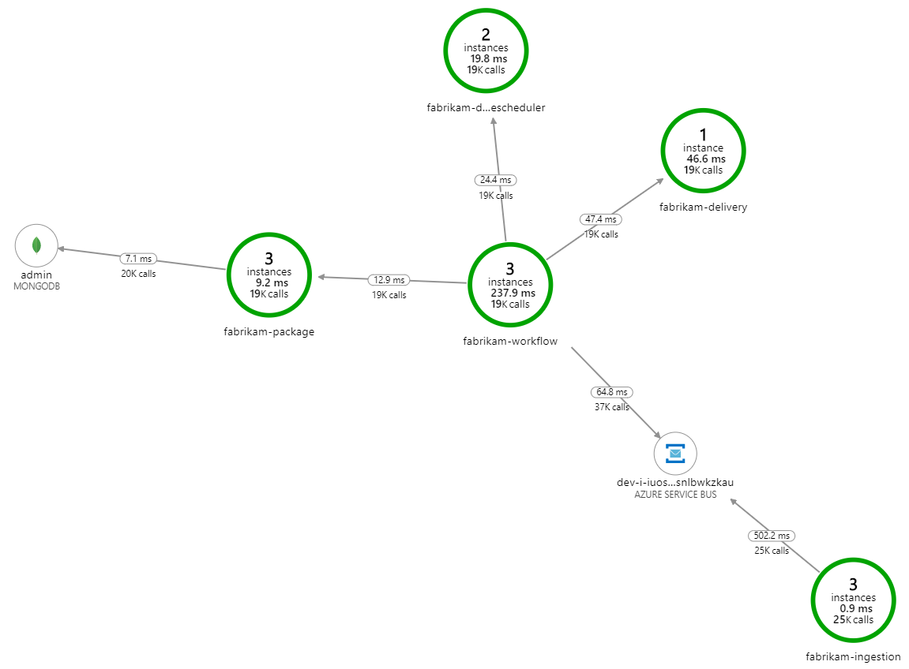

However, there is still a dramatic lag in processing messages. At the peak of the load test, the incoming message rate is more than 5&times; the outgoing rate:

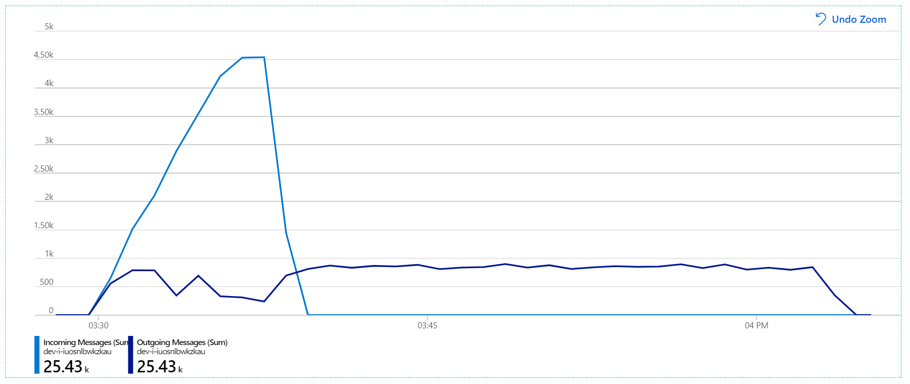

The following graph measures throughput in terms of message completion &mdash; that is, the rate at which the Workflow service marks the Service Bus messages as completed. Each point on the graph represents 5 seconds of data, showing ~16/sec maximum throughput.


This graph was generated by running a query in the Log Analytics workspace, using the [Kusto query language](/azure/kusto/query/):

```kusto
let start=datetime("2019-07-31T22:30:00.000Z");
let end=datetime("2019-07-31T22:45:00.000Z");
dependencies
| where cloud_RoleName == 'fabrikam-workflow' 
| where timestamp > start and timestamp < end
| where type == 'Azure Service Bus' 
| where target has 'https://dev-i-iuosnlbwkzkau.servicebus.windows.net'
| where client_Type == "PC"
| where name == "Complete" 
| summarize succeeded=sumif(itemCount, success == true), failed=sumif(itemCount, success == false) by bin(timestamp, 5s)
| render timechart
```

## Test 3: Scale out the backend services

It appears the back end is the bottleneck. An easy next step is to scale out the business services (Package, Delivery, and Drone Scheduler), and see if throughput improves. For the next load test, the team scaled these services out from three replicas to six replicas.

| Setting | Value |
|---------|-------|
| Cluster nodes | 6 |
| Ingestion service  | 3 replicas |
| Workflow service  | 3 replicas |
| Package, Delivery, Drone Scheduler services | 6 replicas each |

Unfortunately this load test shows only modest improvement. Outgoing messages are still not keeping up with incoming messages:

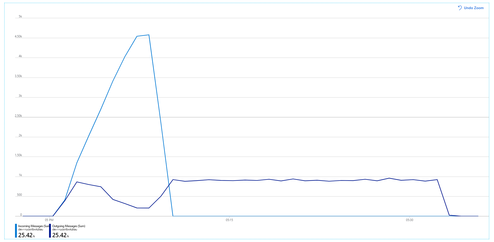

Throughput is more consistent, but the maximum achieved is about the same as the previous test:

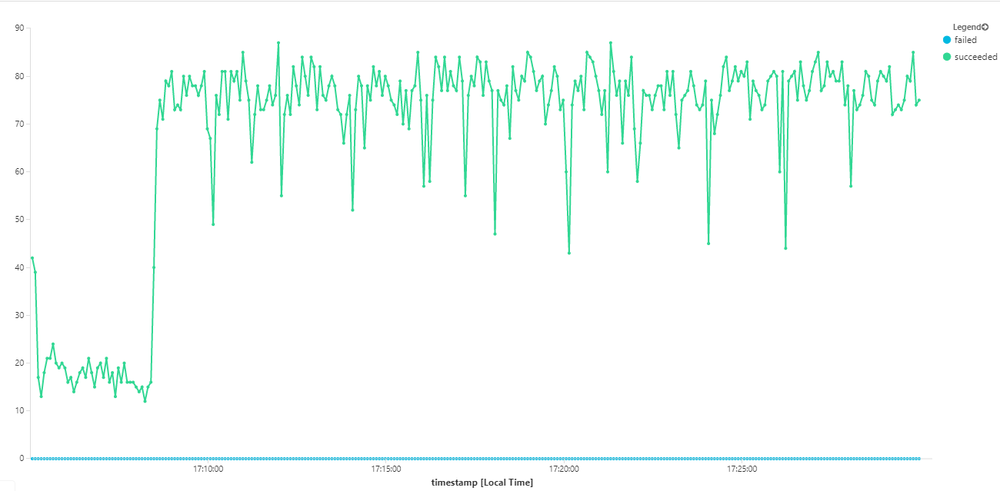

Moreover, looking at [Azure Monitor for containers](/azure/azure-monitor/insights/container-insights-overview), it appears the problem is not caused by resource exhaustion within the cluster. First, the node-level metrics show that CPU utilization remains under 40% even at the 95th percentile, and memory utilization is about 20%.

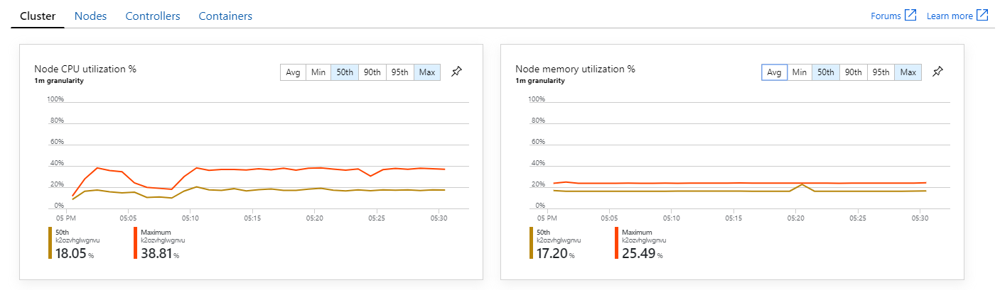

In a Kubernetes environment, it's possible for individual pods to be resource-constrained even when the nodes aren't. But the pod-level view shows that all pods are healthy.

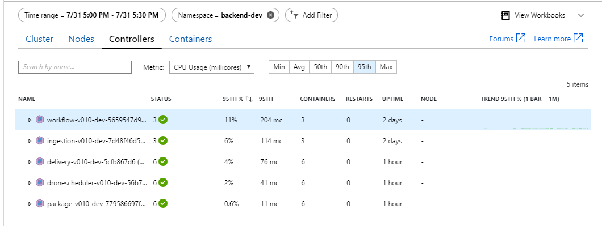

From this test, it seems that just adding more pods to the back end won't help. The next step is to look more closely at the Workflow service to understand what's happening when it processes messages. Application Insights shows that the average duration of the Workflow service's `Process` operation is 246 ms.

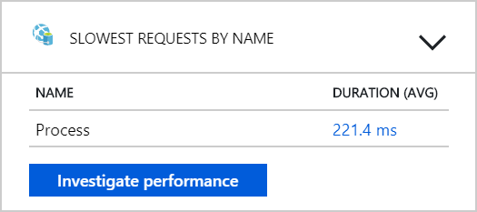

We can also run a query to get metrics on the individual operations within each transaction:  

| target | percentile_duration_50 | percentile_duration_95 |
|--------|------------------------|------------------------|
| `https://dev-i-iuosnlbwkzkau.servicebus.windows.net/ | dev-i-iuosnlbwkzkau` | 86.66950203 | 283.4255578 |
| delivery | 37 | 57 |
| package | 12 | 17 |
| dronescheduler | 21 | 41 |

The first row in this table represents the Service Bus queue. The other rows are the calls to the backend services. For reference, here's the Log Analytics query for this table:

```kusto
let start=datetime("2019-07-31T22:30:00.000Z");
let end=datetime("2019-07-31T22:45:00.000Z");
let dataset=dependencies
| where timestamp > start and timestamp < end
| where (cloud_RoleName == 'fabrikam-workflow')
| where name == 'Complete' or target in ('package', 'delivery', 'dronescheduler');
dataset
| summarize percentiles(duration, 50, 95) by target
```

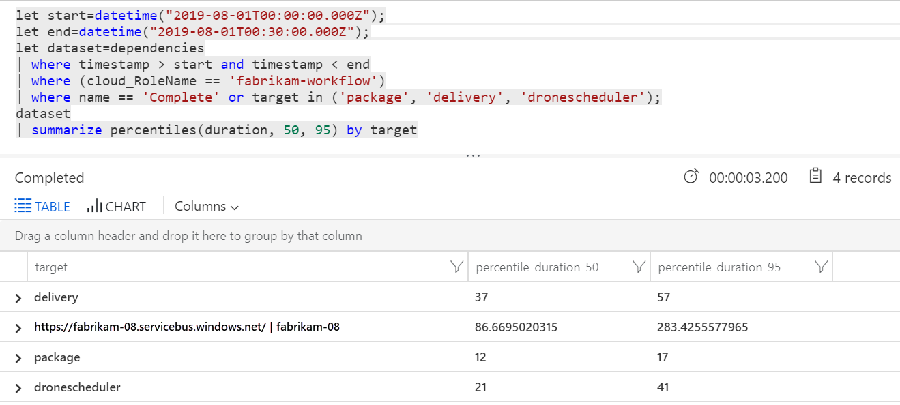

These latencies look reasonable. But here is the key insight: If the total operation time is ~250 ms, that puts a strict upper bound on how fast messages can be processed in serial. The key to improving throughput, therefore, is greater parallelism. 

That should be possible in this scenario, for two reasons:

- These are network calls, so most of the time is spent waiting for I/O completion
- The messages are independent, and don't need to be processed in order.

## Test 4: Increase parallelism

For this test, the team focused on increasing parallelism. To do so, they adjusted two settings on the Service Bus client used by the Workflow service:

| Setting | Description | Default | New value |
| --------| ----------- | ------- | --------- |
| `MaxConcurrentCalls` | The maximum number of messages to process concurrently. | 1 |  20 |
| `PrefetchCount` | How many messages the client will fetch ahead of time into its local cache. | 0 | 3000 |

For more information about these settings, see [Best Practices for performance improvements using Service Bus Messaging](/azure/service-bus-messaging/service-bus-performance-improvements#concurrent-operations). Running the test with these settings produced the following graph: 

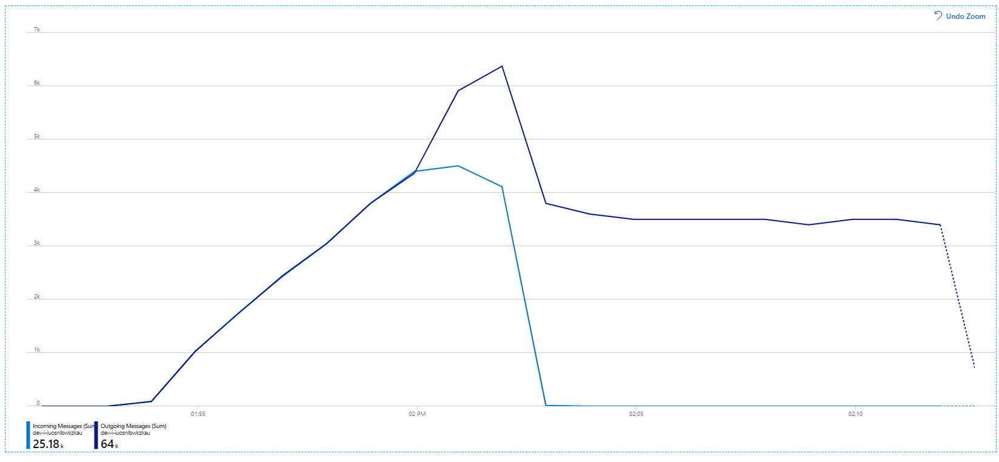

Recall that incoming messages are shown in light blue, and outgoing messages are shown in dark blue.

At first glance, this is a very weird graph. For a while, the outgoing message rate exactly tracks the incoming rate. But then, at about the 2:03 mark, the rate of incoming messages levels off, while the number of outgoing messages continues to rise, actually exceeding the total number of incoming messages. That seems impossible. 

The clue to this mystery can be found in the **Dependencies** view in Application Insights. This chart summarizes all of the calls that the Workflow service made to Service Bus:


Notice that entry for `DeadLetter`. That calls indicates messages are going into the Service Bus [dead-letter queue](/azure/service-bus-messaging/service-bus-dead-letter-queues).  

To understand what's happening, you need to understand [Peek-Lock](/rest/api/servicebus/peek-lock-message-non-destructive-read) semantics in Service Bus. When a client uses Peek-Lock, Service Bus atomically retrieves and locks a message. While the lock is held, the message is guaranteed not to be delivered to other receivers. If the lock expires, the message becomes available to other receivers. After a maximum number of delivery attempts (which is configurable), Service Bus will put the messages onto a [dead-letter queue](/azure/service-bus-messaging/service-bus-dead-letter-queues), where it can be examined later.

Remember that the Workflow service is prefetching large batches of messages &mdash; 3000 messages at a time). That means the total time to process each message is longer, which results in messages timing out, going back onto the queue, and eventually going into the dead-letter queue. 

You can also see this behavior in the exceptions, where numerous `MessageLostLockException` exceptions are recorded:

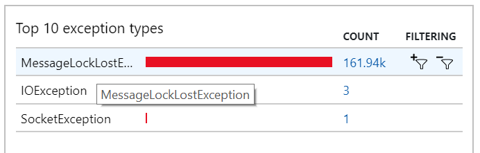

## Test 5: Increase lock duration

For this load test, the message lock duration was set to 5 minutes, to prevent lock timeouts. The graph of incoming and outgoing messages now shows that the system is keeping up with the rate of incoming messages:

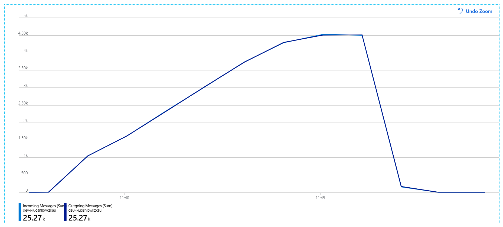

Over the total duration of the 8-minute load test, the application completed 25 K operations, with a peak throughput of 72 operations/sec, representing a 400% increase in maximum throughput.

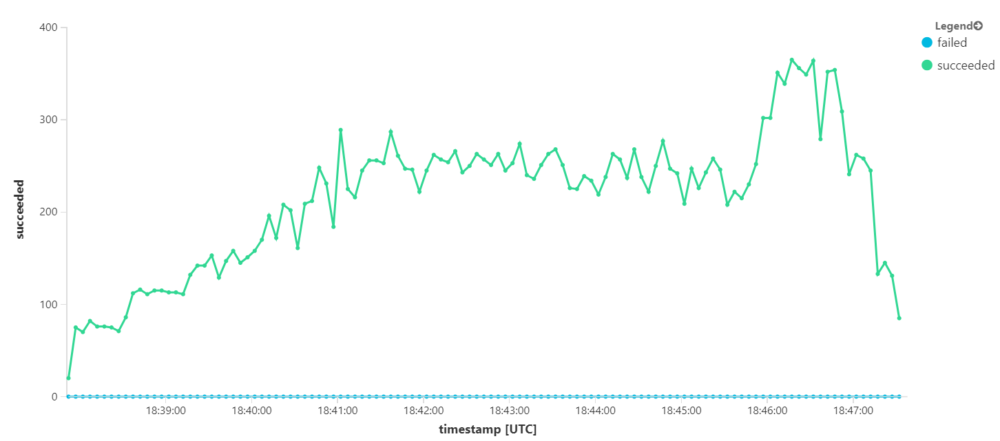

However, running the same test with a longer duration showed that the application could not sustain this rate:

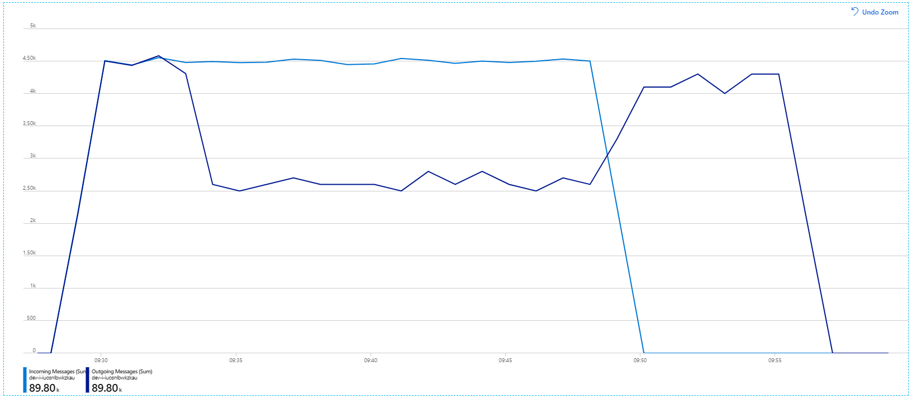

The container metrics show that maximum CPU utilization was close to 100%. At this point, the application appears to be CPU-bound. Scaling the cluster might improve performance now, unlike the previous attempt at scaling out. 

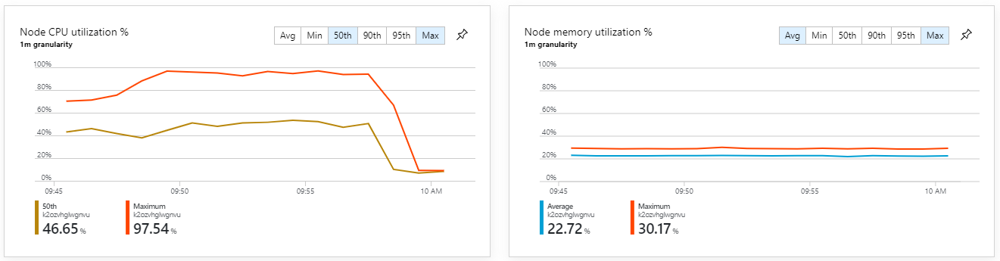

## Test 6: Scale out the backend services (again)

For the final load test in the series, the team scaled out the Kubernetes cluster and pods as follows:

| Setting | Value |
|---------|-------|
| Cluster nodes | 12 |
| Ingestion service | 3 replicas |
| Workflow service | 6 replicas |
| Package, Delivery, Drone Scheduler services | 9 replicas each |

This test resulted in a higher sustained throughput, with no significant lags in processing messages. Moreover, node CPU utilization stayed below 80%.


## Summary

For this scenario, the following bottlenecks were identified:

- Out-of-memory exceptions in Azure Cache for Redis.
- Lack of parallelism in message processing.
- Insufficient message lock duration, leading to lock timeouts and messages being placed in the dead letter queue.
- CPU exhaustion.

To diagnose these issues, the development team relied on the following metrics:

- The rate of incoming and outgoing Service Bus messages.
- Application Map in Application Insights.
- Errors and exceptions.
- Custom Log Analytics queries.
- CPU and memory utilization in Azure Monitor for containers.

## Next steps

For more information about the design of this scenario, see [Designing a microservices architecture](../microservices/design/index.md). 
