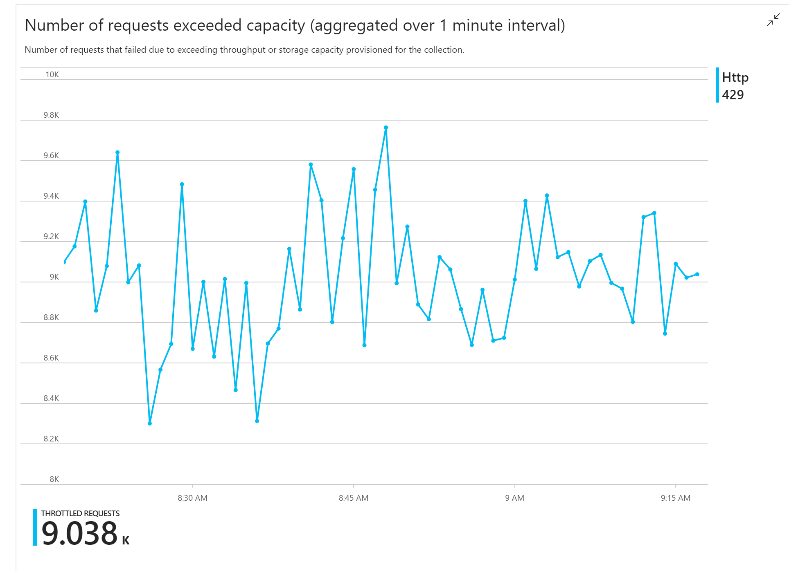
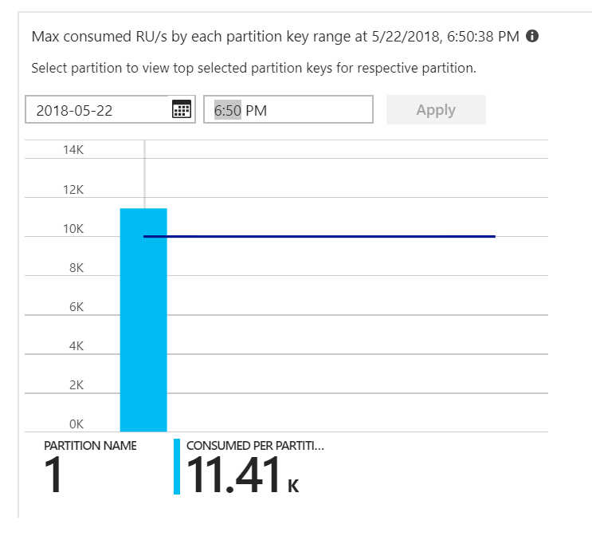
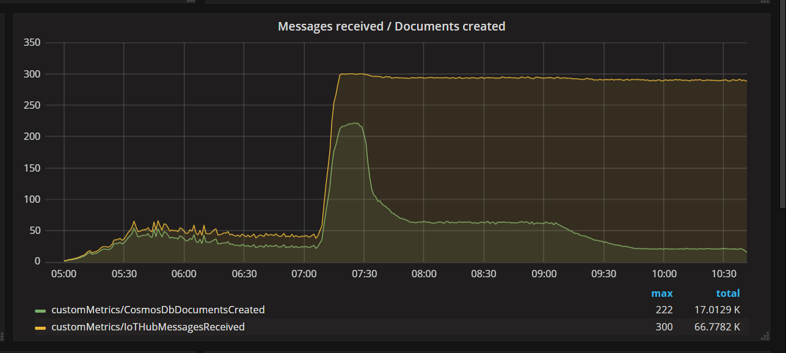
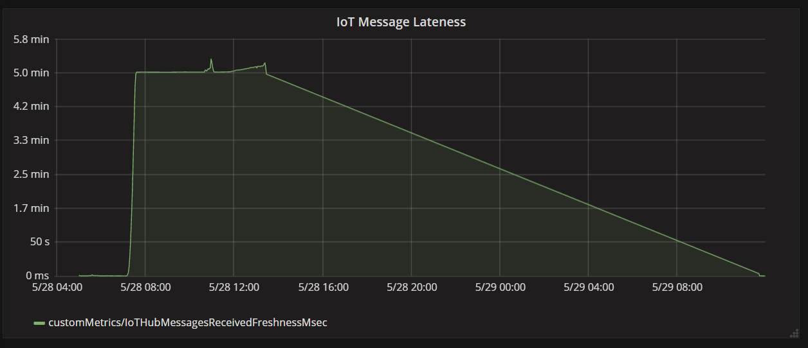

<!--cSpell:ignore upsert upserted -->

This article describes how a development team used metrics to find bottlenecks and improve the performance of a distributed system. The article is based on actual load testing that we did for a sample application.

*This article is part of a series. Read the first part [here](./index.md).*

**Scenario**: Process a stream of events using Azure Functions.


In this scenario, a fleet of drones sends position data in real time to Azure IoT Hub. A Functions app receives the events, transforms the data into [GeoJSON](https://tools.ietf.org/html/rfc7946) format, and writes the transformed data to Azure Cosmos DB. Azure Cosmos DB has native support for [geospatial data](/azure/cosmos-db/geospatial), and Azure Cosmos DB collections can be indexed for efficient spatial queries. For example, a client application could query for all drones within 1 km of a given location, or find all drones within a certain area.

These processing requirements are simple enough that they don't require a full-fledged stream processing engine. In particular, the processing doesn't join streams, aggregate data, or process across time windows. Based on these requirements, Azure Functions is a good fit for processing the messages. Azure Cosmos DB can also scale to support very high write throughput.

## Monitoring throughput

This scenario presents an interesting performance challenge. The data rate *per device* is known, but the number of devices might fluctuate. For this business scenario, the latency requirements are not particularly stringent. The reported position of a drone only needs to be accurate within a minute. That said, the function app must keep up with the average ingestion rate over time.

IoT Hub stores messages in a log stream. Incoming messages are appended to the tail of the stream. A reader of the stream &mdash; in this case, the function app &mdash; controls its own rate of traversing the stream. This decoupling of the read and write paths makes IoT Hub very efficient, but also means that a slow reader can fall behind. To detect this condition, the development team added a custom metric to measure message lateness. This metric records the delta between when a message arrives at IoT Hub, and when the function receives the message for processing.

```csharp
var ticksUTCNow = DateTimeOffset.UtcNow;

// Track whether messages are arriving at the function late.
DateTime? firstMsgEnqueuedTicksUtc = messages[0]?.EnqueuedTimeUtc;
if (firstMsgEnqueuedTicksUtc.HasValue)
{
    CustomTelemetry.TrackMetric(
                        context,
                        "IoTHubMessagesReceivedFreshnessMsec",
                        (ticksUTCNow - firstMsgEnqueuedTicksUtc.Value).TotalMilliseconds);
}
```

The `TrackMetric` method writes a custom metric to Application Insights. For information about using `TrackMetric` inside an Azure Function, see [Custom telemetry in C# function](/azure/azure-functions/functions-monitoring#log-custom-telemetry-in-c-functions).

If the function keeps up with the volume of messages, this metric should stay at a low steady state. Some latency is unavoidable, so the value will never be zero. But if the function falls behind, the delta between enqueued time and processing time will start to go up.

## Test 1: Baseline

The first load test showed an immediate problem: The Function app consistently received HTTP 429 errors from Azure Cosmos DB, indicating that Azure Cosmos DB was throttling the write requests.



In response, the team scaled Azure Cosmos DB by increasing the number RUs allocated for the collection, but the errors continued. This seemed strange, because their back-of-envelope calculation showed that Azure Cosmos DB should have no problem keeping up with the volume of write requests.

Later that day, one of the developers sent the following email to the team:

> I looked at Azure Cosmos DB for the warm path. There's one thing I don't understand. The partition key is deliveryId, however we don't send deliveryId to Azure Cosmos DB. Am I missing something?

That was the clue. Looking at the partition heat map, it turned out that all of the documents were landing on the same partition.



What you want to see in the heat map is an even distribution across all of the partitions. In this case, because every document was getting written to the same partition, adding RUs didn't help. The problem turned out to be a bug in the code. Although the Azure Cosmos DB collection had a partition key, the Azure Function didn't actually include the partition key in the document. For more information about the partition heat map, see [Determine the throughput distribution across partitions](/azure/cosmos-db/use-metrics#determine-the-throughput-distribution-across-partitions).

## Test 2: Fix partitioning issue

When the team deployed a code fix and re-ran the test, Azure Cosmos DB stopped throttling. For a while, everything looked good. But at a certain load, telemetry showed that the function was writing fewer documents that it should. The following graph shows messages receives from IoT Hub versus documents written to Azure Cosmos DB. The yellow line is number of messages received per batch, and the green is the number of documents written per batch. These should be proportional. Instead, the number of database write operations per batch drops significantly at about 07:30.



The next graph shows the latency between when a message arrives at IoT Hub from a device, and when the function app processes that message. You can see that at the same point in time, the lateness spikes dramatically, levels off, and the declines.



The reason the value peaks at 5 minutes and then drops to zero is because the function app discards messages that are more than 5 minutes late:

```csharp
foreach (var message in messages)
{
    // Drop stale messages,
    if (message.EnqueuedTimeUtc < cutoffTime)
    {
        log.Info($"Dropping late message batch. Enqueued time = {message.EnqueuedTimeUtc}, Cutoff = {cutoffTime}");
        droppedMessages++;
        continue;
    }
}
```

You can see this in the graph when the lateness metric drops back to zero. In the meantime, data has been lost, because the function was throwing away messages.

What was happening? For this particular load test, the Azure Cosmos DB collection had RUs to spare, so the bottleneck was not at the database. Rather, the problem was in the message processing loop. Simply put, the function was not writing documents quickly enough to keep up with the incoming volume of messages. Over time, it fell further and further behind.

## Test 3: Parallel writes

If the time to process a message is the bottleneck, one solution is to process more messages in parallel. In this scenario:

- Increase the number of IoT Hub partitions. Each IoT Hub partition gets assigned one function instance at a time, so we would expect throughput to scale linearly with the number of partitions.
- Parallelize the document writes within the function.

To explore the second option, the team modified the function to support parallel writes. The original version of the function used the Azure Cosmos DB [output binding](/azure/azure-functions/functions-bindings-cosmosdb#output). The optimized version calls the Azure Cosmos DB client directly and performs the writes in parallel using [Task.WhenAll](/dotnet/api/system.threading.tasks.task.whenall):

```csharp
private async Task<(long documentsUpserted,
                    long droppedMessages,
                    long cosmosDbTotalMilliseconds)>
                ProcessMessagesFromEventHub(
                    int taskCount,
                    int numberOfDocumentsToUpsertPerTask,
                    EventData[] messages,
                    TraceWriter log)
{
    DateTimeOffset cutoffTime = DateTimeOffset.UtcNow.AddMinutes(-5);

    var tasks = new List<Task>();

    for (var i = 0; i < taskCount; i++)
    {
        var docsToUpsert = messages
                            .Skip(i * numberOfDocumentsToUpsertPerTask)
                            .Take(numberOfDocumentsToUpsertPerTask);
        // client will attempt to create connections to the data
        // nodes on Azure Cosmos DB clusters on a range of port numbers
        tasks.Add(UpsertDocuments(i, docsToUpsert, cutoffTime, log));
    }

    await Task.WhenAll(tasks);

    return (this.UpsertedDocuments,
            this.DroppedMessages,
            this.CosmosDbTotalMilliseconds);
}
```

Note that race conditions are possible with approach. Suppose that two messages from the same drone happen to arrive in the same batch of messages. By writing them in parallel, the earlier message could overwrite the later message. For this particular scenario, the application can tolerate losing an occasional message. Drones send new position data every 5 seconds, so the data in Azure Cosmos DB is updated continually. In other scenarios, however, it may be important to process messages strictly in order.

After deploying this code change, the application was able to ingest more than 2500 requests/sec, using an IoT Hub with 32 partitions.

## Client-side considerations

Overall client experience might be diminished by aggressive parallelization on server side.  Consider using [Azure Cosmos DB bulk executor library](/azure/cosmos-db/bulk-executor-overview) (not shown in this implementation) which significantly reduces the client-side compute resources needed to saturate the throughput allocated to an Azure Cosmos DB container. A single threaded application that writes data using the bulk import API achieves nearly ten times greater write throughput when compared to a multi-threaded application that writes data in parallel while saturating the client machine's CPU.

## Summary

For this scenario, the following bottlenecks were identified:

- Hot write partition, due to a missing partition key value in the documents being written.
- Writing documents in serial per IoT Hub partition.

To diagnose these issues, the development team relied on the following metrics:

- Throttled requests in Azure Cosmos DB.
- Partition heat map &mdash; Maximum consumed RUs per partition.
- Messages received versus documents created.
- Message lateness.

## Next steps

Review [performance antipatterns](../antipatterns/index.md)
