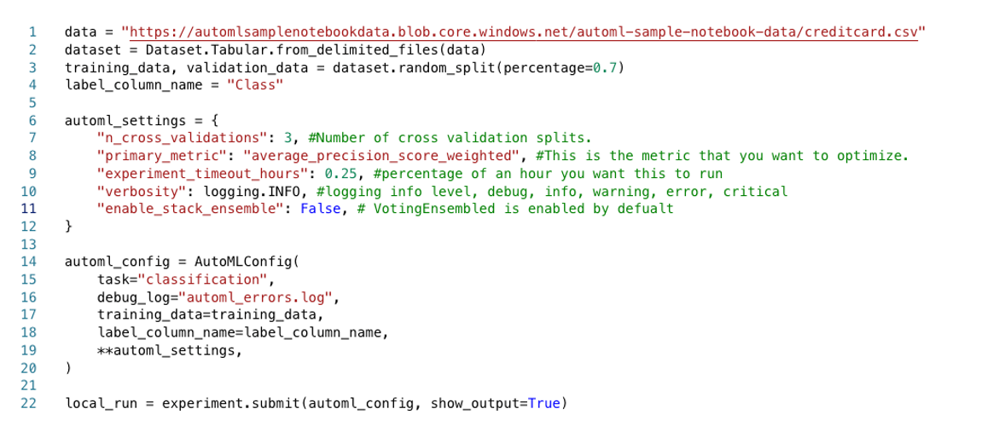

In a typical case of online fraud, the thief makes multiple transactions leading to a loss of thousands. That's why fraud detection must happen in near real-time. More than 800 million people use mobile apps. As that number increases, so does mobile bank fraud. The financial industry is seeing a 100 percent year-over-year increase in losses caused by access from mobile platforms. But there is a mitigation. This article presents a solution that uses Azure technology to predict a fraudulent mobile bank transaction within two seconds. The architecture presented here is based on a real-world solution.

## Challenges: Rare instances of fraud and rigid rules

Most mobile fraud occurs when a *SIM swap attack* is used to compromise a mobile number. The phone number is cloned and the criminal receives the SMS notifications and calls sent to the victim's mobile device. The criminal then obtains sign-in credentials by using social engineering, phishing, vishing (using a phone to phish), or an infected downloaded app. With this information, the criminal can impersonate a bank customer, register for mobile access, and immediately generate fund transfers and withdrawals.

Mobile fraud is hard to detect and expensive for consumers and banks. The first challenge is that it's rare. Fewer than 1 percent of all transactions are fraudulent, so it can take time for a fraud or case management team to sift through potentially fraudulent transactions to identify the fraudulent ones. A second challenge is that many fraud monitoring solutions today rely on rule-based engines. Traditionally, rule-based engines are effective at detecting established patterns of fraud-like transactions generated from risky IP addresses or multiple transactions generated within a brief period on a new account. But rule-based engines have a significant limitation: rules don't adapt quickly to new or evolving types of attacks. They're constrained in the following ways:

- Detection isn't real-time, so fraud is detected after a financial loss occurs.
- Rules are binary and limited. They don't accommodate the complexity and combinations of input variables that can be evaluated. This limitation results in high false positives.
- Rules are hardcoded into business logic. Curating the rules, incorporating new data sources, or adding new fraud patterns usually requires application changes that affect a business process. Propagating changes throughout a business process can be cumbersome and expensive.

AI models can dramatically improve fraud detection rates and detection times. Banks are using them together with other approaches to reduce losses. The process described here is based on three factors:
- An AI model that acts on a derived set of behavioral characteristics
- A methodology for machine learning
- A model evaluation process that's similar to the one used by a fraud manager to evaluate a portfolio

## Operational context

For the bank that this solution is based on, as customers increased the use of digital services, there was a spike in fraud across the mobile channel. It was time for the bank to reconsider its approach to fraud detection and prevention. This solution started with questions that would affect their fraud process and decisions:

- Which activities or transactions are likely fraudulent?  
- Which accounts are compromised?
- Which activities need further investigation and case management?

For the solution to deliver value, there must be a clear understanding of how mobile bank fraud becomes evident in the operational environment:

- What kinds of fraud are perpetuated on the platform?
- How is it committed? 
- What are the patterns in fraudulent activities and transactions?

The answers to these questions led to an understanding of the type of behavior that could signal fraud. Data attributes were mapped to the messages collected from the mobile application gateways with the behaviors identified. Account behavior most relevant for determining fraud was then profiled.

The following table identifies types of compromise, data attributes that might signal fraud, and behaviors that were relevant for the bank:
 
|  |Credential compromises*  |Device compromises  |Financial compromises  |Non-Transactional compromises|
|---------|---------|---------|---------|---|
|Methods used    | Phishing, vishing.        |   SIM swap, vishing, malware, jailbreaking, device emulators.      |   Use of account credentials, device and user digital identifiers (like email and physical addresses).      |Adding new users to account, increasing card or account limits, changing account details and customer profile information or password.|
|Data     | Email or password, credit or debit card numbers, customer-selected or one-time PINs).        |  Device ID, SIM card number, geolocation and IP.       |   Transaction amounts, transfer, withdrawal, or payment beneficiaries.      |Account details.|
|Patterns     | New digital customer (not previously registered) with an existing card and PIN.    Failed sign-ins for users that don't exist or are unknown.  Sign-ins during time frames that are unusual for the account.   Multiple attempts to change sign-in passwords. |  Geographical irregularities (access from an unusual location).  Access from multiple devices in a short period of time.|Patterns in transactions. For example, many small transactions logged for the same account in a short time, sometimes followed by a large withdrawal. Or payments, withdrawals, or transfers made for the maximum allowable amounts.  Unusual frequency of transactions.|   Patterns in the sign-ins and sequence of activities. For example, multiple sign-ins within a short period, multiple attempts to change contact information, or adding devices during an unusual time frame. |

\* The most common indicator of compromise. It precedes financial and non-financial compromises.

The behavioral dimension is critical for detecting mobile fraud. Behavioral-based profiles can help establish typical behavior patterns for an account. Analytics can point to an activity that appears to be outside of the norm. These are some examples of types of behavior that were profiled: 
- How many accounts are associated with the device?
- How many devices are associated with the account? How frequently are they dropped or added?
- How frequently does the device or customer sign in?
- How often does the customer change passwords?
- What's the average monetary transfer or withdrawal amount from the account?
- How often are withdrawals made from the account?

The solution used an approach based on:
- Feature engineering to create behavioral profiles for customers and accounts.
- Azure machine learning to create a fraud classification model for suspicious or inconsistent account behavior.
- Azure services for real-time event processing and end-to-end workflow.

## High-level architecture

There are three workstreams in this architecture:
- An event-driven pipeline that ingests and processes log data, creates and maintains behavioral account profiles, incorporates a fraud classification model, and produces a predictive score
- A model training workstream that combines on-premises historical fraud data and ingested log data
- Functionality to integrate back-end business processes

This diagram illustrates the placement of each of the significant technology components:

diagram 

alt text: Diagram that shows an architecture for detecting online bank fraud.

download link 

The solution integrates with the bank's on-premises environment by using an enterprise service bus (ESB) and a performant network connection.

Most steps in the event processing pipeline start with an [Azure function](https://azure.microsoft.com/services/functions). Azure Functions are used because they're serverless, easily scaled out, and scheduled. The primary workload requires processing millions of incoming mobile transactions and assessing them for fraud in near real-time.

A second workload is batch-oriented and used for model training and re-training. Azure Data Factory orchestrates the processing steps, including:

- Upload of labelled historical fraud data from on-premises sources.
- Archive of data feature sets and score history for all transactions.
- Extraction of events and messages into a structured format for feature engineering and model re-training and evaluation.
- Training and re-training of a fraud model via [Azure Machine Learning](/azure/machine-learning/overview-what-is-azure-machine-learning).

Finally, the 3rd workstream involves integration to back-end business processes. You can use [Azure Logic Apps](https://azure.microsoft.com/services/logic-apps) to connect and synchronize to an on-premises system to create a fraud management case, suspend account access, or generate a phone contact.

Central to this architecture is the data pipeline and AI model, which are discussed in more detail later in this article.

### Data pipeline and automation

When a criminal has access to a bank account through a mobile app, financial loss can occur in minutes. Effective detection of fraud activity must occur while the criminal is interacting with the mobile application and before a monetary transaction occurs. The time it takes to react to a fraudulent transaction directly influences how much financial loss can be prevented. The sooner the detection takes place, the less the financial loss.

Less than two seconds, and ideally a lot less, is the maximum amount of time after a mobile banking activity is forwarded for processing that it needs to be assessed for fraud. This is what needs to happen during those two seconds:

- Collect a complex JSON event.
- Validate, authenticate, parse, and transform the JSON.
- Create account features from the data attributes.
- Submit the transaction for inferencing.
- Retrieve the fraud score.
- Synchronize with a back-end case management system.

Latency and response times are critical in a fraud detection solution. The infrastructure to support it must be fast and scalable.

### Event processing

Telemetry events from the bank's mobile and internet application gateways are formatted as JSON files with a loosely defined schema. These events are streamed as application telemetry to [Azure Event Hubs](/azure/event-hubs/event-hubs-about), where an Azure function in a dedicated App Service Environment orchestrates the processing.

The following diagram illustrates the fundamental interactions for an Azure function within this infrastructure. Those interactions include the following:

1. Ingest the raw JSON event payload from Event Hubs and authenticate by using an SSL certificate retrieved from [Azure Key Vault](https://azure.microsoft.com/services/key-vault).
1. Coordinate the deserialization, parsing, storing, and logging of raw JSON messages in [Azure Data Lake](/azure/architecture/data-guide/scenarios/data-lake) and user financial transaction history in [Azure SQL Database](/azure/azure-sql/database/sql-database-paas-overview).
1. Update and retrieve user account and device profiles from SQL Database and Data Lake.  
1. Call an Azure Machine Learning endpoint to run a predictive model and obtain a fraud score. Persist the inferencing result to a data lake for operational analytics.
1. Connect Power BI to Data Lake via Azure Synapse Analytics for a real-time operational analytics dashboard.
1. Post the scored results as an event to an on-premises system for further fraud investigation and management activity.

image 

link? 

Alt text: Diagram that shows the event-processing infrastructure.

### Data pre-processing and JSON transformation

In the real-world scenario that this solution is based on, pre-processing the data was an integral step in formatting the data for the development and training of the machine learning models. There were years of historic mobile and internet banking events, including transaction data from the application gateway telemetry in JSON format. There were hundreds of thousands of files that contained multiple events that needed to be deserialized and flattened and cleaned for the purpose of training the machine learning model.

Each application gateway produces telemetry from a user's interaction, capturing information like the OS, mobile device metadata, account data, and transaction requests and responses. There was variation between JSON files and attributes, and data types were disparate and inconsistent. Another complication with the JSON files was that attributes and data types could change unexpectedly as application updates were pushed out to the gateways and features were removed, modified, or added. Data transformation challenges with the schemas include the following:

- A JSON file might include one or more mobile phone interactions. Each interaction needs to be extracted as a separate message.
- Fields might be named or represented differently.
- Characters like new lines or carriage returns are embedded inconsistently in messages.
- Attributes like email addresses might be missing or partially formatted. 
- There might be complex, nested properties and values.

A Spark pool is used as part of the cold path to process historical JSON files, deserialize, flatten, and extract device and transaction attributes. Each JSON file is validated and parsed, and the transaction attributes extracted and persisted onto a data lake and partitioned based on the date of the transaction.  

These attributes are used later to create features for the fraud classifier. The power of this solution relies on JSON data's capability to be standardized, joined, and aggregated with historical data to create behavior profiles.

### Near real-time data processing and featurization with SQL Database

In this solution, events are produced from multiple sources, including authentication records, customer information and demographics, transaction records, and log and activity data from mobile devices. SQL Database is used to perform real-time data parsing, pre-processing, and featurization because SQL is familiar to many developers. 

HTAP functionality is necessary to retrieve user account behavior history for a particular device over the previous seven days to calculate features in near real-time with low latency. In SQL Database, these hybrid transaction/analytical processing (HTAP) capabilities are used: 

- [Memory-optimized tables](/sql/relational-databases/in-memory-oltp/memory-optimized-tables) are used to store account profiles. Memory-optimized tables have advantages over traditional SQL tables because they're created and accessed in the main memory. The latencies and overhead of disk access are avoided. The requirement for this solution is to process 300 JSON messages/second. Memory-optimized tables provide for this level of throughput.
- Memory-optimized tables are most efficiently accessed from [natively compiled stored procedures](/sql/relational-databases/in-memory-oltp/natively-compiled-stored-procedures). Unlike interpreted stored procedures, natively compiled stored procedures are compiled when they're first created.
- A [temporal table](/azure/sql-database/sql-database-temporal-tables) is a table that automatically maintains change history. When a row is added or updated, it's versioned and written to the history table. In this solution, the account profiles are stored in a temporal table that has a 7-day retention policy, so rows are automatically removed after the retention period.

This approach also provides these benefits:

- Access to archived data for operational analytics, machine learning model retraining, and fraud validation
- Simplified data archive to long-term storage
- Scalability via sharding data and the use of an elastic database

### Event schema management

The automation of schema management is another challenge that needed to be resolved for this solution. JSON is a flexible and portable file format, partly because a schema isn't stored with the data. When JSON files need to be parsed, deserialized, and processed, a schema that represents the structure of the JSON must be coded somewhere to validate the data properties and data types. If the schema isn't synchronized with the incoming JSON message, the JSON validation fails and data isn't extracted.

The challenge comes when the structure of JSON messages changes because of new application functionality. In its original solution, the bank that this solution is based on deployed multiple application gateways, each with their own UI, functionality, telemetry, and JSON message structure. When the schema was out-of-sync with the incoming JSON data, the inconsistencies created data loss and processing delays for fraud detection.

The bank didn't have a formal schema defined for these events, and the constant fluctuations in the structure of the JSON files created technical debt at each iteration of the solution. This solution resolves that problem by establishing a schema for these events and using Azure Schema Registry. [Azure Schema Registry](/azure/event-hubs/schema-registry-overview) provides a central repository of schemas for events and flexibility for producers and consumer applications to exchange data without needing to manage and share the schema. The simple governance framework it introduces for reusable schemas and the relationship it defines between schemas through the grouping constructs (schema groups) can eliminate significant technical debt, enforce conformance, and provide backward compatibility across changing schemas.

### Feature engineering for machine learning

Features are a way to profile account behavior by aggregating activity over different time scales. They're created from data in the application logs that represents transactional, non-transactional, and device behavior. Transactional behavior includes monetary transaction activities like payments and withdrawals. Non-transactional behavior includes user actions like sign-in attempts and password changes. Device behavior includes activities that involve a mobile device, like adding or removing a device. Features are used to represent current and past account behavior, including:

- New user registration attempts from a specific device.
- Successful and unsuccessful sign-in attempts.
- Requests to add third-party payees or beneficiaries.
- Requests to increase account or credit card limits.
- Password changes.

An account profile table contains attributes from the JSON transactions, like the message ID, transaction type, payment amount, day of the week, and hour of the day. Activities are aggregated across multiple time frames, like an hour, a day, and seven days, and stored as a behavior history for each account. Each row in the table represents a single account. These are of some of the features:

After the account features are calculated and the profile is updated, an Azure function calls the machine learning model for scoring via a REST API to answer this question: *What's the probability that this account is in a state of fraud, based on the behavior we've seen?*

## AutoML

[AutoML](/azure/machine-learning/concept-automated-ml) is used in the solution because it's fast and easy to use. AutoML can be a useful starting point for quick discovery and learning because it doesn't require specialized knowledge or setup. It automates the time-consuming, iterative tasks of machine learning model development. Data scientists, analysts, and developers can use it to build machine learning models with high scalability, efficiency, and productivity while sustaining model quality.

AutoML can perform the following tasks in an ML process:
- Split data into train and validation datasets
- Optimize training based on a chosen metric
- Perform cross validation
- Generate features
- Impute missing values
- Perform one-hot encoding and a variety of scalers
 
### Data imbalance

Fraud classification is challenging because of the severe class imbalance. In a fraud dataset, there are many more non-fraudulent transactions than fraudulent transactions.  Typically, less than 1 percent of a dataset contains fraudulent transactions. If it's not addressed, this imbalance can cause a credibility problem in the model because all transactions could end up classified as non-fraud. The model could completely miss all fraudulent transactions and still achieve a 99 percent accuracy rate.

AutoML can help redistribute data and create a better balance between fraudulent and non-fraudulent transactions:  

- AutoML supports adding a column of weights as input, causing the rows in the data to be weighted up or down, which can make a class less important. The algorithms used by AutoML detect imbalance when the number of samples in the minority class is equal to or fewer than 20 percent of the number of samples in the majority class. Subsequently, AutoML runs the experiment with sub-sampled data to check if using class weights will remedy this problem and improve performance. If it determines the performance is better because of the experiment, the remedy is applied.
- You can use a performance-measurement metric that handles imbalanced data better. For example, if your model needs to be sensitive to false negatives, use `recall`. When the model needs to be sensitive to false positives, use `precision`. You can also use an F1 score. This score is the harmonic mean between `precision` and `recall`, so it's not affected by a high number of true positives or true negatives. You might need to calculate some metrics manually during your testing phase.

Alternatively, to increase the number of transactions classified as fraudulent, you can manually use a technique called Synthetic Minority Oversampling Technique (SMOTE). SMOTE is a statistical technique that uses bootstrapping and k-nearest neighbor (KNN) to produce instances of the minority class.

### Model training

For model training, the Python SDK expects data in either a pandas dataframe format or as an Azure Machine Learning tabular dataset. The value that you want to predict needs to be in the dataset. You pass the y column in as a parameter when you create the training job.

Here's a code sample, with comments:

In the code:

1. Load the dataset into an Azure Machine Learning tabular dataset or pandas dataframe.
1. Split the dataset into 70 percent training 30 percent validation.
1. Create a variable for the column you want to predict.
1. Start creating the AutoML parameters.
1. Configure `AutoMLConfig`.
   1. `task` is the type of machine learning you want to do, `classification` or `regression`. In this case, use `classification`.
   1. `debug_log` is the location where debug information is written.
   1. `training_data` is the dataframe or tabular object the training data is loaded into.
   1. `label_column_name` is the column you want to predict.
1. Run the machine learning job.

### Model evaluation

A good model produces realistic and actionable results. That's one of the challenges with a fraud detection model. Most fraud detection models produce a binary decision to determine whether a transaction is fraudulent. The decision is based on two factors:
- A probability score between 0 and 100 that's returned by the classification algorithm 
- A probability threshold that's established by the business. Above the threshold is considered fraudulent, and below the threshold is considered non-fraudulent. 

Probability is a standard metric for any classification model. But it's typically insufficient in a fraud scenario for decisions about whether to block an account to prevent further losses.

In this solution, account-level metrics are created and factored into the decision of whether the business should act to block an account. The account-level metrics are defined based on these industry-standard metrics:

|Fraud manager concern|Metric  |Description  |
|---------|---------|---------|
|Am I detecting fraud?     |    Fraud Account Detection Rate (ADR)     |   The percentage of detected fraud accounts in all fraud accounts.      |The percentage of monetary savings, assuming the current fraud transaction triggers a blocking action on subsequent transactions, over all fraud losses.
|How much money am I saving (loss prevention)? How much will a delay to react to an alert cost?     |      Value Detection Rate (VDR)   |  The percentage of monetary savings, assuming the current fraud transaction triggered a blocking action on subsequent transactions, over all fraud losses.  |
|How many good customers am I inconveniencing?     |   Account False Positive Ratio (AFPR)      |      The number of non-fraudulent accounts that get flagged for every real fraud detected (per day). The ratio of detected false positive accounts over detected fraudulent accounts.        |

These metrics are valuable data points for a fraud manager. The manager uses them to get a more complete picture of the account risk and decide on remediation.

### Model operationalization and retraining

Predictive models need to be updated periodically. Over time, and as new and different data becomes available, a predictive model needs to be re-trained. This is especially true for fraud detection models in which new patterns of criminal activity are frequent. It also becomes necessary when the telemetry from mobile application logs change because of modifications pushed out to the application gateway. To provide for re-training in this solution, every transaction submitted for analysis and the corresponding model evaluation metrics are logged. Over time, the model performance is monitored. When it appears to degrade, a re-training workflow is triggered. Several Azure services are used in the re-training workflow:

- You can use [Azure Synapse Analytics](/azure/architecture/data-guide/relational-data/data-warehousing) or Azure Data Lake to store historical customer data. You can use these services to store known fraudulent transactions uploaded from on-premises sources and data archived from the Azure Machine Learning web service, including transactions, predictions, and model evaluation metrics. The data needed for retraining is stored in this data store.
- You can use [Data Factory](/azure/data-factory/introduction) or [Azure Synapse pipelines](/azure/data-factory/concepts-pipelines-activities?tabs=data-factory) to orchestrate the data flow and process for retraining, including: 
  - The extraction of historical data and log files from on-premises systems.
  -  The JSON deserialization process.
  - Data pre-processing logic.  

  For a detailed information, see [Retraining and Updating Azure Machine Learning models with Azure Data Factory](https://azure.microsoft.com/blog/retraining-and-updating-azure-machine-learning-models-with-azure-data-factory).
- You can use blue-green deployments in Azure Machine Learning. For information about deploying a new model with minimal downtime, see [Safe rollout for online endpoints](/azure/machine-learning/how-to-safely-rollout-managed-endpoints).

## Technical considerations

Selecting the right technology components for a continuously operating cloud-based infrastructure for fraud detection depends on understanding current, and sometimes vague, requirements. The technology choices for this solution are based on considerations that might help you make similar decisions.

### Skill sets

Consider the current technology skill sets of the teams designing, implementing, and maintaining the solution. Cloud and AI technologies expand the choices available for implementing a solution. For example, if your team has basic data science skills, Azure Machine Learning is a good choice for model creation and endpoint. The decision to use Event Hubs is another example. Event Hubs is a managed service that's easy to set up and maintain. There are technical advantages to using an alternative like Kafka, but that might require training.

### Hybrid operational environment

The deployment for this solution spans an on-premises environment and the Azure environment. Services, networks, applications, and communication have to work effectively across both infrastructures to support the workload. The technology decisions include:
- How are environments integrated?
- What are the network connectivity requirements between the Azure datacenter and the on-premises infrastructure? Azure ExpressRoute is used because it provides dual lines, redundancy, and failover. Site-to-site VPN doesn't provide the security or Quality-of-Service (QoS) that's needed for the workload.
- How do fraud detection scores integrate with back-end systems? Scoring responses should integrate with back-end fraud workflows to automate the verification of transactions with customers or other case management activities. You can use either Azure Functions or Logic Apps to integrate Azure services with on-premises systems.

### Security

Hosting a solution in the cloud brings new security responsibilities. In the cloud, security is a shared responsibility between a cloud vendor and a customer tenant. Workload responsibilities vary depending on whether the workload is a SaaS, PaaS, or IaaS service. For more information, see [Shared Responsibility in the cloud](/azure/security/fundamentals/shared-responsibility).  

Whether you're moving toward a [Zero Trust](https://www.microsoft.com/security/business/zero-trust) approach or working to apply regulatory compliance requirements, securing a solution end-to-end requires careful planning and consideration. For design and deployment, we recommend that you adopt security principles that are consistent with a Zero Trust approach. Adopting principles like verify explicitly, use least privilege access, and assume breach strengthen workload security.

**Verify explicitly** is the process of examining and assessing various aspects of an access request. Here are some of the principles:
- Use a strong identity platform like Azure Active Directory (Azure AD). 
- Understand the security model for each cloud service and how data and access are secured.
- When possible, use managed identity and service principals to control access to cloud services.
- Store keys, secrets, certificates, and application artifacts like database strings, REST endpoint URLs, and API keys in Key Vault.

**Use least privilege access** helps ensure permissions are granted only to meet specific business needs from an appropriate environment to an appropriate client. Here are some of the principles:

- Compartmentalize workloads by limiting how much access a component or resource has via role assignments or network access.
- Disallow public access to endpoints and services. Use private endpoints to help protect your services, unless your service requires public access.
- Use firewall rules to help secure service endpoints or isolate workloads by using virtual networks.
 
**Assume breach** is a strategy for guiding design and deployment decisions. The strategy is to assume that a solution has been compromised. It's an approach to build resilience into a workload by planning for detection of, response to, and remediation of a security threat. For design and deployment decisions, it implies that:

- Workload components are isolated and segmented so that a compromise of one component minimizes impact to upstream or downstream components. 
- Telemetry is captured and analyzed proactively to identify anomalies and potential threats.
- Automation is in place to detect, respond, and remediate a threat.  

Here are some guidelines to consider:

- Encrypt data at rest and in transit.
- Enable auditing for services.
- Capture and centralize audit logs and telemetry into a single log workspace to facilitate analysis and correlation. 
- Enable [Microsoft Defender for Cloud](/azure/defender-for-cloud/defender-for-cloud-introduction) to scan for potentially vulnerable configurations and provide early warning to potential security problems.

Networking is one of the most important security factors. By default, Azure Synapse workspace endpoints are public endpoints. This means that they can be accessed from any public network, so we strongly recommend that you disable public access to the workspace. Consider deploying Azure Synapse with the Managed Virtual Network feature enabled to add a layer of isolation between your workspace and other Azure services.  For more information about Managed Virtual Network and other security factors, see [Azure Synapse Analytics security white paper: Network security](/azure/synapse-analytics/guidance/security-white-paper-network-security).

image 

alt text Network considerations

For the bank fraud solution, security guidance that's specific to each of the solution components is included in following table. For a good starting point, review the [Azure Security Benchmark](/security/benchmark/azure/introduction), which includes security baselines for each of the individual Azure services. The security baseline recommendations can help you select the security configuration settings for each service.

|  |Event Hubs clusters  |Key Vault  |Azure Data Lake Storage Gen2  |Azure Synapse Analytics workspace: Spark pools |Azure SQL|Azure Functions|
|---------|---------|---------|---------|---|---|---|
|**Data protection**     |         |         |         ||
|  - [Encryption at rest](/azure/security/fundamentals/encryption-atrest)   |  Built-in       |     Built-in    |   Built-in      |Built-in|Built-in|Built-in|
|   - [Encryption in transit](/azure/security/fundamentals/encryption-overview#encryption-of-data-in-transit)  |     TLS 1.2    |  TLS 1.2       |     TLS 1.2    |TLS 1.2|TLS 1.2, [configure clients to connect securely to SQL Database](/azure/azure-sql/database/security-best-practice#network-security)|[Enforce TLS 1.2](/azure/azure-functions/security-concepts?tabs=v4#require-https)|
|  - Data classification   |         |         |  [Purview](/azure/purview/concept-classification)       ||[Purview](/azure/purview/concept-classification) or [Azure SQL Data Discovery & Classification](/azure/azure-sql/database/data-discovery-and-classification-overview)||
|  **Access control**  |   [Azure AD RBAC, shared access signatures](/azure/event-hubs/authorize-access-event-hubs)      |   [Azure AD RBAC](/azure/key-vault/general/security-features#access-model-overview), [Conditional Access](/azure/key-vault/general/security-features#conditional-access)      |     [RBAC (coarse grained), ACL (fine grained), shared access signatures, Shared Key authorization](/azure/storage/blobs/data-lake-storage-access-control-model)|[Azure Synapse RBAC](/azure/synapse-analytics/security/synapse-workspace-synapse-rbac)   |[SQL RBAC, Separation of Duties](/azure/azure-sql/database/security-best-practice#access-management)|[Azure RBAC](/azure/role-based-access-control/overview), [function and host keys](/azure/azure-functions/security-concepts?tabs=v4#authorization-scopes-function-level), [endpoints](/azure/azure-functions/security-concepts?tabs=v4#authenticationauthorization)|
|   **Authentication**  |         |   [Azure AD options](/azure/key-vault/general/security-features#key-vault-authentication-options)      |     [Azure AD, Azure AD security group recommended as assigned principal](/azure/storage/blobs/data-lake-storage-access-control-model#security-groups)    |[Azure AD, multifactor authentication, managed identity](/azure/synapse-analytics/guidance/security-white-paper-authentication)|[Azure AD](/azure/azure-sql/database/authentication-aad-overview)|[Managed identity](/azure/azure-functions/security-concepts?tabs=v4#managed-identities) (both user-assigned and system-assigned are supported) |
|  **Logging and monitoring**   |   [Monitor Event Hubs](/azure/event-hubs/monitor-event-hubs)      |  [Monitor Key Vault](/azure/key-vault/general/monitor-key-vault), [logging](/azure/key-vault/general/logging)       |  [Monitor Azure Blob Storage](/azure/storage/blobs/monitor-blob-storage)       |[Enable logging, diagnostic settings](/azure/synapse-analytics/monitoring/how-to-monitor-using-azure-monitor#diagnostic-settings)|[Monitoring, logging, and auditing](/azure/azure-sql/database/security-best-practice#monitoring-logging-and-auditing)|[Log and monitor](/azure/azure-functions/security-concepts?tabs=v4#log-and-monitor)|
|   **Protection and detection**  |         |         |         ||||
|  - Azure security baseline   |    [Event Hubs](/security/benchmark/azure/baselines/event-hubs-security-baseline)     |    [Key Vault](/security/benchmark/azure/baselines/key-vault-security-baseline)     |        [Azure Storage](/security/benchmark/azure/baselines/storage-security-baseline) |[Synapse Analytics Workspace](/security/benchmark/azure/baselines/synapse-analytics-workspace-security-baseline)|[SQL Database](/security/benchmark/azure/baselines/sql-database-security-baseline#identity-management)|[Azure Functions](/security/benchmark/azure/baselines/functions-security-baseline)|
| - Recommended security practices    |         |[Key Vault](/azure/key-vault/general/best-practices)         |  [Azure Storage](/azure/storage/blobs/security-recommendations)       |[Azure Synapse Analytics security white paper](/azure/synapse-analytics/guidance/security-white-paper-introduction)|[Playbook for common security Requirements](/azure/azure-sql/database/security-best-practice#network-security)|[Securing Azure Functions](/azure/azure-functions/security-concepts)|
|   - Monitor security posture and configuration by using Defender for Cloud   |      Yes   |Yes         |Yes         |Yes|Yes|Yes|
| - Advanced threat detection     | No native service. Option to forward logs to Log Analytics Workspace / Sentinel.         |   [Defender for Key Vault](/azure/defender-for-cloud/defender-for-storage-introduction)      |    [Defender for Storage](/azure/defender-for-cloud/defender-for-storage-introduction)    |No native service. Option to forward logs to Log Analytics Workspace/ Sentinel. |[Defender for SQL](/azure/azure-sql/database/azure-defender-for-sql)|No native service. Option to forward logs to Log Analytics Workspace / Sentinel.|

For more information, see [Zero Trust Guidance Center](/security/zero-trust).

### Scalability

The solution needs to perform end-to-end through peak times. A streaming workflow for handling millions of continuously arriving events demands high throughput. Plan to build a test system that simulates the volume and concurrency to ensure the technology components are configured and tuned to meet required latencies. Scalability testing is especially important for these components: 

- Data ingestion to handle concurrent data streams. In this architecture, Event Hubs is used because multiple instances of it can be deployed and assigned to different consumer groups. A scale-out approach is a better option because scaling up can cause locking. In the real-world scenario, the scale-out approach also was a better fit with plans to expand fraud detection from mobile banking to include the internet banking channel.
- A framework to manage and schedule the process flow. Azure Functions is used to orchestrate the workflow. For improved throughput, messages are batched in micro batches and processed through a single Azure function rather than processing one message per function call.
- A low-latency data process to handle parsing, pre-processing, aggregations, and storage. In the real-world solution, the capabilities of in-memory optimized SQL functions meet the scalability and concurrency requirements.
- Model scoring to handle concurrent requests. With Azure Machine Learning web services, you have two options for scaling: 
  - Select a production web tier to support the API concurrency workload.
  - Add multiple endpoints to a web service if you need to support more than 200 concurrent requests.

## Components
  
- [Azure Functions](https://azure.microsoft.com/services/functions) provides event-driven serverless code functions and an end-to-end development experience. 
- [Event Hubs](https://azure.microsoft.com/services/event-hubs) is a fully managed, real-time data ingestion service. You can use it to stream millions of events per second from any source.
- [Key Vault](https://azure.microsoft.com/services/key-vault) encrypts cryptographic keys and other secrets used by cloud apps and services.
- [Azure Machine Learning](https://azure.microsoft.com/services/machine-learning) is an enterprise-grade service for the end-to-end machine learning lifecycle.
- [AutoML](/azure/machine-learning/concept-automated-ml) is a process for automating the time-consuming, iterative tasks of machine learning model development.
- [Azure SQL Database](https://azure.microsoft.com/products/azure-sql/database) is an always-up-to-date, fully managed relational database service built for the cloud.
- [Azure Synapse Analytics](https://azure.microsoft.com/services/synapse-analytics). is a limitless analytics service that brings together data integration, enterprise data warehousing, and big data analytics.

## Contributors

## Next steps

- [A fast, serverless, big data pipeline powered by a single Azure function](https://azure.microsoft.com/blog/a-fast-serverless-big-data-pipeline-powered-by-a-single-azure-function)
- [Considering Azure Functions for a serverless data streaming scenario](https://azure.microsoft.com/blog/considering-azure-functions-for-a-serverless-data-streaming-scenario)
- [Networking considerations for App Service Environment](/azure/app-service/environment/network-info)
- [Event Hubs](/azure/event-hubs/event-hubs-features)
- [Key Vault](/azure/key-vault/general/overview)
- [Azure Machine Learning](/azure/machine-learning/overview-what-is-azure-machine-learning)

## Related resources

- [AI architecture design](/azure/architecture/data-guide/big-data/ai-overview)
- [Compare Microsoft machine learning products and technologies](/azure/architecture/data-guide/technology-choices/data-science-and-machine-learning)
- [Performance and scale guidance for Event Hubs with Azure Functions](/azure/architecture/serverless/event-hubs-functions/performance-scale)
- [Monitor Azure Functions and Event Hubs](/azure/architecture/serverless/event-hubs-functions/observability)
- [What are Azure Machine Learning pipelines?](/azure/machine-learning/concept-ml-pipelines?toc=https%3A%2F%2Fdocs.microsoft.com%2Fazure%2Farchitecture%2Ftoc.json&bc=https%3A%2F%2Fdocs.microsoft.com%2Fazure%2Farchitecture%2Fbread%2Ftoc.json)