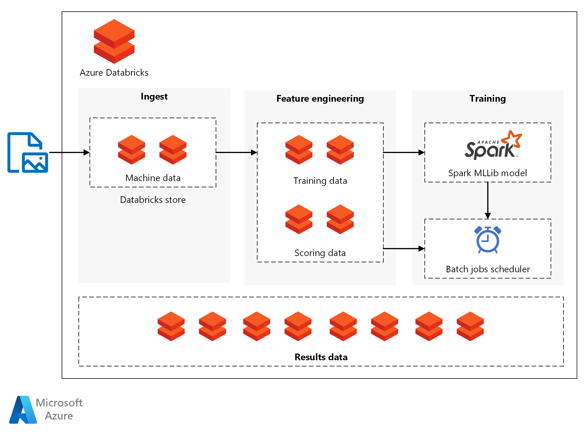

This reference architecture shows how to build a scalable solution for batch scoring an Apache Spark classification model on a schedule using [Azure Databricks][databricks], an Apache Spark-based analytics platform optimized for Azure. Databricks Machine Learning is an integrated end-to-end machine learning environment incorporating managed services for experiment tracking, model training, feature development and management, and feature and model serving. This reference architecture can be used as a template that can be generalized to other scenarios.

A reference implementation for this architecture is available on [GitHub][github].

## Scenario: batch scoring for predictive maintenance

A business in an asset-heavy industry wants to minimize the costs and downtime associated with unexpected mechanical failures. Using IoT data collected from their machines, they can create a predictive maintenance model. This model enables the business to maintain components proactively and repair them before they fail. By maximizing mechanical component use, they can control costs and reduce downtime.

A predictive maintenance model collects data from the machines and retains historical examples of component failures. The model can then be used to monitor the current state of the components and predict if a given component will fail soon. For common use cases and modeling approaches, see [Azure AI guide for predictive maintenance solutions][ai-guide].

This reference architecture is designed for workloads that are triggered by the presence of new data from the component machines. Processing involves the following steps:

1. Ingest the data from the external data store onto an Azure Databricks data store.

2. Train a machine learning model by transforming the data into a training data set, then building a Spark MLlib model. MLlib consists of most common machine learning algorithms and utilities optimized to take advantage of Spark data scalability capabilities.

3. Apply the trained model to predict (classify) component failures by transforming the data into a scoring data set. Score the data with the Spark MLLib model.

4. Store results on the Databricks data store for post-processing consumption.

Notebooks are provided on [GitHub][github] to perform each of these tasks.

## Architecture

The architecture defines a data flow that is entirely contained within [Azure Databricks][databricks] based on a set of sequentially executed [notebooks][notebooks]. It consists of the following components:

**Data files**. The reference implementation uses a simulated data set contained in five static data files.

**Ingestion**. The data ingestion notebook downloads the input data files into a collection of Databricks data sets. In a real-world scenario, data from IoT devices would stream onto Databricks-accessible storage such as Azure SQL Server or Azure Blob storage. Databricks supports multiple [data sources][data-sources].

**Training pipeline**. This notebook executes the feature engineering notebook to create an analysis data set from the ingested data. It then executes a model building notebook that trains the machine learning model using the [Apache Spark MLlib][mllib] scalable machine learning library.

**Scoring pipeline**. This notebook executes the feature engineering notebook to create scoring data set from the ingested data and executes the scoring notebook. The scoring notebook uses the trained [Spark MLlib][mllib-spark] model to generate predictions for the observations in the scoring data set. The predictions are stored in the results store, a new data set on the Databricks data store.

**Scheduler**. A scheduled Databricks [job][job] handles batch scoring with the Spark model. The job executes the scoring pipeline notebook, passing variable arguments through notebook parameters to specify the details for constructing the scoring data set and where to store the results data set.

The scenario is constructed as a pipeline flow. Each notebook is optimized to perform in a batch setting for each of the operations: ingestion, feature engineering, model building, and model scorings. The feature engineering notebook is designed to generate a general data set for any of the training, calibration, testing, or scoring operations. In this scenario, we use a temporal split strategy for these operations, so the notebook parameters are used to set date-range filtering.

Because the scenario creates a batch pipeline, we provide a set of optional examination notebooks to explore the output of the pipeline notebooks. You can find these notebooks in the [GitHub repository notebooks folder][github]:

- `1a_raw-data_exploring.ipynb`
- `2a_feature_exploration.ipynb`
- `2b_model_testing.ipynb`
- `3b_model_scoring_evaluation.ipynb`

## Recommendations

Databricks is set up so you can load and deploy your trained models to make predictions with new data. Databricks also provides other advantages:

- Single sign-on support using Azure Active Directory credentials.
- Job scheduler to execute jobs for production pipelines.
- Fully interactive notebook with collaboration, dashboards, REST APIs.
- Unlimited clusters that can scale to any size.
- Advanced security, role-based access controls, and audit logs.

To interact with the Azure Databricks service, use the Databricks [Workspace][workspace] interface in a web browser or the [command-line interface][cli] (CLI). Access the Databricks CLI from any platform that supports Python 2.7.9 to 3.6.

The reference implementation uses [notebooks][notebooks] to execute tasks in sequence. Each notebook stores intermediate data artifacts (training, test, scoring, or results data sets) to the same data store as the input data. The goal is to make it easy for you to use it as needed in your particular use case. In practice, you would connect your data source to your Azure Databricks instance for the notebooks to read and write directly back into your storage.

You can monitor job execution through the Databricks user interface, the data store, or the Databricks [CLI][cli] as necessary. Monitor the cluster using the [event log][log] and other [metrics][metrics] that Databricks provides.

## Performance considerations

An Azure Databricks cluster enables autoscaling by default so that during runtime, Databricks dynamically reallocates workers to account for the characteristics of your job. Certain parts of your pipeline may be more computationally demanding than others. Databricks adds extra workers during these phases of your job (and removes them when they're no longer needed). Autoscaling makes it easier to achieve high [cluster utilization][cluster], because you don't need to provision the cluster to match a workload.

More complex scheduled pipelines can be developed by using [Azure Data Factory][adf] with Azure Databricks.

## Storage considerations

In this reference implementation, the data is stored directly within Databricks storage for simplicity. In a production setting, however, the data can be stored on cloud data storage such as [Azure Blob Storage][blob]. [Databricks][databricks-connect] also supports [Azure Data Lake Store][azure-data-lake], [Azure Synapse Analytics][azure-synapse], [Azure Cosmos DB][azure-cosmos], [Apache Kafka][apache-kafka], and [Apache Hadoop][apache-hadoop].

## Cost considerations

Azure Databricks is a premium Spark offering with an associated cost. In addition, there are standard and premium Databricks [pricing tiers][pricing].

For this scenario, the standard pricing tier is sufficient. However, if your specific application requires automatically scaling clusters to handle larger workloads or interactive Databricks dashboards, the premium level could increase costs further.

The solution notebooks can run on any Spark-based platform with minimal edits to remove the Databricks-specific packages. See the following similar solutions for various Azure platforms:

- [SQL Server R services][sql-r]
- [PySpark on an Azure Data Science Virtual Machine][py-dvsm]

## Deploy the solution

To deploy this reference architecture, follow the steps described in the [GitHub][github] repository to build a scalable solution for scoring Spark models in batch on Azure Databricks.

## Next steps

See other Azure Architecture Center articles:

- [Build a Real-time Recommendation API on Azure][aac-recommendation] uses Spark for building a recommendation system with offline, pre-computed scores. Recommendation systems are common scenarios where scores are batch-processed.
- [Batch scoring for deep learning models using Azure Machine Learning pipelines][aac-batch-deep]
- [Batch scoring of Python Models on Azure][aac-batch-python]

Learn more:

- [Perform data science with Azure Databricks][learn1] - Microsoft Learn path.
- [Deploy batch inference pipelines with Azure Machine Learning][learn2] - Microsoft Learn module.
- [Tutorial: Build an Azure Machine Learning pipeline for batch scoring][aml-tut] - in the Azure Machine Learning documentation.

<!-- links -->

[aac-batch-deep]: ../../reference-architectures/ai/batch-scoring-deep-learning.yml
[aac-batch-python]: ../../reference-architectures/ai/batch-scoring-python.yml
[aac-recommendation]: ../../reference-architectures/ai/real-time-recommendation.yml
[adf]: https://azure.microsoft.com/blog/operationalize-azure-databricks-notebooks-using-data-factory
[ai-guide]: /azure/machine-learning/team-data-science-process/cortana-analytics-playbook-predictive-maintenance
[aml-tut]: /azure/machine-learning/tutorial-pipeline-batch-scoring-classification
[apache-hadoop]: https://hadoop.apache.org/
[apache-kafka]: https://kafka.apache.org/
[azure-cosmos]: https://azure.microsoft.com/services/cosmos-db/
[azure-data-lake]: https://azure.microsoft.com/services/storage/data-lake-storage/
[azure-synapse]: https://azure.microsoft.com/services/synapse-analytics/
[blob]: https://docs.databricks.com/spark/latest/data-sources/azure/azure-storage.html
[cli]: https://docs.databricks.com/user-guide/dev-tools/databricks-cli.html
[cluster]: /azure/databricks/clusters/configure
[databricks]: /azure/azure-databricks
[databricks-connect]: /azure/azure-databricks/databricks-connect-to-data-sources
[data-sources]: https://docs.databricks.com/spark/latest/data-sources/index.html
[github]: https://github.com/Azure/BatchSparkScoringPredictiveMaintenance
[job]: https://docs.databricks.com/user-guide/jobs.html
[learn1]: /learn/paths/perform-data-science-azure-databricks/
[learn2]: /learn/modules/deploy-batch-inference-pipelines-with-azure-machine-learning/
[log]: https://docs.databricks.com/user-guide/clusters/event-log.html
[metrics]: https://docs.databricks.com/user-guide/clusters/metrics.html
[mllib]: https://docs.databricks.com/spark/latest/mllib/index.html
[mllib-spark]: https://docs.databricks.com/spark/latest/mllib/index.html#apache-spark-mllib
[notebooks]: https://docs.databricks.com/user-guide/notebooks/index.html
[pricing]: https://azure.microsoft.com/pricing/details/databricks
[py-dvsm]: https://gallery.azure.ai/Tutorial/Predictive-Maintenance-using-PySpark
[sql-r]: https://gallery.azure.ai/Tutorial/Predictive-Maintenance-Modeling-Guide-using-SQL-R-Services-1
[workspace]: https://docs.databricks.com/user-guide/workspace.html
