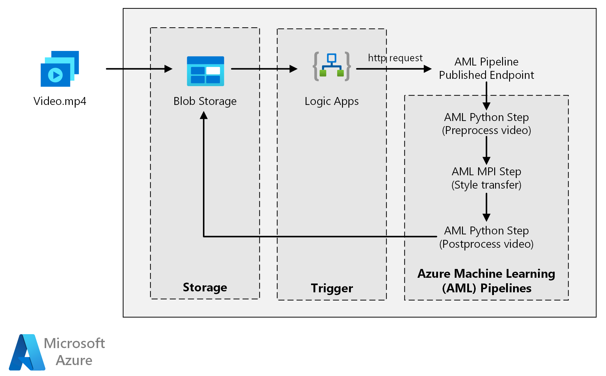

This reference architecture shows how to apply neural-style transfer to a video, using Azure Machine Learning. *Style transfer* is a deep learning technique that composes an existing image in the style of another image. You can generalize this architecture for any scenario that uses batch scoring with deep learning.

## Architecture

*Download a [Visio file](https://arch-center.azureedge.net/azure-machine-learning-deep-learning-scoring-pipeline.vsdx) of this architecture.*

### Workflow

This architecture consists of the following components.

#### Compute

**[Azure Machine Learning][amls]** uses pipelines to create reproducible and easy-to-manage sequences of computation. It also offers a managed compute target (on which a pipeline computation can run) called [Azure Machine Learning Compute][aml-compute] for training, deploying, and scoring machine learning models.

#### Storage

**[Azure Blob Storage][blob-storage]** stores all the images (input images, style images, and output images). Azure Machine Learning integrates with Blob Storage so that users don't have to manually move data across compute platforms and blob storages. Blob Storage is also cost-effective for the performance that this workload requires.

#### Trigger

**[Azure Logic Apps][logic-apps]** triggers the workflow. When the Logic App detects that a blob has been added to the container, it triggers the Azure Machine Learning pipeline. Logic Apps is a good fit for this reference architecture because it's an easy way to detect changes to blob storage, with an easy process for changing the trigger.

#### Preprocess and postprocess the data

This reference architecture uses video footage of an orangutan in a tree.

1. Use [FFmpeg][ffmpeg] to extract the audio file from the video footage, so that the audio file can be stitched back into the output video later.
1. Use FFmpeg to break the video into individual frames. The frames are processed independently, in parallel.
1. At this point, you can apply neural style transfer to each individual frame in parallel.
1. After each frame has been processed, use FFmpeg to restitch the frames back together.
1. Finally, reattach the audio file to the restitched footage.

### Components

- [Azure Machine Learning](https://azure.microsoft.com/services/machine-learning)
- [Azure Blob Storage](https://azure.microsoft.com/services/storage/blobs)
- [Azure Logic Apps](https://azure.microsoft.com/services/logic-apps)

## Solution details

This reference architecture is designed for workloads that are triggered by the presence of new media in Azure storage.

Processing involves the following steps:

1. Upload a video file to Azure Blob Storage.
1. The video file triggers Azure Logic Apps to send a request to the Azure Machine Learning pipeline published endpoint.
1. The pipeline processes the video, applies style transfer with MPI, and postprocesses the video.
1. The output is saved back to Blob Storage once the pipeline is completed.

### Potential use cases

A media organization has a video whose style they want to change to look like a specific painting. The organization wants to apply this style to all frames of the video in a timely manner and in an automated fashion. For more background about neural style transfer algorithms, see [Image Style Transfer Using Convolutional Neural Networks][image-style-transfer] (PDF).

## Considerations

These considerations implement the pillars of the Azure Well-Architected Framework, which is a set of guiding tenets that can be used to improve the quality of a workload. For more information, see [Microsoft Azure Well-Architected Framework](/azure/architecture/framework).

### Performance efficiency

Performance efficiency is the ability of your workload to scale to meet the demands placed on it by users in an efficient manner. For more information, see [Performance efficiency pillar overview](/azure/architecture/framework/scalability/overview).

#### GPU versus CPU

For deep learning workloads, GPUs generally out-perform CPUs by a considerable amount, to the extent that a sizeable cluster of CPUs is typically needed to get comparable performance. Although you can use only CPUs in this architecture, GPUs provide a much better cost/performance profile. We recommend using the latest [NCv3 series][vm-sizes-gpu] of GPU optimized VMs.

GPUs aren't enabled by default in all regions. Make sure to select a region with GPUs enabled. In addition, subscriptions have a default quota of zero cores for GPU-optimized VMs. You can raise this quota by opening a support request. Make sure that your subscription has enough quota to run your workload.

#### Parallelize across VMs versus cores

When you run a style transfer process as a batch job, the jobs that run primarily on GPUs need to be parallelized across VMs. Two approaches are possible: You can create a larger cluster using VMs that have a single GPU, or create a smaller cluster using VMs with many GPUs.

For this workload, these two options have comparable performance. Using fewer VMs with more GPUs per VM can help to reduce data movement. However, the data volume per job for this workload isn't large, so you won't observe much throttling by Blob Storage.

#### MPI step

When creating the [Azure Machine Learning pipeline][aml-pipeline], one of the steps used to perform parallel computation is the (message processing interface) MPI step. The MPI step helps split the data evenly across the available nodes. The MPI step doesn't execute until all the requested nodes are ready. Should one node fail or get preempted (if it's a low-priority virtual machine), the MPI step will have to be rerun.

### Security

Security provides assurances against deliberate attacks and the abuse of your valuable data and systems. For more information, see [Overview of the security pillar](/azure/architecture/framework/security/overview). This section contains considerations for building secure solutions.

#### Restrict access to Azure Blob Storage

In this reference architecture, Azure Blob Storage is the main storage component that needs to be protected. The baseline deployment shown in the GitHub repo uses storage account keys to access the blob storage. For further control and protection, consider using a [shared access signature (SAS)][storage-sas-overview] instead. This grants limited access to objects in storage, without needing to hard code the account keys or save them in plaintext. This approach is especially useful because account keys are visible in plaintext inside of Logic App's designer interface. Using an SAS also helps to ensure that the storage account has proper governance, and that access is granted only to the people intended to have it.

For scenarios with more sensitive data, make sure that all of your storage keys are protected, because these keys grant full access to all input and output data from the workload.

#### Data encryption and data movement

This reference architecture uses style transfer as an example of a batch scoring process. For more data-sensitive scenarios, the data in storage should be encrypted at rest. Each time data is moved from one location to the next, use Transport Layer Security (TSL) to secure the data transfer. For more information, see [Azure Storage security guide][storage-security].

#### Secure your computation in a virtual network

When deploying your Machine Learning compute cluster, you can configure your cluster to be provisioned inside a subnet of a [virtual network][virtual-network]. This subnet allows the compute nodes in the cluster to communicate securely with other virtual machines.

#### Protect against malicious activity

In scenarios where there are multiple users, make sure that sensitive data is protected against malicious activity. If other users are given access to this deployment to customize the input data, note the following precautions and considerations:

- Use [Azure role-based access control (Azure RBAC)][rbac]  to limit users' access to only the resources they need.
- Provision two separate storage accounts. Store input and output data in the first account. External users can be given access to this account. Store executable scripts and output log files in the other account. External users should not have access to this account. This separation ensures that external users can't modify any executable files (to inject malicious code), and don't have access to log files, which could hold sensitive information.
- Malicious users can perform a [DDoS attack][ddos] on the job queue or inject malformed poison messages in the job queue, causing the system to lock up or causing dequeuing errors.

### Cost optimization

Cost optimization is about looking at ways to reduce unnecessary expenses and improve operational efficiencies. For more information, see [Overview of the cost optimization pillar](/azure/architecture/framework/cost/overview).

Compared to the storage and scheduling components, the compute resources used in this reference architecture by far dominate in terms of costs. One of the main challenges is effectively parallelizing the work across a cluster of GPU-enabled machines.

The Azure Machine Learning Compute cluster size can automatically scale up and down depending on the jobs in the queue. You can enable autoscale programmatically by setting the minimum and maximum nodes.

For work that doesn't require immediate processing, configure autoscale so the default state (minimum) is a cluster of zero nodes. With this configuration, the cluster starts with zero nodes and only scales up when it detects jobs in the queue. If the batch scoring process happens only a few times a day or less, this setting results in significant cost savings.

Autoscaling may not be appropriate for batch jobs that happen too close to each other. The time that it takes for a cluster to spin up and spin down also incur a cost, so if a batch workload begins only a few minutes after the previous job ends, it might be more cost effective to keep the cluster running between jobs.

Azure Machine Learning Compute also supports low-priority virtual machines, which allows you to run your computation on discounted virtual machines, with the caveat that they may be preempted at any time. Low-priority virtual machines are ideal for non-critical batch scoring workloads.

### Monitor batch jobs

While running your job, it's important to monitor the progress and make sure that the job is working as expected. However, it can be a challenge to monitor across a cluster of active nodes.

To check the overall state of the cluster, go to the Machine Learning service in the Azure portal to check the state of the nodes in the cluster. If a node is inactive or a job has failed, the error logs are saved to Blob Storage, and are also accessible in the Azure portal.

Monitoring can be further enriched by connecting logs to Application Insights or by running separate processes to poll for the state of the cluster and its jobs.

### Log with Azure Machine Learning

Azure Machine Learning will automatically log all stdout/stderr to the associated Blob Storage account. Unless otherwise specified, your Azure Machine Learning workspace will automatically provision a storage account and dump your logs into it. You can also use a storage navigation tool such as [Azure Storage Explorer][storage-explorer], which is an easier way to navigate log files.

## Deploy this scenario

To deploy this reference architecture, follow the steps described in the [GitHub repo][deployment].

You can also deploy a batch scoring architecture for deep learning models by using the Azure Kubernetes Service. Follow the steps described in this [GitHub repo][deployment2].

## Contributors

*This article is maintained by Microsoft. It was originally written by the following contributors.* 

Principal author:

 - [Jian Tang](https://www.linkedin.com/in/jian-tang-9739a814/) | Program Manager II

*To see non-public LinkedIn profiles, sign in to LinkedIn.*

## Next steps

- [Batch scoring of Spark models on Azure Databricks](batch-scoring-databricks.yml)
- [Batch scoring of Python models on Azure](batch-scoring-python.yml)
- [Batch scoring with R models to forecast sales](batch-scoring-R-models.yml)

## Related resources

- [Artificial intelligence architecture](/azure/architecture/data-guide/big-data/ai-overview)
- [What is Azure Machine Learning?](/azure/machine-learning/overview-what-is-azure-machine-learning)
- [Azure Machine Learning pipelines](/azure/machine-learning/concept-ml-pipelines)

<!-- links -->

[aml-compute]: /azure/machine-learning/service/concept-compute-target
[aml-pipeline]: /azure/machine-learning/service/concept-ml-pipelines
[amls]: /azure/machine-learning/overview-what-is-azure-machine-learning
[blob-storage]: /azure/storage/blobs/storage-blobs-introduction
[deployment]: https://github.com/Azure/Batch-Scoring-Deep-Learning-Models-With-AML
[deployment2]: https://github.com/Azure/Batch-Scoring-Deep-Learning-Models-With-AKS
[ddos]: https://en.wikipedia.org/wiki/Denial-of-service_attack
[ffmpeg]: https://www.ffmpeg.org
[image-style-transfer]: https://www.cv-foundation.org/openaccess/content_cvpr_2016/papers/Gatys_Image_Style_Transfer_CVPR_2016_paper.pdf
[logic-apps]: /azure/logic-apps
[rbac]: /azure/role-based-access-control
[storage-explorer]: https://azure.microsoft.com/features/storage-explorer
[storage-sas-overview]: /azure/storage/common/storage-sas-overview
[storage-security]: /azure/storage/common/storage-security-guide
[virtual-network]: /azure/machine-learning/service/how-to-enable-virtual-network
[vm-sizes-gpu]: /azure/virtual-machines/sizes-gpu
