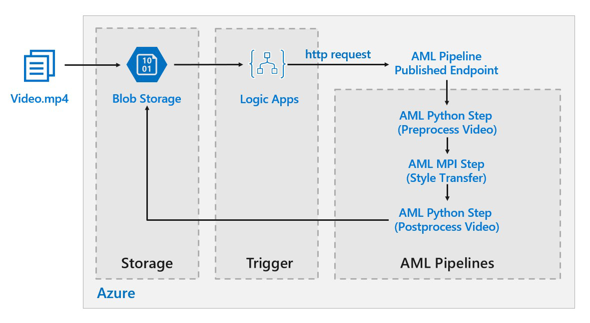

# Batch scoring of deep learning models on Azure

This reference architecture shows how to apply neural style transfer to a video, using Azure Machine Learning. *Style transfer* is a deep learning technique that composes an existing image in the style of another image. This architecture can be generalized for any scenario that uses batch scoring with deep learning. [**Deploy this solution**](#deploy-the-solution).

**Scenario**: A media organization has a video whose style they want to change to look like a specific painting. The organization wants to be able to apply this style to all frames of the video in a timely manner and in an automated fashion. For more background about neural style transfer algorithms, see [Image Style Transfer Using Convolutional Neural Networks][image-style-transfer] (PDF).

<!-- markdownlint-disable MD033 -->

| Style image: | Input/content video: | Output video: |
|--------|--------|---------|
|  |  *click to view video* |  *click to view video* |

<!-- markdownlint-enable MD033 -->

This reference architecture is designed for workloads that are triggered by the presence of new media in Azure storage.

Processing involves the following steps:

1. Upload a video file to storage.
1. The video file triggers a Logic App to send a request to the Azure Machine Learning pipeline published endpoint.
1. The pipeline processes the video, applies style transfer with MPI, and postprocesses the video.
1. The output is saved back to blob storage once the pipeline is completed.

## Architecture

This architecture consists of the following components.

### Compute

**[Azure Machine Learning][amls]** uses pipelines to create reproducible and easy-to-manage sequences of computation. It also offers a managed compute target (on which a pipeline computation can run) called [Azure Machine Learning Compute][aml-compute] for training, deploying, and scoring machine learning models.

### Storage

**[Blob storage][blob-storage]** is used to store all images (input images, style images, and output images). Azure Machine Learning integrates with Blob storage so that users do not have to manually move data across compute platforms and Blob storage. Blob storage is also very cost-effective for the performance that this workload requires.

### Trigger / scheduling

**[Azure Logic Apps][logic-apps]** is used to trigger the workflow. When the Logic App detects that a blob has been added to the container, it triggers the Azure Machine Learning Pipeline. Logic Apps is a good fit for this reference architecture because it's an easy way to detect changes to blob storage and provides an easy process for changing the trigger.

### Preprocessing and postprocessing our data

This reference architecture uses video footage of an orangutan in a tree. You can download the footage from [here][source-video].

1. Use [FFmpeg][ffmpeg] to extract the audio file from the video footage, so that the audio file can be stitched back into the output video later.
1. Use FFmpeg to break the video into individual frames. The frames will be processed independently, in parallel.
1. At this point, we can apply neural style transfer to each individual frame in parallel.
1. One each frame has been processed, we need to use FFmpeg to restitch the frames back together.
1. Finally we reattach the audio file to the restitched footage.

## Performance considerations

### GPU versus CPU

For deep learning workloads, GPUs will generally out-perform CPUs by a considerable amount, to the extent that a sizeable cluster of CPUs is usually needed to get comparable performance. While it's an option to use only CPUs in this architecture, GPUs will provide a much better cost/performance profile. We recommend using the latest [NCv3 series]vm-sizes-gpu of GPU optimized VMs.

GPUs are not enabled by default in all regions. Make sure to select a region with GPUs enabled. In addition, subscriptions have a default quota of zero cores for GPU-optimized VMs. You can raise this quota by opening a support request. Make sure that your subscription has enough quota to run your workload.

### Parallelizing across VMs versus cores

When running a style transfer process as a batch job, the jobs that run primarily on GPUs will have to be parallelized across VMs. Two approaches are possible: You can create a larger cluster using VMs that have a single GPU, or create a smaller cluster using VMs with many GPUs.

For this workload, these two options will have comparable performance. Using fewer VMs with more GPUs per VM can help to reduce data movement. However, the data volume per job for this workload is not very big, so you won't observe much throttling by blob storage.

### MPI step

When creating the [Azure Machine Learning pipeline][aml-pipeline], one of the steps used to perform parallel computation is the MPI step. The MPI step will help split the data evenly across the available nodes. The MPI step will not executed until all the requested nodes are ready. Should one node fail or get preempted (if it is a low-priority virtual machine), the MPI step will have to be rerun.

## Security considerations

### Restricting access to Azure blob storage

In this reference architecture, Azure blob storage is the main storage component that needs to be protected. The baseline deployment shown in the GitHub repo uses storage account keys to access the blob storage. For further control and protection, consider using a shared access signature (SAS) instead. This grants limited access to objects in storage, without needing to hard code the account keys or save them in plaintext. This approach is especially useful because account keys are visible in plaintext inside of Logic App's designer interface. Using an SAS also helps to ensure that the storage account has proper governance, and that access is granted only to the people intended to have it.

For scenarios with more sensitive data, make sure that all of your storage keys are protected, because these keys grant full access to all input and output data from the workload.

### Data encryption and data movement

This reference architecture uses style transfer as an example of a batch scoring process. For more data-sensitive scenarios, the data in storage should be encrypted at rest. Each time data is moved from one location to the next, use SSL to secure the data transfer. For more information, see [Azure Storage security guide][storage-security].

### Securing your computation in a virtual network

When deploying your Machine Learning compute cluster, you can configure your cluster to be provisioned inside a subnet of a [virtual network][virtual-network]. This allows the compute nodes in the cluster to communicate securely with other virtual machines.

### Protecting against malicious activity

In scenarios where there are multiple users, make sure that sensitive data is protected against malicious activity. If other users are given access to this deployment to customize the input data, take note of the following precautions and considerations:

- Use RBAC to limit users' access to only the resources they need.
- Provision two separate storage accounts. Store input and output data in the first account. External users can be given access to this account. Store executable scripts and output log files in the other account. External users should not have access to this account. This will ensure that external users cannot modify any executable files (to inject malicious code), and don't have access to log files, which could hold sensitive information.
- Malicious users can DDoS the job queue or inject malformed poison messages in the job queue, causing the system to lock up or causing dequeuing errors.

## Monitoring and logging

### Monitoring Batch jobs

While running your job, it's important to monitor the progress and make sure that things are working as expected. However, it can be a challenge to monitor across a cluster of active nodes.

To check the overall state of the cluster, go to the Machine Learning blade of the Azure portal to inspect the state of the nodes in the cluster. If a node is inactive or a job has failed, the error logs are saved to blob storage, and are also accessible in the Azure portal.

Monitoring can be further enriched by connecting logs to Application Insights or by running separate processes to poll for the state of the cluster and its jobs.

### Logging with Azure Machine Learning

Azure Machine Learning will automatically log all stdout/stderr to the associated blob storage account. Unless otherwise specified, your Azure Machine Learning workspace will automatically provision a storage account and dump your logs into it. You can also use a storage navigation tool such as Storage Explorer which will provide a much easier experience for navigating log files.

## Cost considerations

Compared to the storage and scheduling components, the compute resources used in this reference architecture by far dominate in terms of costs. One of the main challenges is effectively parallelizing the work across a cluster of GPU-enabled machines.

The Azure Machine Learning Compute cluster size can automatically scale up and down depending on the jobs in the queue. You can enable auto-scale programmatically by setting the minimum and maximum nodes.

For work that doesn't require immediate processing, configure auto-scale so the default state (minimum) is a cluster of zero nodes. With this configuration, the cluster starts with zero nodes and only scales up when it detects jobs in the queue. If the batch scoring process only happens a few times a day or less, this setting enables significant cost savings.

Auto-scaling may not be appropriate for batch jobs that happen too close to each other. The time that it takes for a cluster to spin up and spin down also incur a cost, so if a batch workload begins only a few minutes after the previous job ends, it might be more cost effective to keep the cluster running between jobs.

Azure Machine Learning Compute also supports low-priority virtual machines. This allows you to run your computation on discounted virtual machines, with the caveat that they may be preempted at any time. Low-priority virtual machines are ideal for non-critical batch scoring workloads.

## Deploy the solution

To deploy this reference architecture, follow the steps described in the [GitHub repo][deployment].

> [!NOTE]
> You can also deploy a batch scoring architecture for deep learning models using the Azure Kubernetes Service. Follow the steps described in this [Github repo][deployment2].

<!-- links -->

[aml-compute]: /azure/machine-learning/service/concept-compute-target
[aml-pipeline]: /azure/machine-learning/service/concept-ml-pipelines
[amls]: /azure/machine-learning/service/overview-what-is-azure-ml
[azcopy]: /azure/storage/common/storage-use-azcopy-linux
[blob-storage]: /azure/storage/blobs/storage-blobs-introduction
[container-instances]: /azure/container-instances/
[container-registry]: /azure/container-registry/
[deployment]: https://github.com/Azure/Batch-Scoring-Deep-Learning-Models-With-AML
[deployment2]: https://github.com/Azure/Batch-Scoring-Deep-Learning-Models-With-AKS
[ffmpeg]: https://www.ffmpeg.org/
[image-style-transfer]: https://www.cv-foundation.org/openaccess/content_cvpr_2016/papers/Gatys_Image_Style_Transfer_CVPR_2016_paper.pdf
[logic-apps]: /azure/logic-apps/
[source-video]: https://happypathspublic.blob.core.windows.net/videos/orangutan.mp4
[storage-security]: /azure/storage/common/storage-security-guide
[vm-sizes-gpu]: /azure/virtual-machines/windows/sizes-gpu
[virtual-network]: /azure/machine-learning/service/how-to-enable-virtual-network
