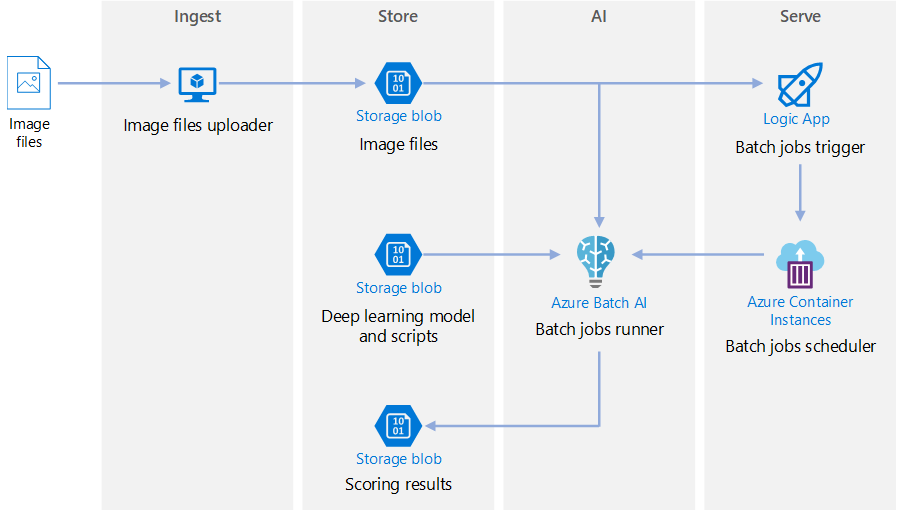
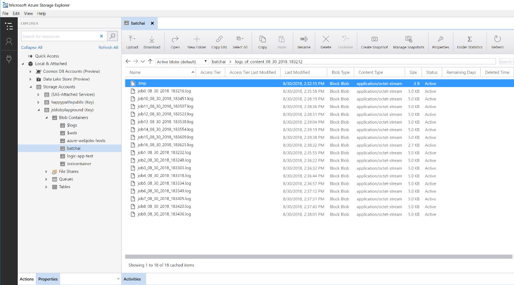

# Batch scoring on Azure for deep learning models

This reference architecture shows how to apply neural style transfer to a video, using Azure Batch AI. *Style transfer* is a deep learning technique that composes an existing image in the style of another image. This architecture can be generalized for any scenario that uses batch scoring with deep learning. [**Deploy this solution**](#deploy-the-solution).
 

**Scenario**: A media organization has a video whose style they want to change to look like a specific painting. The organization wants to be able to apply this style to all frames of the video in a timely manner and in an automated fashion. For more background about neural style transfer algorithms, see [Image Style Transfer Using Convolutional Neural Networks][image-style-transfer] (PDF).

| Style image: | Input/content video: | Output video: | 
|--------|--------|---------|
|  |  *click to view video* |  *click to view video* |

This reference architecture is designed for workloads that are triggered by the presence of new media in Azure storage. Processing involves the following steps:

1. Upload a selected style image (like a Van Gogh painting) and a style transfer script to Blob Storage.
1. Create an autoscaling Batch AI cluster that is ready to start taking work.
1. Split the video file into individual frames and upload those frames into Blob Storage.
1. Once all frames are uploaded, upload a trigger file to Blob Storage.
1. This file triggers a Logic App that creates a container running in Azure Container Instances.
1. The container runs a script that creates the Batch AI jobs. Each job applies the neural style transfer in parallel across the nodes of the Batch AI cluster.
1. Once the images are generated, they are saved back to Blob Storage.
1. Download the generated frames, and stitch back the images into a video.

## Architecture
This architecture consists of the following components.

### Compute

**[Azure Batch AI][batch-ai]** is used to run the neural style transfer algorithm. Batch AI supports deep learning workloads by providing containerized environments that are pre-configured for deep learning frameworks, on GPU-enabled VMs. Batch AI can also connect the compute cluster to Blob storage.

### Storage

**[Blob storage][blob-storage]** is used to store all images (input images, style images, and output images) as well as all logs produced from Batch AI. Blob storage integrates with Batch AI via [blobfuse][blobfuse], an open-source virtual filesystem that is backed by Blob storage. Blob storage is also very cost-effective for the performance that this workload requires.

### Trigger / scheduling

**[Azure Logic Apps][logic-apps]** is used to trigger the workflow. When the Logic App detects that a blob has been added to the container, it triggers the Batch AI process. Logic Apps is a good fit for this reference architecture because it's an easy way to detect changes to blob storage and provides an easy process for changing the trigger.

**[Azure Container Instances][container-instances]** is used to run the Python scripts that create the Batch AI jobs. Running these scripts inside a Docker container is a convenient way to run them on demand. For this architecture, we use Container Instances because there is a pre-built Logic App connector for it, which allows the Logic App to trigger the Batch AI job. Container Instances can spin up stateless processes quickly.

**[DockerHub][dockerhub]** is used to store the Docker image that Container Instances uses to execute the job creation process. DockerHub was chosen for this architecture because it's easy to use and is the default image repository for Docker users. [Azure Container Registry][container-registry] can also be used.

### Data preparation

This reference architecture uses video footage of an orangutan in a tree. You can download the footage from [here][source-video] and process it for the workflow by following these steps:

1. Use [AzCopy][azcopy] to download the video from the public blob.
2. Use [FFmpeg][ffmpeg] to extract the audio file, so that the audio file can be stitched back into the output video later.
3. Use FFmpeg to break the video into individual frames. The frames will be processed independently, in parallel.
4. Use AzCopy to copy the individual frames into your blob container.

At this stage, the video footage is in a form that can be used for neural style transfer. 

## Performance considerations

### GPU vs CPU

For deep learning workloads, GPUs will generally out-perform CPUs by a considerable amount, to the extent that a sizeable cluster of CPUs is usually needed to get comparable performance. While it's an option to use only CPUs in this architecture, GPUs will provide a much better cost/performance profile. We recommend using the latest [NCv3 series]vm-sizes-gpu of GPU optimized VMs.

GPUs are not enabled by default in all regions. Make sure to select a region with GPUs enabled. In addition, subscriptions have a default quota of zero cores for GPU-optimized VMs. You can raise this quota by opening a support request. Make sure that your subscription has enough quota to run your workload.

### Parallelizing across VMs vs cores

When running a style transfer process as a batch job, the jobs that run primarily on GPUs will have to be parallelized across VMs. Two approaches are possible: You can create a larger cluster using VMs that have a single GPU, or create a smaller cluster using VMs with many GPUs. 

For this workload, these two options will have comparable performance. Using fewer VMs with more GPUs per VM can help to reduce data movement. However, the data volume per job for this workload is not very big, so you won't observe much throttling by blob storage.

### Images batch size per Batch AI job

Another parameter that must be configured is the number of images to process per Batch AI job. On the one hand, you want to ensure that work is spread broadly across the nodes and that if a job fails, you don't have to retry too many images. That points to having many Batch AI jobs and thus a low number of images to process per job. On the other hand, if too few images are processed per job, the setup/startup time becomes disproportionately large. You can set the number of jobs to equal the maximum number of nodes in the cluster. This will be the most performant assuming that no jobs fail, because it minimizes the amount of setup/startup cost. However, if a job fails, a large number of images might need to be reprocessed.

### File servers

When using Batch AI, you can choose multiple storage options depending on the throughput needed for your scenario. For workloads with low throughput requirements, using blob storage (via blobfuse) should be enough. Alternatively, Batch AI also supports a Batch AI File Server, a managed single-node NFS, which can be automatically mounted on cluster nodes to provide a centrally accessible storage location for jobs. For most cases, only one file server is needed in a workspace, and you can separate data for your training jobs into different directories. If a single-node NFS isn't appropriate for your workloads, Batch AI supports other storage options, including Azure Files or custom solutions such as a Gluster or Lustre file system.

## Security considerations

### Restricting access to Azure blob storage

In this reference architecture, Azure blob storage is the main storage component that needs to be protected. The baseline deployment shown in the GitHub repo uses storage account keys to access the blob storage. For further control and protection, consider using a shared access signature (SAS) instead. This grants limited access to objects in storage, without needing to hard code the account keys or save them in plaintext. This approach is especially useful because account keys are visible in plaintext inside of Logic App's designer interface. Using an SAS also helps to ensure that the storage account has proper governance, and that access is granted only to the people intended to have it.

For scenarios with more sensitive data, make sure that all of your storage keys are protected, because these keys grant full access to all input and output data from the workload.

### Data encryption and data movement

This reference architecture uses style transfer as an example of a batch scoring process. For more data-sensitive scenarios, the data in storage should be encrypted at rest. Each time data is moved from one location to the next, use SSL to secure the data transfer. For more information, see [Azure Storage security guide][storage-security]. 

### Securing data in a virtual network

When deploying your Batch AI cluster, you can configure your cluster to be provisioned inside a subnet of a virtual network. This allows the compute nodes in the cluster to communicate securely with other virtual machines, or even with an on-premises network. You can also use [service endpoints][service-endpoints] with blob storage to grant access from a virtual network or use a single-node NFS inside the VNET with Batch AI to ensure that the data is always protected.

### Protecting against malicious activity

In scenarios where there are multiple users, make sure that sensitive data is protected against malicious activity. If other users are given access to this deployment to customize the input data, take note of the following precautions and considerations:

- Use RBAC to limit users' access to only the resources they need.
- Provision two separate storage accounts. Store input and output data in the first account. External users can be given access to this account. Store executable scripts and output log files in the other account. External users should not have access to this account. This will ensure that external users cannot modify any executable files (to inject malicious code), and don't have access to logfiles, which could hold sensitive information.
- Malicious users can DDOS the job queue or inject malformed poison messages in the job queue, causing the system to lock up or causing dequeuing errors. 

## Monitoring and logging

### Monitoring Batch AI jobs

While running your job, it's important to monitor the progress and make sure that things are working as expected. However, it can be a challenge to monitor across a cluster of active nodes. 

To get a sense of the overall state of the cluster, go to the Batch AI blade of the Azure Portal to inspect the state of the nodes in the cluster. If a node is inactive or a job has failed, the error logs are saved to blob storage, and are also accessible in the Jobs blade in the Azure Portal. 

Monitoring can be further enriched by connecting logs to Application Insights or by running separate processes to poll for the state of the Batch AI cluster and its jobs.

### Logging in Batch AI

Batch AI will automatically log all stdout/stderr to the associate blob storage account. Using a storage navigation tool such as Storage Explorer will provide a much easier experience for navigating log files. 

The deployment steps for this reference architecture also shows how to set up a more simple logging system, such that all the logs across the different jobs are saved to the same directory in your blob container, as shown below.
Use these logs to monitor how long it takes for each job and each image to process. This will give you a better sense of how to optimize the process even further.

## Cost considerations

Compared to the storage and scheduling components, the compute resources used in this reference architecture by far dominate in terms of costs. One of the main challenges is effectively parallelizing the work across a cluster of GPU-enabled machines.

The Batch AI cluster size can automatically scale up and down depending on the jobs in the queue. You can enable auto-scale with Batch AI in one of two ways. You can do so programmatically, which can be configured in the `.env` file that is part of the [deployment steps][deployment], or you can change the scale formula directly in the portal after the cluster is created.

For work that doesn't require immediate processing, configure the auto-scale formula so the default state (minimum) is a cluster of zero nodes. With this configuration, the cluster starts with zero nodes and only scales up when it detects jobs in the queue. If the batch scoring process only happens a few times a day or less, this setting enables significant cost savings.

Auto-scaling may not be appropriate for batch jobs that happen too close to each other. The time that it takes for a cluster to spin up and spin down also incur a cost, so if a batch workload begins only a few minutes after the previous job ends, it might be more cost effective to keep the cluster running between jobs.

## Deploy the solution

To deploy this reference architecture, follow the steps described in the [GitHub repo][deployment].

[azcopy]: /azure/storage/common/storage-use-azcopy-linux
[batch-ai]: /azure/batch-ai/
[blobfuse]: https://github.com/Azure/azure-storage-fuse
[blob-storage]: /azure/storage/blobs/storage-blobs-introduction
[container-instances]: /azure/container-instances/
[container-registry]: /azure/container-registry/
[deployment]: https://github.com/Azure/batch-scoring-for-dl-models
[dockerhub]: https://hub.docker.com/
[ffmpeg]: https://www.ffmpeg.org/
[image-style-transfer]: https://www.cv-foundation.org/openaccess/content_cvpr_2016/papers/Gatys_Image_Style_Transfer_CVPR_2016_paper.pdf
[logic-apps]: /azure/logic-apps/
[service-endpoints]: /azure/storage/common/storage-network-security?toc=%2fazure%2fvirtual-network%2ftoc.json#grant-access-from-a-virtual-network
[source-video]: https://happypathspublic.blob.core.windows.net/videos/orangutan.mp4
[storage-security]: /azure/storage/common/storage-security-guide
[vm-sizes-gpu]: /azure/virtual-machines/windows/sizes-gpu