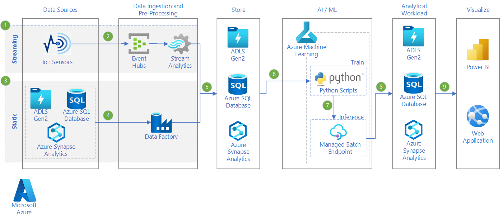

This reference architecture shows how to build a scalable solution for batch scoring many models in parallel using [Azure Machine Learning][amls]. The solution can be used as a template and can generalize to different problems.

A reference implementation for this architecture is available on [GitHub][github].

**Scenario**: This solution monitors the operation of a large number of devices in an IoT setting where each device sends sensor readings continuously. Each device is assumed to be associated with pretrained anomaly detection models (one per sensor) that need to be used to predict whether a series of measurements, that are aggregated over a predefined time interval, correspond to an anomaly or not. In real-world scenarios, this could be a stream of sensor readings that need to be filtered and aggregated before being used in training or real-time scoring. For simplicity, this solution uses the same data file when executing scoring jobs.

This reference architecture is designed for scoring scenarios that are triggered on a schedule. Processing involves the following steps:

1. Send sensor readings for ingestion to Azure Event Hubs.
2. Perform stream processing and store the raw data.
3. Send the data to a Machine Learning cluster that is ready to start taking work. Each node in the cluster runs a scoring job for a specific sensor.
4. Execute the [scoring pipeline][batch-scoring], which runs the scoring jobs in parallel using machine learning Python scripts. The pipeline is created, published, and scheduled to run on a predefined interval of time.
5. Generate predictions and store them in Blob storage for later consumption.

## Architecture

This architecture consists of the following components:

[Azure Event Hubs][event-hubs]. This message ingestion service can ingest millions of event messages per second. In this architecture, sensors send a stream of data to the event hub.

[Azure Stream Analytics][stream-analytics]. An event-processing engine. A Stream Analytics job reads the data streams from the event hub and performs stream processing.

[Azure SQL Database][sql-database]. Data from the sensor readings is loaded into SQL Database. SQL is a familiar way to store the processed, streamed data (which is tabular and structured), but other data stores can be used.

[Azure Machine Learning][amls]. Azure Machine Learning is a cloud service for training, deploying, and managing machine learning models at scale. In the context of batch scoring, Azure Machine Learning creates a cluster of virtual machines on demand with an automatic scaling option, where each node in the cluster runs a scoring job for a specific sensor. The scoring jobs are executed in parallel as Python-script steps that are queued and managed by the service. These steps are part of a Machine Learning pipeline that is created, published, and scheduled to run on a predefined interval of time.

[Azure Blob Storage][storage]. Blob containers are used to store the pretrained models, the data, and the output predictions. The models are uploaded to Blob storage in the [01_create_resources.ipynb][create-resources] notebook. These [one-class SVM][one-class-svm] models are trained on data that represents values of different sensors for different devices. This solution assumes that the data values are aggregated over a fixed interval of time.

[Azure Container Registry][acr]. The scoring Python [script][pyscript] runs in Docker containers that are created on each node of the cluster, where it reads the relevant sensor data, generates predictions and stores them in Blob storage.

## Performance considerations

For standard Python models, it's generally accepted that CPUs are sufficient to handle the workload. This architecture uses CPUs. However, for [deep learning workloads][deep], GPUs generally outperform CPUs by a considerable amount &mdash; a sizeable cluster of CPUs is usually needed to get comparable performance.

### Parallelizing across VMs versus cores

When running scoring processes of many models in batch mode, the jobs need to be parallelized across VMs. Two approaches are possible:

- Create a larger cluster using low-cost VMs.
- Create a smaller cluster using high performing VMs with more cores available on each.

In general, scoring of standard Python models is not as demanding as scoring of deep learning models, and a small cluster should be able to handle a large number of queued models efficiently. You can increase the number of cluster nodes as the dataset sizes increase.

For convenience in this scenario, one scoring task is submitted within a single [Azure Machine Learning pipeline][pipeline] step. However, it can be more efficient to score multiple data chunks within the same pipeline step. In those cases, write custom code to read in multiple datasets and execute the scoring script for those during a single-step execution.

## Management considerations

- **Monitor jobs**. It's important to monitor the progress of running jobs, but it can be a challenge to monitor across a cluster of active nodes. To inspect the state of the nodes in the cluster, use the [Azure portal][portal] to manage the [machine learning workspace][ml-workspace]. If a node is inactive or a job has failed, the error logs are saved to blob storage, and are also accessible in the Pipelines section. For richer monitoring, connect logs to [Application Insights][app-insights], or run separate processes to poll for the state of the cluster and its jobs.
- **Logging**. Machine Learning logs all stdout/stderr to the associated Azure Storage account. To easily view the log files, use a storage navigation tool such as [Azure Storage Explorer][explorer].

## Cost considerations

The most expensive components used in this reference architecture are the compute resources. The compute cluster size scales up and down depending on the jobs in the queue. Enable automatic scaling programmatically through the [Python SDK][python-sdk] by modifying the compute's provisioning configuration. Or use the [Azure CLI][cli] to set the automatic scaling parameters of the cluster.

For work that doesn't require immediate processing, configure the automatic scaling formula so the default state (minimum) is a cluster of zero nodes. With this configuration, the cluster starts with zero nodes and only scales up when it detects jobs in the queue. If the batch scoring process happens only a few times a day or less, this setting enables significant cost savings.

Automatic scaling may not be appropriate for batch jobs that happen too close to each other. The time that it takes for a cluster to spin up and spin down also incurs a cost, so if a batch workload begins only a few minutes after the previous job ends, it might be more cost effective to keep the cluster running between jobs. That depends on whether scoring processes are scheduled to run at a high frequency (every hour, for example), or less frequently (once a month, for example).

## Deployment

To deploy this reference architecture, follow the steps described in the [GitHub repo][github].

## Next steps

Product documentation:

- [What is Azure Blob storage?](/azure/storage/blobs/storage-blobs-overview)
- [Introduction to private Docker container registries in Azure](/container-registry/container-registry-intro)
- [Azure Event Hubs](/azure/event-hubs/event-hubs-about)
- [What is Azure Machine Learning?](/azure/machine-learning/overview-what-is-azure-machine-learning)
- [What is Azure SQL Database?](/azure/azure-sql/database/sql-database-paas-overview)
- [Welcome to Azure Stream Analytics](/azure/stream-analytics/stream-analytics-introduction)

Microsoft Learn modules:

- [Deploy Azure SQL Database](learn/modules/deploy-azure-sql-database)
- [Enable reliable messaging for Big Data applications using Azure Event Hubs](learn/modules/enable-reliable-messaging-for-big-data-apps-using-event-hubs)
- [Explore Azure Event Hubs](/learn/modules/azure-event-hubs)
- [Implement a Data Streaming Solution with Azure Streaming Analytics](/learn/paths/implement-data-streaming-with-asa)
- [Introduction to machine learning](/learn/modules/introduction-to-machine-learning)
- [Manage container images in Azure Container Registry](/learn/modules/publish-container-image-to-azure-container-registry)

## Related resources

- [Artificial intelligence (AI) - Architectural overview](../../data-guide/big-data/ai-overview.md)
- [Batch scoring for deep learning models using Azure Machine Learning pipelines](batch-scoring-deep-learning.md)
- [Batch scoring of Spark models on Azure Databricks](batch-scoring-databricks.md)
- [MLOps for Python models using Azure Machine Learning](mlops-python.md)
- [Real-time scoring of machine learning models in Python](real-time-scoring-machine-learning-models.md)
- [Tune hyperparameters for machine learning models in Python](training-python-models.md)

[acr]: /azure/container-registry/container-registry-intro
[amls]: /azure/machine-learning/overview-what-is-azure-machine-learning
[batch-scoring]: /azure/machine-learning/service/how-to-run-batch-predictions
[cli]: /cli/azure
[create-resources]: https://github.com/microsoft/az-ml-batch-score/blob/master/01_DataPrep.ipynb
[deep]: ./batch-scoring-deep-learning.yml
[event-hubs]: /azure/event-hubs/event-hubs-geo-dr
[explorer]: https://azure.microsoft.com/features/storage-explorer
[github]: https://github.com/Microsoft/AMLBatchScoringPipeline
[one-class-svm]: http://scikit-learn.org/stable/modules/generated/sklearn.svm.OneClassSVM.html
[portal]: https://portal.azure.com
[python-sdk]: /python/api/overview/azure/ml/intro
[ml-workspace]: /azure/machine-learning/studio/create-workspace
[pipeline]: /azure/machine-learning/service/concept-ml-pipelines
[pyscript]: https://github.com/Microsoft/AMLBatchScoringPipeline/blob/master/scripts/predict.py
[storage]: /azure/storage/blobs/storage-blobs-overview
[stream-analytics]: /azure/stream-analytics
[sql-database]: /azure/sql-database
[app-insights]: /azure/application-insights/app-insights-overview
