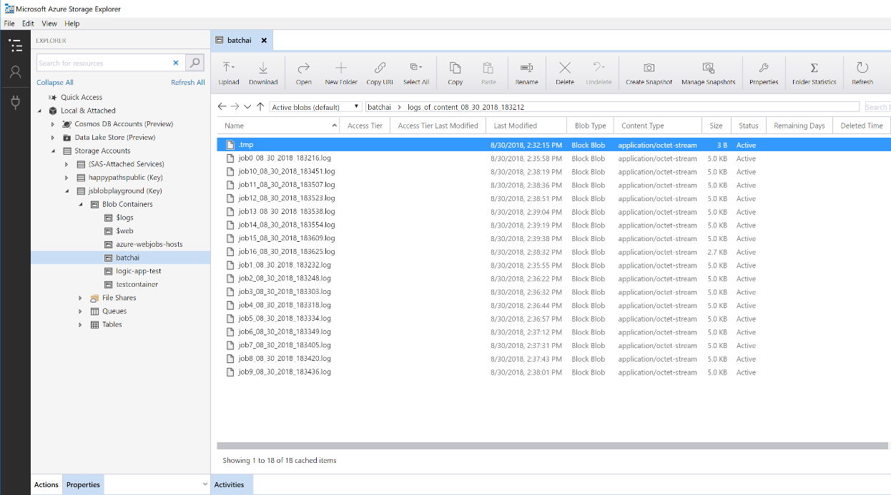

# Batch scoring of Python models on Azure

This reference architecture shows how to build a scalable solution for batch scoring many models on a schedule in parallel using Azure Batch AI. The solution can be used as a template and can generalize to different problems.

A reference implementation for this architecture is available on [GitHub][github].

**Scenario**: This solution monitors the operation of a large number of devices in an IoT setting where each device sends sensor readings continuously. Each device is assumed to have pre-trained anomaly detection models that need to be used to predict whether a series of measurements, that are aggregated over a predefined time interval, correspond to an anomaly or not. In real-world scenarios, this could be a stream of sensor readings that need to be filtered and aggregated before being used in training or real-time scoring. For simplicity, the solution uses the same data file when executing scoring jobs.

## Architecture

This architecture consists of the following components:

[Azure Event Hubs][event-hubs]. This message ingestion service can ingest millions of event messages per second. In this architecture, sensors send a stream of data to the event hub.

[Azure Stream Analytics][stream-analytics]. An event-processing engine. A Stream Analytics job reads the data streams from the event hub and performs stream processing.

[Azure Batch AI][batch-ai]. This distributed computing engine is used to train and test machine learning and AI models at scale in Azure. Batch AI creates virtual machines on demand with an automatic scaling option, where each node in the Batch AI cluster runs a scoring job for a specific sensor. The scoring Python [script][python-script] runs in Docker containers that are created on each node of the cluster, where it reads the relevant sensor data, generates predictions and stores them in Blob storage.

> [!NOTE]
> The Azure Batch AI service is retiring March 2019, and its at-scale training and scoring capabilities are now available in [Azure Machine Learning Service][amls]. This reference architecture will be updated soon to use Machine Learning, which offers a managed compute target called [Azure Machine Learning Compute][aml-compute] for training, deploying, and scoring machine learning models.

[Azure Blob Storage][storage]. Blob containers are used to store the pretrained models, the data, and the output predictions. The models are uploaded to Blob storage in the [create\_resources.ipynb][create-resources] notebook. These [one-class SVM][one-class-svm] models are trained on data that represents values of different sensors for different devices. This solution assumes that the data values are aggregated over a fixed interval of time.

[Azure Logic Apps][logic-apps]. This solution creates a Logic App that runs hourly Batch AI jobs. Logic Apps provides an easy way to create the runtime workflow and scheduling for the solution. The Batch AI jobs are submitted using a Python [script][script] that also runs in a Docker container.

[Azure Container Registry][acr]. Docker images are used in both Batch AI and Logic Apps and are created in the [create\_resources.ipynb][create-resources] notebook, then pushed to Container Registry. This provides a convenient way to host images and instantiate containers through other Azure services—Logic Apps and Batch AI in this solution.

## Performance considerations

For standard Python models, it's generally accepted that CPUs are sufficient to handle the workload. This architecture uses CPUs. However, for [deep learning workloads][deep], GPUs generally outperform CPUs by a considerable amount—a sizeable cluster of CPUs is usually needed to get comparable performance.

### Parallelizing across VMs vs cores

When running scoring processes of many models in batch mode, the jobs need to be parallelized across VMs. Two approaches are possible:

* Create a larger cluster using low-cost VMs.

* Create a smaller cluster using high performing VMs with more cores available on each.

In general, scoring of standard Python models is not as demanding as scoring of deep learning models, and a small cluster should be able to handle a large number of queued models efficiently. You can increase the number of cluster nodes as the dataset sizes increase.

For convenience in this scenario, one scoring task is submitted within a single Batch AI job. However, it can be more efficient to score multiple data chunks within the same Batch AI job. In those cases, write custom code to read in multiple datasets and execute the scoring script for those during a single Batch AI job execution.

### File servers

When using Batch AI, you can choose multiple storage options depending on the throughput needed for your scenario. For workloads with low throughput requirements, using blob storage should be enough. Alternatively, Batch AI also supports a [Batch AI File Server][bai-file-server], a managed, single-node NFS, which can be automatically mounted on cluster nodes to provide a centrally accessible storage location for jobs. For most cases, only one file server is needed in a workspace, and you can separate data for your training jobs into different directories.

If a single-node NFS isn't appropriate for your workloads, Batch AI supports other storage options, including [Azure Files][azure-files] and custom solutions such as a Gluster or Lustre file system.

## Management considerations

### Monitoring Batch AI jobs

It's important to monitor the progress of running jobs, but it can be a challenge to monitor across a cluster of active nodes. To get a sense of the overall state of the cluster, go to the **Batch AI** blade of the [Azure Portal][portal] to inspect the state of the nodes in the cluster. If a node is inactive or a job has failed, the error logs are saved to blob storage, and are also accessible in the **Jobs** blade of the portal.

For richer monitoring, connect logs to [Application Insights][ai], or run separate processes to poll for the state of the Batch AI cluster and its jobs.

### Logging in Batch AI

Batch AI logs all stdout/stderr to the associated Azure storage account. For easy navigation of the log files, use a storage navigation tool such as [Azure Storage Explorer][explorer].

When you deploy this reference architecture, you have the option to set up a simpler logging system. With this option, all the logs across the different jobs are saved to the same directory in your blob container as shown below. Use these logs to monitor how long it takes for each job and each image to process, so you have a better sense of how to optimize the process.

## Cost considerations

The most expensive components used in this reference architecture are the compute resources.

The Batch AI cluster size scales up and down depending on the jobs in the queue. You can enable [automatic scaling][automatic-scaling] with Batch AI in one of two ways. You can do so programmatically, which can be configured in the .env file that is part of the [deployment steps][github], or you can change the scale formula directly in the portal after the cluster is created.

For work that doesn't require immediate processing, configure the automatic scaling formula so the default state (minimum) is a cluster of zero nodes. With this configuration, the cluster starts with zero nodes and only scales up when it detects jobs in the queue. If the batch scoring process only happens a few times a day or less, this setting enables significant cost savings.

Automatic scaling may not be appropriate for batch jobs that happen too close to each other. The time that it takes for a cluster to spin up and spin down also incur a cost, so if a batch workload begins only a few minutes after the previous job ends, it might be more cost effective to keep the cluster running between jobs. That depends on whether scoring processes are scheduled to run at a high frequency (every hour, for example), or less frequently (once a month, for example).

## Deploy the solution

The reference implementation of this architecture is available on [GitHub][github]. Follow the setup steps there to build a scalable solution for scoring many models in parallel using Batch AI.

[acr]: /azure/container-registry/container-registry-intro
[ai]: /azure/application-insights/app-insights-overview
[aml-compute]: /azure/machine-learning/service/how-to-set-up-training-targets#amlcompute
[amls]: /azure/machine-learning/service/overview-what-is-azure-ml
[automatic-scaling]: /azure/batch/batch-automatic-scaling
[azure-files]: /azure/storage/files/storage-files-introduction
[batch-ai]: /azure/batch-ai/
[bai-file-server]: /azure/batch-ai/resource-concepts#file-server
[create-resources]: https://github.com/Azure/BatchAIAnomalyDetection/blob/master/create_resources.ipynb
[deep]: /azure/architecture/reference-architectures/ai/batch-scoring-deep-learning
[event-hubs]: /azure/event-hubs/event-hubs-geo-dr
[explorer]: https://azure.microsoft.com/en-us/features/storage-explorer/
[github]: https://github.com/Azure/BatchAIAnomalyDetection
[logic-apps]: /azure/logic-apps/logic-apps-overview
[one-class-svm]: http://scikit-learn.org/stable/modules/generated/sklearn.svm.OneClassSVM.html
[portal]: https://portal.azure.com
[python-script]: https://github.com/Azure/BatchAIAnomalyDetection/blob/master/batchai/predict.py
[script]: https://github.com/Azure/BatchAIAnomalyDetection/blob/master/sched/submit_jobs.py
[storage]: /azure/storage/blobs/storage-blobs-overview
[stream-analytics]: /azure/stream-analytics/
