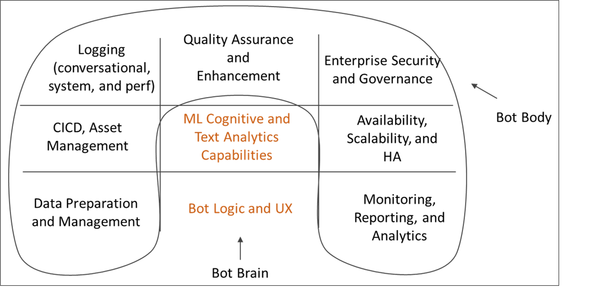

This reference architecture describes how to build an enterprise-grade conversational bot (chatbot) using the [Azure Bot Framework][bot-framework]. Each bot is different, but there are some common patterns, workflows, and technologies to be aware of. Especially for a bot to serve enterprise workloads, there are many design considerations beyond just the core functionality.

The best practice utility samples used in this architecture are fully open-sourced and available on [GitHub][git-repo-base].

## Potential use cases

This solution is ideal for the telecommunications industry. This article covers the most essential design aspects, and introduces the tools needed to build a robust, secure, and actively learning bot.

## Architecture

[![Diagram of the architecture][0]][0]

*Download a [Visio file][visio-download] of this architecture.*

### Components

The architecture shown here uses the following Azure services. Your own bot may not use all of these services, or may incorporate additional services.

#### Bot logic and user experience

- [Bot Framework Service](https://azure.microsoft.com/services/bot-services) (BFS) connects your bot to a communication app such as Cortana, Facebook Messenger, or Slack. It facilitates communication between your bot and the user.
- [Azure App Service](https://azure.microsoft.com/services/app-service) hosts the bot application logic.

#### Bot cognition and intelligence

- [Language Understanding](https://www.luis.ai) (LUIS) is part of [Azure Cognitive Services](https://azure.microsoft.com/services/cognitive-services). LUIS enables your bot to understand natural language by identifying user intents and entities.
- [Azure Search](https://azure.microsoft.com/services/search) is a managed service that provides a quick searchable document index.
- [QnA Maker](/azure/cognitive-services/QnAMaker/overview/overview) is a cloud-based API service that creates a conversational, question-and-answer layer over your data. Typically, it's loaded with semi-structured content such as FAQs. Use it to create a knowledge base for answering natural-language questions.

#### Data ingestion

The bot relies on raw data that must be ingested and prepared. Consider any of the following options to orchestrate this process:

- [Azure Data Factory](https://azure.microsoft.com/services/data-factory) orchestrates and automates data movement and data transformation.
- [Azure Logic Apps](https://azure.microsoft.com/services/logic-apps) is a serverless platform for building workflows that integrate applications, data, and services. Logic Apps provides data connectors for many applications, including Office 365.
- [Azure Functions](https://azure.microsoft.com/services/functions) lets you write custom serverless code that is invoked by a [trigger][functions-triggers] &mdash; for example, whenever a document is added to blob storage or Cosmos DB.

#### Logging and monitoring

- [Application Insights][appinsights-docs] is an extensible Application Performance Management (APM) service that lets you monitor the performance of applications, such as your chatbot.
- [Azure Blob Storage](https://azure.microsoft.com/services/storage/blobs) is optimized for storing massive amounts of unstructured data.
- [Azure Cosmos DB](https://azure.microsoft.com/free/cosmos-db) is well-suited for storing semi-structured log data such as conversations.
- [Power BI](https://powerbi.microsoft.com) lets you create monitoring dashboards for your bot.

#### Security and governance

- [Azure Active Directory](https://azure.microsoft.com/services/active-directory) (Azure AD) lets users authenticate through an identity provider such as Azure AD. The Bot Service handles the authentication flow and OAuth token management. See [Add authentication to your bot via Azure Bot Service][bot-authentication].
- [Azure Key Vault](https://azure.microsoft.com/services/key-vault) stores credentials and other secrets.

#### Quality assurance and enhancements

- [Azure DevOps](https://azure.microsoft.com/services/devops) provides many services for app management, including source control, building, testing, deployment, and project tracking.
- [VS Code](https://code.visualstudio.com/) is a lightweight code editor for app development. You can use any other IDE with similar features.

## Recommendations

At a high level, a conversational bot can be divided into the bot functionality (the "brain") and a set of surrounding requirements (the "body"). The brain includes the domain-aware components, including the bot logic and ML capabilities. Other components are domain agnostic and address non-functional requirements such as CI/CD, quality assurance, and security.

Before getting into the specifics of this architecture, let's start with the data flow through each subcomponent of the design. The data flow includes user-initiated and system-initiated data flows.

### User message flow

**Authentication**. Users start by authenticating themselves using whatever mechanism is provided by their channel of communication with the bot. The bot framework supports many communication channels, including Cortana, Microsoft Teams, Facebook Messenger, Kik, and Slack. For a list of channels, see [Connect a bot to channels](/azure/bot-service/bot-service-manage-channels). When you create a bot with Azure Bot Service, the [Web Chat][webchat] channel is automatically configured. This channel allows users to interact with your bot directly in a web page. You can also connect the bot to a custom app by using the [Direct Line](/azure/bot-service/bot-service-channel-connect-directline) channel. The user's identity is used to provide role-based access control, as well as to serve personalized content.

**User message**. Once authenticated, the user sends a message to the bot. The bot reads the message and routes it to a natural language understanding service such as [LUIS](/azure/cognitive-services/luis/). This step gets the **intents** (what the user wants to do) and **entities** (what things the user is interested in). The bot then builds a query that it passes to a service that serves information, such as [Azure Search][search] for document retrieval, [QnA Maker](https://www.qnamaker.ai/) for FAQs, or a custom knowledge base. The bot uses these results to construct a response. To give the best result for a given query, the bot might make several back-and-forth calls to these remote services.

**Response**. At this point, the bot has determined the best response and sends it to the user. If the confidence score of the best-matched answer is low, the response might be a disambiguation question or an acknowledgment that the bot could not reply adequately.

**Logging**. When a user request is received or a response is sent, all conversation actions should be logged to a logging store, along with performance metrics and general errors from external services. These logs will be useful later when diagnosing issues and improving the system.

**Feedback**. Another good practice is to collect user feedback and satisfaction scores. As a follow up to the bot's final response, the bot should ask the user to rate their satisfaction with the reply. Feedback can help you to solve the cold start problem of natural language understanding, and continually improve the accuracy of responses.

### System Data Flow

**ETL**. The bot relies on information and knowledge extracted from the raw data by an ETL process in the backend. This data might be structured (SQL database), semi-structured (CRM system, FAQs), or unstructured (Word documents, PDFs, web logs). An ETL subsystem extracts the data on a fixed schedule. The content is transformed and enriched, then loaded into an intermediary data store, such as Cosmos DB or Azure Blob Storage.

Data in the intermediary store is then indexed into Azure Search for document retrieval, loaded into QnA Maker to create question and answer pairs, or loaded into a custom web app for unstructured text processing. The data is also used to train a LUIS model for intent and entity extraction.

**Quality assurance**. The conversation logs are used to diagnose and fix bugs, provide insight into how the bot is being used, and track overall performance. Feedback data is useful for retraining the AI models to improve bot performance.

### Building a bot

Before you even write a single line of code, it's important to write a functional specification so the development team has a clear idea of what the bot is expected to do. The specification should include a reasonably comprehensive list of user inputs and expected bot responses in various knowledge domains. This living document will be an invaluable guide for developing and testing your bot.

#### Ingest data

Next, identify the data sources that will enable the bot to interact intelligently with users. As mentioned earlier, these data sources could contain structured, semi-structured, or unstructured data sets. When you're getting started, a good approach is to make a one-off copy of the data to a central store, such as Cosmos DB or Azure Storage. As you progress, you should create an automated data ingestion pipeline to keep this data current. Options for an automated ingestion pipeline include Data Factory, Functions, and Logic Apps. Depending on the data stores and the schemas, you might use a combination of these approaches.

As you get started, it's reasonable to use the Azure portal to manually create Azure resources. Later on, you should put more thought into automating the deployment of these resources.

#### Core bot logic and UX

Once you have a specification and some data, it's time to start making your bot into reality. Let's focus on the core bot logic. This is the code that handles the conversation with the user, including the routing logic, disambiguation logic, and logging. Start by familiarizing yourself with the [Bot Framework][bot-framework], including:

- Basic concepts and terminology used in the framework, especially [conversations], [turns], and [activities].
- The [Bot Connector service](/azure/bot-service/rest-api/bot-framework-rest-connector-quickstart), which handles the networking between the bot and your channels.
- How conversation [state](/azure/bot-service/bot-builder-concept-state) is maintained, either in memory or better yet in a store such as Azure Blob Storage or Azure Cosmos DB.
- [Middleware](/azure/bot-service/bot-builder-basics#middleware), and how it can be used to hook up your bot with external services, such as Cognitive Services.

For a rich [user experience](/azure/bot-service/bot-service-design-user-experience), there are many options.

- You can use [cards](/azure/bot-service/bot-service-design-user-experience#cards) to include buttons, images, carousels, and menus.
- A bot can support speech.
- You can even embed your bot in an app or website and use the capabilities of the app hosting it.

To get started, you can build your bot online using the [Azure Bot Service](/azure/bot-service/bot-service-quickstart), selecting from the available C# and Node.js templates. As your bot gets more sophisticated, however, you will need to create your bot locally then deploy it to the web. Choose an IDE, such as Visual Studio or Visual Studio Code, and a programming language. SDKs are available for the following languages:

- [C#](https://github.com/microsoft/botbuilder-dotnet)
- [JavaScript](https://github.com/microsoft/botbuilder-js)
- [Java](https://github.com/microsoft/botbuilder-java) (preview)
- [Python](https://github.com/microsoft/botbuilder-python) (preview)

As a starting point, you can download the source code for the bot you created using the Azure Bot Service. You can also find [sample code](https://github.com/Microsoft/BotBuilder-Samples/blob/master/README.md), from simple echo bots to more sophisticated bots that integrate with various AI services.

### Add smarts to your bot

For a simple bot with a well-defined list of commands, you might be able to use a rules-based approach to parse the user input via regex. This has the advantage of being deterministic and understandable. However, when your bot needs to understand the intents and entities of a more natural-language message, there are AI services that can help.

- LUIS is specifically designed to understand user intents and entities. You train it with a moderately sized collection of relevant [user input](/azure/cognitive-services/luis/luis-concept-utterance) and desired responses, and it returns the intents and entities for a user's given message.

- Azure Search can work alongside LUIS. Using Search, you create searchable indexes over all relevant data. The bot queries these indexes for the entities extracted by LUIS. Azure Search also supports [synonyms][synonyms], which can widen the net of correct word mappings.

- QnA Maker is another service that is designed to return answers for given questions. It's typically trained over semi-structured data such as FAQs.

Your bot can use other AI services to further enrich the user experience. The [Cognitive Services suite of pre-built AI](https://azure.microsoft.com/services/cognitive-services/?v=18.44a) services (which includes LUIS and QnA Maker) has services for vision, speech, language, search, and location. You can quickly add functionality such as language translation, spell checking, sentiment analysis, OCR, location awareness, and content moderation. These services can be wired up as middleware modules in your bot to interact more naturally and intelligently with the user.

Another option is to integrate your own custom AI service. This approach is more complex, but gives you complete flexibility in terms of the machine learning algorithm, training, and model. For example, you could implement your own topic modeling and use algorithm such as [LDA][lda] to find similar or relevant documents. A good approach is to expose your custom AI solution as a web service endpoint, and call the endpoint from the core bot logic. The web service could be hosted in App Service or in a cluster of VMs. [Azure Machine Learning][aml] provides a number of services and libraries to assist you in [training](https://github.com/Azure/MachineLearningNotebooks/tree/master/how-to-use-azureml/training) and [deploying](https://github.com/Azure/MachineLearningNotebooks/tree/master/how-to-use-azureml/deployment) your models.

### Quality assurance and enhancement

**Logging**. Log user conversations with the bot, including the underlying performance metrics and any errors. These logs will prove invaluable for debugging issues, understanding user interactions, and improving the system. Different data stores might be appropriate for different types of logs. For example, consider Application Insights for web logs, Cosmos DB for conversations, and Azure Storage for large payloads. See [Write directly to Azure Storage][transcript-storage].

**Feedback**. It's also important to understand how satisfied users are with their bot interactions. If you have a record of user feedback, you can use this data to focus your efforts on improving certain interactions and retraining the AI models for improved performance. Use the feedback to retrain the models, such as LUIS, in your system.

**Testing**. Testing a bot involves unit tests, integration tests, regression tests, and functional tests. For testing, we recommend recording real HTTP responses from external services, such as Azure Search or QnA Maker, so they can be played back during unit testing without needing to make real network calls to external services.

> [!NOTE]
> To jump-start your development in these areas, look at the [Botbuilder Utils for JavaScript][git-repo-base]. This repo contains sample utility code for bots built with [Microsoft Bot Framework v4][bot-framework] and running Node.js. It includes the following packages:
>
> - [Cosmos DB Logging Store][cosmosdb-logger]. Shows how to store and query bot logs in Azure Cosmos DB.
> - [Application Insights Logging Store][appinsights-logger]. Shows how to store and query bot logs in Application Insights.
> - [Feedback Collection Middleware][feedback-util]. Sample middleware that provides a bot user feedback-request mechanism.
> - [Http Test Recorder][testing util]. Records HTTP traffic from services external to the bot. It comes pre-built with support for LUIS, Azure Search, and QnAMaker, but extensions are available to support any service. This helps you automate bot testing.
>
> These packages are provided as utility sample code, and come with no guarantee of support or updates.

## Considerations

### Availability

As you roll out new features or bug fixes to your bot, it's best to use multiple deployment environments, such as staging and production. Using deployment [slots][slots] from [Azure DevOps][devops] allows you to do this with zero downtime. You can test your latest upgrades in the staging environment before swapping them to the production environment. In terms of handling load, App Service is designed to scale up or out manually or automatically. Because your bot is hosted in Microsoft's global datacenter infrastructure, the App Service SLA promises high availability.

### Security

As with any other application, the bot can be designed to handle sensitive data. Therefore, restrict who can sign in and use the bot. Also limit which data can be accessed, based on the user's identity or role. Use Azure AD for identity and access control and Key Vault to manage keys and secrets.

### DevOps

#### Monitoring and reporting

Once your bot is running in production, you will need a DevOps team to keep it that way. Continually monitor the system to ensure the bot operates at peak performance. Use the logs sent to Application Insights or Cosmos DB to create monitoring dashboards, either using Application Insights itself, Power BI, or a custom web app dashboard. Send alerts to the DevOps team if critical errors occur or performance falls below an acceptable threshold.

#### Automated resource deployment

The bot itself is only part of a larger system that provides it with the latest data and ensures its proper operation. All of these other Azure resources &mdash; data orchestration services such as Data Factory, storage services such as Cosmos DB, and so forth &mdash; must be deployed. Azure Resource Manager provides a consistent management layer that you can access through the Azure portal, PowerShell, or the Azure CLI. For speed and consistency, it's best to automate your deployment using one of these approaches.

#### Continuous bot deployment

You can deploy the bot logic directly from your IDE or from a command line, such as the Azure CLI. As your bot matures, however, it's best to use a continual deployment process using a CI/CD solution such as Azure DevOps, as described in the article [Set up continuous deployment](/azure/bot-service/bot-service-build-continuous-deployment). This is a good way to ease the friction in testing new features and fixes in your bot in a near-production environment. It's also a good idea to have multiple deployment environments, typically at least staging and production. Azure DevOps supports this approach.

### Cost optimization

Use the [Azure pricing calculator][azure-pricing-calculator] to estimate costs. Here are some other considerations.

#### Bot application

In this architecture, the main cost driver is the Azure App Service in which the bot application logic is hosted. Choose an App Service plan tier that best suits your needs. Here are some recommendations:

- Use **Free** and **Shared** (preview) tiers for testing purposes because the shared resources cannot scale out.
- Run your production workload on **Basic**, **Standard**, and **Premium** tiers because the app runs on dedicated virtual machine instances and has allocated resources that can scale out. App Service plans are billed on a per second basis.

You are charged for the instances in the App Service plan, even when the app is stopped. Delete plans that you don't intend to use long term, such as test deployments.

For more information, see [How much does my App Service plan cost?][app-service-cost].

<!-- markdownlint-disable MD024 -->

#### Data ingestion

- Azure Data Factory

    In this architecture, Data Factory automates the data ingestion pipeline. Explore a range of data integration capabilities to fit your budget needs, from managed SQL Server Integration Services for seamless migration of SQL Server projects to the cloud (cost effective option), to large-scale, serverless data pipelines for integrating data of all shapes and sizes.

    For an example, see [Azure Data Factory - example cost analysis](../../reference-architectures/data/enterprise-bi-adf.yml#example-cost-analysis).

- Azure Functions

    In this reference architecture, Azure Functions is billed as per the **Consumption plan**. You are charged based on per-second resource consumption and each time an event triggers the execution of the function. Processing several events in a single execution or batches can reduce cost.

    Azure scales the infrastructure required to run functions as needed. When workload is low, the infrastructure is scaled down up to zero with no associated cost. Whenever the workload grows, Azure uses enough capacity to serve all the demand. Because you pay per actual use, manage the exact cost of each component.

#### Logic Apps

Logic apps pricing works on the pay-as-you-go model. Logic apps have a pay-as-you-go pricing model. Triggers, actions, and connector executions are metered each time a logic app runs. All successful and unsuccessful actions, including triggers, are considered as executions.

For instance, your logic app processes 1000 messages a day from Azure Service Bus. A workflow of five actions will cost less than $6. For more information, see [Logic Apps pricing][Logic-Apps-Pricing].

For other cost considerations, see the Cost section in [Microsoft Azure Well-Architected Framework][aaf-cost].

## Next steps

- Review the [Virtual Assistant](/azure/bot-service/bot-builder-virtual-assistant-introduction) template to quickly get started building conversational bots.

Product documentation:

- [Language Understanding][luis] (LUIS)
- [Azure App Service][app-service]
- [QnA Maker][qna-maker]
- [Azure Data Factory][data-factory]
- [What is Azure Logic Apps?][logic-apps]
- [Azure Functions][functions]

Microsoft Learn modules:

- [Create Intelligent Bots with the Azure Bot Service](/learn/paths/create-bots-with-the-azure-bot-service)
- [Build a bot with QnA Maker and Azure Bot Service](/learn/modules/build-faq-chatbot-qna-maker-azure-bot-service)

## Related resources

Azure Architecture Center articles describing chatbot architectures:

- [Chatbot for hotel reservations](../../example-scenario/ai/commerce-chatbot.yml)
- [Speech-to-text conversion](../../reference-architectures/ai/speech-to-text-transcription-pipeline.yml)

<!-- links -->

[0]: ./_images/conversational-bot.png
[aad]: /azure/active-directory
[aaf-cost]: /azure/architecture/framework/cost/overview
[activities]: /azure/bot-service/rest-api/bot-framework-rest-connector-concepts#activity
[aml]: /azure/machine-learning/service
[app-insights]: /azure/azure-monitor/app/app-insights-overview
[app-service]: /azure/app-service
[app-service-cost]: /azure/app-service/overview-hosting-plans#how-much-does-my-app-service-plan-cost
[blob]: /azure/storage/blobs/storage-blobs-introduction
[bot-authentication]: /azure/bot-service/bot-builder-authentication
[bot-framework]: https://dev.botframework.com
[bot-framework-service]: /azure/bot-service/bot-builder-basics
[cognitive-services]: /azure/cognitive-services/welcome
[conversations]: /azure/bot-service/bot-service-design-conversation-flow
[cosmosdb]: /azure/cosmos-db
[azure-pricing-calculator]: https://azure.microsoft.com/pricing/calculator
[data-factory]: /azure/data-factory
[devops]: https://azure.microsoft.com/solutions/devops
[functions]: /azure/azure-functions
[functions-triggers]: /azure/azure-functions/functions-triggers-bindings
[git-repo-base]: https://github.com/Microsoft/botbuilder-utils-js
[key-vault]: /azure/key-vault
[lda]: https://wikipedia.org/wiki/Latent_Dirichlet_allocation
[logic-apps]: /azure/logic-apps/logic-apps-overview
[Logic-Apps-Pricing]: https://azure.microsoft.com/pricing/details/logic-apps
[luis]: /azure/cognitive-services/luis
[power-bi]: /power-bi
[qna-maker]: /azure/cognitive-services/QnAMaker
[search]: /azure/search
[slots]: /azure/app-service/deploy-staging-slots
[synonyms]: /azure/search/search-synonyms
[transcript-storage]: /azure/bot-service/bot-builder-howto-v4-storage
[turns]: /azure/bot-service/bot-builder-basics#defining-a-turn
[vscode]: https://azure.microsoft.com/products/visual-studio-code
[webapp]: /azure/app-service/overview
[webchat]: /azure/bot-service/bot-service-channel-connect-webchat?view=azure-bot-service-4.0

[visio-download]: https://arch-center.azureedge.net/conversational-bot.vsdx

[cosmosdb-logger]: https://github.com/Microsoft/botbuilder-utils-js/tree/master/packages/botbuilder-transcript-cosmosdb
[appinsights-logger]: https://github.com/Microsoft/botbuilder-utils-js/tree/master/packages/botbuilder-transcript-app-insights
[feedback-util]: https://github.com/Microsoft/botbuilder-utils-js/tree/master/packages/botbuilder-feedback
[testing util]: https://github.com/Microsoft/botbuilder-utils-js/tree/master/packages/botbuilder-http-test-recorder
