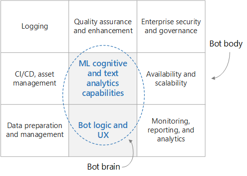

# Building an enterprise grade conversational bot

This reference architecture describes how to build an enterprise grade conversational bot using the [Azure Bot Framework](https://dev.botframework.com/). Each bot is different, of course, but there are some common patterns, workflows, and technologies to be aware of before you dive in. Especially for a bot to serve enterprise-grade workloads, there are many design considerations beyond just the core functionality. This article covers the most essential design aspects, and introduces the tools needed to build a robust, secure, and actively learning bot.

## Architecture

At a high level, a conversational bot can be divided into the bot functionality (the "brain") and a set of surrounding requirements (the "body"). The brain includes the domain-aware components, including the bot logic and ML capabilities. Other components are domain agnostic and address non-functional requirements such as CI/CD, quality assurance, and security.

Before getting into the specifics of this architecture, let's start with the data flow through each subcomponent of the design. The data flow includes user-initiated and system-initiated data flows.

### User message flow

**Authentication**. Users start by authenticating themselves using whatever mechanism is provided by their channel of communication with the bot. The bot framework supports many communciation channels, including Cortana, Microsoft Teams, Facebook Messenger, Kik, and Slack. For a list of channels, see [Connect a bot to channels](/azure/bot-service/bot-service-manage-channels). The bot is configured with channels to create a connection between the bot and the user. You can also connect the bot to a custom app by using the [Direct Line](/azure/bot-service/bot-service-channel-connect-directline) channel.

**Authorization**. The user's identity is used to provide role-based access control, as well as to serve personalized content to the user.

**User message**. Once authenticated, the user sends a message to the bot. The bot reads the message and routes it to a natural language understanding service such as [LUIS](/azure/cognitive-services/luis/). This step gets the **intents** (what the user wants to do) and **entities** (what things the user is interested in) from the message. The bot passes these intents and entities to another service that serves information, such as AzureSearch for document retrieval, [QnA Maker](https://www.qnamaker.ai/) for FAQs, or a custom knowledge base to find the best match for a response.

**Response**. At this point, the bot has determined the best response and sends it to the user. If the confidence score of the best-matched answer is low, the response might be a disambiguation question or even acknowledgement that the bot could not reply adequately.

**Logging**. When a user request is received or a response is sent, all conversation actions should be logged to a logging store, along with performance metrics and general errors from externally called services. These logs will be useful later when diagnosing issues and improving the system. The bot developers can take advantage of the convenience [log utilities](https://github.com/Microsoft/botbuilder-utils-js/tree/master/packages/botbuilder-feedback) available as open source code to standardize and jump start this effort.

**Feedback**. Another good practice, at least in the early rollout stages of the bot, is to enable the bot to collect user feedback and satisfaction scores. The feedback proves useful in eliminating the cold start problem of natural language understanding of the bot and continually improving the system (bot) accuracy. As a follow up to the bot's final response, the bot should ask the user to rate his or her satisfaction with the reply. This can be easily implemented using a [feedback collection utility](https://github.com/Microsoft/botbuilder-utils-js/tree/master/packages/botbuilder-feedback) available as open source code.

### System Data Flow

The raw data in the data backend could originate from structured sources (e.g. SQL database), semi-structured sources (e.g. CRM system , FAQs) or unstructured stores (e.g. Word docs, PDFs, raw web logs, etc. in SharePoint or Azure Blog Storage). The data source preparation and management subsystem extracts the data on a fixed schedule orchestrated by Azure Data Factory, Azure Functions, or Web Logic. The content is transformed and enriched, then loaded into an intermediary store implemented by using Cosmos DB or Azure Blob Storage.

The intermediary store content is indexed into Azure Search for document retrieval, loaded into QnA Maker to create question and answer pairs, loaded into a custom web app for unstructured text processing, and used to train a LUIS model for intent and entity extraction.

The conversation logs captured by the bot as part of user interactions (anonymized) are used to diagnose and fix bugs, provide insight into how the bot is being used, and track the overall performance. A performance dashboard and email alert notification system allow the devops team to stay on top of issues as they arise. The feedback data is also particularly useful in retraining the AI models to improve bot performance.

Bot functionality is tested using a suite of tests collected from the bot using a convenience utility called the [Bot Middleware Testing Package](https://github.com/Microsoft/botbuilder-utils-js/tree/master/packages/botbuilder-http-test-recorder) available as open source code. This package records all responses from external HTTP services, such as Azure Search, QnA Maker, etc. so that they can be played back during unit testing without needing to make real network calls to external services.

## Services used

The services shown below are indicative of those used by most bots, but you may end up using more or needing services to suit the needs of each of the solution sub-components shown in the diagram below.

### Bot logic and user experience

- Bot Service - connects your bot to a channel. A channel is a connection between the bot and communication apps such as Cortana, Facebook Messenger, or Slack. and facilitates communication between your bot and the user
- Azure WebApp - Hosts the Bot application and logic.

### Bot cognition and intelligence

- Language Understanding (LUIS) - Enables your bot to understand natural language by identifying user intents and entities.
- Azure Search – Provides a quick searchable document index.
- QnA Maker - Add a knowledge base to answer questions users ask using natural language. Typically loaded with semi-structured content such as FAQs.

### Logging

- Azure Blob Storage – Optimized for storing massive amounts of unstructured data.
- Cosmos DB – Scalable "schema on demand" document store.
- AppInsights – Used to log web application metrics for monitoring, diagnostic, and analytical purposes.

### Data ETL

- Azure Data Factory (ADF) – Scheduled orchestration service for managing ETL pipelines.
- Azure Functions - Serverless compute service that enables you to run code on-demand without having to explicitly provision or manage infrastructure.
- Logic Apps – Provides data connectors across numerous apps, including Office 365.

### Monitoring and reporting

- PowerBI (PBI) – Used to create visually appealing dashboards for data exploration and analysis.

## Security and governance

- Azure Active Directory (AAD) – User identity platform used across a wide array of services.
- KeyVault - Secure key management service for storing and managing keys and secrets.

- Azure DevOps - Project development service supporting source control, continuous build/test integration and deployment (CICD), and project planning and management.

## Building a bot

### Ingest Data

The very first thing you should do before you write a line of code is to write a functional spec so you, and everyone you work with, has a clear idea of what the bot is expected to do. Included in this should be a reasonably sized list of user inputs and expected bot responses in various knowledge domains. This "living document" will be an invaluable guide for developing and testing your bot going forward.

Next identify the data sources that will provide the data the bot will need to interact intelligently with the user. As mentioned earlier, these data sources could contain structured, semi-structured or unstructured datasets. To get started, a one-off copy of the data to a central store, such as CosmosDB or Azure Storage, is a good approach. As you progress, you will want to create automated data ingest pipelines to keep this data current, using such Azure services as Azure Data Factory, Azure Functions or Web Logic (or a combination of these based on the raw data store and the schema of the raw dataset).

As you get started, it's reasonable to use the Azure Portal to manually create whatever Azure resources you need. Later on, more thought should be put into how to automate the deployment of these resources.

### Core Bot Logic and UX

Now it's time to start making your bot into reality. You should familiarize yourself with the [bot framework](https://dev.botframework.com/), including the [bot connector](/azure/bot-service/rest-api/bot-framework-rest-connector-quickstart) that handles the networking between the bot and your channels, and the core bot logic that handles the back and forth communication with the user.

Let's focus on the core bot logic. This is the code that a bot developer writes and handles the conversation with the user including the routing logic, disambiguation logic, and logging. First, you should familiarize yourself with the basic concepts and terminology used in the bot framework, especially what is a conversation, a turn, and an activity. Familiarize yourself with how the conversation [state](/azure/bot-service/bot-builder-concept-state) is maintained, either in memory or better yet in a store such as Azure Blob Storage or Azure Cosmos DB. Also read up on [middleware](/azure/bot-service/bot-builder-basics#middleware), and how it can be used to hook up your bot with external services, such as Cognitive Services.

For a rich [UX](/azure/bot-service/bot-service-design-user-experience) experience, there are many options at your disposal. You can use [cards](/azure/bot-service/bot-service-design-user-experience#cards) to include buttons, images, carousels, and menus. You can make your bot support speech. You can even embed your bot in an app or website and leverage the capabilities of the app hosting it. Here are some design principles to consider.

To get started you can simply build your bot online using the [Azure Bot Service](https://docs.microsoft.com/en-us/azure/bot-service/bot-service-quickstart?view=azure-bot-service-4.0), where you can select from the available C# and Node.js templates. As your bot gets more sophisticated, however, you will need to create your bot locally then deploy it to the web. You must choose an IDE, such as Visual Studio or Code, and a programming language. As of this writing, SDKs are in General Available (GA) release  for [C#](https://github.com/microsoft/botbuilder-dotnet) and [JavaScript](https://github.com/microsoft/botbuilder-js), and preview release for [Java](https://github.com/microsoft/botbuilder-java) and [Python](https://github.com/microsoft/botbuilder-python). As a starting point, you can download the source code for the bot you created using the Azure Bot Service. You can also find [sample code](https://github.com/Microsoft/BotBuilder-Samples/blob/master/README.md), from simple echo bots to more sophisticated bots that integrate with various AI services.

### Add Smarts to your Bot

Depending on what your bot needs to do, for example one with a well-defined list of commands, you might be able to implement the core bot logic just by using a rules-based approach to parse the user input via regex. This has the advantage of being deterministic and understandable. However, when understanding the intents and entities of a more natural language message is required, there are AI services that can help.

LUIS is specifically designed to understand user intents and entities. You train it with a moderately sized collection of relevant [user input](https://docs.microsoft.com/en-us/azure/cognitive-services/luis/luis-concept-utterance) and desired responses, and it will return the intents and entities for a user's given message. AzureSearch can work alongside LUIS. You create searchable indexes over all relevant data and use them to find values for the given entities found by LUIS. [Synonyms](https://docs.microsoft.com/en-us/azure/search/search-synonyms) in Azure Search can also be used to widen the net of correct word mappings. QnA Maker is another service that is designed to return answers for the given questions. It is typically trained over semi-structured data such as FAQs.

There are many more AI services that can be used by your bot to further enrich the user experience. The [Cognitive Services suite of pre-built AI](https://azure.microsoft.com/en-us/services/cognitive-services/?v=18.44a) services (which includes LUIS and QnA Maker) has many services for vision, speech, language, search, and location.  You can quickly add functionality such as language translation, spell checking, sentiment analysis, OCR, location awareness, and content moderation. These services can be wired up as middleware modules in your bot to interact more naturally and intelligently with the user.

Should you want to integrate your own custom AI service, that is an option as well. In this case, you have complete flexibility on what you want to do, as you control the machine learning algorithm, training and the model. For example, you could implement your own topic modelling and use algorithm such as the [LDA](https://en.wikipedia.org/wiki/Latent_Dirichlet_allocation) for finding relevant information or answers from a set of a documents. A good approach here would be to expose your custom AI solution as a web service endpoint hosted on a WebApp, virtual machine or a cluster of machines and call the endpoint from the core bot logic. To assist you with custom AI, Azure Machine Learning provides a number of services and libraries to assist you in [training](https://github.com/Azure/MachineLearningNotebooks/tree/master/how-to-use-azureml/training) and [deploying](https://github.com/Azure/MachineLearningNotebooks/tree/master/how-to-use-azureml/deployment) your models.

## Security considerations

For an enterprise bot that could potentially expose user and company confidential information, or be the target of denial of service attacks, security is a serious issue. Restricting who can log and use the bot and limiting which data can be accessed based on the user's identity or role is required. This type of user identity and data protection can be achieved using Azure Active Directory for identity and access control and Azure Key Vault for key and secrets management.

## Logging

It's not a good idea flying blind when it comes to understanding how your bot is being used or how it's performing. You need to log user conversations with the bot, including the underlying performance metrics and any errors that occurred. These logs will prove invaluable when it comes to debugging issues, understanding user interactions, and improving the system. You can implement logging by using [transcript logging middleware](https://docs.microsoft.com/en-us/azure/bot-service/bot-builder-debug-transcript?view=azure-bot-service-4.0) for your bot. Different types of logs might be better suited for different stores. For example, AppInsights might be best for web logs, CosmosDB might be best for conversations, and Azure Storage (azure transcript storage as part of the bot framework) might be best for large payloads.

## Feedback

It's also important to understand how satisfied users are with their bot interactions. If you have a record of user feedback, you can use this data to focus your efforts on improving certain interactions and retraining the AI models for improved performance. You can use the [Feedback Middleware](https://github.com/Microsoft/botbuilder-utils-js/tree/master/packages/botbuilder-feedback) to directly ask users to provide optional feedback for each bot response. This feedback should be used to retrain the models, such as LUIS, in your system.

## Quality Assurance and Enhancement

Testing of the bot involves unit, integration, regression, and functional testing. To assist with testing the [Testing Middleware](https://github.com/Microsoft/botbuilder-utils-js/tree/master/packages/botbuilder-http-test-recorder) provides developers with the ability to record HTTP traffic from external services. It comes pre-built with support for LUIS, Azure Search, and QnAMaker, but extensions are available to support any service.

The last three sections use the Botbuilder Utils for JavaScript. This repo contains sample middleware code that can be used to accelerate the development of a Microsoft Bot Framework v4 bot running NodeJS. The packages are provided as utility sample code only, and so are not published to npm*. To use them in your bot, follow the instructions in the respective READMEs:

- [botbuilder-transcript-cosmosdb](https://github.com/Microsoft/botbuilder-utils-js/tree/master/packages/botbuilder-transcript-cosmosdb) – transcript logger backed by Cosmos DB SQL.
- [botbuilder-transcript-app-insights](https://github.com/Microsoft/botbuilder-utils-js/tree/master/packages/botbuilder-transcript-app-insights) – transcript logger backed by Application Insights.
- [botbuilder-feedback](https://github.com/Microsoft/botbuilder-utils-js/tree/master/packages/botbuilder-feedback) – feedback logging mechanism to rate the quality of answers.
- [botbuilder-http-test-recorder](https://github.com/Microsoft/botbuilder-utils-js/tree/master/packages/botbuilder-http-test-recorder) – HTTP recording and playback mechanism for unit testing.

*See ReadMe for full support disclaimer.

## Availability considerations

Keeping your enterprise bot up and running during maintenance or heavy load is essential. As you roll out new features or bug fixes to your bot, it is best to employ multiple deployment environments, such as staging and production. Using deployment slots from Azure DevOps allows you to do this with zero downtime. You can test your latest upgrades in the staging environment prior to swapping them to the production environment. As for handling load, bots are deployed as Azure WebApps, which are designed to scale up or out manually or automatically. Because your bot is hosted in Microsoft's global datacenter infrastructure, the App Service SLA promises high availability.

## Monitoring and Reporting

Now that your enterprise bot is up and running, you will need a devops team to keep it that way. Constant monitoring of the system will be needed to ensure its operating at peak performance. The logs being sent to AppInsights or CosmosDB will be used to create effective monitoring dashboards, either using AppInsights itself, PowerBI, or possibly a custom webapp dashboard. Errors or performance levels falling below an acceptable threshold will result in email notifications to the devops team.

## Automated Resource Deployment

Of course, the bot itself is only part of a larger ecosystem needed to provide it with the latest data and to ensure its proper operation. All of these other Azure resources – data orchestration services such as ADF, Web Logic, or Azure functions, storage services such as Azure Storage Blob or Cosmos DB, etc. – need to be deployed. Azure Resource Manager provides a consistent management layer that you can access through Azure Portal, Client SDKs, REST API, Azure PowerShell and Azure CLI. For speed and consistency, it's best to automate your deployment using one of these approaches.

## Continuous Bot Deployment

Deploying your bot logic itself can be done directly from your IDE, such as Visual Studio. You can also use the command line, such as the Azure CLI. As your bot matures, it's best to use a continual deployment process using Azure DevOps, as described in the article [Set up continuous deployment](https://docs.microsoft.com/en-us/azure/bot-service/bot-service-build-continuous-deployment?view=azure-bot-service-4.0). This is a good way to ease the friction in testing out new features and fixes in your bot in a near production environment. Speaking of which, and as discussed above under availability, it's a good idea to have multiple deployment environments, typically at least staging and production. Azure DevOps supports this as well, allowing you to deploy to multiple deployment slots.
