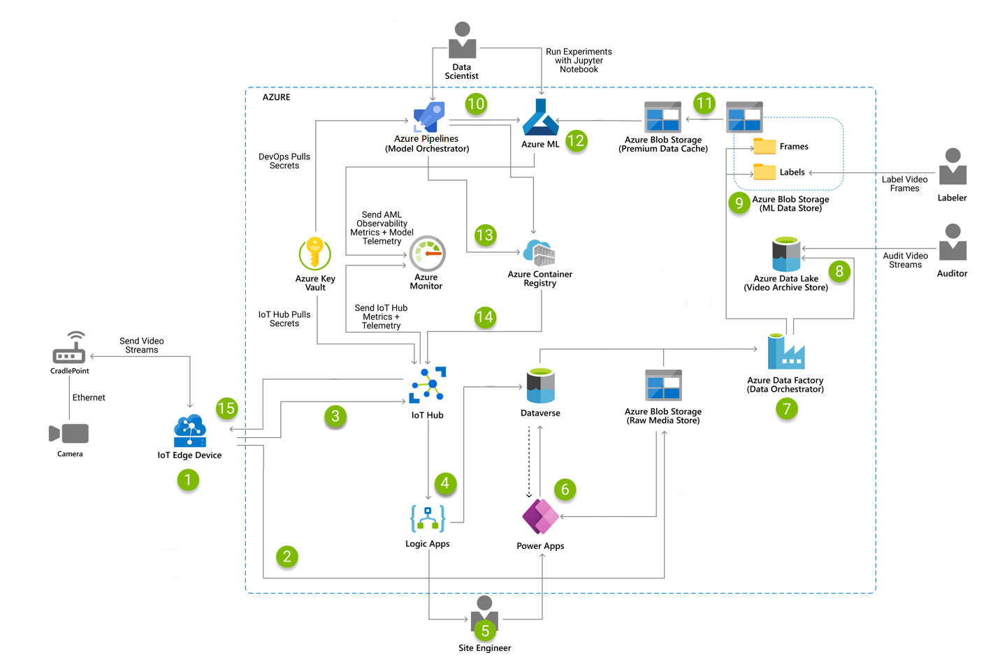

Fully automated smart factories use artificial intelligence (AI) and machine
learning (ML) to analyze data, run systems, and improve processes over time. In manufacturing, computer vision on the edge is an increasingly popular Internet of Things (IoT) application used in safety and quality assurance applications. In this example, cameras are attached to a smart device that runs a machine learning model. The model makes calculations and inferences, returning output that can be used for monitoring and troubleshooting equipment and production environments, ensuring compliance, upholding worker safety, and other operations.

This example architecture shows an end-to-end approach to computer vision from the edge to the cloud and back. It is divided into three operational areas:

-   **MLOps**. This architecture reflects a best practice to productionize machine learning called
    [MLOps](/azure/machine-learning/concept-model-management-and-deployment), a life cycle management approach based on DevOps techniques. MLOps automates the process of using ML models for complex decision-making (that is,
    "productionizing" the model) and is a top benefit for a smart factory. The key to MLOps is tight coordination among the teams who build, train, evaluate, and deploy the machine learning models.

-   **IoT**. Real-time images from [connected cameras](../../example-scenario/iot/introduction-to-solutions.yml) are used to run the ML model to inference video frames. Cached video streams are also used for auditing purposes and to retrain the models.

-   **Notification**. This example architecture describes a human-in-the-loop approach, in which people are notified to intervene at certain steps in the automation. Their interventions become part of the intelligence captured by the models, creating a continuous cycle of training, testing, tuning, and validating the machine learning algorithms.

## Potential use cases

-   Recognizing defects such as leaks in a manufacturing environment.

-   Detecting personal protective equipment (PPE).

-   Monitoring building entrances for personnel.

## Architecture

### Data flow

1.  Azure Video Analyzer consists of an IoT Edge module and an associated Azure service. On the edge module, it captures the live video stream, breaks it down into frames, and calls a service that performs inference on the image data to determine if an incident has occurred.

2.  Azure Video Analyzer service uploads the raw video files and sends them to Azure Storage, which acts as a raw media store.

3.  The inferencing results and metadata captured by Azure Video Analyzer on the edge module are sent to IoT Hub, which acts as a central message hub for communications in both directions.

4.  Azure Logic Apps monitors IoT Hub for messages about incident events.

5.  Logic Apps routes inferencing results and metadata to Microsoft Dataverse for storage.

6.  When an incident occurs, Logic Apps sends SMS and e-mail notifications to the site engineer.

7.  Site engineer opens a mobile app based on Power Apps to acknowledge and resolve the incident.

8.  Power Apps pulls inferencing results and metadata from Dataverse and the raw video files to display relevant information about the incident.

9.  Power Apps updates Dataverse with the incident resolution provided by the site engineer. This step acts as human-in-the-loop validation for model retraining purposes.

10. Azure Data Factory is the data orchestrator that fetches raw video files from the raw media store together with the corresponding inferencing results and metadata from Dataverse.

11. The data orchestrator stores the raw video files, plus the metadata, in Azure Data Lake, which serves as a video archive for auditing purposes.

12. The data orchestrator breaks raw video files into frames, converts the inferencing results into labels, and uploads the data into Azure Blob Storage, which acts as the ML data store.

13. Changes to the model code automatically trigger the Azure DevOps model orchestrator pipeline, which operators can also trigger manually. Code changes also start the machine learning model training and validation process on Azure Machine Learning.

14. Azure Machine Learning starts training the model by validating the data from the ML data store and copying the required datasets to Azure Premium Blob Storage, a performance tier that provides a data cache for faster model training.

15. Azure Machine Learning uses the dataset in the Premium data cache to train the model, validate the trained model's performance, score it against the newly trained model, and register the model into Azure Machine Learning registry.

16. A model orchestrator pipeline reviews the performance of the newly trained ML model and determines if it's better than previously trained models. If the newly trained model is better, the pipeline downloads it from Azure Machine Learning and builds a new version of the ML inferencing module to be published in Azure Container Registry.

17. When a new ML inferencing module is ready, Azure Pipeline deploys it to the IoT edge module in IoT Hub.

18. IoT Hub pulls the ML inferencing module container from Container Registry.

19. IoT Hub updates the edge device with the new ML inferencing module.

### Components

[Azure Video Analyzer](/azure/azure-video-analyzer/video-analyzer-docs/overview) enables developers to quickly build an AI-powered video analytics solution to extract actionable insights from videos, whether stored or streaming.

[Azure IoT Hub](/azure/iot-hub/about-iot-hub) acts as a central message hub for communications in both directions between an IoT application and its attached devices.

[Azure Machine Learning](/azure/machine-learning/) is used to build, train, deploy, and manage ML models in a cloud-based environment.

[Microsoft Dataverse](/powerapps/maker/data-platform/data-platform-intro) is the cloud-based storage platform used by Power Apps to support human-in-the-loop notifications and to store metadata associated with the MLOps data pipeline.

[Azure Container Registry](/azure/container-registry/) creates and manages the Docker registry. Container Registry builds, stores, and manages Docker container images, including containerized ML models.

[Azure Blob Storage](https://azure.microsoft.com/services/storage/blobs/) provides a local data store for the ML data store and a Premium data cache for training the ML model.

[Azure Data Lake Storage Gen 2](/azure/storage/blobs/data-lake-storage-introduction) provides low-cost, tiered storage on top of Azure Blob Storage. In this example, it provides the archival video store for the raw video files and metadata.

[Azure Logic Apps](/azure/logic-apps/logic-apps-overview) is used to create and run the automated notification workflow that sends SMS and email alerts to the site engineers.

[Microsoft Power Apps](/powerapps/powerapps-overview) is a suite of apps, services, and connectors, together with a data platform, that provides a rapid application development environment.

[Azure Data Factory](/azure/data-factory/introduction) is an ETL and data integration service that allows you to create data-driven workflows for orchestrating data movement and transforming data at scale. Here, it orchestrates the data in an ETL pipeline to the inferencing data, which it stores for retraining purposes.

[Azure DevOps](/azure/devops/user-guide/what-is-azure-devops?view=azure-devops) provides team-based developer services. In this example, it's used to validate ML code, trigger Azure Machine Learning pipelines with serverless tasks, compare ML models, and build the inferencing service container on the edge. It features Azure Pipelines for creating continuous integration (CI) and continuous deployment (CD) pipelines.

[Azure Monitor](/azure/azure-monitor/overview) collects telemetry from Azure resources so teams can proactively identify problems and maximize performance and reliability.

### Alternatives

-   For model orchestration, you can use Azure DevOps, which has the benefit of being closely tied to the model code. The training pipeline can be triggered easily with code changes and through a standard CI/CD process.

-   Model orchestration can also be done using Azure Data Factory. The benefit of this approach is that each Data Factory pipeline can provision the required compute resources. Data Factor doesn't hold on to the Azure DevOps agents to run ML training, which might congest normal CI/CD flow.

-   Instead of using the data pipeline to break down the video stream into image frames, you can use the option to deploy an Azure Blob Storage module onto the IoT Edge device. Then the inferencing module can upload the inferenced image frame to the storage module on the edge device, which determines when to upload the frames directly to the ML data store. The advantage of this approach is that you remove a step from the data pipeline. The tradeoff is that the IoT edge device is tightly coupled to Azure Blob Storage.

## Considerations

As part of the human-in-the-loop transactions, workers check and evaluate the results of the machine learning predictions. In this way, human expertise is captured and helps validate the model. If the model's results are inaccurate, the data is checked again and the algorithms are tuned.

This smart factory is set up with the following roles:

-   **Data labeler**. The data labeling process is the first step in creating a reliable model trained through algorithms—especially when working with image data. Azure Machine Learning Labeling allows the data labeler to label data sets for retraining to complete the loop of the end-to-end solution. Azure Data Factory organizes the video frames into logical groupings (positive and false positive), which makes the data labeler's work quick and efficient.

-   **Data scientist**. Data scientists use the labeled data sets to train the algorithms to make the right real-life predictions. As part of the MLOps lifecycle, data scientists use Azure DevOps with GitHub or Azure Pipelines to create a continuous integration (CI) process that automatically trains and validate a model. Training can be triggered manually or automatically when new data populates the dataset or when a change is made to the training scripts. Data scientists work in an [Azure Machine Learning workspace](/azure/machine-learning/concept-workspace)
    capable of automatically registering, deploying, and managing models.

-   **IoT engineer**. In the MLOps lifecycle, the IoT Engineers use [Azure Pipelines](/azure/devops/pipelines/get-started/what-is-azure-pipelines?view=azure-devops) to publish [IoT Edge modules](/azure/iot-edge/about-iot-edge), which run in containers, to Container Registry. Using a continuous deployment (CD) pipeline, they can deploy and scale the infrastructure on demand.

-   **Site engineer**. When the site engineers receive the incident notifications sent by Logic Apps, they can manually validate the results or predictions of the machine learning model. For example, they might examine a valve that the model predicted had failed.

-   **Safety auditor**. When questions arise about a model's predictions, safety auditors can review the archived video streams to detect anomalies, assess compliance, and confirm results.

### Availability

The majority of the components used in this example scenario are managed services that will automatically scale. The [availability of the services](https://azure.microsoft.com/global-infrastructure/services/?products=machine-learning-service,virtual-machines&regions=all) used in this example varies by region.

Apps based on machine learning typically require one set of resources for training and another for serving. Resources required for training generally don't need high availability, as live production requests don't directly hit these resources. Resources required for serving requests need to have high availability.

### Operations

In this example, Azure Machine Learning sends observability metrics and model telemetry to Azure Monitor, enabling the IoT engineers and data scientists to optimize operations. IoT Hub ingests high volumes of telemetry from the cameras and other IoT devices, and sends the metrics to Azure Monitor, so the site engineer can investigate and troubleshoot.

### Performance

IoT devices have limited memory and processing power, so it's important to limit the size of the container you send to it. In this example, we selected an IoT device capable of performing inference on the model and producing result in an acceptable time.

To optimize performance for training models, this example architecture uses
[Azure Premium Blob Storage](https://azure.microsoft.com/services/storage/blobs/). This performance tier is designed for workloads that require very fast response times and high transaction rates like this human-in-the-loop video labeling scenario.

For general guidance on designing scalable solutions, see the [performance efficiency checklist](/azure/architecture/framework/scalability/performance-efficiency) in the Azure Architecture Center.

### Scalability

Azure is the foundation of the long-term scalable architecture used in this smart factory example. In machine learning, scalability refers to the scale-out clusters used to train models against large datasets. Scalability also enables the machine learning model to meet the demands of the applications that consume it. To meet both needs, the cluster must provide scale-out on CPUs, and it should also include GPU-enabled nodes.

Scalability also applies to the data ingestion pipeline, where Azure Data Factory maximizes data movement by providing a highly performant, cost-effective solution.

Scalability for the IoT application depends on [IoT Hub quotas and throttling](/azure/iot-hub/iot-hub-devguide-quotas-throttling). Factors to consider include the maximum daily quota of messages into IoT Hub, the quota of connected devices in an IoT Hub instance, and the ingestion and processing throughput.

### Security

Access management mechanisms in Dataverse and other Azure services help ensure that only authorized users can access the environment, data, and reports. This solution also uses Azure Key Vault to manage passwords and secrets associated with the deployment of IoT Edge modules. Storage is encrypted using
[customer-managed keys](/azure/storage/common/customer-managed-keys-overview).

For general guidance on designing secure solutions, see the [Azure Security Documentation](/azure/security) and the [Azure IoT reference architecture](../iot.yml).

### DevOps

DevOps practices are used to orchestrate the end-to-end approach used in this example. If your organization is new to DevOps, the [DevOps Checklist](../../checklist/dev-ops.md) can help you get started.

The MLOps [maturity model](../../example-scenario/mlops/mlops-technical-paper.yml) lays out practices that support DevOps and contribute to running a successful ML environment. The [Azure Machine Learning decision guide for optimal tool selection](../../example-scenario/mlops/aml-decision-tree.yml) can also help you determine the best Azure services for your team's ML projects.

## Deploy this scenario

Here are a few related GitHub resources you can use:

-   This [Logic App sample](https://github.com/Azure/logicapps/tree/master/azure-devops-sample) is a single-tenant project that includes Azure deployment and pipeline examples.

-   This project shows you how to do [object detection on edge devices](https://github.com/Azure-Samples/MLOpsManufacturing/tree/main/samples/edge-object-detection) and route the detection results to the cloud! The repository includes pipelines that fully automate the Azure resource deployments as well as the deployment of edge modules to do the object detection.

-   [Azure Debugging Relay for Python](https://github.com/vladkol/azure-debug-relay) is a Visual Studio Code extension and a Python package for distributed remote debugging.

## Pricing

In general, use the [Azure pricing calculator](https://azure.microsoft.com/pricing/calculator) to estimate costs. For other considerations, see [Cost Optimization](/azure/architecture/framework/cost/index) in the Well-Architected Framework.

Azure Machine Learning also deploys Container Registry, Azure Storage, and Azure Key Vault services, which incur extra costs. For more information, see [How Azure Machine Learning works: Architecture and concepts](/azure/machine-learning/concept-azure-machine-learning-architecture). Azure Machine Learning pricing includes charges for the virtual machines that are used for training the model in the public cloud.

## Next steps

[How Azure Machine Learning works: Architecture and concepts](/azure/machine-learning/concept-azure-machine-learning-architecture)

[Azure IoT reference architecture](../iot.yml)

## Related resources

[Dow uses vision AI at the edge to boost employee safety and security with Azure](https://customers.microsoft.com/story/1349423518578860629-dow-chemicals-azure-video-analyzer)

[Build intelligent applications infused with world-class AI](https://mybuild.microsoft.com/sessions/2ba55238-d398-46f9-9ff2-eafcd9d69df3)

[Azure IoT for safer workplaces](https://azure.microsoft.com/solutions/safer-workplaces-iot/)
