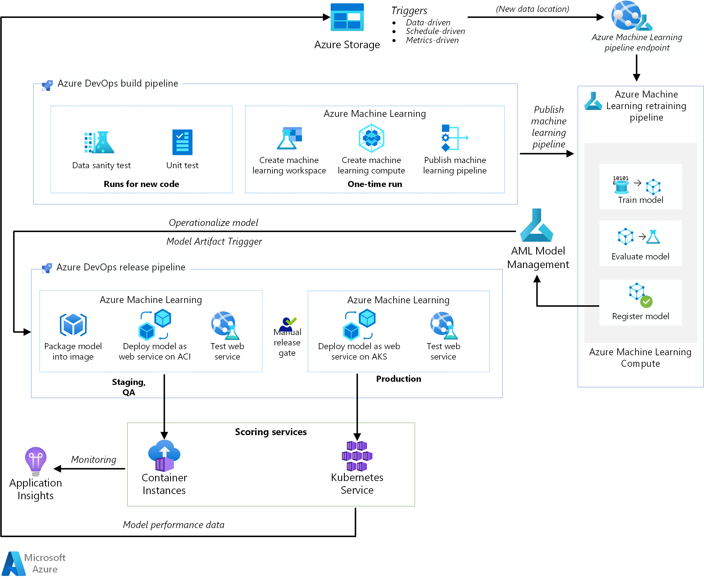

# Machine learning operationalization (MLOps) for Python models using Azure Machine Learning

This reference architecture shows how to implement a continuous integration (CI), continuous delivery (CD), and retraining pipeline for an AI application using Azure DevOps and [Azure Machine Learning](/azure/machine-learning/service/overview-what-is-azure-ml). The solution is built on the scikit-learn diabetes dataset but can be easily adapted for any AI scenario and other popular build systems such as Jenkins and Travis.

 A reference implementation for this architecture is available on [GitHub][repo].



## Architecture

This architecture consists of the following components:

**[Azure Pipelines](/azure/devops/pipelines/get-started/index?view=azure-devops)**. This build and test system is based on [Azure DevOps](https://azure.microsoft.com/services/devops/) and used for the build and release pipelines. Azure Pipelines breaks these pipelines into logical steps called tasks. For example, the [Azure CLI](/azure/devops/pipelines/tasks/deploy/azure-cli?view=azure-devops) task makes it easier to work with Azure resources.

**[Azure Machine Learning](/azure/machine-learning/service/overview-what-is-azure-ml)**. Azure Machine Learning is a cloud service for training, scoring, deploying, and managing machine learning models at scale. This architecture uses the Azure Machine Learning [SDK for Python 3](/azure/machine-learning/service/quickstart-create-workspace-with-python) to create a workspace, compute resources, the machine learning pipeline, and the scoring image. An Azure Machine Learning [workspace](/azure/machine-learning/service/concept-workspace) provides the space in which to experiment and train and deploy machine learning models.

**[Azure Machine Learning Compute](/azure/machine-learning/service/how-to-set-up-training-targets)** is cluster of virtual machines on demand with an automatic scaling and GPU and CPU node options. The training job is executed on this cluster.

**[Azure Machine Learning pipelines](/azure/machine-learning/service/concept-ml-pipelines)** provide reusable machine learning workflows that can be reused across scenarios. Training, model evaluation, model registration, and image creation occur in distinct steps within these pipelines for this use case. The pipeline is published or updated at the end of the build phase and gets triggered on new data arrival.

**[Azure Blob Storage](/azure/storage/blobs/storage-blobs-overview)**. Blob containers are used to store the logs from the scoring service. In this case, both the input data and the model prediction are collected. After some transformation, these logs can be used for model retraining.

**[Azure Container Registry](/azure/container-registry/container-registry-intro)**. The scoring Python [script](https://github.com/microsoft/MLOpsPython/blob/master/code/scoring/score.py) is packaged as a Docker image and versioned in the registry.

**[Azure Container Instances](/azure/container-instances/container-instances-overview)**. As part of release pipeline, the QA and staging environment is mimicked by deploying the scoring webservice image to Container Instances, which provides an easy, serverless way to run a container.

**[Azure Kubernetes Service](/azure/aks/intro-kubernetes)**. Once the scoring webservice image is thoroughly tested in the QA environment, it is deployed to the production environment on a managed Kubernetes cluster.

**[Azure Application Insights](/azure/azure-monitor/app/app-insights-overview)**. This monitoring service is used to detect performance anomalies.

## MLOps Pipeline

This solution demonstrates an end-to-end automation of various stages of an AI project using tools that are already familiar to software engineers. The machine learning problem is simple to keep the focus on the DevOps pipeline. The solution uses the [scikit-learn diabetes dataset](https://scikit-learn.org/stable/modules/generated/sklearn.datasets.load_diabetes.html) and builds a ridge linear regression model to predict the likelihood of diabetes. See [Training of Python scikit-learn models](/azure/architecture/reference-architectures/ai/training-python-models) for details.

This solution is based on the following three pipelines:

- **Build pipeline**. Buildings the code and runs a suite of tests.
- **Retraining pipeline**. Retrains the model on a schedule or when new data becomes available
- **Release pipeline**. Operationalizes the scoring image and promotes it safely across different environments.

The next sections describe each of these pipelines.

### Build pipeline

The CI pipeline gets triggered every time code is checked in. It publishes an updated Azure Machine Learning pipeline after building the code and running a suite of tests. The build pipeline consists of the following tasks:

- **Unit test.** These tests make sure the code works and is stable.

- **Data test.** These tests verify that the data samples conform to the expected schema and distribution. Customize this test for other use cases and run it as a separate data sanity pipeline that gets triggered as new data arrives. For example, move the data test task to a data ingestion pipeline so you can test it earlier.

The following one-time tasks occur when setting up the infrastructure for Azure Machine Learning and the Python SDK:

- Create the workspace that hosts all Azure Machine Learning-related resources.

- Create the compute resources that run the training job.

- Create the machine learning pipeline with the updated training script.

- Publish the machine learning pipeline as a REST endpoint to orchestrate the training workflow. The next section describes this step.

### Retraining pipeline

The machine learning pipeline orchestrates the process of retraining the model in an asynchronous manner. Retraining can be triggered on a schedule or when new data becomes available by calling the published pipeline REST endpoint from previous step.

This pipeline covers the following steps:

- **Train model.** The training Python script is executed on the Azure Machine Learning Compute resource to get a new model. Since training is the most compute-intensive task in an AI project, the solution uses [Azure Machine Learning Compute](/azure/machine-learning/service/how-to-set-up-training-targets#amlcompute).

- **Evaluate model.** A simple evaluation test compares the new model with the existing model, and only when the new model is better does it get promoted.

- **Register model.** The retrained model is registered with the model management service. This service provides version control for the models along with metadata tags so they can be easily reproduced.

### Release pipeline

This pipeline shows how to operationalize the scoring image and promote it safely across different environments. This pipeline is subdivided into two environments, QA and production:

#### QA environment

- **Model Artifact trigger.** Release pipelines get triggered every time a new artifact is available. A new model registered to Azure Machine Learning Model Management is treated as a release artifact. In this case, a pipeline is triggered for each new model is registered.

- **Create scoring image.** The registered model is packaged together with scoring script and Python dependencies (Conda YAML file) into an operationalization Docker image. The image automatically gets versioned through Azure Container Registry.

- **Deploy on Container Instances.** This service is used to create a non-production environment. The scoring image is also deployed here, and this is mostly used for testing. Container Instances provides an easy and quick way to test the Docker image.

- **Test web service.** A simple API test makes sure the image is successfully deployed.

#### Production environment

- **Deploy on Azure Kubernetes Service.** This service is used for deploying scoring image as a web service at scale in a production environment.

- **Test web service.** A simple API test makes sure the image is successfully deployed.

To understand the end-to-end flow of the solution, see the project
[readme](https://github.com/Microsoft/MLOpsPython#architecture-flow) on GitHub.

## Scalability considerations

A build pipeline on Azure DevOps can be scaled for applications of any size. Build pipelines have a maximum timeout that varies depending on the agent they are run on. Builds can run forever on self-hosted agents (private agents). For Microsoft-hosted agents for a public project, builds can run for six hours. For private projects, 30 minutes.

To use the maximum timeout, set the following property in your [Azure Pipelines YAML](/azure/devops/pipelines/process/phases?view=azure-devops&tabs=yaml&viewFallbackFrom=vsts#timeouts) file:

```yaml
jobs:
- job: <job_name>
  timeoutInMinutes: 0
```

Ideally, have your build pipeline finish quickly and execute only unit tests and a subset of other tests. This allows you to validate the changes quickly and fix them if issues arise. Run long-running tests during off hours.

The release pipeline publishes a real-time scoring web service. A release to the QA environment is done using Container Instances for convenience, but you can use another Kubernetes cluster running in the QA/staging environment.

Scale the production environment according to the size of your Azure Kubernetes Service cluster. The size of the cluster depends on the load you expect for the deployed scoring web service. For real-time scoring architectures, throughput is a key optimization metric. For non-deep learning scenarios, CPU should be sufficient to handle the load; however, for deep learning workloads, when speed is a bottleneck, GPUs generally provide better performance compared to CPUs. For moreTo match GPU performance using CPUs, a cluster with a large number of CPUs is usually needed. Kubernetes Service supports both CPU and GPU node types—the reason this solution uses Kubernetes Service for image deployment. For more information, see [GPUs vs CPUs for deployment of deep learning models](https://azure.microsoft.com/blog/gpus-vs-cpus-for-deployment-of-deep-learning-models/) (blog post).

Scale the retraining pipeline up and down depending on the number of nodes in your Azure Machine Learning Compute resource, and use the [autoscaling](/azure/machine-learning/service/how-to-set-up-training-targets#persistent) option to manage the cluster. This architecture uses CPUs. For deep learning workloads, GPUs are a better choice and are supported by Azure Machine Learning Compute.

## Management considerations

- **Monitor retraining job.** Machine learning pipelines orchestrate retraining across a cluster of machines and provides an easy way to monitor them. Use the [Azure portal](https://portal.azure.com/), and go to the machine learning workspace, and look under pipelines section for the logs. Alternatively, these logs are also written to blob and can be read from there as well using tools such as [Azure Storage Explorer](https://azure.microsoft.com/features/storage-explorer/).

- **Logging.** Azure Machine Learning provides an easy way to log at each step of the machine learning life cycle. The logs are stored in a blob container. For more information, see [Enable logging in Azure Machine Learning](/azure/machine-learning/service/how-to-enable-logging). For richer monitoring, configure [Application Insights](/azure/machine-learning/service/how-to-enable-app-insights#use-the-azure-portal-to-configure) to use the logs.

- **Security.** All secrets and credentials are stored in [Azure Key Vault](/azure/key-vault/) and accessed in Azure Pipelines using [variable groups](/azure/devops/pipelines/library/variable-groups?view=azure-devops&tabs=yaml#link-secrets-from-an-azure-key-vault).

## Cost considerations

Azure DevOps is [free](https://azure.microsoft.com/pricing/details/devops/azure-devops-services/) for open-source projects and small projects with up to five users. For larger teams, purchase a plan based on the number of users.

Compute is the biggest cost driver in this architecture and varies depending on the use case. For experimentation and training, Azure Machine Learning is free, you pay only for the compute used. While deploying models to Kubernetes Service cluster, Azure Machine Learning adds a small [surcharge](https://azure.microsoft.com/pricing/details/machine-learning-service/) on top of the Kubernetes Service compute cost. Depending on the expected web service load and the defined autoscaling option, you can control this cost. You can use either Azure CLI or Azure Machine Learning Python SDK to programmatically set an autoscaling configuration.

The retraining pipeline also requires a form of compute. This architecture uses Azure Machine Learning Compute, but other [options](/azure/machine-learning/service/concept-azure-machine-learning-architecture#compute-targets) are available. As mentioned earlier, training models do not incur the machine learning service surcharge; you only pay the compute cost. The compute cost depends on the cluster size, node type, and number of nodes. You can estimate the cost for Machine Learning and other services using the Azure [pricing calculator](https://azure.microsoft.com/pricing/calculator/?service=machine-learning-service).

## Deploy the solution

To deploy this reference architecture, follow the steps described in the [GitHub repo][repo].

[repo]: https://github.com/Microsoft/MLOpsPython
