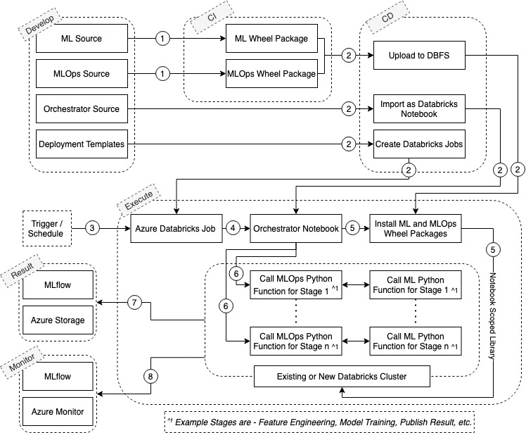

This scenario describes an approach to [machine learning operations
(MLOps)](/azure/machine-learning/concept-model-management-and-deployment) that involves running model training and batch scoring on Azure Databricks using Databricks Notebook as an orchestrator, as well as managing the end-to-end machine learning life cycle using the open-source
[MLflow](/azure/databricks/applications/mlflow/) platform.

## Potential use cases

While using large datasets (millions of records) for model training and batch scoring, MLOps stages like feature engineering, model training, and others can become long-running processes. To ensure that these long-running tasks are handled properly and that each stage proceeds resiliently, it is critically important to manage, monitor, and operate the MLOps stages with a high degree of control and flexibility.

Using an MLflow project is a common approach to orchestrating different MLOps stages. However, limitations in hosting and deployment systems may make it difficult to operate stages resiliently using MLflow. As an alternative, you can use Databricks Notebook as an orchestrator that manages the different MLOps stages needed for model training or batch scoring.

A Databricks Notebook orchestrator can be executed using a Databricks job on an existing Databricks cluster or a new cluster, an approach that allows you to gain more control over orchestration by taking advantage of additional Databricks features such as widgets, notebook-scoped libraries, jobs, and more.

## Architecture

The process in this scenario works as follows:

1. Execute the Continuous Integration pipeline. This involves:

    1. Unit tests and Lint checks.

    2. Packaging ML source code and MLOps source code (wheel packages).

2. Execute the Continuous Deployment pipeline. This involves:

    1. Uploading the ML and MLOps wheel packages to Azure Databricks DBFS.

    2. Importing the orchestrator Python source files as Azure Databricks notebooks.

    3. Creating or updating Azure Databricks jobs as per job templates (JSON files) stored in source control.

3. Trigger or schedule model training or batch scoring of Azure Databricks jobs with required parameters.

4. Azure Databricks job invokes it's respective orchestrator notebook.

5. The orchestrator notebook executes a magic Python "pip" command to install ML and MLOps wheel packages as notebook-scoped libraries.

6. The orchestrator notebook executes the MLOps Python function and corresponding ML Python function for the stage from installed wheel packages.

    You can also implement conditional Python logic to enable or disable specific MLOps stages for a particular run or rerun of the Azure Databricks job. For example, if the MLOps stage "Feature Engineering" needs to be disabled for rerun, you can use an Azure Databricks job parameter to set when it gets disabled.

    **Note:** This step will be repeated for all MLOps stages.

7. Results of model training or batch scoring can be published both in MLflow artifacts and Azure Storage based on usage:

    1. MLflow Model Registry is used to store the trained model for batch scoring.

    2. MLflow artifacts may contain statistical outcomes during training or batch scoring. For example, PCA graphs, Box plots, UMAP, etc.

    3. Azure Storage may contain batch scoring results.

8. Monitoring a run of Azure Databricks job:

    1. MLflow Parameters is used for storing model-related parameters, such as training hyperparameters, etc.

    2. MLflow Metrics is used for storing model performance metrics.

    3. Azure Monitor is used for storing MLOps stage logs, traces, and metrics.

    4. Azure Monitor is used for overall monitoring of Azure Databricks clusters.

### Advantages

In addition to addressing the issue of long-running process, this approach also adds potential benefits:

-  An alternative to MLflow projects

    -  This approach allows the reuse of an existing Databricks cluster. To run an MLflow project against Azure Databricks, a new cluster must be created; an existing cluster cannot be used. However, in certain situations it's not possible to create a new cluster on Databricks—for example, if the Databricks service is shared, or if you lack necessary permissions to create new clusters. In these situations, this approach offers a workaround.

    -  This approach can be used completely within the Databricks ecosystem, by using features like Jobs or Node Pools without interacting with external systems (for example, MLflow CLI). This might be required if Databricks access is restricted behind a VPN.

-  Testability of MLOps code

    -  Unit testing of MLOps packages enables detection of errors early in your development process.

    -  By using notebooks for orchestration, orchestrator code can be tested using integration tests with the help of a test framework, like
        [Nutter](https://github.com/microsoft/nutter).

### Components

This scenario uses the following components:

-  [MLOps](/azure/machine-learning/concept-model-management-and-deployment), based on DevOps principles and practices that increase the efficiency of workflows.

-  [MLflow](/azure/databricks/applications/mlflow/), an open-source platform for managing the end-to-end machine learning life cycle.

-  [Azure Databricks](/azure/databricks/scenarios/what-is-azure-databricks), a data analytics platform optimized for the Microsoft Azure cloud services platform.

-  [Azure Blob storage](/azure/storage/blobs/storage-blobs-overview), Microsoft's object storage solution for the cloud. Blob storage is optimized for storing massive amounts of unstructured data.

-  [Azure Monitor](/azure/azure-monitor/overview), a comprehensive solution for collecting, analyzing, and acting on telemetry from your cloud and on-premises environments.

## Considerations

This architecture does not provide in-build support for executing in remote environments.

## Alternatives

If you are able to create new Databricks clusters and can interact with external systems like MLflow CLI, you can also consider running these types of workloads using MLflow projects. See [Run MLflow Projects on Azure Databricks](/azure/databricks/applications/mlflow/projects).

If your workloads heavily rely on remote execution using Azure Machine Learning and a containerized deployment solution like Azure Kubernetes Service (AKS), MLflow may also be a better fit for your needs. See [MLflow and Azure Machine Learning](/azure/machine-learning/concept-mlflow#train-mlflow-projects).

## Pricing

Costs related to this use case will depend on the standard pricing for the following services, based on your usage:

-  [Azure Databricks pricing](https://azure.microsoft.com/pricing/details/databricks/)

-  [Azure Blob Storage pricing](https://azure.microsoft.com/pricing/details/storage/blobs/)

-  [Azure Monitor pricing](https://azure.microsoft.com/pricing/details/monitor/)

## Deploy this scenario

A sample implementation of this concept is available on the [Azure Databricks MLOps using MLflow repository](https://github.com/Azure-Samples/azure-databricks-mlops-mlflow)
. This sample provides:

-  A way to run Python-based MLOps without using [MLflow projects](https://mlflow.org/docs/latest/projects.html), but still using MLflow for managing the end-to-end machine learning life cycle.

-  A sample of machine learning source code structure along with unit test cases.

-  A sample of MLOps code structure along with Unit Test cases.

-  A demo setup configuration to try on your subscription.

## Next steps

Want to learn more about developing a machine learning solution on Azure? Consider the following articles:

-  [Azure Machine Learning decision guide for optimal tool selection](../../example-scenario/mlops/aml-decision-tree.yml)

-  [MLOps framework to upscale machine learning life cycle with Azure Machine Learning](../../example-scenario/mlops/mlops-technical-paper.yml)

-  [Batch scoring for deep learning models using Azure Machine Learning pipelines](./batch-scoring-deep-learning.yml).

-  [Send Azure Databricks application logs to Azure Monitor](../../databricks-monitoring/application-logs.md)

-  [Tutorial: Train a first Python machine learning model](/azure/machine-learning/tutorial-1st-experiment-sdk-train)

## Related resources

You may also find these Architecture Center articles useful:

-  [Batch scoring of Spark models on Azure Databricks](./batch-scoring-databricks.yml)

-  [MLOps for Python models using Azure Machine Learning](./mlops-python.yml)

-  [Modern analytics architecture with Azure Databricks](../../solution-ideas/articles/azure-databricks-modern-analytics-architecture.yml)

-  [Machine Learning Operations maturity model](../../example-scenario/mlops/mlops-maturity-model.yml)

-  [Team Data Science Process for data scientists](../../data-science-process/team-data-science-process-for-data-scientists.md)
