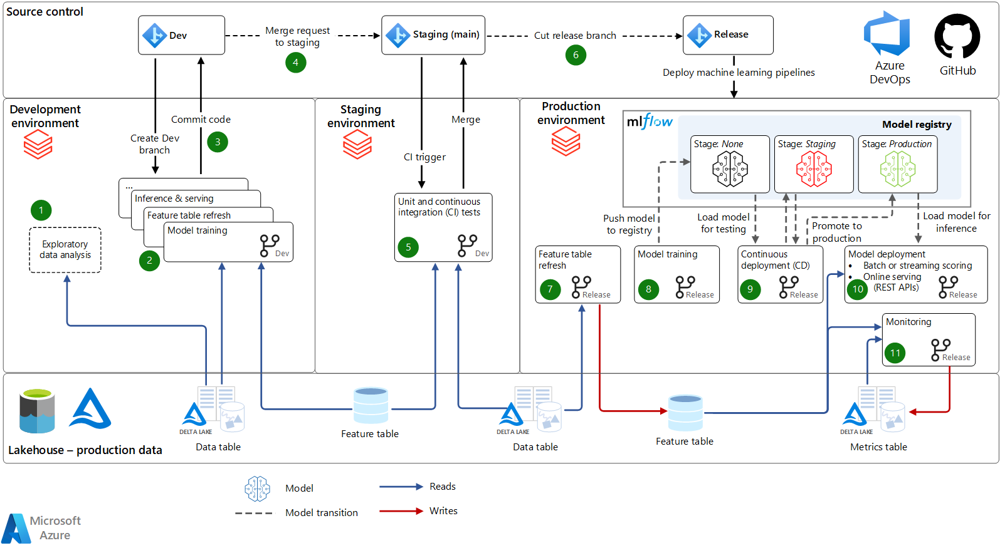

This article provides a [Machine Learning Operations (MLOps)](https://docs.microsoft.com/en-us/azure/cloud-adoption-framework/ready/azure-best-practices/ai-machine-learning-mlops) architecture and process for Azure Databricks. This MLOps process defines a standardized way of moving machine learning models and pipelines from development to production, with options for automation and humans in the loop. The architecture is pluggable; while Azure Databricks provides most architecture components, you can also integrate with your existing infrastructure for one or components.

MLOps helps to reduce risk of failures in ML and AI systems and to improve efficiency in collaboration and tooling. For an introduction to MLOps, see the blog post &quot;[Architecting MLOps on the Lakehouse](https://databricks.com/blog/2022/06/22/architecting-mlops-on-the-lakehouse.html).&quot;

## Potential use cases

This architecture is general to all types of machine learning, deep learning, and advanced analytics. Common ML/AI techniques used in this architecture include classical machine learning (linear models, tree-based models, boosting, etc.), modern deep learning (TensorFlow, PyTorch, etc.), and custom analytics (statistics, Bayesian methods, graph analytics, etc.).

This architecture supports both small data (single-machine) and large data (distributed computing and GPU-accelerated). In each stage of the architecture, flexible choices for compute resources and libraries can be made to adapt to the data and problem dimensions.

This architecture applies to all types of business use cases and industries. Azure Databricks customers leveraging this and similar architectures include both small and large organizations in:

- Consumer goods and retail services
- Financial services
- Healthcare and life sciences
- Information technology
- and many more

See the [Databricks Customers website](https://databricks.com/customers) for examples.

## Architecture

The reference architecture below provides a template for a robust MLOps process using Azure Databricks. All elements in the architecture are pluggable, so other Azure and 3rd-party services may integrate throughout the architecture as needed. This architecture and description are adapted from the eBook, "The Big Book of MLOps", available directly from © Databricks, Inc.

## Workflow

- **Source Control**: This project&#39;s code repository organizes the notebooks, modules, and pipelines. Data scientists can create development branches to test updates and new models. Code may be developed in notebooks or in IDEs, backed by Git, with [Repos](https://docs.microsoft.com/en-us/azure/databricks/repos/) integration for syncing with your Azure Databricks workspaces. Source control is used to promote ML pipelines from development, through staging (for testing), to production (for deployment).

- **Lakehouse - Production Data**: Data scientists work in the development environment, where they have read-only access to production data (alternatively, data can be mirrored or redacted). They also have read-write access to a dev storage environment for development and experimentation. We recommend a [Lakehouse](https://databricks.com/blog/2020/01/30/what-is-a-data-lakehouse.html) architecture for data, in which data are stored in [Azure Data Lake Storage](https://docs.microsoft.com/en-us/azure/storage/blobs/data-lake-storage-introduction) in [Delta Lake](https://docs.microsoft.com/en-us/azure/databricks/delta/) format, with access controls defined using [Azure Active Directory credential passthrough](https://docs.microsoft.com/en-us/azure/databricks/security/credential-passthrough/adls-passthrough) or [Table Access Controls](https://docs.microsoft.com/en-us/azure/databricks/administration-guide/access-control/table-acl).

### Development 

In the development environment, data scientists and engineers develop ML pipelines.

1. **Exploratory Data Analysis (EDA)**: Data scientists explore data in an interactive, iterative process. This ad hoc work might not be deployed to staging or production. Tools may include [Databricks SQL](https://docs.microsoft.com/en-us/azure/databricks/sql/get-started/), [dbutils.data.summarize](https://docs.microsoft.com/en-us/azure/databricks/dev-tools/databricks-utils#dbutils-data-summarize) and [AutoML](https://docs.microsoft.com/en-us/azure/databricks/applications/machine-learning/automl).

1. [**Model Training**](https://docs.microsoft.com/en-us/azure/databricks/applications/machine-learning/train-model/) **and Other ML Pipelines**: ML pipelines are developed as modular code in notebooks and/or IDEs. For example, the Model Training pipeline reads data from the feature store and other Lakehouse tables. Training and tuning log model parameters and metrics to the [MLflow tracking server](https://docs.microsoft.com/en-us/azure/databricks/applications/mlflow/tracking), and the final model is logged using the [Feature Store APIs](https://docs.microsoft.com/en-us/azure/databricks/applications/machine-learning/feature-store/python-api). These logs link the model, its inputs, and the training code.

1. **Commit Code**: To promote the ML workflow towards production, the data scientist commits the code for featurization, training, and other pipelines to source control.

### Staging

In the staging environment, CI infrastructure tests changes to ML pipelines in an environment which mimics production.

4. **Merge Request**: When a merge (or pull) request is submitted against the staging (main) branch of the project in source control, then a CI/CD tool such as [Azure DevOps](https://docs.microsoft.com/en-us/azure/devops/?view=azure-devops) runs tests.

5. **Unit and Continuous Integration (CI) tests**: Unit tests can run in CI infrastructure, and integration tests can run end-to-end [Workflows](https://docs.microsoft.com/en-us/azure/databricks/jobs) on Databricks. If tests pass, the code changes are merged.

6. **Cut Release Branch**: When ready to deploy the updated ML pipelines to production, an ML engineer can cut a new release. A deployment pipeline in the CI/CD tool redeploys the updated pipelines as new [Workflows](https://docs.microsoft.com/en-us/azure/databricks/jobs).

### Production

ML engineers manage the production environment, where ML pipelines directly serve end applications. The key pipelines in production refresh feature tables, train and deploy new models, run inference or serving, and monitor model performance.

7. **Feature Table Refresh**: This pipeline reads data, computes features, and writes to [Feature Store](https://docs.microsoft.com/en-us/azure/databricks/applications/machine-learning/feature-store/) tables. It can run continuously in streaming mode, run on a schedule, or be triggered.

1. **Model Training**: In production, the model (re)training pipeline can be triggered or scheduled to train a fresh model on the latest production data. Models are registered to the [MLflow Model Registry](https://docs.microsoft.com/en-us/azure/databricks/applications/mlflow/model-registry).

1. **Continuous Deployment (CD)**: Registering new model versions triggers the CD pipeline, which runs tests to ensure that the model will perform well in production. As the model passes tests, its progress is tracked in the Model Registry via model stage transitions, and [registry webhooks](https://docs.microsoft.com/en-us/azure/databricks/applications/mlflow/model-registry-webhooks) may be used for automation. Tests can include compliance checks, A/B tests to compare the new model with the current production model, and infrastructure tests. Test results and metrics are recorded in Lakehouse tables. Manual sign-offs can optionally be required before models are transitioned to production.

1. **Model Deployment**: As a model enters production, it is deployed for scoring or serving. The most common deployment modes are:
    1. [**Batch or Streaming Scoring**](https://docs.microsoft.com/en-us/azure/databricks/applications/machine-learning/model-inference/#offline-batch-predictions): For latencies of minutes or higher, batch and streaming are the most cost-effective options. The scoring pipeline reads the latest data from the Feature Store, loads the latest production model version from the Model Registry, and performs inference in a Databricks Job. It can publish predictions to Lakehouse tables, a JDBC connection, flat files, message queues, or other downstream systems.
    2. **Online Serving (REST APIs)**: For low-latency use cases, online serving is generally necessary. MLflow can deploy models to [MLflow Model Serving on Azure Databricks](https://docs.microsoft.com/en-us/azure/databricks/applications/mlflow/model-serving), cloud provider serving systems, and other systems. In all cases, the serving system is initialized with the latest production model from the Model Registry. For each request, it fetches features from an online Feature Store and makes predictions.

1. **Monitoring**: Continuous or periodic [Workflows](https://docs.microsoft.com/en-us/azure/databricks/jobs) monitor input data and model predictions for drift, performance, and other metrics. [Delta Live Tables](https://docs.microsoft.com/en-us/azure/databricks/data-engineering/delta-live-tables/) can simplify automation of monitoring pipelines, storing the metrics in Lakehouse tables. [Databricks SQL](https://docs.microsoft.com/en-us/azure/databricks/sql/), [Power BI](https://docs.microsoft.com/en-us/power-bi/) or other tools can read from those tables to create dashboards and alerts.

1. **Retraining**: This architecture supports both manual and automatic retraining. Scheduled retraining jobs are the simplest option to keep models fresh.

## Components

[**Data Lakehouse**](https://databricks.com/blog/2020/01/30/what-is-a-data-lakehouse.html)

A Lakehouse architecture unifies the best elements of data lakes and data warehouses — delivering data management and performance typically found in data warehouses with the low-cost, flexible object stores offered by data lakes.

- [**Delta**](https://delta.io/) is the recommended choice for an open-source data format for a Lakehouse. Azure Databricks stores data in your Azure Data Lake Storage (ADLS) and provides a high-performance query engine.

[**MLflow**](https://www.mlflow.org/)

MLflow is an open-source project for managing the end-to-end machine learning lifecycle. It has the following primary components:

- [**Tracking**](https://docs.microsoft.com/en-us/azure/databricks/applications/mlflow/tracking): Allows you to track experiments to record and compare parameters, metrics and model artifacts.
  - [**MLflow Autologging**](https://docs.microsoft.com/en-us/azure/databricks/applications/mlflow/databricks-autologging): Azure Databricks extends [MLflow automatic logging](https://mlflow.org/docs/latest/tracking.html#automatic-logging) to track ML experiments, automatically logging model parameters, metrics, files, and lineage information.
- [**Models**](https://docs.microsoft.com/en-us/azure/databricks/applications/mlflow/models): Allows you to store and deploy models from any ML library to a variety of model serving and inference platforms.
- [**Model Registry**](https://docs.microsoft.com/en-us/azure/databricks/applications/mlflow/model-registry): Provides a centralized model store for managing models&#39; lifecycle stage transitions from development to production.
- [**Model Serving**](https://docs.microsoft.com/en-us/azure/databricks/applications/mlflow/model-serving): Enables you to host MLflow Models as REST endpoints.

Azure Databricks provides a managed MLflow service with enterprise security features, high availability, and integrations with other Azure Databricks workspace features.

[**Databricks Runtime for Machine Learning**](https://docs.microsoft.com/en-us/azure/databricks/runtime/mlruntime#mlruntime)

The &quot;ML Runtime&quot; automates the creation of a cluster optimized for machine learning, preinstalling popular ML libraries like TensorFlow, PyTorch and XGBoost as well as Azure Databricks ML tools like AutoML and Feature Store clients.

[**Feature Store**](https://docs.microsoft.com/en-us/azure/databricks/applications/machine-learning/feature-store/)

The Azure Databricks Feature Store is a centralized repository of features. It enables feature sharing and discovery, and it helps to avoid data skew between model training and inference.

[**Azure Databricks SQL**](https://docs.microsoft.com/en-us/azure/databricks/sql/)

Azure Databricks SQL provides a simple experience for SQL queries on Lakehouse data, as well as for visualizations, dashboards and alerts.

[**Repos**](https://docs.microsoft.com/en-us/azure/databricks/repos/)

Azure Databricks Repos provide integration with your Git provider in the Azure Databricks workspace, simplifying collaborative development of notebooks or code and IDE integration.

[**Workflows**](https://docs.microsoft.com/en-us/azure/databricks/data-engineering/) and [**Jobs**](https://docs.microsoft.com/en-us/azure/databricks/jobs)

A workflow or job is a way to run non-interactive code in an Azure Databricks cluster. For ML, jobs provide automation for data preparation, featurization, training, inference, and monitoring.

## Architectural considerations

Key architectural principles built into this architecture are:

1. **Connect your business stakeholders with ML and data science teams.** This architecture allows data scientists to use notebooks, IDEs, etc. to develop, and it allows business stakeholders to view metrics and dashboards in Databricks SQL, all within the same Lakehouse architecture.
2. **Machine learning infrastructure should be data-centric**. This architecture treats &quot;ML data&quot; (data from feature engineering, training, inference and monitoring) just like other data. It reuses tooling for production pipelines, dashboarding, and other general data processing for ML data processing.
3. **MLOps should be implemented in modules and pipelines**. As with any software application, the modularized pipelines and code in this architecture enable testing of individual components and decrease the cost of future refactoring.
4. **Automate your MLOps processes as needed**. In this architecture, you can automate steps to improve productivity and lower the risk of human error, but not every step needs to be automated. Azure Databricks permits UI and manual processes as well as APIs for automation.

This reference architecture can be tailored to your Azure infrastructure. Common customizations include:

- Multiple development workspaces which share a common production workspace
- Swapping out one or more architecture components for your existing infrastructure, e.g., using [Azure Data Factory](https://docs.microsoft.com/en-us/azure/data-factory/) to orchestrate Databricks Jobs
- Integrating with your existing CI/CD tooling via Git and via Azure Databricks REST APIs

## Next steps

To get started, our top recommendations are:

- Read &quot;[The Big Book of MLOps](https://databricks.com/p/ebook/the-big-book-of-mlops),&quot; which explores the architecture described above in more detail.

Documentation and quickstarts

- [Databricks Machine Learning in-product quickstart](https://docs.microsoft.com/en-us/azure/databricks/applications/machine-learning/ml-quickstart)
- [10-minute tutorials: Get started with machine learning on Azure Databricks](https://docs.microsoft.com/en-us/azure/databricks/applications/machine-learning/tutorial/)
- [Databricks Machine Learning documentation](https://docs.microsoft.com/en-us/azure/databricks/scenarios/ml/), or see specific documentation links below in &quot;Related resources&quot;
- [Databricks Machine Learning product page](https://databricks.com/product/machine-learning) for links to a variety of resources

Webinars, talks, and e-books

- 2022-06 Data+AI Summit talk &quot;[MLOps on Databricks: A How-To Guide](https://databricks.com/dataaisummit/session/mlops-databricks-how-guide)&quot;
- 2022 eBook &quot;[The Big Book of MLOps](https://databricks.com/p/ebook/the-big-book-of-mlops)&quot;
- 2021-09 webinar &quot;[Automating the ML Lifecycle With Databricks Machine Learning](https://databricks.com/p/webinar/automating-the-ml-lifecycle-with-databricks-machine-learning)&quot;
- 2021-02 tech talk &quot;[MLOps on Azure Databricks with MLflow](https://www.youtube.com/watch?v=l36u1_9Gopk)&quot;
- 2021 eBook &quot;[Machine Learning Engineering for the Real World](https://databricks.com/p/ebook/machine-learning-engineering-in-action)&quot;
- 2021 eBook &quot;[Automate Your Machine Learning Pipeline](https://databricks.com/p/ebook/automate-your-machine-learning-pipeline)&quot;

Courses and certifications

- [Databricks Academy](https://databricks.com/learn/training/home) provides instructor-led and self-paced courses, learning paths, and certifications.
- The [Databricks Academy GitHub project](https://github.com/databricks-academy) provides some course materials for free.

## Related resources

Introductory MLOps

- [MLOps Glossary](https://databricks.com/glossary/mlops)
- &quot;[Architecting MLOps on the Lakehouse](https://databricks.com/blog/2022/06/22/architecting-mlops-on-the-lakehouse.html)&quot; – blog post overview of this MLOps architecture
- &quot;[Need for Data-centric ML Platforms](https://databricks.com/blog/2021/06/23/need-for-data-centric-ml-platforms.html)&quot; – introduction to MLOps
- &quot;[Three Principles for Selecting Machine Learning Platforms](https://databricks.com/blog/2021/06/24/three-principles-for-selecting-machine-learning-platforms.html)&quot; – guidelines for ML platform architecture

Data

- [What is a Lakehouse?](https://databricks.com/blog/2020/01/30/what-is-a-data-lakehouse.html)
  - Open-source [Delta Lake](https://delta.io/) home page
- [Data guide](https://docs.microsoft.com/en-us/azure/databricks/data/)
  - [Azure Active Directory credential passthrough](https://docs.microsoft.com/en-us/azure/databricks/security/credential-passthrough/adls-passthrough)
  - [Table Access Controls](https://docs.microsoft.com/en-us/azure/databricks/administration-guide/access-control/table-acl)
- Data exploration
  - [Databricks SQL](https://docs.microsoft.com/en-us/azure/databricks/sql/get-started/)
  - [dbutils.data.summarize](https://docs.microsoft.com/en-us/azure/databricks/dev-tools/databricks-utils#dbutils-data-summarize) utility
- Data pipelines: [Delta Live Tables](https://docs.microsoft.com/en-us/azure/databricks/data-engineering/delta-live-tables/)
- [Feature Store](https://docs.microsoft.com/en-us/azure/databricks/applications/machine-learning/feature-store/)

Compute and environments

- [Clusters](https://docs.microsoft.com/en-us/azure/databricks/clusters/)
- [Databricks Runtime for Machine Learning](https://docs.microsoft.com/en-us/azure/databricks/runtime/mlruntime#mlruntime)
- [Libraries](https://docs.microsoft.com/en-us/azure/databricks/libraries/)
- [Jobs](https://docs.microsoft.com/en-us/azure/databricks/jobs)

MLflow

- Open-source [MLflow home page](https://www.mlflow.org/) and [MLflow Documentation](https://www.mlflow.org/docs/latest/index.html)
- Azure Databricks [MLflow guide](https://docs.microsoft.com/en-us/azure/databricks/applications/mlflow/)
  - [MLflow Tracking](https://docs.microsoft.com/en-us/azure/databricks/applications/mlflow/tracking)
  - [MLflow Model Registry](https://docs.microsoft.com/en-us/azure/databricks/applications/mlflow/model-registry)
    - [Webhooks](https://docs.microsoft.com/en-us/azure/databricks/applications/mlflow/model-registry-webhooks)
    - [Share models across workspaces](https://docs.microsoft.com/en-us/azure/databricks/applications/machine-learning/manage-model-lifecycle/multiple-workspaces)

Development

- [Notebooks](https://docs.microsoft.com/en-us/azure/databricks/notebooks/)
- [Repos](https://docs.microsoft.com/en-us/azure/databricks/repos/)
- [Developer tools and guidance](https://docs.microsoft.com/en-us/azure/databricks/dev-tools/)

Model training

- [Model Training](https://docs.microsoft.com/en-us/azure/databricks/applications/machine-learning/train-model/) – getting started
- [AutoML](https://docs.microsoft.com/en-us/azure/databricks/applications/machine-learning/automl)

Deployment

- [Batch or Streaming Scoring](https://docs.microsoft.com/en-us/azure/databricks/applications/machine-learning/model-inference/#offline-batch-predictions)
- Online serving: deploying an ML model from MLflow to Azure services
  - [MLflow Model Serving on Azure Databricks](https://docs.microsoft.com/en-us/azure/databricks/applications/mlflow/model-serving)
  - [Deploy MLflow models to online endpoints](https://docs.microsoft.com/en-us/azure/machine-learning/how-to-deploy-mlflow-models-online-endpoints?tabs=endpoint%2Cstudio) in Azure ML
  - [Deploy to Azure Kubernetes Service (AKS)](https://docs.microsoft.com/en-us/azure/machine-learning/how-to-deploy-mlflow-models#deploy-to-azure-kubernetes-service-aks)
