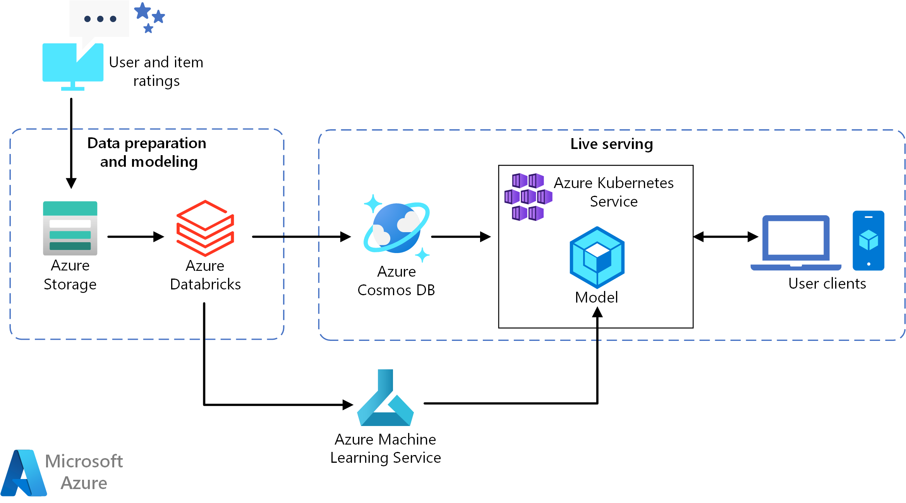
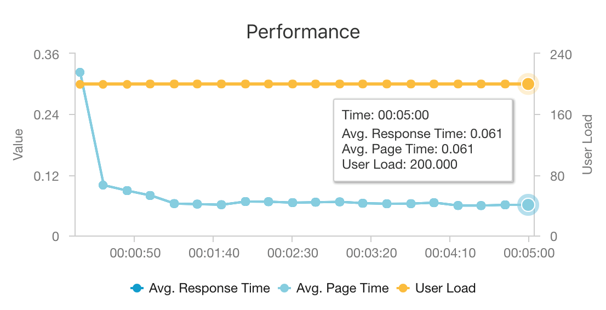

# Build a real-time recommendation API on Azure

This reference architecture shows how to train a recommendation model using Azure Databricks and deploy it as an API by using Azure Cosmos DB, Azure Machine Learning, and Azure Kubernetes Service (AKS). This architecture can be generalized for most recommendation engine scenarios, including recommendations for products, movies, and news.

A reference implementation for this architecture is available on [GitHub][als-example].

**Scenario**: A media organization wants to provide movie or video recommendations to its users. By providing personalized recommendations, the organization meets several business goals, including increased click-through rates, increased engagement on site, and higher user satisfaction.

This reference architecture is for training and deploying a real-time recommender service API that can provide the top 10 movie recommendations for a given user.

The data flow for this recommendation model is as follows:

1. Track user behaviors. For example, a backend service might log when a user rates a movie or clicks a product or news article.

2. Load the data into Azure Databricks from an available [data source][data-source].

3. Prepare the data and split it into training and testing sets to train the model. ([This guide][guide] describes options for splitting data.)

4. Fit the [Spark Collaborative Filtering][als] model to the data.

5. Evaluate the quality of the model using rating and ranking metrics. ([This guide][eval-guide] provides details about the metrics you can evaluate your recommender on.)

6. Precompute the top 10 recommendations per user and store as a cache in Azure Cosmos DB.

7. Deploy an API service to AKS using the Azure Machine Learning APIs to containerize and deploy the API.

8. When the backend service gets a request from a user, call the recommendations API hosted in AKS to get the top 10 recommendations and display them to the user.

## Architecture

This architecture consists of the following components:

[Azure Databricks][databricks]. Databricks is a development environment used to prepare input data and train the recommender model on a Spark cluster. Azure Databricks also provides an interactive workspace to run and collaborate on notebooks for any data processing or machine learning tasks.

[Azure Kubernetes Service][aks] (AKS). AKS is used to deploy and operationalize a machine learning model service API on a Kubernetes cluster. AKS hosts the containerized model, providing scalability that meets your throughput requirements, identity and access management, and
 logging and health monitoring.

[Azure Cosmos DB][cosmosdb]. Cosmos DB is a globally distributed database service used to store the top 10 recommended movies for each user. Azure Cosmos DB is well-suited for this scenario, because it provides low latency (10 ms at 99th percentile) to read the top recommended items for a given user.

[Azure Machine Learning][mls]. This service is used to track and manage machine learning models, and then package and deploy these models to a scalable AKS environment.

[Microsoft Recommenders][github]. This open-source repository contains utility code and samples to help users get started in building, evaluating, and operationalizing a recommender system.

## Performance considerations

Performance is a primary consideration for real-time recommendations, because recommendations usually fall in the critical path of the request a user makes on your site.

The combination of AKS and Azure Cosmos DB enables this architecture to provide a good starting point to provide recommendations for a medium-sized workload with minimal overhead. Under a load test with 200 concurrent users, this architecture provides recommendations at a median latency of about 60 ms and performs at a throughput of 180 requests per second. The load test was run against the default deployment configuration (a 3x D3 v2 AKS cluster with 12 vCPUs, 42 GB of memory, and 11,000 [Request Units (RUs) per second][ru] provisioned for Azure Cosmos DB).

Azure Cosmos DB is recommended for its turnkey global distribution and usefulness in meeting any database requirements your app has. For slightly [faster latency][latency], consider using [Azure Cache for Redis][redis] instead of Azure Cosmos DB to serve lookups. Azure Cache for Redis can improve performance of systems that rely highly on data in back-end stores.

## Scalability considerations

If you don't plan to use Spark, or you have a smaller workload where you don't need distribution, consider using [Data Science Virtual Machine][dsvm] (DSVM) instead of Azure Databricks. DSVM is an Azure virtual machine with deep learning frameworks and tools for machine learning and data science. As with Azure Databricks, any model you create in a DSVM can be operationalized as a service on AKS via Azure Machine Learning.

During training, provision a larger fixed-size Spark cluster in Azure Databricks or configure [autoscaling][autoscaling]. When autoscaling is enabled, Databricks monitors the load on your cluster and scales up and downs when required. Provision or scale out a larger cluster if you have a large data size and you want to reduce the amount of time it takes for data preparation or modeling tasks.

Scale the AKS cluster to meet your performance and throughput requirements. Take care to scale up the number of [pods][scale] to fully utilize the cluster, and to scale the [nodes][nodes] of the cluster to meet the demand of your service. For more information on how to scale your cluster to meet the performance and throughput requirements of your recommender service, see [Scaling Azure Container Service Clusters][blog].

To manage Azure Cosmos DB performance, estimate the number of reads required per second, and provision the number of [RUs per second][ru] (throughput) needed. Use best practices for [partitioning and horizontal scaling][partition-data].

## Cost considerations

The main drivers of cost in this scenario are:

- The Azure Databricks cluster size required for training.
- The AKS cluster size required to meet your performance requirements.
- Azure Cosmos DB RUs provisioned to meet your performance requirements.

Manage the Azure Databricks costs by retraining less frequently and turning off the Spark cluster when not in use. The AKS and Azure Cosmos DB costs are tied to the throughput and performance required by your site and will scale up and down depending on the volume of traffic to your site.

## Deploy the solution

To deploy this architecture, follow the **Azure Databricks** instructions in the [setup document][setup]. Briefly, the instructions require you to:

1. Create an [Azure Databricks workspace][workspace].

1. Create a new cluster with the following configuration in Azure Databricks:

    - Cluster mode: Standard
    - Databricks Runtime Version: 4.3 (includes Apache Spark 2.3.1, Scala 2.11)
    - Python Version: 3
    - Driver Type: Standard\_DS3\_v2
    - Worker Type: Standard\_DS3\_v2 (min and max as required)
    - Auto Termination: (as required)
    - Spark Config: (as required)
    - Environment Variables: (as required)

1. Create a personal access token within the [Azure Databricks workspace][workspace]. See the Azure Databricks authentication [documentation][adbauthentication] for details.

1. Clone the [Microsoft Recommenders][github] repository into an environment where you can execute scripts (for example, your local computer).

1. Follow the **Quick install** setup instructions to [install the relevant libraries][setup] on Azure Databricks.

1. Follow the **Quick install** setup instructions to [prepare Azure Databricks for operationalization][setupo16n].

1. Import the [ALS Movie Operationalization notebook][als-example] into your workspace. After logging into your Azure Databricks Workspace, do the following:

    a. Click **Home** on the left side of the workspace.

    b. Right-click on white space in your home directory. Select **Import**.

    c. Select **URL**, and paste the following into the text field: `https://github.com/Microsoft/Recommenders/blob/master/notebooks/05_operationalize/als_movie_o16n.ipynb`

    d. Click **Import**.

1. Open the notebook within Azure Databricks and attach the configured cluster.

1. Run the notebook to create the Azure resources required to create a recommendation API that provides the top-10 movie recommendations for a given user.

## Related architectures

We have also built a reference architecture that uses Spark and Azure Databricks to execute scheduled [batch-scoring processes][batch-scoring]. See that reference architecture to understand a recommended approach for generating new recommendations routinely.

<!-- links -->
[aci]: /azure/container-instances/container-instances-overview
[aad]: /azure/active-directory-b2c/active-directory-b2c-overview
[adbauthentication]: https://docs.azuredatabricks.net/api/latest/authentication.html#generate-a-token
[aks]: /azure/aks/intro-kubernetes
[als]: https://spark.apache.org/docs/latest/ml-collaborative-filtering.html
[als-example]: https://github.com/Microsoft/Recommenders/blob/master/notebooks/05_operationalize/als_movie_o16n.ipynb
[autoscaling]: https://docs.azuredatabricks.net/user-guide/clusters/sizing.html
[autoscale]: https://docs.azuredatabricks.net/user-guide/clusters/sizing.html#autoscaling
[availability]: /azure/architecture/checklist/availability
[batch-scoring]: /azure/architecture/reference-architectures/ai/batch-scoring-databricks
[blob]: /azure/storage/blobs/storage-blobs-introduction
[blog]: https://blogs.technet.microsoft.com/machinelearning/2018/03/20/scaling-azure-container-service-cluster/
[clusters]: https://docs.azuredatabricks.net/user-guide/clusters/configure.html
[cosmosdb]: /azure/cosmos-db/introduction
[data-source]: https://docs.azuredatabricks.net/spark/latest/data-sources/index.html
[databricks]: /azure/azure-databricks/what-is-azure-databricks
[dsvm]: /azure/machine-learning/data-science-virtual-machine/overview
[dsvm-ubuntu]: /azure/machine-learning/data-science-virtual-machine/dsvm-ubuntu-intro
[eval-guide]: https://github.com/Microsoft/Recommenders/blob/master/notebooks/03_evaluate/evaluation.ipynb
[free]: https://azure.microsoft.com/free/?WT.mc_id=A261C142F
[github]: https://github.com/Microsoft/Recommenders
[guide]: https://github.com/Microsoft/Recommenders/blob/master/notebooks/01_prepare_data/data_split.ipynb
[latency]: https://github.com/jessebenson/azure-performance
[mls]: /azure/machine-learning/service/
[n-tier]: /azure/architecture/reference-architectures/n-tier/n-tier-cassandra
[ndcg]: https://en.wikipedia.org/wiki/Discounted_cumulative_gain
[nodes]: /azure/aks/scale-cluster
[notebook]: https://github.com/Microsoft/Recommenders/notebooks/00_quick_start/als_pyspark_movielens.ipynb
[partition-data]: /azure/cosmos-db/partition-data
[redis]: /azure/azure-cache-for-redis/cache-overview
[regions]: https://azure.microsoft.com/global-infrastructure/services/?products=virtual-machines&regions=all
[resiliency]: /azure/architecture/resiliency/
[ru]: /azure/cosmos-db/request-units
[sec-docs]: /azure/security/
[setup]: https://github.com/Microsoft/Recommenders/blob/master/SETUP.md#repository-installation
[setupo16n]: https://github.com/Microsoft/Recommenders/blob/master/SETUP.md#prepare-azure-databricks-for-operationalization
[scale]: /azure/aks/tutorial-kubernetes-scale
[sla]: https://azure.microsoft.com/support/legal/sla/virtual-machines/v1_8/
[vm-size]: /azure/virtual-machines/virtual-machines-linux-change-vm-size
[workspace]: https://docs.azuredatabricks.net/getting-started/index.html
