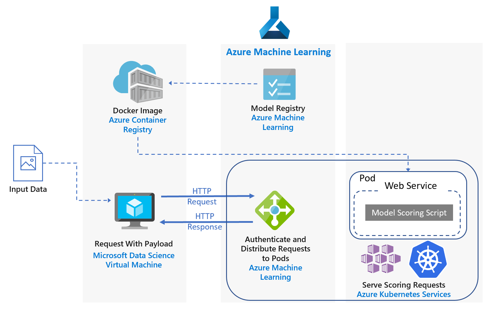

# Real-time scoring of Python scikit-learn and deep learning models on Azure

This reference architecture shows how to deploy Python models as web services to make real-time predictions using the [Azure Machine Learning][aml]. Two scenarios are covered: deploying regular Python models, and the specific requirements of deploying deep learning models. Both scenarios use the architecture shown.

Two reference implementations for this architecture are available on GitHub, one for [regular Python models][github-python] and one for [deep learning models][github-dl].

## Scenarios

The reference implementations demonstrate two scenarios using this architecture.

**Scenario 1: FAQ matching**. This scenario shows how to deploy a frequently asked questions (FAQ) matching model as a web service to provide predictions for user questions. For this scenario, "Input Data" in the architecture diagram refers to text strings containing user questions to match with a list of FAQs. This scenario is designed for the [scikit-learn][scikit] machine learning library for Python, but can be generalized to any scenario that uses Python models to make real-time predictions.

This scenario uses a subset of Stack Overflow question data that includes original questions tagged as JavaScript, their duplicate questions, and their answers. It trains a scikit-learn pipeline to predict the match probability of a duplicate question with each of the original questions. These predictions are made in real time using a REST API endpoint.

The application flow for this architecture is as follows:

1. The trained model is registered to the machine learning model registry.
2. Machine Learning creates a Docker image that includes the model and scoring script.
3. Azure Machine Learning deploys the scoring image on Azure Kubernetes Service (AKS) as a web service.
4. The client sends an HTTP POST request with the encoded question data.
5. The web service created by Azure Machine Learning extracts the question from the request.
6. The question is sent to the Scikit-learn pipeline model for featurization and scoring.
7. The matching FAQ questions with their scores are returned to the client.

Here is a screenshot of the example app that consumes the results:

**Scenario 2: Image classification**. This scenario shows how to deploy a Convolutional Neural Network (CNN) model as a web service to provide predictions on images. For this scenario, "Input Data" in the architecture diagram refers to image files. CNNs are very effective in computer vision for tasks such as image classification and object detection. This scenario is designed for the frameworks TensorFlow, Keras (with the TensorFlow back end), and PyTorch. However, it can be generalized to any scenario that uses deep learning models to make real-time predictions.

This scenario uses a pre-trained ResNet-152 model trained on ImageNet-1K (1,000 classes) dataset to predict which category (see figure below) an image belongs to. These predictions are made in real time using a REST API endpoint.

The application flow for the deep learning model is as follows:

1. The deep learning model is registered to the machine learning model registry.
2. Azure Machine Learning creates a docker image including the model and scoring script.
3. Azure Machine Learning deploys the scoring image on Azure Kubernetes Service (AKS) as a web service.
4. The client sends an HTTP POST request with the encoded image data.
5. The web service created by Azure Machine Learning preprocesses the image data and sends it to the model for scoring.
6. The predicted categories with their scores are returned to the client.

## Architecture

This architecture consists of the following components.

**[Azure Machine Learning][aml]** is a cloud service that is used to train, deploy, automate and manage machine learning models, all at the broad scale that the cloud provides. It is used in this architecture to manage the deployment of models as well as authentication, routing, and load balancing of the web service.

**[Virtual machine][vm]** (VM). The VM is shown as an example of a device &mdash; local or in the cloud &mdash; that can send an HTTP request.

**[Azure Kubernetes Service][aks]** (AKS) is used to deploy the application on a Kubernetes cluster. AKS simplifies the deployment and operations of Kubernetes. The cluster can be configured using CPU-only VMs for regular Python models or GPU-enabled VMs for deep learning models.

**[Azure Container Registry][acr]** enables storage of images for all types of Docker container deployments including DC/OS, Docker Swarm and Kubernetes. The scoring images are deployed as containers on Azure Kubernetes Service and used to run the scoring script. The image used here is created by Machine Learning from the trained model and scoring script, and then is pushed to the Azure Container Registry.

## Performance considerations

For real-time scoring architectures, throughput performance becomes a dominant consideration. For regular Python models, it's generally accepted that CPUs are sufficient to handle the workload.

However for deep learning workloads, when speed is a bottleneck, GPUs generally provide better [performance][gpus-vs-cpus] compared to CPUs. To match GPU performance using CPUs, a cluster with large number of CPUs is usually needed.

You can use CPUs for this architecture in either scenario, but for deep learning models, GPUs provide significantly higher throughput values compared to a CPU cluster of similar cost. AKS supports the use of GPUs, which is one advantage of using AKS for this architecture. Also, deep learning deployments typically use models with a high number of parameters. Using GPUs prevents contention for resources between the model and the web service, which is an issue in CPU-only deployments.

## Scalability considerations

For regular Python models, where the AKS cluster is provisioned with CPU-only VMs, take care when [scaling out the number of pods][manually-scale-pods]. The goal is to fully utilize the cluster. Scaling depends on the CPU requests and limits defined for the pods. Machine Learning through Kubernetes also supports [pod autoscaling][autoscale-pods] based on CPU utilization or other metrics. The [cluster autoscaler][autoscaler] (in preview) can scale agent nodes based on the pending pods.

For deep learning scenarios, using GPU-enabled VMs, resource limits on pods are such that one GPU is assigned to one pod. Depending on the type of VM used, you must [scale the nodes of the cluster][scale-cluster] to meet the demand for the service. You can do this easily using the Azure CLI and kubectl.

## Monitoring and logging considerations

### AKS monitoring

For visibility into AKS performance, use the [Azure Monitor for containers][monitor-containers] feature. It collects memory and processor metrics from controllers, nodes, and containers that are available in Kubernetes through the Metrics API.

While deploying your application, monitor the AKS cluster to make sure it's working as expected, all the nodes are operational, and all pods are running. Although you can use the [kubectl][kubectl] command-line tool to retrieve pod status, Kubernetes also includes a web dashboard for basic monitoring of the cluster status and management.

To see the overall state of the cluster and nodes, go to the **Nodes** section of the Kubernetes dashboard. If a node is inactive or has failed, you can display the error logs from that page. Similarly, go to the **Pods** and **Deployments** sections for information about the number of pods and status of your deployment.

### AKS logs

AKS automatically logs all stdout/stderr to the logs of the pods in the cluster. Use kubectl to see these and also node-level events and logs. For details, see the deployment steps.

Use [Azure Monitor for containers][monitor-containers] to collect metrics and logs through a containerized version of the Log Analytics agent for Linux, which is stored in your Log Analytics workspace.

## Security considerations

Use [Azure Security Center][security-center] to get a central view of the security state of your Azure resources. Security Center monitors potential security issues and provides a comprehensive picture of the security health of your deployment, although it doesn't monitor AKS agent nodes. Security Center is configured per Azure subscription. Enable security data collection as described in [Onboard your Azure subscription to Security Center Standard][get-started]. When data collection is enabled, Security Center automatically scans any VMs created under that subscription.

**Operations**. To sign in to an AKS cluster using your Azure Active Directory (Azure AD) authentication token, configure AKS to use Azure AD for [user authentication][aad-auth]. Cluster administrators can also configure Kubernetes role-based access control (RBAC) based on a user's identity or directory group membership.

Use [RBAC][rbac] to control access to the Azure resources that you deploy. RBAC lets you assign authorization roles to members of your DevOps team. A user can be assigned to multiple roles, and you can create custom roles for even more fine-grained [permissions].

**HTTPS**. As a security best practice, the application should enforce HTTPS and redirect HTTP requests. Use an [ingress controller][ingress-controller] to deploy a reverse proxy that terminates SSL and redirects HTTP requests. For more information, see [Create an HTTPS ingress controller on Azure Kubernetes Service (AKS)][https-ingress].

**Authentication**. This solution doesn't restrict access to the endpoints. To deploy the architecture in an enterprise setting, secure the endpoints through API keys and add some form of user authentication to the client application.

**Container registry**. This solution uses Azure Container Registry to store the Docker image. The code that the application depends on, and the model, are contained within this image. Enterprise applications should use a private registry to help guard against running malicious code and to help keep the information inside the container from being compromised.

**DDoS protection**. Consider enabling [DDoS Protection Standard][ddos]. Although basic DDoS protection is enabled as part of the Azure platform, DDoS Protection Standard provides mitigation capabilities that are tuned specifically to Azure virtual network resources.

**Logging**. Use best practices before storing log data, such as scrubbing user passwords and other information that could be used to commit security fraud.

## Deployment

To deploy this reference architecture, follow the steps described in the GitHub repos:

- [Regular Python models][github-python]
- [Deep learning models][github-dl]

<!-- links -->

[aad-auth]: /azure/aks/aad-integration
[acr]: /azure/container-registry/
[something]: https://kubernetes.io/docs/reference/access-authn-authz/authentication/
[aks]: /azure/aks/intro-kubernetes
[autoscaler]: /azure/aks/autoscaler
[autoscale-pods]: /azure/aks/tutorial-kubernetes-scale#autoscale-pods
[azcopy]: /azure/storage/common/storage-use-azcopy-linux
[ddos]: /azure/virtual-network/ddos-protection-overview
[get-started]: /azure/security-center/security-center-get-started
[github-python]: https://github.com/Microsoft/MLAKSDeployAML
[github-dl]: https://github.com/Microsoft/AKSDeploymentTutorial_AML
[gpus-vs-cpus]: https://azure.microsoft.com/blog/gpus-vs-cpus-for-deployment-of-deep-learning-models/
[https-ingress]: /azure/aks/ingress-tls
[ingress-controller]: https://kubernetes.io/docs/concepts/services-networking/ingress/
[kubectl]: https://kubernetes.io/docs/tasks/tools/install-kubectl/
[aml]: /azure/machine-learning/service/overview-what-is-azure-ml
[manually-scale-pods]: /azure/aks/tutorial-kubernetes-scale#manually-scale-pods
[monitor-containers]: /azure/monitoring/monitoring-container-insights-overview
[permissions]: /azure/aks/concepts-identity
[rbac]: /azure/active-directory/role-based-access-control-what-is
[scale-cluster]: /azure/aks/scale-cluster
[scikit]: https://pypi.org/project/scikit-learn/
[security-center]: /azure/security-center/security-center-intro
[vm]: /azure/virtual-machines/
