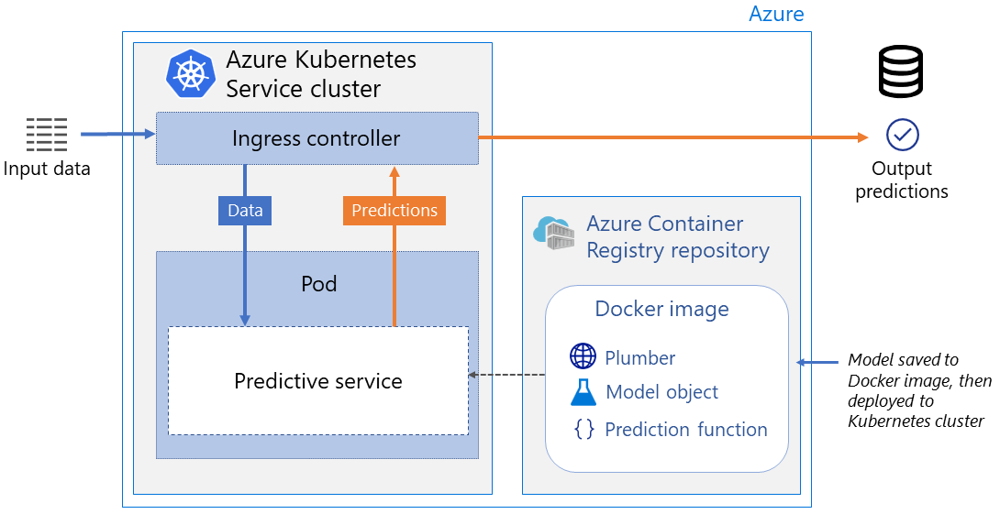

This reference architecture shows how to implement a real-time web service in R using Azure Machine Learning running in Azure Kubernetes Service (AKS). This architecture is intended to be generic and suited for any predictive model built in R that you want to deploy as a real-time service.

## Architecture

*Download a [Visio file](https://arch-center.azureedge.net/realtime-scoring-r.vsdx) of this architecture.*

This reference architecture takes a container-based approach. A Docker image is built containing R, as well as the various artifacts needed to score new data. These include the model object itself and a scoring script. An image is created and pushed to the Azure Container Registry associated with the Azure Machine Learning workspace. This is then deployed to an inference cluster using Azure Kubernetes Service.

### Workflow

The architecture of this workflow includes the following components.

- **[Azure Container Registry][acr]** is used to store the images for this workflow. Registries created with Container Registry can be managed via the standard [Docker Registry V2 API][docker] and client.

- **[Azure Kubernetes Service][aks]** is used to host the deployment and service. This AKS cluster is connected to your Azure Machine Learning workspace.

- **[Azure Machine Learning][aml]** is a cloud-based environment you can use to train, deploy, automate, manage, and track ML models.

## Considerations

These considerations implement the pillars of the Azure Well-Architected Framework, which is a set of guiding tenets that can be used to improve the quality of a workload. For more information, see [Microsoft Azure Well-Architected Framework](/azure/architecture/framework).

### Performance efficiency

Performance efficiency is the ability of your workload to scale to meet the demands placed on it by users in an efficient manner. For more information, see [Performance efficiency pillar overview](/azure/architecture/framework/scalability/overview).

Machine learning workloads tend to be compute-intensive, both when training and when scoring new data. As a rule of thumb, try not to run more than one scoring process per core. Azure Machine Learning lets you define the number of R processes running in each container. The default is five processes. When creating a relatively simple model, such as a linear regression with a small number of variables, or a small decision tree, you can increase the number of processes. Monitor the CPU load on your cluster nodes to determine the appropriate limit on the number of containers.

A GPU-enabled cluster can speed up some types of workloads, and deep learning models in particular. Not all workloads can take advantage of GPUs &mdash; only those that make heavy use of matrix algebra. For example, tree-based models, including random forests and boosting models, generally derive no advantage from GPUs.

Some model types such as random forests are massively parallelizable on CPUs. In these cases, speed up the scoring of a single request by distributing the workload across multiple cores. However, doing so reduces your capacity to handle multiple scoring requests given a fixed cluster size.

In general, open-source R models store all their data in memory, so ensure that your nodes have enough memory to accommodate the processes you plan to run concurrently. Also, monitor your nodes to ensure that your scoring processes are not memory-starved.

### Security

Security provides assurances against deliberate attacks and the abuse of your valuable data and systems. For more information, see [Overview of the security pillar](/azure/architecture/framework/security/overview).

#### Network encryption

If you secured the deployed web service using a TLS/SSL certificate, you can use HTTPS to connect to the service using the scoring or swagger URI. HTTPS helps secure communications between a client and a web service by encrypting communications between the two. Encryption uses Transport Layer Security (TLS). TLS is sometimes still referred to as Secure Sockets Layer (SSL), which was the predecessor of TLS.

#### Authentication and authorization

Azure Machine Learning provides two ways to control access to your web services.

- Key-based authentication
- Token-based authentication

The primary difference between keys and tokens is that keys are static and can be regenerated manually, and tokens need to be refreshed upon expiration.

### Monitoring and logging

Azure Application Insights can be used to monitor models deployed to web service endpoints in [Azure Kubernetes Service (AKS)][aks] using Azure Machine Learning. The data collected from the endpoint includes: Output data Responses Request rates, response times, and failure rates Dependency rates, response times, and failure rates Exceptions

### Cost optimization

Cost optimization is about looking at ways to reduce unnecessary expenses and improve operational efficiencies. For more information, see [Overview of the cost optimization pillar](/azure/architecture/framework/cost/overview).

The main cost consideration in this architecture is the Kubernetes cluster's compute resources. The cluster must be large enough to handle the expected request volume at peak times, but this approach leaves resources idle at other times.

## Contributors

*This article is maintained by Microsoft. It was originally written by the following contributors.* 

Principal author:

 - [Hong Ooi](https://www.linkedin.com/in/hongooi) | Senior Data Scientist
 
*To see non-public LinkedIn profiles, sign in to LinkedIn.*

## Next steps

- [Azure Machine Learning Documentation][aml-docs].
- [Azure Machine Learning SDK for R][r-sdk]

## Related resources

- [Baseline architecture for an Azure Kubernetes Service (AKS) cluster][aks-baseline]

<!-- links -->
[aml]: /azure/machine-learning/overview-what-is-azure-ml
[aml-docs]: /azure/machine-learning/
[acr]: /azure/container-registry/container-registry-intro
[aks]: /azure/aks/intro-kubernetes
[aks-baseline]: /azure/architecture/reference-architectures/containers/aks/baseline-aks
[docker]: https://docs.docker.com/registry/spec/api
[r-sdk]: https://azure.github.io/azureml-sdk-for-r/index.html
