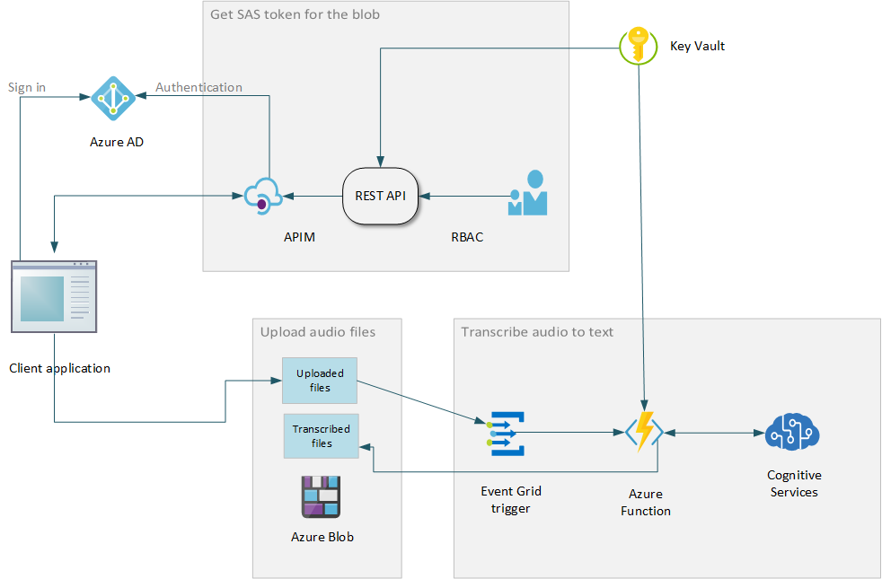

# Speech recognition with Azure Cognitive Services

Customer care centers form an integral part of business success. Efficiency of these call centers can be significantly improved using *Speech AI*. Speech recognition and analysis of high volumes of recorded customer calls can provide businesses with valuable information about current trends, product shortcomings as well as successes. Enterprise solutions using the Speech APIs of Azure Cognitive Services can be implemented to consume and process such high volumes of discrete data.

This reference architecture shows how to build an audio ingestion and *speech-to-text* transcription pipeline for such customer care centers. This pipeline processes batches of recorded audio files, and stores the transcribed text files in Azure Blob Storage. Note that this does not implement real-time speech processing.

This pipeline can later feed into the next phase of your Speech AI implementation, where transcribed text is processed for PII (or Personally Identifiable Information) recognition and deletion, sentiment analysis, and so on.

The reference implementation for this architecture is available on GitHub (TBD link).

## Architecture

Businesses can implement this architecture with their Azure account, and allow the client applications access to the pipeline via REST APIs. The client application uses the REST API to get a SAS token required to access the blob storage. The client then uploads the audio files to a blob container. The reference client application uses JavaScript to upload the files, as shown in [this example](https://docs.microsoft.com/azure/storage/blobs/storage-quickstart-blobs-nodejs#upload-blobs-to-a-container). Once the file is uploaded, an Event Grid trigger is generated which invokes an Azure Function. The function processes the file using the Cognitive Services Speech APIs. The transcribed text is stored in a separate blob container, ready for analysis and storage in a database.

The architecture utilizes the following Azure services:

**Azure Blob Storage** stores objects on the cloud. Blob storage is optimized for storing massive amounts of unstructured data, such as text or binary data. Since sensitive information might be saved in the blob, its access must be secured using authentication methods such as SAS keys.

**Azure Event Grid** provides built-in support to build efficient event-driven architectures on Azure. When the audio file upload is completed, the Event Grid triggers a [*Blob Created*](https://docs.microsoft.com/en-us/azure/event-grid/event-schema-blob-storage#microsoftstorageblobcreated-event) event for the transcription function.

**Azure Functions** provides the event-driven compute capabilities, without the overhead of building the infrastructure. The function in this reference implementation uses the Cognitive Services Speech APIs to transcribe speech to plain text.

**Azure Cognitive Services** is a collection of APIs available to help developers build intelligent applications without requiring extensive AI or data science skills. This service enables developers to easily implement cognitive AI capabilities in their applications. These APIs were created using vast amounts of machine learning data, which generally covers most scenarios.

[**API Management**](https://docs.microsoft.com/azure/api-management/api-management-key-concepts) provides secure access to your REST APIs. Only clients authenticated with the API Management will be able to get this SAS token. API Management thus provides an additional layer of security in this architecture.

**Azure Active Directory** provides identity management and secured access to resources in Azure cloud. Azure AD credentials belonging to the owner of the Azure resources in this architecture, are used to create the access token for the blob storage. The clients are given the minimum access privileges required to upload their audio files, using the **Role-based Access Control** feature of Azure AD.

[**Key Vault**](https://docs.microsoft.com/azure/key-vault/key-vault-overview) allows secure storage of secrets and keys. This reference architecture stores the account credentials and other secrets required to generate the SAS tokens in the Key Vault. Both the REST APIs and the speech transcription function access this vault to retrieve the secrets.

## Scalability considerations

### Azure Blob Storage

#### Scalability during upload

While audio files can be easily uploaded using a REST API interface, it may soon run out of ephemeral ports as uploads to the blob increase. For scalability, this reference architecture uses the [Valet Key design pattern](https://docs.microsoft.com/azure/architecture/patterns/valet-key) to offload the data upload to the client application. The valet key here is the SAS token required to access the blob. The REST API generates a [user delegate SAS token](https://docs.microsoft.com/rest/api/storageservices/create-user-delegation-sas), which is created using Azure Active Directory credentials. For most scenarios, this is more secure and recommended over [the SAS tokens](https://docs.microsoft.com/rest/api/storageservices/delegate-access-with-shared-access-signature#types-of-shared-access-signatures) created using an account key.

#### Scalability for file size

The reference architecture divides large files into four kilobyte chunks. This is a common technique used to upload extremely large data to the cloud. The audio file size is then limited only by the [maximum size limits of a blob](https://azure.microsoft.com/blog/general-availability-larger-block-blobs-in-azure-storage/).

#### Scalability for storage

Azure Blob Storage can throttle service requests [per blob](https://docs.microsoft.com/azure/storage/blobs/scalability-targets) or [per storage account](https://docs.microsoft.com/azure/azure-resource-manager/management/azure-subscription-service-limits#storage-limits). The blob level throttling limits may not be a concern in this scenario, since every uploaded file corresponds to a single blob. However, multiple clients uploading multiple files to a single storage account, may soon exceed its limits. Consider using multiple storage accounts and partitioning your data objects across them in such a case. For more detailed list of scalability considerations, read the [Performance and scalability checklist for Blob storage](https://docs.microsoft.com/azure/storage/blobs/storage-performance-checklist).

### Event Grid

The function that transcribes the audio files is triggered when the upload is completed. In applications which need high throughput, the Event Grid trigger is preferred over the Blob trigger. The blob trigger is not suitable for blobs greater than 10K size.

### Azure Cognitive Services

This reference architecture uses Azure Cognitive Services APIs which has [request limits for the text translation](https://docs.microsoft.com/azure/cognitive-services/translator/request-limits) based on the subscription tier. To avoid these throttling restrictions for large volume processing, it is recommended to containerize the API. Containers also give you flexibility of deployment, whether on cloud or on-premises. Additionally, you can avoid potential side-effects of new version roll-outs. Read [Container support in Azure Cognitive Services](https://docs.microsoft.com/azure/cognitive-services/cognitive-services-container-support) for more information.

## Security considerations

Many of the basic principles of security in this architecture are similar to [Security considerations for a serverless web applications](https://docs.microsoft.com/azure/architecture/reference-architectures/serverless/web-app#security-considerations). The following sections discuss the implementation differences.

### Azure Active Directory

Blob storage stores client's audio files, which may potentially contain sensitive information such as PII. Clients should get only the minimal required access to the blobs. This reference architecture uses SAS tokens created using the service owner's Azure AD credentials (a user delegate SAS token). A SAS token allows you to control:
    - The resources the client can access, since SAS tokens are created per resource.
    - What permissions they have to access these resources, using [Role based access control](https://docs.microsoft.com/rest/api/storageservices/create-user-delegation-sas#assign-permissions-with-rbac). It is recommended to give minimal required privileges, such as *Read Only* for a client in this scenario.
    - Expiration of the SAS token, as this helps to limit any chance of unauthorized access to a token. For a large file upload, if the client's SAS token expires before the upload is over, it can request another SAS token from the application's REST API. This does not negatively affect security since the client will always need to authenticate with the API Management for accessing the REST API.

Read [Grant limited access to Azure Storage resources using shared access signatures (SAS)](https://docs.microsoft.com/azure/storage/common/storage-sas-overview)) for more in-depth discussion on SAS tokens. Also see [Create a user delegation SAS](https://docs.microsoft.com/rest/api/storageservices/create-user-delegation-sas) to learn more about a user delegate SAS token.

### API Management

Although the Valet Key design pattern is secure enough for most applications, the API Management layer in front of the REST API provides an additional layer of security. In this reference architecture, only the clients authenticated with API Management can request the SAS token to access the blob storage. The API Gateway uses [its built-in security controls](https://docs.microsoft.com/azure/api-management/api-management-security-controls) to gate the access to your APIs.

## Resiliency considerations

For an extremely high churn, the Event Grid may fail to trigger the function. Read [Event Grid message delivery and retry](https://docs.microsoft.com/azure/event-grid/delivery-and-retry) for its policies on retries and failures. If it fails, the message is normally left in a *dead letter queue*. Although the reference architecture does not implement this for simplicity, it is advised to make the architecture more resilient by having a *supervisor* function in addition. This supervisor can periodically wake up on a timer trigger, and look for discrepancies in the processing. It can either figure this out from the dead letter queue, or by comparing the files between the containers used to keep uploaded and transcribed files. This pattern is similar to the [Scheduler Agent Supervisor pattern](https://docs.microsoft.com/azure/architecture/patterns/scheduler-agent-supervisor).

Another way to reduce these failures is to use Service Bus instead of the Event Grid. The architecture will change in that case to a sequential processing of events. The client will need to signal the Service Bus when the upload is completed, which in turn can invoke the function to transcribe the uploaded file. This guarantees hundred percent reliability, however this model will generally have less throughput than an event-based architecture. Carefully consider which architecture applies to your scenario and application.

## Deploy the solution

TBD pending the availability of the readme.

## Next steps

The text transcribed from the audio files in this reference architecture can be processed with the built-in sentiment analysis provided by Azure Cognitive Services. To explore, read [the documentation on Speech APIs](https://docs.microsoft.com/azure/cognitive-services/speech-service/).
