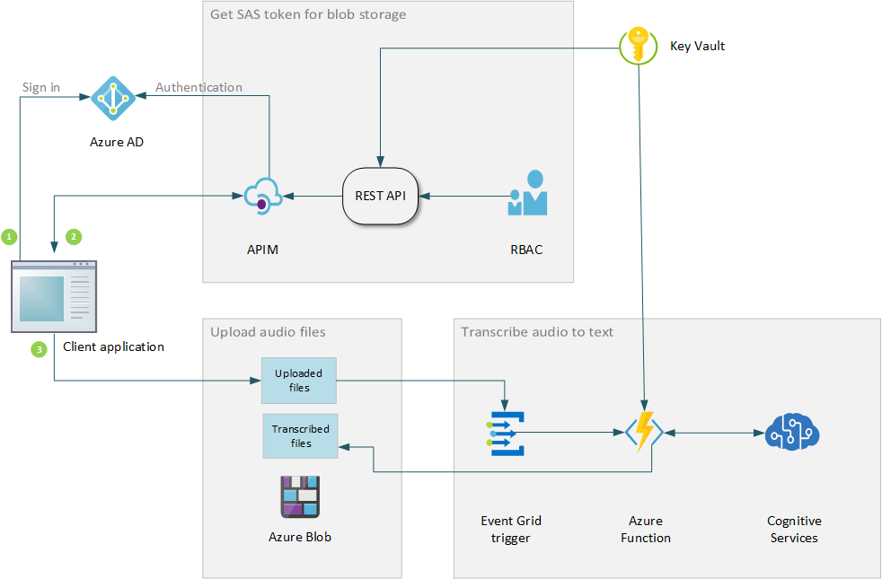

Customer care centers are an integral part of the success of many businesses. You can improve the efficiency of your call centers by using speech AI. Speech recognition and the analysis of high volumes of recorded customer calls can provide your business with valuable information about current trends, product shortcomings, and successes. Enterprise solutions that use the Speech APIs of [Azure Cognitive Services](/azure/cognitive-services/speech-service/overview) can be implemented to consume and process such high volumes of discrete data.

The reference architecture described in this article shows how to build an audio ingestion and speech-to-text transcription pipeline for customer care centers. This pipeline processes batches of recorded audio files and stores the transcribed text files in Azure Blob storage. This architecture doesn't implement real-time speech processing.

This pipeline can later feed into the next phase of your speech AI implementation. In that phase, you can process transcribed text to recognize and remove sensitive information, perform sentiment analysis, and so on.

The reference implementation for this architecture is available on [GitHub](https://github.com/mspnp/cognitive-services-reference-implementation).

## Architecture

You can implement this architecture by using your Azure account and allow client applications access to the pipeline through REST APIs. The application goes through a three-step process to upload an audio file:

1. Authenticates by using Azure Active Directory (Azure AD). This step is required for the first file upload.
2. Calls the REST API to get the shared access signature (SAS) token required to access Azure Blob Storage.
3. Uploads the audio files to a blob container.

The reference client application uses JavaScript to upload the files, as shown in [this blob upload example](/azure/storage/blobs/storage-quickstart-blobs-nodejs#upload-blobs-to-a-container). After the file is uploaded, an Azure Event Grid trigger is generated that invokes an Azure function. The function processes the file by using the Azure Cognitive Services Speech APIs. The transcribed text is stored in a separate blob container, ready for consumption into the next phase of the pipeline: speech analysis and storage in a database.

The architecture uses these Azure services:

[**Azure Blob storage**](/azure/storage/blobs/) stores objects in the cloud. Blob storage is optimized for storing massive amounts of unstructured data, like text or binary data. Because sensitive information might be saved in the blob, you need to secure access by using authentication methods like SAS keys.

[**Azure Event Grid**](/azure/event-grid/) provides built-in support for efficient event-driven architectures on Azure. When the audio file upload is complete, Event Grid triggers a [*BlobCreated*](/azure/event-grid/event-schema-blob-storage#microsoftstorageblobcreated-event) event for the transcription function.

[**Azure Functions**](/azure/azure-functions/) provides event-driven compute capabilities without requiring you to build the infrastructure. The function in this reference architecture transcribes the speech audio files to text. The model is a *serverless* model, which means the [Consumption plan](/azure/azure-functions/functions-consumption-costs) is used to host the function.

[**Azure Cognitive Services**](/azure/cognitive-services/) is a collection of APIs that can help developers build intelligent applications without extensive AI or data science skills. The transcription function calls the [Cognitive Services speech-to-text APIs](/azure/cognitive-services/speech-service/index-speech-to-text). The output for a sample audio file transcription might look similar to the following metadata:

`ResultId:19e70bee8b5348a6afb67817825a9586 Reason:RecognizedSpeech Recognized text:<Text for sample audio.>. Json:{"DisplayText":"Text for sample audio.","Duration":53700000,"Id":"28526a6304da4af1922fedd4edcdddbb","Offset":3900000,"RecognitionStatus":"Success"}`.

[**Azure API Management**](/azure/api-management/api-management-key-concepts) provides secure access to REST APIs. Because only clients authenticated via API Management can request a SAS token, this service provides another layer of security.

[**Azure Active Directory**](/azure/active-directory/) provides identity management and secured access to resources on the Azure cloud platform. The client in this architecture first needs to authenticate by using Azure AD to be able to access the REST API. The REST API creates the access token for the blob storage by using the Azure AD credentials of the business owner. [Azure role-based access control (Azure RBAC)](/azure/role-based-access-control/overview) gives the client the minimum access privileges needed to upload audio files.

[**Azure Key Vault**](/azure/key-vault/key-vault-overview) provides secure storage of secrets and keys. This reference architecture stores the account credentials and other secrets needed to generate the SAS tokens in the key vault. The REST APIs and the speech transcription function access this vault to retrieve the secrets.

## Scalability considerations

### Azure Blob storage

**Scalability during upload:** To create a high-performing and cost-effective scalable solution, this reference architecture uses the [Valet Key design pattern](../../patterns/valet-key.yml). The client application is responsible for the actual data upload. The SAS token restricts access to blob storage. The client needs to first acquire this token by using the REST API. The API in the reference implementation generates a [user delegate SAS token](/rest/api/storageservices/create-user-delegation-sas) that's created by using the Azure Active Directory credentials of the business owner. For most scenarios, this method is more secure and is preferred over SAS tokens created by using an account key. For more information on SAS tokens, see [Types of shared access signatures](/rest/api/storageservices/delegate-access-with-shared-access-signature#types-of-shared-access-signatures).

**Scalability for file size:** The reference architecture allows large audio files to be uploaded to the cloud by dividing them into 4 KB chunks. *Chunking* is a common technique used to upload large blobs, as discussed in [this article on uploading large blobs](https://www.red-gate.com/simple-talk/cloud/platform-as-a-service/azure-blob-storage-part-4-uploading-large-blobs/). The maximum file size that can be uploaded is dictated by the [maximum size limit of the blob](https://azure.microsoft.com/blog/general-availability-larger-block-blobs-in-azure-storage/), which can be as much as 4.77 TB.

**Scalability for storage:** Azure Blob storage can throttle service requests [per blob](/azure/storage/blobs/scalability-targets) or [per storage account](/azure/azure-resource-manager/management/azure-subscription-service-limits#storage-limits). The blob-level throttling limits might not be a concern in this scenario because every uploaded file corresponds to a single blob. However, multiple clients uploading multiple files to a single storage account might exceed the account's limits. If that's a possibility, consider using multiple storage accounts and partitioning the data objects across them. For a detailed list of scalability considerations for the blob, see [Performance and scalability checklist for Blob storage](/azure/storage/blobs/storage-performance-checklist).

### Azure Event Grid

The function that transcribes the audio files is triggered when the upload finishes. This reference architecture uses an Event Grid trigger instead of the Blob storage trigger. An Event Grid trigger is used because blob trigger events can be missed as the number of blobs in a container increases significantly. Missing triggers negatively affect application throughput and reliability. For more information, see [Blob trigger alternatives](/azure/azure-functions/functions-bindings-storage-blob-trigger?tabs=csharp#alternatives).

### Azure Cognitive Services

Cognitive Services APIs might have request limits based on the subscription tier. Consider containerizing these APIs to avoid throttling large volume processing. Containers give you flexibility of deployment, whether in the cloud or on-premises. You can also mitigate side effects of new version rollouts by using containers. For more information, see [Container support in Azure Cognitive Services](/azure/cognitive-services/cognitive-services-container-support).

## Security considerations

Many of the [security considerations for a serverless web applications](../../reference-architectures/serverless/web-app.yml#security-considerations) apply to this reference architecture. The following sections discuss considerations specific to this architecture.

### Azure Active Directory

The audio files stored in the blob might contain sensitive customer data. If multiple clients are using this solution, it's important to restrict access to these files. This reference architecture uses SAS tokens to protect these files from outside attacks. These tokens, called user delegation SAS tokens, are created by using the service owner's Azure AD credentials.

A SAS token allows you to control:

- Which resources clients can access, because it's created per resource.
- Which permissions clients have while accessing the resources, via [Azure role-based access control (Azure RBAC)](/rest/api/storageservices/create-user-delegation-sas#assign-permissions-with-rbac). We recommend that you grant the minimum required permissions. The clients in this architecture have write-only access to the blobs. This access level prevents them from reading other clients' audio files, either accidentally or maliciously.
- When individual tokens expire. This control limits the window of exposure to the token, which limits the possibility of unauthorized access to the resource. For larger files, the SAS token might expire before the upload finishes. The client can request multiple tokens for the same file. Because only authenticated clients can do so, multiple requests of these tokens don't affect overall security.

See [Grant limited access to Azure Storage resources using shared access signatures (SAS)](/azure/storage/common/storage-sas-overview) for an in-depth discussion of SAS tokens. See [Create a user delegation SAS](/rest/api/storageservices/create-user-delegation-sas) to learn more about user delegation SAS tokens.

### API Management

In addition to restricting access to resources by using SAS tokens, this reference architecture provides another layer of security by using API Management. Clients need to authenticate by using API Management before they request SAS tokens. API Management has [built-in access controls](/azure/api-management/api-management-security-controls) for the REST API. We recommend this extra layer of security because the uploaded data might contain sensitive information.

When several clients upload files in parallel, API Management:

- Enforces usage quotas and rate limits.
- Validates [OAuth 2.0](/azure/api-management/api-management-howto-oauth2) tokens for authentication.
- Enables [cross-origin resource sharing (CORS)](/azure/api-management/api-management-cross-domain-policies#CORS).
- Caches responses.
- Monitors and logs requests.

## Resiliency considerations

If there are an extremely large number of events, Event Grid might fail to trigger the function. Such missed events are typically added to a *dead letter container*. Consider making the architecture more resilient by adding a *supervisor* function. This function can periodically wake up on a timer trigger. It can then find and process missed events, either from the dead letter container or by comparing the blobs in the *upload* and *transcribe* containers.

This pattern is similar to the [Scheduler Agent Supervisor pattern](../../patterns/scheduler-agent-supervisor.yml). This pattern isn't implemented in this reference architecture for the sake of simplicity. For more information on how Event Grid handles failures, see the [Event Grid message delivery and retry](/azure/event-grid/delivery-and-retry) policies.

Another way to improve resiliency is to use [Azure Service Bus](/azure/service-bus-messaging/) instead of Event Grid. This model sequentially processes file uploads. The client signals Service Bus when an upload finishes. Service Bus then invokes the function to transcribe the uploaded file. This model is more reliable. However, it will have less throughput than an event-based architecture. Carefully consider which architecture applies to your scenario and application.

## Solution deployment

For information about how to deploy the reference implementation for this architecture, see [the GitHub readme](https://github.com/mspnp/cognitive-services-reference-implementation/blob/master/README.md).

## Next steps

Review key product documentation used in this architecture:

- [What is Speech service?](/azure/cognitive-services/speech-service/overview)
- [What is Azure Event Grid?](/azure/event-grid/overview)
- [About API Management](/azure/api-management/api-management-key-concepts)

Microsoft Learn modules:

- [Introduction to Speech-to-Text](/learn/modules/intro-to-speech-to-text/)
- [React to state changes in your Azure services by using Event Grid](/learn/modules/react-to-state-changes-using-event-grid/)
- [Control access to Azure Storage with shared access signatures](/learn/modules/control-access-to-azure-storage-with-sas/)
