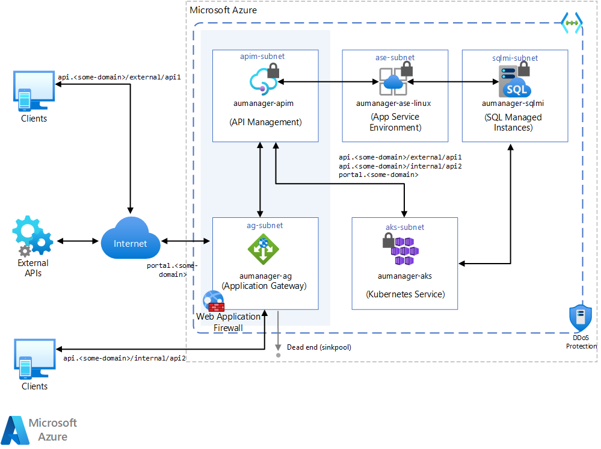

With more companies' internal applications adhering to the API-first approach, and the growing number and severity of threats to web application over the internet, it's critical to have a security strategy to protect APIs. The first step toward security is restricting who can access which aspects of an API from what locations. This article describes how to protect API access by using Azure Application Gateway and Azure API Management.

## Architecture

This solution doesn't address the architecture's underlying services, like App Service Environment, Azure SQL Database, and Azure Kubernetes Services. These parts of the diagram only showcase what you can do as a broader solution. This article specifically discusses the gray-backgrounded areas, API Management and Application Gateway.



- Application Gateway sets up a URL redirection mechanism that sends the request to the proper [backend pool](/azure/application-gateway/application-gateway-components#backend-pools), depending on the URL format of the API call.
  For more information about reducing false positives, see [Handle false positives in Azure Sentinel](false-positives.md).
  - Application Gateway redirects calls formatted as `api.<some-domain>/*` to a dead end, meaning a backend pool with no target.
  
- API Management accepts and properly maps internal calls, which come from resources in the same Azure virtual network, under `api.<some-domain>/internal/*`.
  
- So that developers can manage APIs and their configurations from both internal and external environments, a rule at the Application Gateway level properly redirects users under `portal.<some-domain>/*` to the developer portal.
  
- Finally, at the API Management level, APIs are set up to accept calls under the following patterns:
  
  - `api.<some-domain>/external/*`
  - `api.<some-domain>/internal/*`

### Components

- [Azure Resource Groups](/azure/azure-resource-manager/management/manage-resource-groups-portal) provides a logical container for Azure components.

- [Azure Virtual Network](/azure/virtual-network/virtual-networks-overview) enables many types of Azure resources, such as Azure Virtual Machines (VMs), to securely communicate with each other, the internet, and on-premises networks.

- [Azure Application Gateway](/azure/application-gateway/overview) is a web traffic load balancer that manages traffic to web applications. Load balancers operate at the transport layer (OSI layer 4 - TCP and UDP), and route traffic based on source IP address and port to a destination IP address and port.

- [Azure API Management](https://azure.microsoft.com/services/api-management/) creates consistent, modern API gateways for existing backend services.

## Recommendations

- This solution focuses on implementing the whole solution, building blocks, and testing API access from inside and outside the API Management virtual network. For details on the API Management virtual network integration process, see [Integrate API Management in an internal VNET with Application Gateway](/azure/api-management/api-management-howto-integrate-internal-vnet-appgateway).

- Product creation and API configuration in API Management isn't covered here. For a comprehensive tutorial, see [Tutorial: Create and publish a product](/azure/api-management/api-management-howto-add-products).

- To communicate with private resources in the back end, Application Gateway and API Management must be in the same virtual network. This solution assumes you already have a virtual network set up with your own resources. The solution also creates two subnets for Application Gateway and API Management.

- The private, internal deployment model allows API Management to connect to an existing virtual network, making it reachable from the inside of that network context. This feature requires either **Development** or **Production** API Management tiers.
  
- Application Gateway requires PFX certificates for SSL termination. These certificates should be in place before you implement the solution.

- You can manage certificates and passwords in [Azure Key Vault](/azure/key-vault/general/basic-concepts).

- You can use CNAME entries to personalize interactions with the services.

- For firewall and Web Application Firewall (WAF), other services can deliver the same level of protection:
  
  - [Azure Front Door](/azure/frontdoor/front-door-overview)
  - [Azure Firewall](/azure/firewall/overview)
  - Third-party solutions like [Barracuda](https://azuremarketplace.microsoft.com/marketplace/apps/barracudanetworks.waf?tab=overview)
  - Other solutions available in [Azure Marketplace](https://azure.microsoft.com/marketplace/)

## Scalability considerations

- Turn on Application Gateway's autoscale feature. Application Gateway serves as entry point for this architecture, and the WAF feature requires additional processing power for each request analysis. It's critical that the service can expand its computational capacity on the spot. To enable autoscale, see [Specify autoscale](/azure/application-gateway/tutorial-autoscale-ps#specify-autoscale).

- Consider Application Gateway subnet sizing. Application Gateway requests one private address per instance, plus another private IP address if a private front-end IP is configured. Application Gateway also takes five IPs per instance from the subnet it's deployed to. To properly deploy Application Gateway for this architecture, make sure its subnet has enough space to grow. For more information, see [Application Gateway infrastructure configuration](/azure/application-gateway/configuration-infrastructure).

- Turn on the API Management autoscaling feature to support highly concurrent scenarios. Autoscaling lets the service expand its capabilities to quickly respond to a growing number of incoming requests. To enable the autoscale feature, see [Automatically scale an Azure API Management instance](/azure/api-management/api-management-howto-autoscale).

## Availability considerations

- Enable Application Gateway's zone redundance. An Application Gateway or WAF deployment can span multiple Availability Zones, so you don't have to provision separate Application Gateway instances in each zone with a traffic manager. You can choose to deploy Application Gateway instances in a single zone or multiple zones, making it more resilient to zone failure.

## Security considerations

- In this scenario, API Management has two types of IP addresses, public and private. Public IP addresses are used for internal communication on port 3443. In the external virtual network configuration, public IPs are also used for runtime API traffic. When a request is sent from API Management to a public, internet-facing back end, a public IP address is visible as the origin of the request. For more information, see [IP addresses of API Management service in VNet](/azure/api-management/api-management-howto-ip-addresses#ip-addresses-of-api-management-service-in-vnet).

- To fortify the communication through API Management, see [Azure security baseline for API Management](/security/benchmark/azure/baselines/api-management-security-baseline).

## Deploy the solution

The following deployment steps use PowerShell. You could also use the [Azure portal](/azure/azure-portal/) or [Azure CLI](/cli/azure/) to get the same results.

1. Deploy a new Resource Group.
   
   ```powershell
   $resGroupName = "{resource-group-name}"
   $location = "{azure-region}"
   New-AzResourceGroup -Name $resGroupName -Location $location
   ```
   
1. Add subnets for API Management and Application Gateway.
   
   ```powershell
   # Retrieve virtual network information
   $vnet = Get-AzVirtualNetwork -Name {vnet-name}  -ResourceGroupName {resource-group-name}
   
   # Add the appgtw-subnet to the existing virtual network 
   $subnetApplication GatewayConfig = Add-AzVirtualNetworkSubnetConfig `
   -Name appgtw-subnet `
   -AddressPrefix {subnet-prefix-address} `
   -VirtualNetwork $vnet
   
   # Add the apim-subnet to the existing virtual network 
   $subnetAPIMConfig = Add-AzVirtualNetworkSubnetConfig `
     -Name apim-subnet `
     -AddressPrefix {subnet-prefix-address} `
     -VirtualNetwork $vnet
   
   # Attach subnets to the virtual network 
   $vnet | Set-AzVirtualNetwork
   
   # Make sure subnets were successfully added
   $vnet.Subnets
   
   # Assign subnet to variables
   $appgatewaysubnetdata = $vnet.Subnets[subnet-index]
   $apimsubnetdata = $vnet.Subnets[subnet-index]
   ```
   
1. Deploy a new API Management instance.
   
   ```powershell
   # Create an API Management virtual network-connected object
   $apimVirtualNetwork = New-AzApiManagementVirtualNetwork -SubnetResourceId $apimsubnetdata.Id
   
   # Create an API Management service inside the virtual network
   $apimServiceName = "{apim-name}"
   $apimOrganization = "{organization-name}"
   $apimAdminEmail = "{alias}@{somedomain}"
   
   $apimService = New-AzApiManagement `
       -ResourceGroupName $resGroupName `
       -Location $location `
       -Name $apimServiceName `
       -Organization $apimOrganization `
       -AdminEmail $apimAdminEmail `
       -VirtualNetwork $apimVirtualNetwork `
       -VpnType "Internal" `
       -Sku "{apim-tier}"
   ```
   
1. Configure hostnames and certificates.
   
   ```powershell
   # Specify certificate configuration
   $gatewayHostname = "api.{some-domain}"
   $portalHostname = "portal.{some-domain}"
   $gatewayCertCerPath = "{local-path-to-cer-certificate}"
   $gatewayCertPfxPath = "{local-path-to-pfx-certificate}"
   $portalCertPfxPath = "{local-path-to-pfx-certificate}"
   $gatewayCertPfxPassword = "{cert-api-password}"
   $portalCertPfxPassword = "{cert-portal-password}"
   
   # Convert to secure string before sending over HTTP
   $certPwd = ConvertTo-SecureString -String $gatewayCertPfxPassword -AsPlainText -Force
   $certPortalPwd = ConvertTo-SecureString -String $portalCertPfxPassword -AsPlainText -Force
   
   # Create and set the hostname configuration objects for the proxy and portal
   $proxyHostnameConfig = New-AzApiManagementCustomHostnameConfiguration `
     -Hostname $gatewayHostname `
     -HostnameType Proxy `
     -PfxPath $gatewayCertPfxPath `
     -PfxPassword $certPwd
     
   $portalHostnameConfig = New-AzApiManagementCustomHostnameConfiguration `
     -Hostname $portalHostname `
     -HostnameType Portal `
     -PfxPath $portalCertPfxPath `
     -PfxPassword $certPortalPwd
   
   # Tie certificates configurations into API Management service
   $apimService.ProxyCustomHostnameConfiguration = $proxyHostnameConfig
   $apimService.PortalCustomHostnameConfiguration = $portalHostnameConfig
   
   # Update API Management with the updated configuration
   Set-AzApiManagement -InputObject $apimService
   ```
   
1. Provision a public IP (PIP) for Application Gateway.
   
   ```powershell
   # Create a public IP address for the Application Gateway front end
   $publicip = New-AzPublicIpAddress `
       -ResourceGroupName $resGroupName `
       -name "{pip-name}" `
       -location $location `
       -AllocationMethod Dynamic
   ```
   
1. Configure Application Gateway.
   
   1. Create the Application Gateway IP configuration.
      ```powershell
      # Step 1 - create new Application Gateway IP configuration
      $gipconfig = New-AzApplicationGatewayIPConfiguration `
          -Name "gatewayIP" `
          -Subnet $appgatewaysubnetdata
      ```
      
   1. Configure the front-end IP port object.
      
      ```powershell
      # Step 2 - configure the front-end IP port for the public IP endpoint
      $fp01 = New-AzApplicationGatewayFrontendPort `
          -Name "frontend-port443" `
          -Port 443
      ```
   
   1. Tie the front-end IP port to the public IP.
      
      ```powershell
      # Step 3 - configure the front-end IP with the public IP endpoint
      $fipconfig01 = New-AzApplicationGatewayFrontendIPConfig `
          -Name "frontend1" `
          -PublicIPAddress $publicip
      ```
      
   1. Set up certificates for Application Gateway.
      
      ```powershell
      # Step 4 - configure certificates for the Application Gateway
      $cert = New-AzApplicationGatewaySslCertificate `
          -Name "apim-gw-cert" `
          -CertificateFile $gatewayCertPfxPath `
          -Password $certPwd
      
      $certPortal = New-AzApplicationGatewaySslCertificate `
          -Name "apim-portal-cert" `
          -CertificateFile $portalCertPfxPath `
          -Password $certPortalPwd
      ```
      
   1. Create Application Gateway listeners.
      
      ```powershell
      # Step 5 - configure HTTP listeners for the Application Gateway
      $listener = New-AzApplicationGatewayHttpListener `
          -Name "apim-api-listener" `
          -Protocol "Https" `
          -FrontendIPConfiguration $fipconfig01 `
          -FrontendPort $fp01 `
          -SslCertificate $cert `
          -HostName $gatewayHostname `
          -RequireServerNameIndication true
      
      $portalListener = New-AzApplicationGatewayHttpListener `
          -Name "apim-portal-listener" `
          -Protocol "Https" `
          -FrontendIPConfiguration $fipconfig01 `
          -FrontendPort $fp01 `
          -SslCertificate $certPortal `
          -HostName $portalHostname `
          -RequireServerNameIndication true
      ```
      
   1. Create Application Gateway probes to map API Management endpoints.
      
      ```powershell
      # Step 6 - create custom probes for API Management endpoints
      $apimprobe = New-AzApplicationGatewayProbeConfig `
          -Name "apim-api-probe" `
          -Protocol "Https" `
          -HostName $gatewayHostname `
          -Path "/status-0123456789abcdef" `
          -Interval 30 `
          -Timeout 120 `
          -UnhealthyThreshold 8
      
      $apimPortalProbe = New-AzApplicationGatewayProbeConfig `
          -Name "apim-portal-probe" `
          -Protocol "Https" `
          -HostName $portalHostname `
          -Path "/signin" `
          -Interval 60 `
          -Timeout 300 `
          -UnhealthyThreshold 8
      ```
      
   1. List API Management endpoints to backend pools.
      
      ```powershell
      # Step 7 - upload certificate for SSL-enabled backend pool resources
      $authcert = New-AzApplicationGatewayAuthenticationCertificate `
          -Name "whitelistcert" `
          -CertificateFile $gatewayCertCerPath
      ```
      
   1. Configure Application Gateway HTTPs settings.
      
      ```powershell
      # Step 8 - configure HTTPs backend settings for the Application Gateway
      $apimPoolSetting = New-AzApplicationGatewayBackendHttpSettings `
          -Name "apim-api-poolsetting" `
          -Port 443 `
          -Protocol "Https" `
          -CookieBasedAffinity "Disabled" `
          -Probe $apimprobe `
          -AuthenticationCertificates $authcert `
          -RequestTimeout 180
      
      $apimPoolPortalSetting = New-AzApplicationGatewayBackendHttpSettings `
          -Name "apim-portal-poolsetting" `
          -Port 443 `
          -Protocol "Https" `
          -CookieBasedAffinity "Disabled" `
          -Probe $apimPortalProbe `
          -AuthenticationCertificates $authcert `
          -RequestTimeout 180
      ```
      
   1. Map backend pool IP to API Management internal IP.
      
      ```powershell
      # Step 9a - map backend pool IP with API Management internal IP
      $apimProxyBackendPool = New-AzApplicationGatewayBackendAddressPool `
          -Name "apimbackend" `
          -BackendIPAddresses $apimService.PrivateIPAddresses[0]
      
      # Step 9b - create sinkpool for API Management requests to discard 
      $sinkpool = New-AzApplicationGatewayBackendAddressPool -Name "sinkpool"
      
      $apimProxyBackendPool = New-AzApplicationGatewayBackendAddressPool `
          -Name "apimbackend" `
          -BackendIPAddresses $apimService.PrivateIPAddresses[0]
      ```
      
   1. Allow external access to the API Management developer portal.
      
      ```powershell
      # Step 10 - create a routing rule to allow external internet access to the developer portal
      $rule01 = New-AzApplicationGatewayRequestRoutingRule `
          -Name "apim-portal-rule" `
          -RuleType Basic `
          -HttpListener $portalListener `
          -BackendAddressPool $apimProxyBackendPool `
          -BackendHttpSettings $apimPoolPortalSetting
      ```
      
   1. Configure Application Gateway deployment.
      
      ```powershell
      # Step 11 - change Application Gateway SKU and instances (# instances can be configured as required)
      $sku = New-AzApplicationGatewaySku -Name "{waf-sku-name}" -Tier "WAF" -Capacity {instances-number}
      
      # Step 12 - configure WAF to be in prevention mode
      $config = New-AzApplicationGatewayWebApplicationFirewallConfiguration `
          -Enabled $true `
          -FirewallMode "Detection"
      ```
      
1. Deploy Application Gateway.
   
   ```powershell
      # Deploy the Application Gateway
   $appgwName = "{ag-name}"
   
   $appgw = New-AzApplicationGateway `
       -Name $appgwName `
       -ResourceGroupName $resGroupName `
       -Location $location `
       -BackendAddressPools $apimProxyBackendPool, $sinkpool `
       -BackendHttpSettingsCollection $apimPoolSetting, $apimPoolPortalSetting `
       -FrontendIpConfigurations $fipconfig01 `
       -GatewayIpConfigurations $gipconfig `
       -FrontendPorts $fp01 `
       -HttpListeners $listener, $portalListener `
       -RequestRoutingRules $rule01 `
       -Sku $sku `
       -WebApplicationFirewallConfig $config `
       -SslCertificates $cert, $certPortal `
       -AuthenticationCertificates $authcert `
       -Probes $apimprobe, $apimPortalProbe
   ```
   
1. Configure redirection rules.
   
   ```powershell
   # Get existing Application Gateway config
   $appgw = Get-AzApplicationGateway `
       -ResourceGroupName $resGroupName `
       -Name $appgwName
   
   $listener = Get-AzApplicationGatewayHttpListener `
       -Name "apim-api-listener" `
       -ApplicationGateway $appgw
   
   $sinkpool = Get-AzApplicationGatewayBackendAddressPool `
       -ApplicationGateway $appgw `
       -Name "sinkpool"
   
   $pool = Get-AzApplicationGatewayBackendAddressPool `
       -ApplicationGateway $appgw `
       -Name "apimbackend"
   
   $poolSettings = Get-AzApplicationGatewayBackendHttpSettings `
       -ApplicationGateway $appgw `
       -Name "apim-api-poolsetting"
   
   $pathRule = New-AzApplicationGatewayPathRuleConfig `
       -Name "external" `
       -Paths "/external/*" `
       -BackendAddressPool $pool `
       -BackendHttpSettings $poolSettings
   
   $appgw = Add-AzApplicationGatewayUrlPathMapConfig `
       -ApplicationGateway $appgw `
       -Name "external-urlpathmapconfig" `
       -PathRules $pathRule `
       -DefaultBackendAddressPool $sinkpool `
       -DefaultBackendHttpSettings $poolSettings
   
   $appgw = Set-AzApplicationGateway `
       -ApplicationGateway $appgw
   
   $pathmap = Get-AzApplicationGatewayUrlPathMapConfig `
       -ApplicationGateway $appgw `
       -Name "external-urlpathmapconfig"
   
   $appgw = Add-AzApplicationGatewayRequestRoutingRule `
       -ApplicationGateway $appgw `
       -Name "apim-api-external-rule" `
       -RuleType PathBasedRouting `
       -HttpListener $listener `
       -BackendAddressPool $Pool `
       -BackendHttpSettings $poolSettings `
       -UrlPathMap $pathMap
   ```
   
1. Update Application Gateway with the new configuration.
   
   ```powershell
   $appgw = Set-AzApplicationGateway `
       -ApplicationGateway $appgw
   ```

## Pricing

The cost of this architecture depends on configuration aspects like:
- Service tiers
- Scalability, meaning number of instances dynamically allocated by services to support a given demand
- Automation scripts
- Whether this architecture will run continuously or just a few hours a month

After you assess these aspects, go to the [Azure Pricing Calculator](https://azure.microsoft.com/pricing/calculator/) to estimate pricing.

# Next steps
