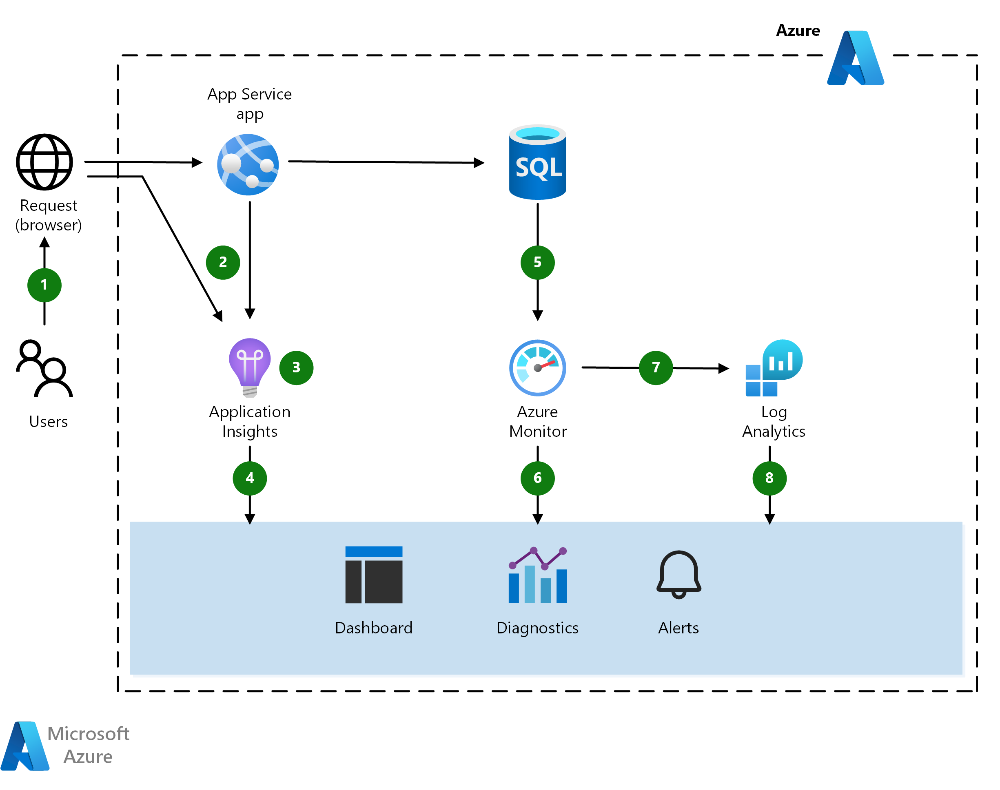

This scenario addresses the monitoring services you can use and describes a dataflow model for use with multiple data sources. When it comes to monitoring, many tools and services work with Azure deployments. In this scenario, we choose readily available services precisely because they are easy to consume. Other monitoring options are discussed later in this article.

## Architecture

*Download a [Visio file](https://arch-center.azureedge.net/architecture-diagram-app-monitoring.vsdx) of this architecture.*

### Dataflow

This scenario uses a managed Azure environment to host an application and data tier. The data flows through the scenario as follows:

1. A user interacts with the application.
2. The browser and app service emit telemetry.
3. Application Insights collects and analyzes application health, performance, and usage data.
4. Developers and administrators can review health, performance, and usage information.
5. Azure SQL Database emits telemetry.
6. Azure Monitor collects and analyzes infrastructure metrics and quotas.
7. Log Analytics collects and analyzes logs and metrics.
8. Developers and administrators can review health, performance, and usage information.

### Components

- [Azure App Service](/azure/app-service/) is a PaaS service for building and hosting apps in managed virtual machines. The underlying compute infrastructures on which your apps run is managed for you. App Service provides monitoring of resource usage quotas and app metrics, logging of diagnostic information, and alerts based on metrics. Even better, you can use Application Insights to create [availability tests][availability-tests] for testing your application from different regions.
- [Application Insights][application-insights] is an extensible Application Performance Management (APM) service for developers and supports multiple platforms. It monitors the application, detects application anomalies such as poor performance and failures, and sends telemetry to the Azure portal. Application Insights can also be used for logging, distributed tracing, and custom application metrics.
- [Azure Monitor][azure-monitor] provides base-level infrastructure [metrics and logs][metrics] for most services in Azure. You can interact with the metrics in several ways, including charting them in Azure portal, accessing them through the REST API, or querying them using PowerShell or CLI. Azure Monitor also offers its data directly into [Log Analytics and other services], where you can query and combine it with data from other sources on premises or in the cloud.
- [Log Analytics][log-analytics] helps correlate the usage and performance data collected by Application Insights with configuration and performance data across the Azure resources that support the app. This scenario uses the [Azure Log Analytics agent][Azure Log Analytics agent] to push SQL Server audit logs into Log Analytics. You can write queries and view data in the Log Analytics blade of the Azure portal.

## Scenario details

Azure platform as a service (PaaS) offerings manage compute resources for you and affect how you monitor deployments. Azure includes multiple monitoring services, each of which performs a specific role. Together, these services deliver a comprehensive solution for collecting, analyzing, and acting on telemetry from your applications and the Azure resources they consume.

This scenario addresses the monitoring services you can use and describes a dataflow model for use with multiple data sources. When it comes to monitoring, many tools and services work with Azure deployments. In this scenario, we choose readily available services precisely because they are easy to consume. Other monitoring options are discussed later in this article.

### Potential use cases

Other relevant use cases include:

- Instrumenting a web application for monitoring telemetry.
- Collecting front-end and back-end telemetry for an application deployed on Azure.
- Monitoring metrics and quotas associated with services on Azure.

## Considerations

These considerations implement the pillars of the Azure Well-Architected Framework, which is a set of guiding tenets that can be used to improve the quality of a workload. For more information, see [Microsoft Azure Well-Architected Framework](/azure/architecture/framework).

### Operational excellence

Operational excellence covers the operations processes that deploy an application and keep it running in production. For more information, see [Overview of the operational excellence pillar](/azure/architecture/framework/devops/overview).

#### Monitoring

A recommended practice is adding Application Insights to your code during development using the [Application Insights SDKs][Application Insights SDKs], and customizing per application. These open-source SDKs are available for most application frameworks. To enrich and control the data you collect, incorporate the use of the SDKs both for testing and production deployments into your development process. The main requirement is for the app to have a direct or indirect line of sight to the Applications Insights ingestion endpoint hosted with an Internet-facing address. You can then add telemetry or enrich an existing telemetry collection.

Runtime monitoring is another easy way to get started. The telemetry that is collected must be controlled through configuration files. For example, you can include runtime methods that enable tools such as [Application Insights Status Monitor][Application Insights Status Monitor] to deploy the SDKs into the correct folder and add the right configurations to begin monitoring.

Like Application Insights, Log Analytics provides tools for [analyzing data across sources][analyzing data across sources], creating complex queries, and [sending proactive alerts][sending proactive alerts] on specified conditions. You can also view telemetry in [the Azure portal][the Azure portal]. Log Analytics adds value to existing monitoring services such as [Azure Monitor][azure-monitor] and can also monitor on-premises environments.

Both Application Insights and Log Analytics use [Azure Log Analytics Query Language][Azure Log Analytics Query Language]. You can also use [cross-resource queries](https://azure.microsoft.com/blog/query-across-resources) to analyze the telemetry gathered by Application Insights and Log Analytics in a single query.

Azure Monitor, Application Insights, and Log Analytics all send [alerts](/azure/monitoring-and-diagnostics/monitoring-overview-alerts). For example, Azure Monitor alerts on platform-level metrics such as CPU utilization, while Application Insights alerts on application-level metrics such as server response time. Azure Monitor alerts on new events in the Azure Activity Log, while Log Analytics can issue alerts about metrics or event data for the services configured to use it. [Unified alerts in Azure Monitor](/azure/monitoring-and-diagnostics/monitoring-overview-unified-alerts) is a new, unified alerting experience in Azure that uses a different taxonomy.

##### Alternatives

This article describes conveniently available monitoring options with popular features, but you have many choices, including the option to create your own logging mechanisms. A recommended practice is to add monitoring services as you build out tiers in a solution. Here are some possible extensions and alternatives:

- Consolidate Azure Monitor and Application Insights metrics in Grafana using the [Azure Monitor Data Source For Grafana][Azure Monitor Data Source For Grafana].
- [Data Dog][data-dog] features a connector for Azure Monitor
- Automate monitoring functions using [Azure Automation][Azure Automation].
- Add communication with [ITSM solutions][ITSM solutions].
- Extend Log Analytics with a [management solution][management solution].

For more information see [Monitoring For DevOps][devops-monitoring] in the Azure Well-Architected Framework.

### Scalability and availability

This scenario focuses on PaaS solutions for monitoring in large part because they conveniently handle availability and scalability for you and are backed by service-level agreements (SLAs). For example, App Services provides a guaranteed [SLA][SLA] for its availability.

Application Insights has [limits][app-insights-limits] on how many requests can be processed per second. If you exceed the request limit, you may experience message throttling. To prevent throttling, implement [filtering][message-filtering] or [sampling][message-sampling] to reduce the data rate

High availability considerations for the app you run, however, are the developer's responsibility. For information about scale, for example, see the [scalability considerations](../app-service-web-app/basic-web-app.yml?tabs=cli#performance-efficiency) in the basic web application reference architecture. After an app is deployed, you can set up tests to [monitor its availability][monitor its availability] using Application Insights.

### Security

Security provides assurances against deliberate attacks and the abuse of your valuable data and systems. For more information, see [Overview of the security pillar](/azure/architecture/framework/security/overview).

Sensitive information and compliance requirements affect data collection, retention, and storage. Learn more about how [Application Insights][application-insights] and [Log Analytics][log-analytics] handle telemetry.

The following security considerations may also apply:

- Develop a plan to handle personal information if developers are allowed to collect their own data or enrich existing telemetry.
- Consider data retention. For example, Application Insights retains telemetry data for 90 days. Archive data you want access to for longer periods using Microsoft Power BI, Continuous Export, or the REST API. Storage rates apply.
- Limit access to Azure resources to control access to data and who can view telemetry from a specific application. To help lock down access to monitoring telemetry, see [Resources, roles, and access control in Application Insights][Resources, roles, and access control in Application Insights].
- Consider whether to control read/write access in application code to prevent users from adding version or tag markers that limit data ingestion from the application. With Application Insights, there is no control over individual data items once they are sent to a resource, so if a user has access to any data, they have access to all data in an individual resource.
- Add [governance](/azure/security/governance-in-azure) mechanisms to enforce policy or cost controls over Azure resources if needed. For example, use Log Analytics for security-related monitoring such as policies and role-based access control, or use [Azure Policy](/azure/azure-policy/azure-policy-introduction) to create, assign and, manage policy definitions.
- To monitor potential security issues and get a central view of the security state of your Azure resources, consider using [Microsoft Defender for Cloud](/azure/security-center/security-center-intro).

### Cost optimization

Cost optimization is about looking at ways to reduce unnecessary expenses and improve operational efficiencies. For more information, see [Overview of the cost optimization pillar](/azure/architecture/framework/cost/overview).

Monitoring charges can add up quickly. Consider pricing up front, understand what you are monitoring, and check the associated fees for each service. Azure Monitor provides [basic metrics][basic metrics] at no cost, while monitoring costs for [Application Insights][application-insights-pricing] and [Log Analytics][log-analytics] are based on the amount of data ingested and the number of tests you run.

To help you get started, use the [pricing calculator][pricing] to estimate costs. Change the various pricing options to match your expected deployment.

Telemetry from Application Insights is sent to the Azure portal during debugging and after you have published your app. For testing purposes and to avoid charges, a limited volume of telemetry is instrumented. To add more indicators, you can raise the telemetry limit. For more granular control, see [Sampling in Application Insights][Sampling in Application Insights].

After deployment, you can watch a [Live Metrics Stream][Live Metrics Stream] of performance indicators. This data is not stored &mdash; you are viewing real-time metrics &mdash; but the telemetry can be collected and analyzed later. There is no charge for Live Stream data.

Log Analytics is billed per gigabyte (GB) of data ingested into the service. The first 5 GB of data ingested to the Azure Log Analytics service every month is offered free, and the data is retained at no charge for first 31 days in your Log Analytics workspace.

## Contributors

*This article is maintained by Microsoft. It was originally written by the following contributors.* 

Principal author:

 - [Shawn Gibbs](https://www.linkedin.com/in/shawngibbs) | Principal Software Engineer
 
*To see non-public LinkedIn profiles, sign in to LinkedIn.*

## Next steps

Check out these resources designed to help you get started with your own monitoring solution:

- [Start monitoring your ASP.NET Web Application][Start monitoring your ASP.NET Web Application]

- [Collect data about Azure Virtual Machines][Collect data about Azure Virtual Machines]

- [Monitoring Azure applications and resources][Monitoring Azure applications and resources]

- [Find and diagnose run-time exceptions with Azure Application Insights][Find and diagnose run-time exceptions with Azure Application Insights]

## Related resources

- [Basic web application reference architecture][Basic web application reference architecture]
- [Web application monitoring on Azure](/azure/architecture/reference-architectures/app-service-web-app/app-monitoring)
- [Extract actionable insights from IoT data](/azure/architecture/industries/manufacturing/extract-insights-iot-data)
- [Hybrid availability and performance monitoring](/azure/architecture/hybrid/hybrid-perf-monitoring)
- [High availability enterprise deployment using App Service Environment](/azure/architecture/reference-architectures/enterprise-integration/ase-high-availability-deployment)

<!-- links -->

[availability-tests]: /azure/application-insights/app-insights-monitor-web-app-availability
[application-insights]: /azure/application-insights/app-insights-overview
[azure-monitor]: /azure/monitoring-and-diagnostics/monitoring-overview-azure-monitor
[metrics]: /azure/monitoring-and-diagnostics/monitoring-supported-metrics
[Log Analytics and other services]: /azure/log-analytics/log-analytics-azure-storage
[log-analytics]: /azure/log-analytics/log-analytics-overview
[Azure Log Analytics agent]: /archive/blogs/sqlsecurity/azure-log-analytics-oms-agent-now-collects-sql-server-audit-logs
[application-insights-pricing]: https://azure.microsoft.com/pricing/details/application-insights
[Application Insights SDKs]: /azure/application-insights/app-insights-asp-net
[Application Insights Status Monitor]: https://azure.microsoft.com/updates/application-insights-status-monitor-and-sdk-updated
[analyzing data across sources]: /azure/log-analytics/log-analytics-dashboards
[sending proactive alerts]: /azure/log-analytics/log-analytics-alerts
[the Azure portal]: /azure/log-analytics/log-analytics-tutorial-dashboards
[Azure Log Analytics Query Language]: /azure/azure-monitor/log-query/get-started-queries
[cross-resource queries]: https://azure.microsoft.com/blog/query-across-resources
[alerts]: /azure/monitoring-and-diagnostics/monitoring-overview-alerts
[Alerts (Preview)]: /azure/monitoring-and-diagnostics/monitoring-overview-unified-alerts
[Azure Monitor Data Source For Grafana]: https://grafana.com/grafana/plugins/grafana-azure-monitor-datasource
[Azure Automation]: /azure/automation/automation-intro
[ITSM solutions]: https://azure.microsoft.com/blog/itsm-connector-for-azure-is-now-generally-available
[management solution]: /azure/monitoring/monitoring-solutions
[SLA]: https://azure.microsoft.com/support/legal/sla/app-service/v1_4
[monitor its availability]: /azure/application-insights/app-insights-monitor-web-app-availability
[Resources, roles, and access control in Application Insights]: /azure/application-insights/app-insights-resources-roles-access-control
[basic metrics]: /azure/monitoring-and-diagnostics/monitoring-supported-metrics
[pricing]: https://azure.microsoft.com/pricing/calculator
[Sampling in Application Insights]: /azure/application-insights/app-insights-sampling
[Live Metrics Stream]: /azure/application-insights/app-insights-live-stream
[Basic web application reference architecture]: ../app-service-web-app/basic-web-app.yml?tabs=cli#performance-efficiency  
[Start monitoring your ASP.NET Web Application]: /azure/application-insights/quick-monitor-portal
[Collect data about Azure Virtual Machines]: /azure/log-analytics/log-analytics-quick-collect-azurevm
[Monitoring Azure applications and resources]: /azure/monitoring-and-diagnostics/monitoring-overview
[Find and diagnose run-time exceptions with Azure Application Insights]: /azure/application-insights/app-insights-tutorial-runtime-exceptions
[data-dog]: <https://www.datadoghq.com/blog/azure-monitoring-enhancements>
[app-insights-limits]: /azure/azure-subscription-service-limits#application-insights
[message-filtering]: /azure/application-insights/app-insights-api-filtering-sampling
[message-sampling]: /azure/application-insights/app-insights-sampling
[devops-monitoring]: /azure/architecture/framework/devops/checklist
