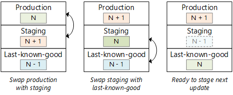

This reference architecture shows best practices for creating a web application for a single environment. The architecture provides a framework for any basic web application that you can customize to your needs.


*Download a [Visio file](https://arch-center.azureedge.net/app-service-reference-architectures-basic-webapp.vsdx) of this architecture.*

## Architecture

- **App Service plan**: An [App Service plan](/azure/app-service/azure-web-sites-web-hosting-plans-in-depth-overview) provides the managed virtual machines (VMs) that host your app. All apps associated with a plan run on the same VM instances.
- **App Service app**: [Azure App Service](/azure/app-service) is a fully managed platform for creating and deploying cloud applications.
- **Deployment slots**: A [deployment slot](/azure/app-service-web/web-sites-staged-publishing) lets you stage a deployment and then swap it with the production deployment. That way, you avoid deploying directly into production. See the [Manageability](#manageability) section for specific recommendations.
- **IP address**: The App Service app has a public IP address and a domain name. The domain name is a subdomain of `azurewebsites.net`, such as `contoso.azurewebsites.net`.
- **Azure DNS**: [Azure DNS](/azure/dns/dns-overview) is a hosting service for DNS domains, providing name resolution using Microsoft Azure infrastructure. By hosting your domains in Azure, you can manage your DNS records using the same credentials, APIs, tools, and billing as your other Azure services. To use a custom domain name (such as `contoso.com`), create DNS records that map the custom domain name to the IP address. For more information, see [Configure a custom domain name in Azure App Service](/azure/app-service-web/web-sites-custom-domain-name).
- **Azure SQL Database**: [SQL Database](/azure/sql-database) is a relational database-as-a-service in the cloud. SQL Database shares its code base with the Microsoft SQL Server database engine. Depending on your application requirements, you can also use [Azure Database for MySQL](/azure/mysql) or [Azure Database for PostgreSQL](/azure/postgresql). These alternatives are fully managed database services based on the open-source MySQL Server and Postgres database engines.

### Components

- [Azure App Service](https://azure.microsoft.com/services/app-service)
- [Azure DNS](https://azure.microsoft.com/services/dns)
- [Azure SQL Database](https://azure.microsoft.com/services/sql-database)
- [Azure Active Directory](https://azure.microsoft.com/services/active-directory)
- [Azure Monitor](https://azure.microsoft.com/services/monitor)
- [Azure Key Vault](https://azure.microsoft.com/services/key-vault)

## Recommendations

Your requirements might differ from the architecture described and given in the code. The code deploys with production configurations. Use the recommendations to customize your deployment to meet your needs.

### App Service plan

The App Service plan has different pricing tiers. Each pricing tier supports several *instance sizes* that differ by the number of cores and memory. The ARM template replicates a production environment and deploys to the Standard pricing tier. You can change the pricing tier after deployment by selecting "Scale up (App Service Plan)" on the left navigation.

- Run your production workload on the *Basic*, *Standard*, and *Premium* pricing tiers. In these three tiers, the app runs on dedicated virtual machine instances and has allocated resources that can scale out.
- If you need autoscale and TLS/SSL, use the *Standard* and *Premier* tiers.
- For testing and development, create a different App Service Plan. Use the *Free* and *Shared* (preview) tiers because they're cost efficient. Don't use them for production workloads. Shared resources can't scale out. The two tiers provide different options within your budget.
- App Service plans are billed on a per-second basis. You're charged for the instances in the App Service plan, even if the app is stopped. Make sure to delete plans that you aren't using (for example, test deployments). For more information about App Service plans, see [App Service Pricing](https://azure.microsoft.com/pricing/details/app-service). For more information, see [How much does my App Service plan cost?](/azure/app-service/overview-hosting-plans#how-much-does-my-app-service-plan-cost)

### SQL Database

- Use Azure SQL Server. Azure SQL server creates logical construct that acts as a central administrative point for a collection of databases. In the deployment template, there's only one SQL database, but when the number grows, this logical construct reduces management overhead. Each database within the group is deployed with a specific [service tier](/azure/sql-database/sql-database-service-tiers). Within each group, the databases can't share resources. There are no compute costs for the server, but you need to specify the tier for each database. Therefore, the performance might be better because of the dedicated resources, but the cost can be higher.
- Do perform capacity planning and choose a tier and performance level that meets your requirements. SQL Database supports Basic, Standard, and Premium [service tiers](/azure/sql-database/sql-database-service-tiers), with multiple performance levels within each tier measured in [Database Transaction Units (DTUs)](/azure/sql-database/sql-database-service-tiers).

### Region

- Provision the App Service plan and the SQL Database in the same region to minimize network latency. Generally, choose the region closest to your users.
- The resource group also has a region, which specifies where deployment metadata is stored. Put the resource group and its resources in the same region to improve availability during deployment.
- Use the [pricing calculator](https://azure.microsoft.com/pricing/calculator) to estimate costs.
- For more information, see the cost section in [Microsoft Azure Well-Architected Framework](/azure/architecture/framework/cost/overview).

## Considerations

### Scalability

A major benefit of Azure App Service is the ability to scale your application based on load. Here are some considerations to keep in mind when planning to scale your application.

#### Scaling the App Service app

There are two ways to scale an App Service app:

- [*Scale up*](/azure/app-service-web/web-sites-scale) means changing the instance size. The instance size determines the memory, number of cores, and storage on each VM instance. You can scale up manually by changing the instance size or the plan tier.
- *Scale out* means adding instances to handle increased load. Each pricing tier has a maximum number of instances. You can scale out by [manually changing the instance count](/azure/app-service-web/web-sites-scale) or by configuring [autoscaling](/azure/azure-monitor/autoscale/autoscale-get-started) to have Azure automatically add or remove instances based on a schedule and/or performance metrics. Each scale operation happens quickly, typically within seconds.
- To enable [autoscaling](/azure/azure-monitor/autoscale/autoscale-get-started), create an autoscale *profile* that defines the minimum and maximum number of instances. Profiles can be scheduled. For example, you might create separate profiles for weekdays and weekends. Optionally, a profile contains rules for when to add or remove instances. (Example: Add two instances if CPU usage is above 70% for 5 minutes.)

Recommendations for scaling a web app:

- As much as possible, avoid scaling up and down because it can trigger an application restart. Instead, select a tier and size that meet your performance requirements under typical load and then scale out the instances to handle changes in traffic volume.
- Enable autoscaling. If your application has a predictable, regular workload, create profiles to schedule the instance counts ahead of time. If the workload isn't predictable, use rule-based autoscaling to react to changes in load as they occur. You can combine both approaches.
- CPU usage is generally a good metric for autoscale rules. However, you should load test your application, identify potential bottlenecks, and base your autoscale rules on that data.
- Autoscale rules include a *cool-down* period, which is the interval to wait after a scale action has been completed before starting a new scale action. The cool-down period lets the system stabilize before scaling again. Set a shorter cool-down period for adding instances and a longer cool-down period for removing instances. For example, set 5 minutes to add an instance, but 60 minutes to remove an instance. It's better to add new instances quickly under heavy load to handle the extra traffic and then gradually scale back.

#### Scaling SQL Database

If you need a higher service tier or performance level for SQL Database, you can scale up individual databases with no application downtime. For more information, see [Scale single database resources in Azure SQL Database](/azure/sql-database/sql-database-single-database-scale).

### Availability

At the time of writing, the service level agreement (SLA) for App Service is 99.95%. The App Service SLA applies to both single and multiple instances. The SLA for SQL Database is 99.99% for Basic, Standard, and Premium tiers.

#### Backups

SQL Database provides point-in-time restore and geo-restore to restore data loss. These features are available in all tiers and are automatically enabled. You don't need to schedule or manage the backups.

- Use point-in-time restore to [recover from human error](/azure/sql-database/sql-database-business-continuity#recover-a-database-within-the-same-azure-region) by returning the database to an earlier point in time.
- Use geo-restore to [recover from a service outage](/azure/sql-database/sql-database-recovery-using-backups#geo-restore) by restoring a database from a geo-redundant backup.
- App Service provides a [backup and restore](/azure/app-service-web/web-sites-backup) feature for your application files. However, the backed-up files include app settings in plain text, such as connection strings. 
- Avoid using the App Service backup feature to back up your SQL databases because it exports the database to a SQL BACPAC file, consuming [DTUs](/azure/sql-database/sql-database-service-tiers). Instead, use SQL Database point-in-time restore described above.

For more information, see [cloud business continuity and database disaster recovery with SQL Database](/azure/sql-database/sql-database-business-continuity).

### Manageability

The ARM template uses one resource group and is designed for production environments.

- Create separate resource groups for production, development, and test environments. Separating environments makes it easier to manage deployments, delete test deployments, and assign access rights.

When assigning resources to resource groups, consider the following features:

- *Lifecycle* - In general, put resources with the same lifecycle into the same resource group.
- *Access* - You can use [Azure role-based access control (Azure RBAC)](/azure/role-based-access-control/overview) to apply access policies to the resources in a group.
- *Billing* - You can view the rolled-up costs for the resource group.

For more information, see [Azure Resource Manager overview](/azure/azure-resource-manager/resource-group-overview).

### DevOps

- Use [ARM templates](/azure/azure-resource-manager/resource-group-overview#resource-groups) to provision Azure resources and their dependencies. The accompanying ARM template deploys a single web application. All the resources are isolated in the same basic workload. This isolation makes it easier to associate the workload's specific resources to a team. The team can then independently manage all aspects of those resources. This isolation enables the DevOps team to perform continuous integration and continuous delivery (CI/CD).
- Use different ARM Templates and integrate them with Azure DevOps Services to provision different environments in minutes. For example, you can replicate production-like scenarios or load testing environments only when needed and save on cost.
- Provision multiple instances of the web application, so it doesn't depend on a single instance, which could create a single point of failure. Also, multiple instances improve resiliency and scalability.

#### Release Engineering and Deployment

- Use [Azure Resource Manager templates](/azure/azure-resource-manager/resource-group-overview#resource-groups) to provision Azure resources. Templates make it easier to automate deployments via PowerShell or the Azure CLI.
- Deploy the application (code, binaries, and content files). You have several options, including deploying from a local Git repository, using Visual Studio, or continuous deployment from cloud-based source control. See [Deploy your app to Azure App Service](/azure/app-service-web/web-sites-deploy).

An App Service app always has one deployment slot named `production`. The production slot represents the live production site. We recommend creating a staging slot for deploying updates. The benefits of using a staging slot include:

- You can verify the deployment succeeded before swapping it into production.
- Deploying to a staging slot ensures that all instances are warmed up before being swapped into production. Many applications have a significant warmup and cold-start time.
- Create a third slot to hold the last-known-good deployment. After you swap staging and production, move the previous production deployment (which is now in staging) into the last-known-good slot. That way, if you discover a problem later, you can quickly revert to the last-known-good version.



- If you revert to a previous version, make sure any database schema changes are backward compatible.
- Don't use slots on your production deployment for testing because all apps within the same App Service plan share the same VM instances. For example, load tests might degrade the live production site. Instead, create separate App Service plans for production and test. By putting test deployments into a separate plan, you isolate them from the production version.

#### Configuration

- Store configuration settings as [app settings](/azure/app-service-web/web-sites-configure). Define the app settings in your Resource Manager templates or using PowerShell. At runtime, app settings are available to the application as environment variables.
- Never check passwords, access keys, or connection strings into source control. Instead, pass secrets as parameters to a deployment script that stores these values as app settings.
- When you swap a deployment slot, the app settings are swapped by default. If you need different production and staging settings, you can create app settings that stick to a slot and don't get swapped.

#### Diagnostics and monitoring

- Enable [diagnostics logging](/azure/app-service-web/web-sites-enable-diagnostic-log), including application logging and web server logging. Configure logging to use Azure Log Analytics. For more detailed guidance on logging, see [Monitoring and diagnostics guidance](../../best-practices/monitoring.yml).
- Use a service such as [New Relic](https://newrelic.com) or [Application Insights](/azure/application-insights/app-insights-overview) to monitor application performance and behavior under load. Be aware of the [data rate limits](/azure/application-insights/app-insights-pricing) for Application Insights.
- Perform load testing, using a tool such as [Azure DevOps](/azure/devops) or [Visual Studio Team Foundation Server](/azure/devops/server/tfs-is-now-azure-devops-server). For a general overview of performance analysis in cloud applications, see [Performance Analysis Primer](https://github.com/mspnp/performance-optimization/blob/master/Performance-Analysis-Primer.md).

Tips for troubleshooting your application:

- Use the [troubleshoot blade](https://azure.microsoft.com/updates/self-service-troubleshooting-for-app-service-web-apps-customers) in the Azure portal to find solutions to common problems.
- Enable [log streaming](/azure/app-service-web/web-sites-enable-diagnostic-log#stream-logs) to see logging information in near-real-time.
- The [Kudu dashboard](https://azure.microsoft.com/blog/windows-azure-websites-online-tools-you-should-know-about) has several tools for monitoring and debugging your application. For more information, see [Azure Websites online tools you should know about](https://azure.microsoft.com/blog/windows-azure-websites-online-tools-you-should-know-about) (blog post). You can reach the Kudu dashboard from the Azure portal. Open the blade for your app and select **Tools**, then select **Kudu**.
- If you use Visual Studio, see the article [Troubleshoot a web app in Azure App Service using Visual Studio](/azure/app-service-web/web-sites-dotnet-troubleshoot-visual-studio) for debugging and troubleshooting tips.

For more information, see the DevOps section in [Azure Well-Architected Framework](/azure/architecture/framework/devops/overview).

### Security

This section lists security considerations that are specific to the Azure services described in this article. It's not a complete list of security best practices. For some other security considerations, see [Secure an app in Azure App Service](/azure/app-service-web/web-sites-security).

#### SQL Database auditing

Auditing can help you maintain regulatory compliance and get insight into discrepancies and irregularities that could indicate business concerns or suspected security violations. See [Get started with SQL database auditing](/azure/sql-database/sql-database-auditing-get-started).

#### Deployment slots

Each deployment slot has a public IP address. Secure the nonproduction slots using [Azure Active Directory login](/azure/app-service-mobile/app-service-mobile-how-to-configure-active-directory-authentication) so that only members of your development and DevOps teams can reach those endpoints.

#### Logging

Logs should never record users' passwords or other information that might be used to commit identity fraud. Scrub those details from the data before storing it.

#### SSL

An App Service app includes an SSL endpoint on a subdomain of `azurewebsites.net` at no extra cost. The SSL endpoint includes a wildcard certificate for the `*.azurewebsites.net` domain. If you use a custom domain name, you must provide a certificate that matches the custom domain. The simplest approach is to buy a certificate directly through the Azure portal. You can also import certificates from other certificate authorities. For more information, see [Buy and Configure an SSL Certificate for your Azure App Service](/azure/app-service-web/web-sites-purchase-ssl-web-site).

HTTPS isn't enabled by default in the ARM template deployment. As a security best practice, your app should enforce HTTPS by redirecting HTTP requests. You can implement HTTPS inside your application or use a URL rewrite rule as described in [enable HTTPS for an app in Azure App Service](/azure/app-service-web/web-sites-configure-ssl-certificate).

#### Authentication

We recommend authenticating through an identity provider (IDP), such as Azure AD, Facebook, Google, or Twitter. Use OAuth 2 or OpenID Connect (OIDC) for the authentication flow. Azure AD provides functionality to manage users and groups, create application roles, integrate your on-premises identities, and consume backend services such as Microsoft 365 and Skype for Business.

Avoid having the application manage user logins and credentials directly, as it creates a potential attack surface. At a minimum, you would need to have an email confirmation, password recovery, and multi-factor authentication, validate password strength, and store password hashes securely. The large identity providers handle all of those things for you and are constantly monitoring and improving their security practices.

Consider using [App Service authentication](/azure/app-service-api/app-service-api-authentication) to implement the OAuth/OIDC authentication flow. The benefits of App Service authentication include:

- Easy to configure.
- No code is required for simple authentication scenarios.
- Supports delegated authorization using OAuth access tokens to consume resources on behalf of the user.
- Provides a built-in token cache.

Some limitations of App Service authentication:

- Limited customization options.
- Delegated authorization is restricted to one backend resource per login session.
- If you use more than one IDP, there's no built-in mechanism for home realm discovery.
- For multi-tenant scenarios, the application must implement the logic to validate the token issuer.

## Deploy this scenario

This architecture includes an Azure App Service plan and an empty application. It uses Azure SQL Database, Azure Key Vault for storing the database connection string, and Azure Monitor for logging, monitoring, and alerting.

# [Azure CLI](#tab/cli)

Use the following command to create a resource group for the deployment. Select the **Try it** button to use an embedded shell.

```azurecli-interactive
az group create --name basic-web-app --location eastus
```

Run the following command to deploy the web application and supporting infrastructure. When prompted, enter a user name and password. These values are used for accessing the Azure SQL Database instance.

```azurecli-interactive
az deployment group create --resource-group basic-web-app  \
    --template-uri https://raw.githubusercontent.com/mspnp/samples/master/solutions/basic-web-app/azuredeploy.json
```

# [PowerShell](#tab/powershell)

Use the following command to create a resource group for the deployment. Select the **Try it** button to use an embedded shell.

```azurepowershell-interactive
New-AzResourceGroup -Name basic-web-app -Location eastus
```

Run the following command to deploy the web application and supporting infrastructure. When prompted, enter a user name and password. These values are used for accessing the Azure SQL Database instance.

```azurepowershell-interactive
New-AzResourceGroupDeployment -ResourceGroupName basic-web-app `
    -TemplateUri https://raw.githubusercontent.com/mspnp/samples/master/solutions/basic-web-app/azuredeploy.json
```

# [Azure portal](#tab/portal)

Use the following button to deploy the reference using the Azure portal.

[](https://portal.azure.com/#create/Microsoft.Template/uri/https%3A%2F%2Fraw.githubusercontent.com%2Fmspnp%2Fsamples%2Fmaster%2Fsolutions%2Fbasic-web-app%2Fazuredeploy.json)

---

For detailed information and more deployment options, see the ARM Templates used to deploy this solution.

> [!div class="nextstepaction"]
> [Basic web application ARM Template](/samples/mspnp/samples/basic-web-app-deployment/)

## Next steps

Product documentation:

- [About Azure Key Vault](/azure/key-vault/general/overview)
- [App Service overview](/azure/app-service/overview)
- [Azure Monitor overview](/azure/azure-monitor/overview)
- [Azure App Service plan overview](/azure/app-service/overview-hosting-plans)
- [Overview of Log Analytics in Azure Monitor](/azure/azure-monitor/logs/log-analytics-overview)
- [What is Azure Active Directory?](/azure/active-directory/fundamentals/active-directory-whatis)
- [What is Azure DNS?](/azure/dns/dns-overview)
- [What is Azure SQL Database?](/azure/azure-sql/database/sql-database-paas-overview)

Microsoft Learn modules:

- [Configure and manage Azure Monitor](/learn/modules/azure-monitor)
- [Configure Azure Active Directory](/learn/modules/configure-azure-active-directory)
- [Configure Azure Monitor](/learn/modules/configure-azure-monitor)
- [Deploy and configure servers, instances, and databases for Azure SQL](/learn/modules/azure-sql-deploy-configure)
- [Explore Azure App Service](/learn/modules/introduction-to-azure-app-service)
- [Host a web application with Azure App Service](/learn/modules/host-a-web-app-with-azure-app-service)
- [Host your domain on Azure DNS](/learn/modules/host-domain-azure-dns)
- [Implement Azure Key Vault](/learn/modules/implement-azure-key-vault)
- [Manage users and groups in Azure Active Directory](/learn/modules/manage-users-and-groups-in-aad)

## Related resources

- [Ten design principles for Azure applications](../../guide/design-principles/index.md)
- [Highly available multi-region web application](multi-region.yml)
- [Multi-region web app with private connectivity to database](../../example-scenario/sql-failover/app-service-private-sql-multi-region.yml)
- [Scalable web application](scalable-web-app.yml)
