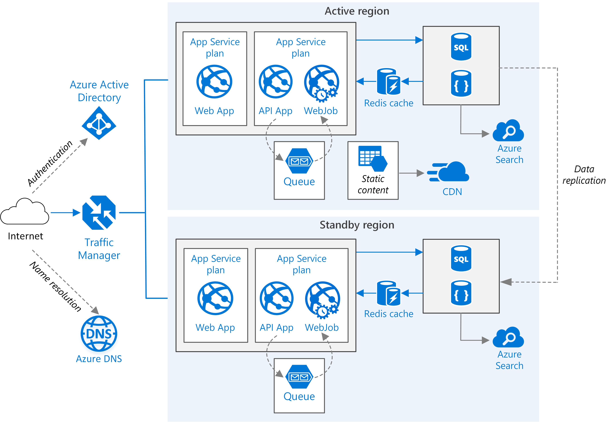

<!-- cSpell:ignore CNAME -->

This example architecture is based on the [Scalable web application][guidance-web-apps-scalability] example architecture and extends it to show how to run an Azure App Service application in multiple regions to achieve high availability. Ensure that you're familiar with that design and the components used in it to prepare for this article. It provides detailed information on the core components that won't be reproduced here.

## Architecture

*Download a [Visio file][visio-download] of this architecture.*

### Workflow

This architecture builds on the one shown in [Scalable web application][guidance-web-apps-scalability]. The main differences are:

- **Primary and secondary regions**. This architecture uses two regions to achieve higher availability. The application is deployed to each region. During normal operations, network traffic is routed to the primary region. If the primary region becomes unavailable, traffic is routed to the secondary region.
- **Front Door**. Front Door is included in single-region design, as it's the recommended load balancer and web application firewall (WAF) solution for web apps. However, the difference in this design is in the routing configuration and replacing Azure CDN with Front Door's native content caching functionality. In this design, Front Door is configured for [priority](/azure/frontdoor/routing-methods#priority) routing, which sends all traffic to the primary region unless it becomes unavailable.  If the primary region becomes unavailable, Front Door routes all traffic to the secondary region.
- **Geo-replication** of Storage Accounts, SQL Database and/or Azure Cosmos DB.

### Components

Key technologies used to implement this architecture:

- [Azure Active Directory][Azure-Active-Directory]
- [Azure DNS][Azure-DNS]
- [Azure Content Delivery Network][Azure-Content-Delivery-Network]
- [Azure Front Door][Azure-Front-Door]
- [Azure AppService][Azure-AppService]
- [Azure Function][Azure-Function]
- [Azure Storage][Azure-Storage]
- [Azure Redis Cache][Azure-Redis-Cache]
- [Azure SQL Database][Azure-SQL-Database]
- [Azure Cosmos DB][Azure-Cosmos-DB]
- [Azure Search][Azure-Search]

For a detailed description of the components in scope for this design, refer to the [Scalable web application](/azure/architecture/reference-architectures/app-service-web-app/scalable-web-app#workflow) article that this design is based on.

## Scenario details

There are several general approaches to achieve high availability across regions:

- Active/Passive with hot standby: traffic goes to one region, while the other waits on hot standby. *Hot standby* means the App Service in the secondary region is allocated and is always running.

- Active/Passive with cold standby: traffic goes to one region, while the other waits on cold standby. Cold standby means the App Service in the secondary region isn't allocated until needed for failover. This approach costs less to run, but will generally take longer to come online during a failure.

- Active/Active: both regions are active, and requests are load balanced between them. If one region becomes unavailable, it's taken out of rotation.

This reference focuses on active/passive with hot standby. It extends the single region design for a scalable web application. See [Scalable web application][guidance-web-apps-scalability] for information on the base architecture.

### Potential use cases

These use cases can benefit from a multi-region deployment:

- Design a business continuity and disaster recovery plan for LoB applications.

- Deploy mission-critical applications that run on Windows or Linux.

- Improve the user experience by keeping applications available.

## Recommendations

Your requirements might differ from the architecture described here. Use the recommendations in this section as a starting point.

### Regional pairing

Each Azure region is paired with another region within the same geography. In general, choose regions from the same regional pair (for example, East US 2 and Central US). Benefits of doing so include:

- If there's a broad outage, recovery of at least one region out of every pair is prioritized.
- Planned Azure system updates are rolled out to paired regions sequentially to minimize possible downtime.
- In most cases, regional pairs reside within the same geography to meet data residency requirements.

However, make sure that both regions support all of the Azure services needed for your application. See [Services by region][services-by-region]. For more information about regional pairs, see [Business continuity and disaster recovery (BCDR): Azure Paired Regions][regional-pairs].

### Resource groups

Consider placing the primary region, secondary region, and Front Door into separate [resource groups][resource groups]. This allocation lets you manage the resources deployed to each region as a single collection.

### Front Door configuration

**Routing**. Front Door supports several [routing mechanisms](/azure/frontdoor/front-door-routing-methods#priority-based-traffic-routing). For the scenario described in this article, use *priority* routing. With this setting, Front Door sends all requests to the primary region unless the endpoint for that region becomes unreachable. At that point, it automatically fails over to the secondary region. Set the origin pool with different priority values, 1 for the active region and 2 or higher for the standby or passive region.

**Health probe**. Front Door uses an HTTPS probe to monitor the availability of each back end. The probe gives Front Door a pass/fail test for failing over to the secondary region. It works by sending a request to a specified URL path. If it gets a non-200 response within a timeout period, the probe fails. You can configure the health probe frequency, number of samples required for evaluation, and the number of successful samples required for the origin to be marked as healthy. If Front Door marks the origin as degraded, it fails over to the other origin. For details, see [Health Probes](/azure/frontdoor/front-door-health-probes).

As a best practice, create a health probe path in your application origin that reports the overall health of the application. This health probe should check critical dependencies such as the App Service apps, storage queue, and SQL Database. Otherwise, the probe might report a healthy origin when critical parts of the application are actually failing. On the other hand, don't use the health probe to check lower priority services. For example, if an email service goes down the application can switch to a second provider or just send emails later. For further discussion of this design pattern, see [Health Endpoint Monitoring Pattern](/azure/architecture/patterns/health-endpoint-monitoring).

Securing origins from the internet is a critical part of implementing a publicly accessible app. Refer to the [Network secure ingress implementation](/azure/architecture/pattern-implementations/network-secure-ingress) to learn about Microsoft's recommended design and implementation patterns for securing your app's ingress communications with Front Door.

### SQL Database

Use [Active geo-replication](/azure/azure-sql/database/auto-failover-group-sql-db?view=azuresql&tabs=azure-powershell) and [auto-failover groups](/azure/azure-sql/database/auto-failover-group-sql-db?view=azuresql&tabs=azure-powershell) to make your databases resilient.  Active geo-replication allows you to replicate your databases from the primary region into one or more (up to four) other regions.  Auto-failover groups build on top of active geo-replication by allowing you to fail over to a secondary database without any code changes to your apps.  Failovers can be performed manually or automatically, according to policy definitions that you create.  In order to use auto-failover groups, you'll need to configure your connections strings with the failover connection string automatically created for the failover group, rather than the connection strings of the individual databases.

### Azure Cosmos DB

Azure Cosmos DB supports geo-replication across regions in active-active pattern with multiple write regions. Alternatively, you can designate one region as the writable region and the others as read-only replicas. If there's a regional outage, you can fail over by selecting another region to be the write region. The client SDK automatically sends write requests to the current write region, so you don't need to update the client configuration after a failover. For more information, see [Global data distribution with Azure Cosmos DB][cosmosdb-geo].

### Storage

For Azure Storage, use [read-access geo-redundant storage][ra-grs] (RA-GRS). With RA-GRS storage, the data is replicated to a secondary region. You have read-only access to the data in the secondary region through a separate endpoint. [User-initiated failover](/azure/storage/common/storage-initiate-account-failover?tabs=azure-portal) to the secondary region is supported for geo-replicated storage accounts.  Initiating a storage account failover automatically updates DNS records to make the secondary storage account the new primary storage account.  Failovers should only be undertaken when you deem it's necessary. This requirement is defined by your organization's disaster recovery plan, and you should consider the implications as described in the Considerations section below.

If there's a regional outage or disaster, the Azure Storage team might decide to perform a geo-failover to the secondary region. For these types of failovers, there's no customer action required.  Fail back to the primary region is also managed by the Azure storage team in these cases.

In some cases [object replication for block blobs](/azure/storage/blobs/object-replication-overview) will be a sufficient replication solution for your workload.  This replication feature allows you to copy individual block blobs from the primary storage account into a storage account in your secondary region.  Benefits of this approach are a granular control over what data is being replicated. You can define a replication policy for more granular control of the types of block blobs that are replicated.  Examples of policy definitions include, but aren't limited to:

- Only block blobs added subsequent to creating the policy are replicated
- Only block blobs added after a given date and time are replicated
- Only block blobs matching a given prefix are replicated.

Queue storage is referenced as an alternative messaging option to Azure Service Bus for this scenario. However, if you use queue storage for your messaging solution, the guidance provided above relative to geo-replication applies here, as queue storage resides on storage accounts. It's important to understand, however, that messages aren't replicated to the secondary region and their state is inextricable from the region.

### Azure Service Bus

In order to benefit from the highest resilience offered for Azure Service Bus, use the premium tier for your namespaces. The premium tier makes use of [availability zones](/azure/service-bus-messaging/service-bus-geo-dr#availability-zones), which makes your namespaces resilient to data center outages. If there's a widespread disaster affecting multiple data centers, the [Geo-disaster recovery](/azure/service-bus-messaging/service-bus-geo-dr) feature included with the premium tier can help you recover. The Geo-Disaster recovery feature ensures that the entire configuration of a namespace (queues, topics, subscriptions, and filters) is continuously replicated from a primary namespace to a secondary namespace when paired. It allows you to initiate a once-only failover move from the primary to the secondary at any time. The failover move will repoint the chosen alias name for the namespace to the secondary namespace and then break the pairing. The failover is nearly instantaneous once initiated.

### Azure Cognitive Search

In Cognitive Search, availability is achieved through multiple replicas, whereas business continuity and disaster recovery (BCDR) is achieved through multiple search services.

In Cognitive Search, replicas are copies of your index. Having multiple replicas allows Azure Cognitive Search to do machine reboots and maintenance against one replica, while query execution continues on other replicas. For more information about adding replicas, see [Add or reduce replicas and partitions](/azure/search/search-capacity-planning#adjust-capacity). 

You can utilize [Availability Zones](/azure/availability-zones/az-overview) with Azure Cognitive Search by adding two or more replicas to your search service. Each replica will be placed in a different Availability Zone within the region.

For BCDR considerations, refer to the [Multiple services in separate geographic regions](/azure/search/search-performance-optimization#multiple-services-in-separate-geographic-regions) documentation.

### Azure Cache for Redis

While all tiers of Azure Cache for Redis offer [Standard replication for high availability](/azure/azure-cache-for-redis/cache-high-availability#standard-replication-for-high-availability), the Premium or Enterprise tier are recommended to provide a higher level of resilience and recoverability.  Review the [High availability and disaster recovery](/azure/azure-cache-for-redis/cache-high-availability) for a complete list of resiliency and recoverability features and options for these tiers.  Your business requirements will determine which tier is the best fit for your infrastructure.

## Considerations

These considerations implement the pillars of the Azure Well-Architected Framework, which is a set of guiding tenets that can be used to improve the quality of a workload. For more information, see [Microsoft Azure Well-Architected Framework](/azure/architecture/framework).

### Reliability

Reliability ensures your application can meet the commitments you make to your customers. For more information, see [Overview of the reliability pillar](/azure/architecture/framework/resiliency/overview). Consider these points when designing for high availability across regions.

#### Azure Front Door

Azure Front Door automatically fails over if the primary region becomes unavailable. When Front Door fails over, there's a period of time (usually about 20-60 seconds) when clients can't reach the application. The duration is affected by the following factors:

- **Frequency of health probes**. The more frequent the health probes are sent, the faster Front Door can detect downtime or the origin coming back healthy.
- **Sample size configuration**. This configuration controls how many samples are required for the health probe to detect that the primary origin has become unreachable. If this value is too low, you could get false positives from intermittent issues.

Front Door is a possible failure point in the system. If the service fails, clients can't access your application during the downtime. Review the [Front Door service level agreement (SLA)](https://azure.microsoft.com/support/legal/sla/frontdoor) and determine whether using Front Door alone meets your business requirements for high availability. If not, consider adding another traffic management solution as a fallback. If the Front Door service fails, change your canonical name (CNAME) records in DNS to point to the other traffic management service. This step must be performed manually, and your application will be unavailable until the DNS changes are propagated.

Azure Front Door Standard and Premium tier combine the capabilities of Azure Front Door (classic), Azure CDN Standard from Microsoft (classic), and Azure WAF into a single platform. Using the Azure Front Door Standard or Premium reduces the points of failure and enables enhanced control, monitoring, and security. For more information, see [Overview of Azure Front Door tier][front-door-tier].

<!-- markdownlint-disable MD024 -->

#### SQL Database

The recovery point objective (RPO) and estimated recovery time objective (RTO) for SQL Database are documented in [Overview of business continuity with Azure SQL Database][sql-rpo].

Be mindful that active geo-replication effectively doubles the cost of each replicated database. Sandbox, test, and development databases are typically not recommended for replication.

#### Azure Cosmos DB

RPO and recovery time objective (RTO) for Azure Cosmos DB are configurable via the consistency levels used, which provide trade-offs between availability, data durability, and throughput. Azure Cosmos DB provides a minimum RTO of 0 for a relaxed consistency level with multi-master or an RPO of 0 for strong consistency with single-master. To learn more about Azure Cosmos DB consistency levels, see [Consistency levels and data durability in Azure Cosmos DB](/azure/cosmos-db/consistency-levels-tradeoffs#rto).

#### Storage

RA-GRS storage provides durable storage, but it's important to consider the following factors when contemplating performing a failover:

- **Anticipate data loss:** Data replication to the secondary region is performed asynchronously. Therefore, if a geo-failover is performed, some data loss should be anticipated if changes to the primary account haven't fully synchronized to the secondary account. You can [check the Last Sync Time property](/azure/storage/common/last-sync-time-get) of the secondary storage account to see the last time that data from the primary region was written successfully to the secondary region.
- **Plan your recovery time objective (RTO) accordingly:** Failover to the secondary region typically takes about one hour, so your DR plan should take this information into account when calculating your RTO parameters.
- **Plan your fail back carefully:** It's important to understand that when a storage account fails over, the data in the original primary account is lost. Attempting a fail back to the primary region without careful planning is risky. After failover completes, the new primary - in the failover region - will be configured for locally redundant storage (LRS). You must manually reconfigure it as geo-replicated storage to initiate replication to the primary region and then give sufficient time to let the accounts sync.
- Transient failures, such as a network outage, won't trigger a storage failover. Design your application to be resilient to transient failures. Mitigation options include:

  - Read from the secondary region.
  - Temporarily switch to another storage account for new write operations (for example, to queue messages).
  - Copy data from the secondary region to another storage account.
  - Provide reduced functionality until the system fails back.

For more information, see [What to do if an Azure Storage outage occurs][storage-outage].

Refer to the [prerequisites and caveats for object replication](/azure/storage/blobs/object-replication-overview#prerequisites-and-caveats-for-object-replication) documentation for considerations when using object replication for block blobs.

#### Azure Service Bus

It's important to understand that the Geo-disaster recovery feature included in the premium Azure Service Bus tier enables instant continuity of operations with the same configuration. However, it **doesn't replicate the messages held in queues or topic subscriptions or dead-letter queues**. As such, a mitigation strategy is required to ensure a smooth failover to the secondary region.  For a detailed description of other considerations and mitigation strategies, refer to the [important points to consider](/azure/service-bus-messaging/service-bus-geo-dr#important-points-to-consider) and [disaster recovery considerations](/azure/service-bus-messaging/service-bus-geo-dr#considerations) documentation. 

### Security

Security provides assurances against deliberate attacks and the abuse of your valuable data and systems. For more information, see [Overview of the security pillar](/azure/architecture/framework/security/overview).

This architecture builds on the one shown in [Scalable web application][guidance-web-apps-scalability], see the [Security considerations section][guidance-web-apps-scalability-security].

When you define identities for the components in this architecture, use [system managed identities][system-managed-identities] where possible to reduce your need to manage credentials and the risks inherent to managing credentials. Where it's not possible to use system managed identities, ensure that every user managed identity exists in only one region and is never shared across region boundaries.

When configuring the service firewalls for the components, ensure both that only the region-local services have access to the services and that the services only allow outbound connections, which is explicitly required for replication and application functionality. Consider using [Azure Private Link][private-link] for further enhanced control and segmentation. For more information on securing web applications, see [Network-hardened web application with private connectivity to PaaS datastores][hardened-web-app].

### Cost optimization

Cost optimization is about looking at ways to reduce unnecessary expenses and improve operational efficiencies. For more information, see [Overview of the cost optimization pillar](/azure/architecture/framework/cost/overview).

Use the [pricing calculator][pricing-calculator] to estimate costs. These recommendations in this section may help you to reduce cost.

#### Azure Front Door

Azure Front Door billing has three pricing tiers: outbound data transfers, inbound data transfers, and routing rules. For more info See [Azure Front Door Pricing][AFD-pricing]. The pricing chart doesn't include the cost of accessing data from the origin services and transferring to Front Door. Those costs are billed based on data transfer charges, described in [Bandwidth Pricing Details][bandwidth-pricing].

#### Azure Cosmos DB

There are two factors that determine Azure Cosmos DB pricing:

- The provisioned throughput or [Request Units per second (RU/s)](/azure/cosmos-db/request-units).

    There are two types of throughput that can be provisioned in Azure Cosmos DB, standard and autoscale. Standard throughput allocates the resources required to guarantee the RU/s that you specify. For autoscale, you provision the maximum throughput, and Azure Cosmos DB instantly scales up or down depending on the load, with a minimum of 10% of the maximum autoscale throughput. Standard throughput is billed for the throughput provisioned hourly. Autoscale throughput is billed for the maximum throughput consumed hourly.

- Consumed storage. You're billed a flat rate for the total amount of storage (GBs) consumed for data and the indexes for a given hour.

For more information, see the cost section in [Microsoft Azure Well-Architected Framework](/azure/architecture/framework/cost/overview).

### Operational excellence

[Operational excellence](/azure/architecture/framework/devops/overview) refers to the operations processes that deploy an application and keep it running in production and is an extension of the [Well-Architected Framework Reliability](/azure/architecture/framework/resiliency/overview) guidance.  This guidance provides a detailed overview of architecting resiliency into your application framework to ensure your workloads are available and can recover from failures at any scale.  A core tenet of this approach is to design your application infrastructure to be highly available, optimally across multiple geographic regions as this design illustrates.  

## Contributors

*This article is maintained by Microsoft. It was originally written by the following contributors.* 

Principal author:

 - Arvind Boggaram Pandurangaiah Setty | Senior Consultant
 
*To see non-public LinkedIn profiles, sign in to LinkedIn.*

## Next steps

- Deep dive on [Azure Front Door - traffic routing methods][front-door-routing]

- Create health probes that report the overall health of the application based on [endpoint monitoring patterns][endpoint-monitoring]

- Enable [Azure SQL auto-failover groups][sql-failover]

- [Ensure business continuity and disaster recovery using Azure Paired Regions](/azure/best-practices-availability-paired-regions)

## Related resources

- [Multi-region N-tier application](../n-tier/multi-region-sql-server.yml) is a similar scenario. It shows an N-tier application running in multiple Azure regions

- [Design principles for Azure applications][Design-principles-for-Azure-Application]

<!-- links -->

[AFD-pricing]: https://azure.microsoft.com/pricing/details/frontdoor
[AAF-devops-deployment-multi-region]: /azure/architecture/framework/devops/release-engineering-cd#consider-deploying-across-multiple-regions
[bandwidth-pricing]: https://azure.microsoft.com/pricing/details/bandwidth
[cosmosdb-geo]: /azure/cosmos-db/distribute-data-globally
[guidance-web-apps-scalability]: ./scalable-web-app.yml
[guidance-web-apps-scalability-devops]: ./scalable-web-app.yml#devops
[guidance-web-apps-scalability-security]: ./scalable-web-app.yml#security
[pricing-calculator]: https://azure.microsoft.com/pricing/calculator
[ra-grs]: /azure/storage/common/storage-designing-ha-apps-with-ragrs
[regional-pairs]: /azure/best-practices-availability-paired-regions
[resource groups]: /azure/azure-resource-manager/resource-group-overview#resource-groups
[services-by-region]: https://azure.microsoft.com/regions/#services
[sql-failover]: /azure/sql-database/sql-database-disaster-recovery
[sql-rpo]: /azure/sql-database/sql-database-business-continuity#sql-database-features-that-you-can-use-to-provide-business-continuity
[storage-outage]: /azure/storage/storage-disaster-recovery-guidance
[system-managed-identities]: /azure/active-directory/managed-identities-azure-resources/overview
[visio-download]: https://arch-center.azureedge.net/app-service-reference-architectures-multi-region-webapp.vsdx
[Azure-Active-Directory]: https://azure.microsoft.com/services/active-directory
[Azure-DNS]: https://azure.microsoft.com/services/dns
[Azure-Content-Delivery-Network]: https://azure.microsoft.com/services/cdn
[Azure-Front-Door]: https://azure.microsoft.com/services/frontdoor
[Azure-AppService]: https://azure.microsoft.com/services/app-service
[Azure-Function]: https://azure.microsoft.com/services/functions
[Azure-Storage]: https://azure.microsoft.com/product-categories/storage
[Azure-Redis-Cache]: https://azure.microsoft.com/services/cache
[Azure-SQL-Database]: https://azure.microsoft.com/products/azure-sql/database
[Azure-Cosmos-DB]: https://azure.microsoft.com/services/cosmos-db
[Azure-Search]: https://azure.microsoft.com/services/search
[front-door-routing]: /azure/frontdoor/front-door-routing-methods
[front-door-tier]: /azure/frontdoor/standard-premium/tier-comparison
[endpoint-monitoring]: /azure/architecture/patterns/health-endpoint-monitoring
[Design-principles-for-Azure-Application]: /azure/architecture/guide/design-principles
[private-link]: /azure/private-link/private-link-overview
[hardened-web-app]: /azure/architecture/example-scenario/security/hardened-web-app
