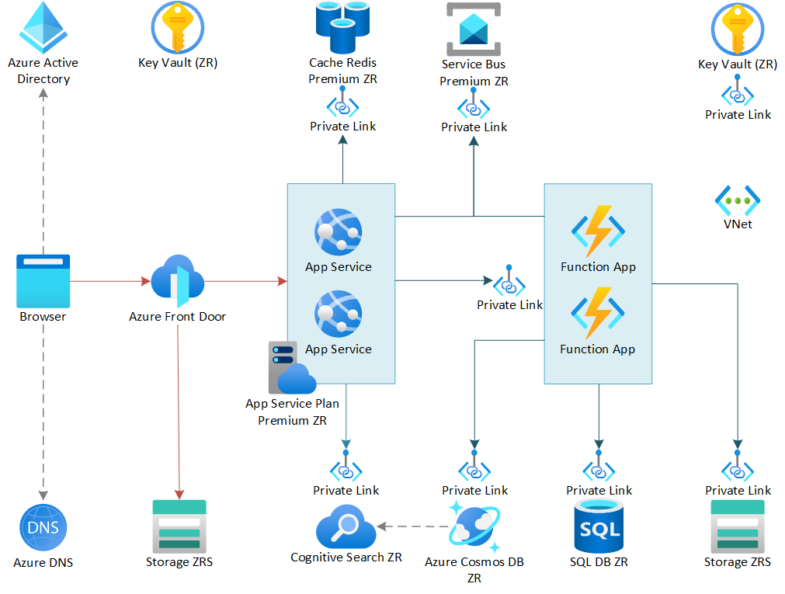

<!-- cSpell:ignore CNAME -->

This reference architecture shows how to run an Azure App Service application in a zone-redundant configuration to achieve high availability. Zone-redundant services replicate your services and data across Availability Zones to protect from single points of failure.

Multi-zone architectures are a good alternative to [multi-region architectures], offering less complexity and lower cost, while still meeting the availability and recovery requirements for most customers.

*See a [full working sample of this architecture in Azure Samples], including Visio file, Bicep template and Bill of materials.*

## Architecture

This architecture builds on the additional availability provided by [Availability Zones infrastructure] found in many Azure regions today. Availability Zones spread a solution across multiple zones within a region, allowing for an application to continue functioning when one zone fails. Most Foundational and Mainstream Azure services, as well as many Specialized Azure services provide support for Availability Zones today. All of the Azure services in this architecture are [Zone Redundant], simplifying deployment and management. 

This is essentially an active/active design within a single region, where high availability is provided as a feature of a platform. In most cases failures are automatically mitigated without user intervention.

### Front Door

In this architecture [Azure Front Door] serves as an edge for all public HTTP traffic ingressing into the Azure Region. Because this is a single region design, the global load balancing feature of Front Door is not used. Front Door provides CDN style cache, DDOS and WAF functionality in one convenient service. However, [Azure CDN] and/or [Azure Application Gateway] could be used instead.  

## Recommendations

Your requirements might differ from the architecture described here. Use the recommendations in this section as a starting point.

### SQL Database

Use an [Azure SQL DB Tier that supports Availability Zones][]. 

## WIP Below this line ----------------------------------------

Use [Active Geo-Replication][sql-replication] to create a readable secondary replica in a different region. You can have up to four readable secondary replicas. Fail over to a secondary database if your primary database fails or needs to be taken offline. Active Geo-Replication can be configured for any database in any elastic database pool.

### Cosmos DB

Cosmos DB supports geo-replication across regions in active-active pattern with multiple write regions. Alternatively, you can designate one region as the writable region and the others as read-only replicas. If there is a regional outage, you can fail over by selecting another region to be the write region. The client SDK automatically sends write requests to the current write region, so you don't need to update the client configuration after a failover. For more information, see [Global data distribution with Azure Cosmos DB][cosmosdb-geo].

> [!NOTE]
> All of the replicas belong to the same resource group.
>

### Storage

For Azure Storage, use [read-access geo-redundant storage][ra-grs] (RA-GRS). With RA-GRS storage, the data is replicated to a secondary region. You have read-only access to the data in the secondary region through a separate endpoint. If there is a regional outage or disaster, the Azure Storage team might decide to perform a geo-failover to the secondary region. There is no customer action required for this failover.

For Queue storage, create a backup queue in the secondary region. During failover, the app can use the backup queue until the primary region becomes available again. That way, the application can still process new requests.

## Availability considerations

Consider these points when designing for high availability across regions.

### Azure Front Door

Azure Front Door automatically fails over if the primary region becomes unavailable. When Front Door fails over, there is a period of time (usually about 20-60 seconds) when clients cannot reach the application. The duration is affected by the following factors:

- **Frequency of health probes**. The more frequent the health probes are sent, the faster Front Door can detect downtime or the backend coming back healthy.
- **Sample size configuration**. This configuration controls how many samples are required for the health probe to detect that the primary backend has become unreachable. If this value is too low, you could get false positives from intermittent issues.

Front Door is a possible failure point in the system. If the service fails, clients cannot access your application during the downtime. Review the [Front Door service level agreement (SLA)](https://azure.microsoft.com/support/legal/sla/frontdoor) and determine whether using Front Door alone meets your business requirements for high availability. If not, consider adding another traffic management solution as a fallback. If the Front Door service fails, change your canonical name (CNAME) records in DNS to point to the other traffic management service. This step must be performed manually, and your application will be unavailable until the DNS changes are propagated.

<!-- markdownlint-disable MD024 -->

### SQL Database

The recovery point objective (RPO) and estimated recovery time (ERT) for SQL Database are documented in [Overview of business continuity with Azure SQL Database][sql-rpo].

### Cosmos DB

RPO and recovery time objective (RTO) for Cosmos DB are configurable via the consistency levels used, which provide trade-offs between availability, data durability, and throughput. Cosmos DB provides a minimum RTO of 0 for a relaxed consistency level with multi-master or an RPO of 0 for strong consistency with single-master. To learn more about Cosmos DB consistency levels, see [Consistency levels and data durability in Cosmos DB](/azure/cosmos-db/consistency-levels-tradeoffs#rto).

### Storage

RA-GRS storage provides durable storage, but it's important to understand what can happen during an outage:

- If a storage outage occurs, there will be a period of time when you don't have write-access to the data. You can still read from the secondary endpoint during the outage.
- If a regional outage or disaster affects the primary location and the data there cannot be recovered, the Azure Storage team may decide to perform a geo-failover to the secondary region.
- Data replication to the secondary region is performed asynchronously. Therefore, if a geo-failover is performed, some data loss is possible if the data can't be recovered from the primary region.
- Transient failures, such as a network outage, will not trigger a storage failover. Design your application to be resilient to transient failures. Mitigation options include:

  - Read from the secondary region.
  - Temporarily switch to another storage account for new write operations (for example, to queue messages).
  - Copy data from the secondary region to another storage account.
  - Provide reduced functionality until the system fails back.

For more information, see [What to do if an Azure Storage outage occurs][storage-outage].

## Cost considerations

Use the [pricing calculator][pricing-calculator] to estimate costs. These recommendations in this section may help you to reduce cost.

### Azure Front Door

Azure Front Door billing has three pricing tiers: outbound data transfers, inbound data transfers, and routing rules. For more info See [Azure Front Door Pricing][AFD-pricing]. The pricing chart does not include the cost of accessing data from the backend services and transferring to Front Door. Those costs are billed based on data transfer charges, described in [Bandwidth Pricing Details][bandwidth-pricing].

### Azure Cosmos DB

There are two factors that determine Azure Cosmos DB pricing:

- The provisioned throughput or [Request Units per second (RU/s)](/azure/cosmos-db/request-units).

    There are two types of throughput that can be provisioned in Cosmos DB, standard and autoscale. Standard throughput allocates the resources required to guarantee the RU/s that you specify. For autoscale, you provision the maximum throughput, and Cosmos DB instantly scales up or down depending on the load, with a minimum of 10% of the maximum autoscale throughput. Standard throughput is billed for the throughput provisioned hourly. Autoscale throughput is billed for the maximum throughput consumed hourly.

- Consumed storage.
    You are billed a flat rate for the total amount of storage (GBs) consumed for data and the indexes for a given hour.

For more information, see the cost section in [Microsoft Azure Well-Architected Framework](../../framework/cost/overview.md).

## Manageability considerations

If the primary database fails, perform a manual failover to the secondary database. See [Restore an Azure SQL Database or failover to a secondary][sql-failover]. The secondary database remains read-only until you fail over.

## DevOps considerations

This architecture follows the multi region deployment recommendation, described in the [DevOps section of the Azure Well Architected Framework][AAF-devops-deployment-multi-region].

This architecture builds on the one shown in [Improve scalability in a web application][guidance-web-apps-scalability], see [DevOps considerations section][guidance-web-apps-scalability-devops].

<!-- links -->

[AFD-pricing]: https://azure.microsoft.com/pricing/details/frontdoor
[AAF-devops-deployment-multi-region]: ../../framework/devops/release-engineering-cd.md#consider-deploying-across-multiple-regions
[bandwidth-pricing]: https://azure.microsoft.com/pricing/details/bandwidth
[cosmosdb-geo]: /azure/cosmos-db/distribute-data-globally
[guidance-web-apps-scalability]: ./scalable-web-app.yml
[guidance-web-apps-scalability-devops]: ./scalable-web-app.yml#devops-considerations
[pricing-calculator]: https://azure.microsoft.com/pricing/calculator
[ra-grs]: /azure/storage/common/storage-designing-ha-apps-with-ragrs
[regional-pairs]: /azure/best-practices-availability-paired-regions
[resource groups]: /azure/azure-resource-manager/resource-group-overview#resource-groups
[services-by-region]: https://azure.microsoft.com/regions/#services
[sql-failover]: /azure/sql-database/sql-database-disaster-recovery
[sql-replication]: /azure/sql-database/sql-database-geo-replication-overview
[sql-rpo]: /azure/sql-database/sql-database-business-continuity#sql-database-features-that-you-can-use-to-provide-business-continuity
[storage-outage]: /azure/storage/storage-disaster-recovery-guidance
[visio-download]: https://arch-center.azureedge.net/app-service-reference-architectures.vsdx
[sql-azs]:https://docs.microsoft.com/en-us/azure/azure-sql/database/high-availability-sla