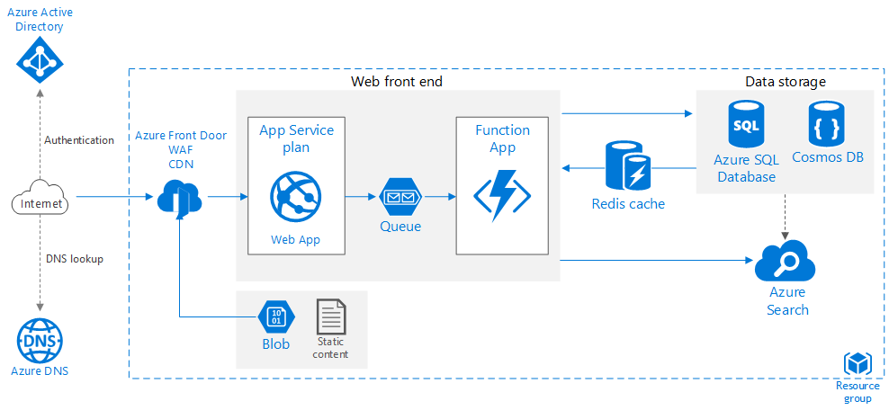

This example architecture shows proven practices for improving scalability and performance in an Azure App Service web application.

 A reference implementation for this architecture is available on [GitHub][github].

## Architecture

*Download a [Visio file][visio-download] of this architecture.*

### Workflow

This architecture builds on the one shown in [Basic web application][basic-web-app]. It includes the following components:

- **[Web app][app-service-web-app]**. A typical modern application might include both a website and one or more RESTful web APIs. A web API might be consumed by browser clients through AJAX, by native client applications, or by server-side applications. For considerations on designing web APIs, see [API design guidance][api-guidance].
- **Front Door**. [Front Door](/azure/frontdoor) is a layer 7 load balancer. In this architecture, it routes HTTP requests to the web front end. Front Door also provides a [web application firewall](/azure/frontdoor/waf-overview) (WAF) that protects the application from common exploits and vulnerabilities. Front Door is also used for a [Content Delivery Network](/azure/frontdoor/front-door-overview#global-delivery-scale-using-microsofts-network) (CDN) solution in this design.  
- **Function App**. Use [Function Apps][functions] to run background tasks. Functions are invoked by a trigger, such as a timer event or a message being placed on queue. For long-running stateful tasks, use [Durable Functions][durable-functions].
- **Queue**. In the architecture shown here, the application queues background tasks by putting a message onto an [Azure Service Bus queue][queue-storage]. The message triggers a function app. Alternatively, you can use Azure Storage queues. For a comparison, see [Storage queues and Service Bus queues - compared and contrasted][queues-compared].
- **Cache**. Store semi-static data in [Azure Cache for Redis][azure-redis].
- **Data storage**. Use [Azure SQL Database][sql-db] for relational data. For non-relational data, consider [Azure Cosmos DB][cosmosdb].
- **Azure Cognitive Search**. Use [Azure Cognitive Search][azure-search] to add search functionality such as search suggestions, fuzzy search, and language-specific search. Azure Search is typically used in conjunction with another data store, especially if the primary data store requires strict consistency. In this approach, store authoritative data in the other data store and the search index in Azure Search. Azure Search can also be used to consolidate a single search index from multiple data stores.
- **Azure DNS**. [Azure DNS][azure-dns] is a hosting service for DNS domains, providing name resolution using Microsoft Azure infrastructure. By hosting your domains in Azure, you can manage your DNS records using the same credentials, APIs, tools, and billing as your other Azure services.

## Recommendations

Your requirements might differ from the architecture described here. Use the recommendations in this section as a starting point.

### App Service apps

We recommend creating the web application and the web API as separate App Service apps. This design lets you run them in separate App Service plans so they can be scaled independently. If you don't need that level of scalability initially, you can deploy the apps into the same plan and move them into separate plans later if necessary.

> [!NOTE]
> For the Basic, Standard, Premium, and Isolated plans, you are billed for the VM instances in the plan, not per app. See [App Service Pricing][app-service-pricing]
>

### Cache

You can improve performance and scalability by using [Azure Cache for Redis][azure-redis] to cache some data. Consider using Azure Cache for Redis for:

- Semi-static transaction data.
- Session state.
- HTML output. This can be useful in applications that render complex HTML output.

For more detailed guidance on designing a caching strategy, see [Caching guidance][caching-guidance].

### CDN

Use [Front Door's native CDN functionality](/azure/frontdoor/front-door-overview#global-delivery-scale-using-microsofts-network) to cache static content. The main benefit of a CDN is to reduce latency for users, because content is cached at an edge server that is geographically close to the user. CDN can also reduce load on the application, because that traffic is not being handled by the application. Front Door additionally offers [dynamic site acceleration](/azure/cdn/cdn-dynamic-site-acceleration) allowing you to deliver a better overall user experience for your web app than would be available with only static content caching.

> [!NOTE]
> Front Door CDN is not designed to serve content that requires authentication.

### Storage

Modern applications often process large amounts of data. In order to scale for the cloud, it's important to choose the right storage type. Here are some baseline recommendations.

| What you want to store | Example | Recommended storage |
| --- | --- | --- |
| Files |Images, documents, PDFs |Azure Blob Storage |
| Key/Value pairs |User profile data looked up by user ID |Azure Table storage |
| Short messages intended to trigger further processing |Order requests |Azure Queue storage, Service Bus queue, or Service Bus topic |
| Non-relational data with a flexible schema requiring basic querying |Product catalog |Document database, such as Azure Cosmos DB, MongoDB, or Apache CouchDB |
| Relational data requiring richer query support, strict schema, and/or strong consistency |Product inventory |Azure SQL Database |

See [Choose the right data store][datastore].

## Considerations

These considerations implement the pillars of the Azure Well-Architected Framework, which is a set of guiding tenets that can be used to improve the quality of a workload. For more information, see [Microsoft Azure Well-Architected Framework](/azure/architecture/framework).

### Security

This section lists security considerations that are specific to the Azure services described in this article. It's not a complete list of security best practices for web applications. For additional security considerations, see [Secure an app in Azure App Service][app-service-security].

#### Restrict incoming traffic

Configure the application to accept traffic only from Front Door. This ensures that all traffic goes through the WAF before reaching the app. For more information, see [How do I lock down the access to my backend to only Azure Front Door?](/azure/frontdoor/front-door-faq#how-do-i-lock-down-the-access-to-my-backend-to-only-azure-front-door-)

#### Cross-Origin Resource Sharing (CORS)

If you create a website and web API as separate apps, the website cannot make client-side AJAX calls to the API unless you enable CORS.

> [!NOTE]
> Browser security prevents a web page from making AJAX requests to another domain. This restriction is called the same-origin policy, and prevents a malicious site from reading sensitive data from another site. CORS is a W3C standard that allows a server to relax the same-origin policy and allow some cross-origin requests while rejecting others.
>

App Services has built-in support for CORS, without needing to write any application code. See [Consume an API app from JavaScript using CORS][cors]. Add the website to the list of allowed origins for the API.

#### SQL Database encryption

Use [Transparent Data Encryption][sql-encryption] if you need to encrypt data at rest in the database. This feature performs real-time encryption and decryption of an entire database (including backups and transaction log files) and requires no changes to the application. Encryption does add some latency, so it's a good practice to separate the data that must be secure into its own database and enable encryption only for that database.

### Cost optimization

Use caching to reduce the load on servers that serve content that doesn't change frequently. Every render cycle of a page can impact cost because it consumes compute, memory, and bandwidth. Those costs can be reduced significantly by using caching, especially for static content services, such as JavaScript single-page apps and media streaming content.

If your app has static content, use CDN to decrease the load on the front end servers. For data that doesn't change frequently, use Azure Cache for Redis.

Stateless apps that are configured for autoscaling are more cost effective than stateful apps. For an ASP.NET application that uses session state, store it in-memory with Azure Cache for Redis. For more information, see [ASP.NET Session State Provider for Azure Cache for Redis](/azure/azure-cache-for-redis/cache-aspnet-session-state-provider). Another option is to use Azure Cosmos DB as a backend state store through a session state provider. See [Use Azure Cosmos DB as an ASP.NET session state and caching provider](/azure/cosmos-db/sql/session-state-and-caching-provider).

For more information, see the cost section in the [Microsoft Azure Well-Architected Framework](/azure/architecture/framework/cost/overview).

Consider placing a function app into a dedicated App Service plan so that background tasks don't run on the same instances that handle HTTP requests. If background tasks run intermittently, consider using a [consumption plan](/azure/azure-functions/functions-scale#consumption-plan), which is billed based on the number of executions and resources used, rather than hourly.

Use the [pricing calculator](https://azure.microsoft.com/pricing/calculator) to estimate costs.

### Operational excellence

Operational excellence covers the operations processes that deploy an application and keep it running in production. For more information, see [Overview of the operational excellence pillar](/azure/architecture/framework/devops/overview). A key tenet of operational excellence is automating operational activities including infrastructure modifications, following DevOps practices.

Guidance provided in the basic web application [DevOps considerations section][basic-web-app-devops] applies here as it is the basis for this architecture.

### Performance efficiency

A major benefit of Azure App Service is the ability to scale your application based on load. Here are some considerations to keep in mind when planning to scale your application.

#### App Service app

If your solution includes several App Service apps, consider deploying them to separate App Service plans. This approach enables you to scale them independently because they run on separate instances.

#### SQL Database

Increase scalability of a SQL database by *sharding* the database. Sharding refers to partitioning the database horizontally. Sharding allows you to scale out the database horizontally using [Elastic Database tools][sql-elastic]. Potential benefits of sharding include:

- Better transaction throughput.
- Queries can run faster over a subset of the data.

#### Azure Front Door

Front Door can perform SSL offload and also reduces the total number of TCP connections with the backend web app. This improves scalability because the web app manages a smaller volume of SSL handshakes and TCP connections. These performance gains apply even if you forward the requests to the web app as HTTPS, due to the high level of connection reuse.

#### Azure Search

Azure Search removes the overhead of performing complex data searches from the primary data store, and it can scale to handle load. See [Scale resource levels for query and indexing workloads in Azure Search][azure-search-scaling].

## Contributors

*This article is maintained by Microsoft. It was originally written by the following contributors.* 

Principal author:

 - [Chad Kittel](https://www.linkedin.com/in/chadkittel/) | Principal SDE
 
*To see non-public LinkedIn profiles, sign in to LinkedIn.*

## Next steps

- [Secure an app in Azure App Service][app-service-security]
- [Transparent Data Encryption][sql-encryption]
- [ASP.NET Session State Provider for Azure Cache for Redis](/azure/azure-cache-for-redis/cache-aspnet-session-state-provider)

## Related resources

- [Basic web application][basic-web-app]
- [Run a web application in multiple Azure regions for high availability][web-app-multi-region]
- [Overview of load-balancing options in Azure](../../guide/technology-choices/load-balancing-overview.yml)

<!-- links -->

[api-guidance]: ../../best-practices/api-design.md
[app-service-security]: /azure/app-service-web/web-sites-security
[app-service-web-app]: /azure/app-service-web/app-service-web-overview
[app-service-pricing]: https://azure.microsoft.com/pricing/details/app-service
[azure-dns]: /azure/dns/dns-overview
[azure-redis]: https://azure.microsoft.com/services/cache
[azure-search]: /azure/search
[azure-search-scaling]: /azure/search/search-capacity-planning
[basic-web-app]: ./basic-web-app.yml
[basic-web-app-devops]: ./basic-web-app.yml#devops
[caching-guidance]: ../../best-practices/caching.yml
[cors]: /azure/app-service-api/app-service-api-cors-consume-javascript
[cosmosdb]: /azure/cosmos-db
[datastore]: ../..//guide/technology-choices/data-store-overview.md
[durable-functions]: /azure/azure-functions/durable-functions-overview
[functions]: /azure/azure-functions/functions-overview
[github]: https://github.com/mspnp/reference-architectures/tree/master/web-app
[queue-storage]: /azure/service-bus-messaging/service-bus-queues-topics-subscriptions#queues
[queues-compared]: /azure/service-bus-messaging/service-bus-azure-and-service-bus-queues-compared-contrasted
[sql-db]: /azure/sql-database
[sql-elastic]: /azure/sql-database/sql-database-elastic-scale-introduction
[sql-encryption]: /azure/azure-sql/database/transparent-data-encryption-tde-overview?view=sql-server-ver15
[visio-download]: https://arch-center.azureedge.net/app-service-reference-architectures-scalable-webapp.vsdx
[web-app-multi-region]: ./multi-region.yml
