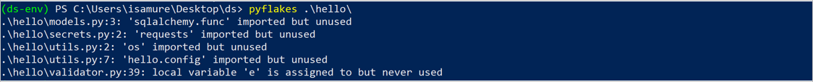
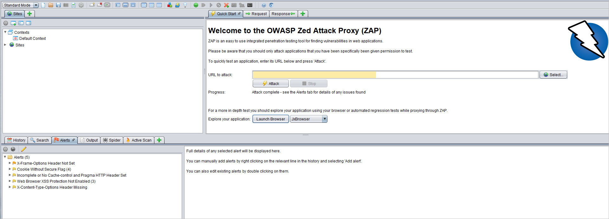

# Basic Azure secure sample application

The sample application to be deployed is a simple Python application that displays a web page containing links to security resources for developing on Azure. The sample application implements security best practices that are worthwhile to look at to improve your application and organization’s security posture as you develop on Azure.

The sample application is targeted towards beginners developing on Azure who want to implement security in the resources they use on Azure.

In this application, you learn how to:

1. Create an Azure Key Vault instance and store and retrieve secrets from it.
2. Deploy Azure Database for PostgreSQL using secure passwords and whitelisting access to it.
3. Run an Alpine Linux container on Azure Web Apps for Linux and enabling Managed Service Identities.
4. Create and configure an Application Gateway instance with Firewall enabled using OWASP top 10 rulesets.
5. Enable encryption of data at transit and rest using Azure Services.

After you develop and deploy this application, you will have set up the sample web application below along with the configuration and security measures to be shown.


## Architecture
The application is a typical n-tier application with three tiers. The frontend, backend, and database layer with monitoring and secret management components integrated as shown below.


The architecture consists of the following components:

- [Azure Application Gateway](https://docs.microsoft.com/azure/application-gateway/) – provides the load balancing and firewall for our application architecture.
- [Azure Web Apps for Linux](https://docs.microsoft.com/azure/app-service/containers/app-service-linux-intro) – offers the container runtime to run the Python application on a Linux environment.
- [Azure Key Vault](https://docs.microsoft.com/azure/key-vault/) – stores and encrypts our applications secrets and manages creating access policies around these.
- [Azure Database for PostgreSQL Service](https://azure.microsoft.com/services/postgresql/) – stores our applications data securely.
- [Azure Security Center](https://docs.microsoft.com/azure/security-center/) and [Azure Application Insights](https://docs.microsoft.com/azure/azure-monitor/app/app-insights-overview) – for monitoring and alerts on the operation of our application.

## Threat model
Threat modeling is the process of identifying potential security threats to your business and application, and then ensuring that a proper mitigation plan is in place.

For our secure sample application the threat modelling was done using the [Microsoft Threat Modeling Tool](https://docs.microsoft.com/azure/security/azure-security-threat-modeling-tool). By diagramming out our components and the data flows that the application is using we can identify issues and threats early in the development process saving time and money later on.

The threat model for the sample app is shown below:


Some sample threats and potential vulnerabilities that the threat modeling tool generates are shown below. The threat model gives an overview of the attack surface exposed and prompts us to think about how to mitigate the issues.


For example, SQL injection in the above threat model output is mitigated by sanitizing user inputs and by using stored functions in Azure Database for PostgreSQL. The mitigation prevents arbitrary execution of queries during data reads and writes.

The overall security of the system is improved by mitigating each of the threats in the threat model output.

## Deployment
The following options let you run Linux on App Service:

- Use the list of pre-built Microsoft containers on Azure that have been built with supporting technologies (Python, Ruby, PHP, Java, Node.js, .NET Core).
- Use a custom-built container and select our own container registries as the source of the image and build upon the limitless number of technologies available that support HTTP.

In this example, we build our container, push it to a container registry, and deploy the application from the registry onto the app service environment. This is described further in later sections.

By building our custom container we have adapted a new deployment model as shown in the following diagram.


There are many ways to deploy applications on Azure including but not limited to:

- JSON templates
- PowerShell
- Azure CLI
- Azure portal

For our application we utilized:

- [Docker](https://docs.docker.com/) to create and build our container images.
- [Azure CLI](https://docs.microsoft.com/cli/azure/install-azure-cli?view=azure-cli-latest) for deployment.
- [Docker Hub](https://hub.docker.com/) as the container registry.

## Security considerations

### Network
For the network, the sample application implements end to end SSL encryption for data in transit flowing into and out of the network, the gateway configured with a self-signed certificate. The application firewall also inspects incoming traffic and alerts administrators when malicious traffic is detected in the network traffic.

Using the App Gateway mitigates the possibility for DDOS and SQL injection threats brought up  by the threat model.

### Identity
To log into the portal, the sample app implements Multi Factor Authentication (MFA) for Active Directory users assigned access to the resources. The sample app also uses Managed Service Identities (MSI) to gain permissions to read and retrieve secrets from Azure Key Vault, the application does not need to hardcode credentials and tokens to read the secrets. Active Directory automatically creates the Service Principals required to read and modify the secrets.

By using MSI and MFA it becomes harder for adversaries to gain privilege and escalate their own privilege in the system as was seen in the threat model.

### Storage
Data in the PostgreSQL database is encrypted at rest automatically by Azure Database for PostgreSQL. The database whitelists the App Service IP addresses such that only the app service Web App deployed can access the database resources with the right authentication credentials.

### Logging and auditing
The application implements logging by using application insights to track metrics, logs, and tracking exceptions that occur. This is to give sufficient application metadata to inform developers and operations on the status of the application and sufficient data to backtrack in case of security incidents.

## Cost considerations
If you don't already have an Azure account, you can create a free account. Go [here](https://azure.microsoft.com/free/) to get started, see what you can do with an Azure free account, and which products are free for 12 months.

Deploying the resources in the sample application with the security features requires paying for some premium features. As the application scales and the free tiers and trials offered by Azure need upgrading to meet the application requirements, your costs may go up. Use the Azure [pricing calculator](https://azure.microsoft.com/pricing/calculator/) to estimate your costs.

## Deploy the solution
### Prerequisites
To get the application up and running, you need to install the following tools:

- Install a code editor to modify and view the application code. For the sample app, [Visual Studio Code](https://code.visualstudio.com/) was used.
- Install the [Azure CLI](https://docs.microsoft.com/cli/azure/install-azure-cli?view=azure-cli-latest&viewFallbackFrom=azure-cli-latest,) on your development machine.
- Install [Git](https://git-scm.com/) on your system. Git is used to clone the source code locally.
- Install [jq](https://stedolan.github.io/jq/), a UNIX tool for querying JSON in a user friendly way.

You need an Azure subscription to deploy the sample application's resources. If you do not have an Azure subscription, you can [create a free account](https://azure.microsoft.com/en-us/free/) to test the sample application.

After installing the above tools, you’re ready to move on and deploy the application on Azure.

### Environment setup
Run the deployment scripts to setup the environment and subscription:

1. To clone the source code repository, use the following git command:

``` git
git clone <GIT_CLONE_URL>
```
2. To move into the directory, use the following command:

```
cd hello-project/script
```

3. In the scripts folder there exist files specific to the environment the resources are deployed in. Earlier, under prerequisites, you installed the Azure CLI. Log into the Azure account in the command line by running the CLI command:

``` azurecli
az login
```

The browser opens. You can log in with the credentials. After logging in you can start to deploy the resources from the command line.

The deployment scripts **deploy-powershell.ps1** and **deploy-bash.sh** show the end to end experience of deploying the architecture. You can modify the variable names of the resources and resource groups to fit your naming conventions.

The following examples showcase snippets of the key components. The examples can be deployed individually or with the rest of the components by running the deploy files.

### Implementation guidance
The deployment is one script that can be broken down into four different phases. Each phase deploys and configures an Azure resource in the [architecture diagram](#architecture).

The four phases are:

- Deploy Azure Key Vault
- Deploy Azure Database for PostgreSQL
- Deploy Azure Web App on Linux Container
- Deploy Application Gateway with Web Application Firewall

Each phase builds upon the previous one by using configuration from the preceding deployed resources to link the resources together in one deployment script.

To follow along with the implementation make sure you’ve installed the tools from the [prerequisites](#prerequisites) section.

#### Deploy Azure Key vault
In this section you create and deploy an Azure Key Vault instance used to store secrets and certificates.

At the end of the deployment you have an Azure Key Vault instance deployed on Azure.


The deployment steps using Azure CLI are:

1. Declare the variables for Azure Key Vault.
2. Register the Azure Key Vault provider in Azure CLI.
3. Create the resource group for the instance.
4. Create the Azure Key Vault instance in the resource group created in step 3.

``` azurecli
az provider register -n Microsoft.KeyVault

az group create --name $kvResourceGroup `
    --location $location `
    --verbose

# Create the Key Vault instance.
az keyvault create --name $kvName `
    --resource-group $kvResourceGroup `
    --location $location `
    --verbose

# Generating credentials using the username and random variables
$pgUsername = ($env:Username + (New-Guid).Guid.Split('-')[4])
$pgPassword = (New-Guid).Guid

az keyvault secret set --vault-name $kvName `
    --name PGUSERNAME `
    --value $pgUsername `
    --verbose

az keyvault secret set --vault-name $kvName `
    --name PGPASSWORD `
    --value $pgPassword `
    --verbose

```
It’s a best practice to use Managed Service Identities in applications that use Key Vault to access resources. Your security posture is increased when access keys to Key Vault are not stored in code or configuration.

#### Deploy Azure Database for PostgreSQL
Azure Database for PostgreSQL works in the same way as the default PostgreSQL deployment model. You first create the database server then the database on which to store the schema and data.

At the end of the deployment you have a PostgreSQL server and database running on Azure.


The deployment steps using Azure CLI are:

1. Open a terminal with Azure CLI and your Azure subscription setup.
2. Generate secure username and password combination used to access the database. (These should be stored in Azure Key Vault for applications using them.)
3. Create the PostgreSQL Server instance.
4. Create a database on the server instance created in step 2.
5. Run PostgreSQL scripts on the Azure Database for PostgreSQL instance.

``` azurecli
$dbResourceGroup = "postgresRg"
$dbServer = "hellopgserver"
$dbName = "hellodb"
$dbRootCertPath = "hello/postgres/root.crt"
$dbSSLMode = "verify-ca"
$location = "northeurope"
$dbPort = 5432

# Generating credentials using the username and random variables
$pgUsername = ($env:Username + (New-Guid).Guid.Split('-')[4])
$pgPassword = (New-Guid).Guid

az group create --location $location `
    --name $dbResourceGroup `
    --verbose

az  postgres server create -l $location `
    --resource-group $dbResourceGroup `
    --name $dbServer `
    --admin-user $pgUsername `
    --admin-password $pgPassword `
    --sku-name B_Gen4_1 `
    --verbose

az postgres db create --resource-group $dbResourceGroup `
    --server-name $dbServer `
    --name $dbName `
    --verbose
```

#### Deploy Azure Web Apps on Linux
Linux services can be easily built on top of Azure App Service as Azure provides a set of prebuilt containers and images for widely used languages such as Python, Ruby, C# and Java. Custom containers, which can allow virtually all programming languages to be run on the Azure App Service platform, are also supported.

For this example, the application being built is a simple Python application that runs on the latest Ubuntu Linux distribution and connects to Azure Key Vault and Postgres Instances created in the previous sections for credential management and data storage respectively.

There is a docker file provided in the root folder of the application with the contents:

``` docker
FROM ubuntu:latest

RUN apt-get update -y && \
    apt-get install -y python3-pip && \
    apt-get install -y python3-dev

ADD requirements.txt /hello/

WORKDIR /hello

COPY . /hello
RUN pip3 install --no-cache-dir -r requirements.txt

ENV FLASK_APP=app.py

COPY init.sh /usr/local/bin/

RUN  chmod u+x /usr/local/bin/init.sh

EXPOSE 8000

ENTRYPOINT ["init.sh"]
```

To build and push the docker image to a container registry:

1. Save the file above as Dockerfile.
2. Move into the directory the Dockerfile located in your terminal.
3. Log into your container registry for Docker Hub.

```
docker login
```

For Azure Container Registry:

```
az acr login --name <ACR_NAME>
```

4. Build the container image locally by running the command below where publisher name is your registry username and the image name is any image.

```
docker build . -t <PUBLISHER_NAME/IMAGE_NAME>
```

5. Push the image to the container registry by running:

```
docker push  <PUBLISHER_NAME/IMAGE_NAME>
```

After the container is on a registry, the deployment script below:

1. Declares the variables and names for the app service.
2. Creates the resource group for the App Service Plan.
3. Provisions an Azure Web App for Linux containers instance.
4. Enables logging for the web app container.
5. Sets some app configurations into the containers app settings.

```
$appResourceGroup = "appRg"
$appServicePlanName = "helloAppServicePlan"
$appName = "helloLinuxAppWeb"
$appPort = 8000
$containerName = "<CONTAINER_NAME>"
$location = "eastus"
$timezone = "Pacific Standard Time"


az group create --name $appResourceGroup `
    --location $location `
    --verbose

az appservice plan create --name $appServicePlanName `
    --resource-group $appResourceGroup `
    --location $location `
    --number-of-workers 1 `
    --sku B1 `
    --is-linux `
    --verbose

az webapp create --name $appName `
    --resource-group $appResourceGroup `
    --plan $appServicePlanName `
    --deployment-container-image-name $containerName `
    --verbose

az webapp identity assign --name $appName `
    --resource-group $appResourceGroup `
    --verbose

```
The above script also creates an assigned identity for the app service that can be used with Managed Service Identities to access other Azure services such as Azure Key Vault without hard coding secrets in code or configuration.

#### Deploy Azure Application Gateway with Web Application Firewall enabled
With web applications, it is recommended to not expose services directly to the outside world on the internet. Having some load balancing and firewall rules set up for us to have more security and control over the incoming traffic and how to manage it.

To deploy an Azure Application Gateway:

1. Create the resource group to house the Application Gateway.
2. Provision a virtual network (VNet) to attach to the gateway.
3.	Create a subnet for the gateway in the VNet.
4.	Provision a public IP address.
5.	Provision the Application Gateway.
6.	Enable Web Application Firewall on the gateway.

``` azurecli
az group create --name $gwResourceGroup `
    --location $location `
    --verbose

az network vnet create --name $vnetName `
    --resource-group $gwResourceGroup `
    --location $location `
    --address-prefix 10.0.0.0/16 `
    --subnet-name $vnetSubnet `
    --subnet-prefix 10.0.1.0/24 `
    --verbose

az network vnet subnet create --name $gwSubnet `
    --resource-group $gwResourceGroup `
    --vnet-name $vnetName `
	--address-prefix 10.0.2.0/24 `
    --verbose

az network public-ip create --resource-group $gwResourceGroup `
	--name $publicIpName `
	--verbose

az network application-gateway create `
	--name $gwName `
	--resource-group $gwResourceGroup `
	--location $location `
	--vnet-name $vnetName `
	--subnet $gwSubnet `
	--public-ip-address $publicIpName `
	--http-settings-cookie-based-affinity Disabled `
	--frontend-port 443 `
	--http-settings-protocol Https `
	--http-settings-port 443 `
    --capacity 2 `
	--sku WAF_Medium `
	--cert-file $certPath `
	--cert-password $certPassword `
	--verbose

az network application-gateway waf-config set `
	--enabled true `
	--gateway-name $gwName `
	--resource-group $gwResourceGroup `
	--firewall-mode Detection `
	--rule-set-version 3.0 `
	--verbose

$gwHTTPSettings = $(az network application-gateway http-settings list --resource-group $gwResourceGroup `
	--gateway-name $gwName)

$gwHTTPSettings = $gwHTTPSettings | ConvertFrom-Json
$gwHTTPSettingsName = $gwHTTPSettings.name

$gwAddressPool = $(az network application-gateway address-pool list --resource-group $gwResourceGroup `
	--gateway-name $gwName)

$gwAddressPool = $gwAddressPool | ConvertFrom-Json
$gwAddressPoolName = $gwAddressPool.name

az network application-gateway address-pool update --name $gwAddressPoolName `
	--resource-group $gwResourceGroup `
	--gateway-name $gwName `
	--servers $appHostName `
    --verbose

az network application-gateway probe create --gateway-name $gwName `
    --name $gwProbe `
    --resource-group $gwResourceGroup `
    --protocol Https `
    --path $gwProbePath `
    --host-name-from-http-settings true `
    --verbose

az network application-gateway http-settings update --gateway-name $gwName `
    --resource-group $gwResourceGroup `
    --name $gwHTTPSettingsName `
    --connection-draining-timeout 0 `
    --enable-probe true `
    --host-name-from-backend-pool true `
    --probe $gwProbe `
    --protocol Https `
    --port 443 `
    --verbose
```

At the end of the deployment you have an Application Gateway with Web Application Firewall enabled.


This deploys a gateway instance that exposes port 443 for HTTPS. This ensures that our application is only accessible on port 443 through HTTPS.

Blocking unused ports and limiting the attack surface exposure is a security best practice.

#### Deploy Application Insights
With the application now deployed and working, you need to handle errors occurring within the application and logging and trace data collection. Logging and trace data collection provides a view into audit events happening in the application.

Application insights is a service that collects logs which can be user generated or system generated.

To create an application insight instance:

1. Search for Application Insights on the Azure portal menu.
2. Select Application Insights and fill in the details as shown below to create an instance:


At the end of the deployment you have an Application Insights instance.


After creating the App Insights instance, you need to make the application aware of the instrumentation key that allows it to send logs to the cloud. This is done by retrieving the Application Insights key and using it within the application libraries Azure provides for Application Insights. The best practice is to store keys and secrets in Azure Key Vault to securely store them.

#### Implementing Multi-Factor Authentication for Active Directory
Administrators need to ensure that the subscription accounts in the portal are successfully protected. The subscription is vulnerable to attacks as it manages the resources you created. To protect the subscription, enable Multi-Factor Authentication (MFA) on the Azure Active Directory tab of the subscription.

Azure Active Directory (Azure AD) operates on the concept of policies that are applied to users or groups of users that fit a certain criterion. Azure creates a default policy that specifies that administrators need two factor authentication to log in to the portal. After enabling this policy, you might be asked to log out and log in to the Azure portal.

To enable MFA for admin logins:

1. Go to the Azure Active Directory tab in the Azure portal.
2. Under the security category, select conditional access. You’ll be presented with the following screen:


If you cannot create a new policy:

1. Switch to the MFA tab.
2. Select the trial and subscribe to the free Azure AD Premium trial.


Return to the conditional access screen:

1. Select the new policy tab.
2. Enter the policy name.
3. Select the users or groups that you'd like to enable MFA.
4. In the access controls, select the Grant tab and select Require MFA (and other settings if you're so inclined) as shown below.


You can enable the policy in the checkbox above or back in the Conditional Access tab. With the policy enabled, users require MFA to sign in to the portal.

There is a baseline policy that requires MFA for all Azure administrators. You can enable it immediately in on the portal. This may invalidate the current session and require you to log in again.

If the baseline policy is not enabled:
1.	Select **Require MFA for admins** and s
2.	Select **Use the policy immediately** as shown below.


## Evaluation and verification
After developing and deploying the tested architecture, you need to ensure that the code running and the services deployed meet security standards. Following are some of the steps taken to verify the software.

- Static code analysis
- Vulnerability scanning
- Finding and fixing vulnerabilities in application dependencies

These serve as the basic building blocks for best practices in secure development.

### Static code analysis
For the sample application, verification with static analysis tools involves finding vulnerabilities in the application code using techniques such as taint-checking and data-flow analysis. Running Python static analysis tools gives you more confidence that the application is secure.

**Linting**
Pyflakes, a Python linting library, helps us remove dead code and unused functions from the application as shown below.



Linting gives hints and possible changes that would make the code cleaner and less error prone during runtime.

**Pylint**
Using PyLint offered the most value for the project. PyLint performed code standard checks, error checking, and refactoring tips to ensure that the code running on the server is safe. Fixing the code using Pylint, we are able to eliminate bugs coming from the written code and improve the Pylint rating as shown below.


After fixing some of the code errors that the linting tools found, you have more confidence that the code being run is not prone to errors. Fixing the code errors significantly reduces the amount of security risks that can occur when the code is deployed to production environments.


### Vulnerability scanning
OWASP's ZAP tool is an open source web application vulnerability scanner that can be used to check the sample application for vulnerabilities. Running the tool on the sample application reveals some possible problem errors and attack vectors as shown below.



### Find and fix vulnerabilities in application dependencies
To find and fix application dependencies, you can use OWASP's Dependency checker.

A similar application that checks dependencies is PySafety which can be found on [GitHub](https://github.com/pyupio/safety). PySafety scans for vulnerabilities found in well-known vulnerability databases.


