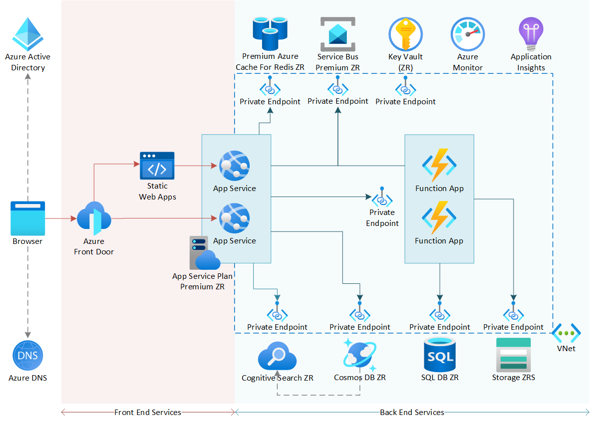

This reference architecture shows how to run a web-app workload on Azure App Services using a zone-redundant configuration. [Zone-redundant services][az-ha-services] provide high availability by replicating your services and data across availability zones to protect against single points of failure.

## Architecture

*Download a [Visio file](https://arch-center.azureedge.net/zone-redundant-web-app-diagram.vsdx) that contains this architecture diagram.*

### Workflow

A single-page application that runs in a browser requests static assets such as scripts, stylesheets, and media assets. Once loaded, the single-page application makes API calls that provide functionality.

### Components

* The application's users are authenticated by [Azure Active Directory (Azure AD)][aad] or [Azure AD B2C][aad-b2c]. The browser performs DNS lookups to resolve addresses to Azure Front Door.
* [Azure Front Door][afd] is a public front-end for all internet requests, acting as a global HTTP reverse proxy and cache in front of several Azure services. Front Door also provides automatic protection from layer 3 and 4 DDoS attacks, and a range of other features including WAF (web application firewall), caching, and custom rules to enhance the security and performance of your application.
* [Azure Static Web Apps][swa] hosts all of the application assets, including scripts, stylesheets, and media.
* [Azure App Service][app-services] hosts the front-end API applications that are called by the app. Deployment slots are used to provide zero-downtime releases.
* App Services and Functions Apps use [Virtual Network (VNet) Integration][vnet-integration] to connect to backend Azure services over a private VNet.
* [Azure Functions][functions] provides a data access layer for Azure SQL Database. APIs hosted in App Services trigger these functions synchronously via HTTPS requests and asynchronously via Service Bus messages.
* [Azure Cache for Redis][redis] provides a high-performance distributed cache for output, session, and general-purpose caching.
* [Azure Service Bus][service-bus] acts as an asynchronous high-speed bus between front-end and back-end application services.
* [Azure Cosmos DB][cosmos-db] provides NoSQL document databases for front-end application services.
* [Azure SQL DB][sql-db] provides a transactional and relational database for back-end application services.
* [Azure Cognitive Search][cog-search] indexes Cosmos DB documents, allowing them to be searched via an API.
* [Azure Blob Storage][storage] stores metadata and trigger state for Functions Apps.
* [Private Endpoints][peps] allow connections to Azure services from private VNets, and allow the public endpoints on these services to be disabled.
* [Azure private DNS][private-dns] automatically configures and updates the DNS records required by private endpoint services.
* [Azure Key Vault][akv] securely stores secrets and certificates to be accessed by Azure services.
* [Azure Monitor][azmon] and [Application Insights][insights] collect service logs and application performance metrics for observability.

### Networking

Private endpoints are used throughout this architecture to improve security. While private endpoints don't directly improve, or reduce, the availability of this solution, they allow important security principles to be applied. For more information about security design principles, see [Azure well architected framework - Security pillar][waf-security].

Network segmentation boundaries are established along public and private lines. Azure Front Door, Azure Static Web Apps, and Azure App Service are designed to operate on the public internet. These services have their public endpoints enabled. However, App Service has access restrictions in place to ensure that only traffic allowed by Front Door WAF (Web Application Firewall) is allowed to ingress into the App Service.

Azure services that don't require access from the public internet have private endpoints enabled and public endpoints disabled. The Azure data services Cosmos DB, SQL DB, Azure Cache for Redis, Cognitive Search, and Storage all have public endpoints disabled. Each private endpoint is deployed into its own subnet. Azure service firewalls are used to only allow traffic from other authorized Azure services. Private DNS zones are linked to each private endpoint, via private DNS zone groups and virtual network links, to ensure that private link DNS records are automatically created and updated.

For network and subnet topology details, see the [Azure sample template][azure-sample] for this architecture.

### Alternatives

* Either Azure AD or Azure AD B2C can be used as an identity provider in this scenario. Azure AD is designed for internal applications and business-to-business (B2B) scenarios, while Azure AD B2C is designed for business-to-consumer (B2C) scenarios.
* You can choose to use Azure-managed DNS, which is recommended, or your own DNS provider.
* [Azure Application Gateway][appgw] can be used instead of Azure Front Door when most users are located close to the Azure region that hosts your workload, and when content caching isn't required. [Azure DDoS Network Protection][ddos-network-protection] is recommended for protecting internet-facing Application Gateway services.
* Azure Static Web Apps provides direct integration with Azure App Service for secure and seamless routing. When Static Web Apps is linked to App Service, only requests made from the static web app resolve, and public access to the App Service is rejected. For more information about Static Web Apps integration with Azure App Service, see [Overview of API support in Azure Static Web Apps][swa-apis].
* [Static website hosting in Azure Storage][storage-spa] may be considered in place of Azure Static Web Apps, if already using Azure CDN for example. However, static website hosting in Azure Storage does have limitations. For more information, see [Static website hosting in Azure Storage][storage-spa]. Azure Static Web Apps was chosen for its global high availability, and its simple deployment and configuration.
* A premium [Azure API Manager][apim] instance deployed with zone-redundancy enabled is a good alternative for hosting frontend APIs, backend APIs, or both. For more information about zone-redundancy in API Manager, see [Availability zone support][apim-zr].

## Scenario details

Traditionally, it's been hard to keep hosting platforms highly available at scale. High availability has historically required complex and expensive multi-region deployments, with tradeoffs between data consistency and high performance.

[Availability zones][azs] resolve many of these issues. Availability zones are physically separate locations within each Azure region that are tolerant to local failures. Availability zones spread a solution across multiple independent zones within a region, allowing an application to continue functioning when one zone fails.

Zone-redundant Azure services automatically manage and mitigate failures to maintain their [service level agreements (SLAs)](https://azure.microsoft.com/support/legal/sla). Zone-redundancy offers effective recovery times of zero for zonal failure. If a single zone within a region becomes unavailable, you shouldn't expect to lose any data, and your workload should continue to run within the remaining available zones. Zone redundancy is configured at deployment time and is automatically managed by services throughout their lifetime, so there is no need to manage zone pinning or zonal deployments.

This architecture shows how to compose zone-redundant services into a solution that provides high availability and is resilient to zonal failures.

All of the Azure services in this architecture are either globally available or zone-redundant services. Azure Front Door, Azure AD, Azure DNS, and Static Web Apps are globally available non-regional services that are resilient to zone and region-wide outages. All other services are zone-redundant.

### Potential use cases

* Public website hosting
* Intranet portal
* Mobile app hosting
* E-commerce
* Media streaming
* Machine learning workloads

> [!IMPORTANT]
> For mission-critical workloads it is recommended to combine zone-redundancy and regional-redundancy to achieve maximum reliability and availability, with zone-redundant services deployed across multiple Azure regions.
> For more details please refer to the [global distribution](/azure/architecture/framework/mission-critical/mission-critical-application-design#video---global-distribution ) section of the mission-critical design methodology, and the [mission-critical baseline architecture](/azure/architecture/reference-architectures/containers/aks-mission-critical/mission-critical-intro).

## Recommendations

The following recommendations apply for most scenarios. Follow these recommendations unless you have a specific requirement that overrides them.

### Front Door

Azure Front Door is a global service, always available across all Azure geographies and resilient to zone-wide outages and region-wide outages.

* Use [Azure managed certificates][afd-certs] on all front ends to prevent certificate mis-configuration and expiration issues.
* Enable [caching][afd-cache] on routes where appropriate to improve availability. Front Door's cache distributes your content to the Azure PoP (point of presence) edge nodes. In addition to improving your performance, caching reduces the load on your origin servers.
* Deploy Azure Front Door Premium and configure a [WAF policy][afd-waf] with a Microsoft-managed ruleset. Apply the policy to all custom domains. Use Prevention mode to mitigate web attacks that might cause an origin service to become unavailable.
* Deployments with higher security requirements could also use [Private Link in Azure Front Door Premium](/azure/frontdoor/private-link) to secure connectivity to Azure App Service.

For more recommendations and information, see [Best practices for Front Door][afd-best-practices].

### Azure Static Web Apps

Azure Static Web Apps is a global service resilient to zone and region failures. Deploy a Standard plan for production apps. API support and Enterprise-grade edge aren't required for this architecture as Premium Functions and Azure Front Door are used instead.

### App Services

[App Service Premium v2, Premium v3][app-services-zr], and [Isolated v3][ise-zr] App Service Plans offer zone redundancy. You must deploy a minimum of three instances of the plan. In this configuration, App Service Plan instances are distributed across multiple availability zones to protect from zone failure. App Service automatically balances your load across the instances and availability zones.

* Deploy a minimum of three instances for zone-redundancy.
* Implement health check endpoints in your apps and configure the App Service health check feature to reroute requests away from unhealthy instances. For more information about App Service Health check, see [Monitor App Service instances using health check][appservicehealthchecks]. For more information about implementing health check endpoints in ASP.NET applications, see [Health checks in ASP.NET Core][healthchecksaspnet].
* Create auto-scale rules to automatically add more instances to take the load if a zone or instance fails. For more information about autoscale best practices in Azure, see [Autoscaling][autoscale].
* Add App Service access restrictions so that only Front Door traffic is allowed. Access restrictions ensure that requests aren't able to bypass the Azure Front Door WAF. For more information about restricting access to a specific Azure Front Door instance, see [App Service access restrictions][app-service-controls].
* Enable [Virtual Network (VNet) Integration][appservice-vnet] for private networking with backend Azure services.

### Azure Functions

[Azure Functions Elastic Premium][functions-zr] offers zone redundancy when you deploy a minimum of three instances of your plan and opt into zone redundancy.

* Deploy a minimum of three instances for zone-redundancy.
* Enable a private endpoint and deny access to public endpoint traffic.
* Enable VNet Integration for private networking with backend services.

For more information about Private endpoints and VNet integration in Azure Functions, see [Integrate Azure Functions with an Azure virtual network][func-vnet].

### SQL Database

[Zone-redundancy in Azure SQL DB][sql-gp-zr] is supported in General Purpose, Premium, and Business Critical tiers.

* Deploy Azure SQL DB General Purpose, Premium, or Business Critical with zone-redundancy enabled.
* [Configure SQL DB backups][sql-backups-zr] to use ZRS (zone-redundant storage) or GZRS (geo-zone-redundant storage).
* [Create a private link for Azure SQL DB][sql-pep] and disable the public endpoint.

### Cosmos DB

Enable [zone-redundancy in Azure Cosmos DB][cosmos-ha] when selecting a region to associate with your Azure Cosmos account.

* Enable zone-redundancy when adding the local read/write region to the Azure Cosmos account.
* [Enable continuous backups][cosmos-backup].
* [Configure private link for the Cosmos DB account][cosmos-pep]. Enabling the private endpoint disables the public endpoint.

### Blob storage

Azure [Zone-Redundant Storage][zrs] (ZRS) replicates your data synchronously across three Azure availability zones in the region.

* Create Standard ZRS or Standard GZRS storage accounts to ensure that data is replicated across availability zones.
* Create separate storage accounts for web assets, Azure Functions meta-data, and other data, so that the accounts can be managed and configured separately.
* [Use private endpoints for Azure Storage][storage-pep].
* Configure the Storage firewall to deny public internet traffic.

### Service Bus

[Service Bus Premium][servicebus-az] supports availability zones, providing fault-isolated locations within the same Azure region.

* Enable zone-redundancy on a new Azure Service Bus Premium namespace.
* [Configure private link][sb-pep] for the Azure Service Bus namespace.
* Specify at least one IP rule or virtual network rule for the namespace to allow traffic only from the specified IP addresses or subnet of a virtual network. Adding a rule disables the public endpoint.

### Cache for Redis

Cache for Redis supports [zone-redundancy][redis-zr] in certain tiers. To enable zone redundancy for Azure Cache for Redis, follow the instructions in [Enable zone redundancy for Azure Cache for Redis][enable-redis-zr].

In this architecture, Azure Cache for Redis is deployed with a private endpoint and the public endpoint is disabled.

* Deploy a new Azure Cache for Redis with a private endpoint, or add a private endpoint to an existing cache.
* Set the `publicNetworkAccess` flag to `Disabled` to disable the public endpoint.

For more information about private endpoints on Azure Redis Cache, see [Azure Cache for Redis with Azure Private Link][redis-pep].

### Cognitive Search

You can utilize [availability zones with Azure Cognitive Search][cog-search-az] by adding more replicas to your search service. Each replica is placed in a different availability zone within the region.

* Deploy a minimum of three replicas for zone-redundancy and maximum availability.
* [Create a private endpoint for Azure Cognitive Search][cog-search-pep]. Adding a private endpoint disables the public endpoint.

### Key Vault

Key Vault is automatically zone-redundant in any region where availability zones are available. The Key Vault used in this architecture is deployed with a private endpoint enabled and public disabled for backend services to access secrets. For more information about private endpoints for Azure Key Vault, see [Integrate Key Vault with Azure Private Link][akv-pep].

### Azure DNS Private Zones

Integrate private endpoints with Azure DNS Private Zones to simplify DNS management. For more information, see [Azure Private Endpoint DNS configuration][pep-dns].

## Considerations

These considerations implement the pillars of the Azure Well-Architected Framework, which is a set of guiding tenets that can be used to improve the quality of a workload. For more information, see [Microsoft Azure Well-Architected Framework](/azure/architecture/framework).

### Reliability

Reliability ensures your application can meet the commitments you make to your customers. For more information, see [Overview of the reliability pillar](/azure/architecture/framework/resiliency/overview).

#### Availability

This reference architecture is designed to provide high availability through availability zone infrastructure. When implemented properly this architecture provides excellent availability for lower cost and operational overhead than other solutions. The risk of a zone failure in an Azure region is mitigated by this design, since zone-redundant services are designed to withstand a zonal failure while still operating within the defined SLA.

Regional failures are unlikely, but are possible. Region failures are where services are unavailable throughout all availability zones within a region. It's important to understand the types of risks that you mitigate by using multi-zone and multi-region architectures.

Mitigate the risk of region failure by combining this zone-redundant architecture with a multi-region architecture. You should understand how to plan your multi-region architecture to reduce your solution's recovery time if an entire region is unavailable.

Multi-region designs are more complex and often more expensive than multi-zone designs within a single region, but provide an opportunity to  further optimize availability and overall reliability.

> [!NOTE]
> You should perform a risk assessment to determine if a [multi-region architecture](/azure/architecture/reference-architectures/containers/aks-mission-critical/mission-critical-intro) is required for your solution.

#### Resilience

Multi-zone designs based on availability zones offer levels of availability and resilience that meet or exceed the business requirements of most customers. However, for customers who want to replicate data to a secondary region for disaster recovery, the options you have available depend on the Azure services that you use.

For example, Azure Storage supports [object replication for block blobs][object-replication]. Azure data services like Cosmos DB also offer replication of data to other Azure regions with continuous backup. You can use these features to restore your solution if a disaster occurs. For more information, see [Continuous backup with point-in-time restore in Azure Cosmos DB][cosmos-continuous-backup].

#### Global services

Failures in global services like Azure Front Door and Azure Active Directory (Azure AD) are rare, but the impact can be high. Improve recovery by preparing and rehearsing runbooks to be used if failure occurs.

For example, Front Door service downtime may be reduced with a runbook that deploys an [Azure Application Gateway][appgw] and changes DNS records, redirecting traffic until Front Door service is restored.

See also this important guidance for increasing resilience to Azure AD failures by [building resilience in identity and access management infrastructure][aad-resilience].

### Security

Security provides assurances against deliberate attacks and the abuse of your valuable data and systems. For more information, see [Overview of the security pillar](/azure/architecture/framework/security/overview).

* Private endpoints are used on Azure services that don't need to be accessed from the public internet.
* Deployments with higher security requirements could also use [Private Link in Azure Front Door Premium][afd-pep] to secure connectivity to Azure App Service.
* Access restrictions on Azure App Service should be configured to only allow Front Door traffic. Access restrictions ensure that requests aren't able to bypass the Azure Front Door WAF.
* All service-to-service communication in Azure is TLS (transport layer security) encrypted by default. Azure Front Door, Azure App Services, and Azure Static Web Apps should be configured to accept HTTPS traffic only, and the minimum TLS version set.
* Managed identities are used for authenticating Azure service-to-service communication, where available. For more information about managed identities, see [What are managed identities for Azure resources?][msi].

### Cost optimization

Cost optimization is about looking at ways to reduce unnecessary expenses and improve operational efficiencies. For more information, see [Overview of the cost optimization pillar](/azure/architecture/framework/cost/overview).

Zone-redundant architectures are less expensive than multi-region alternatives because services can be deployed in a single region. However, there are several cost implications that customers should be aware of:

* Some zone-redundant services incur charges for inter-zone bandwidth. For more information, see [Bandwidth pricing][bandwidth-pricing].
* Some services require a minimum number of instances or replicas to be deployed to achieve zone redundancy.
* Zone-redundant storage (ZRS) is priced differently than locally redundant storage (LRS). For more information, see [Storage pricing][storage-pricing].
* Private endpoints are mostly available on Premium Azure service SKUs. Private endpoints incur hourly and bandwidth (data) charges. For more information, see [Private Link pricing][pep-pricing].

Some cost optimization considerations include:

* Save money when you reserve resources in advance. Several services in this architecture are eligible for reserved capacity pricing. For more information about reserved capacity, see [Reservations][reservations].
* Function Apps can be hosted in the same dedicated App Service Plan as the API Apps. Combining the plans removes the segmentation of front-end and back-end services and introduces risk of noisy neighbor effect. Back-end services could consume resources needed by front-end services, and reverse. Hosting Functions in an App Service plans also negates the elasticity benefits the Elastic Premium plan.
* Private endpoints can be removed to save costs. Conduct a risk assessment to determine the risk of enabling public endpoints on backend services. Use managed identities and enable service firewalls to provide defense in depth.

An example bill of materials for this architecture can be viewed in the [Azure pricing calculator][bom].

### Operational excellence

Operational excellence covers the operations processes that deploy an application and keep it running in production. For more information, see [Overview of the operational excellence pillar](/azure/architecture/framework/devops/overview).

All Azure PaaS (platform as a service) services are integrated with [Azure Monitor][azmon]. Follow [Azure monitor best practices][azmon-bp] to:

* Build a [health model](/azure/architecture/framework/mission-critical/mission-critical-health-modeling#video-define-a-health-model-for-your-mission-critical-workload) to quantify application health in the context of business requirements.
* Configure the right amount of log data collection.
* Create Azure Dashboards for "single pane of glass" views for operations teams.
* Create a successful alerting strategy.
* Integrate [Application Insights][insights] into apps to track application performance metrics.  

Azure App Services and Azure Functions provide deployment slots. Practice [staged deployments][app-service-staging] for zero-downtime releases.

Automate service deployments with [Bicep][bicep], a template language for deploying Infrastructure as Code. A [sample Bicep file][azure-sample] is provided for this architecture that can be used to automatically deploy the entire solution.

[Continuously validate](/azure/architecture/framework/mission-critical/mission-critical-deployment-testing#video-continuously-validate-your-mission-critical-workload) the workload to test the performance and resilience of the entire solution using services such as [Azure Load Testing][load-tests] and [Azure Chaos Studio][chaos].

### Performance efficiency

Performance efficiency is the ability of your workload to scale to meet the demands placed on it by users in an efficient manner. For more information, see [Performance efficiency pillar overview](/azure/architecture/framework/scalability/overview).

This architecture can be highly optimized for performance and scale:

* Develop web apps as single-page applications.
* Host applications in Azure Static Web Apps.
* Cache assets in Azure Front Door to distribute workloads to the Azure Microsoft Edge.
* Use premium services for maximum performance and scale, including App Services Premium and Azure Functions Premium.
* Use Azure Front Door as a global HTTP load balancer in front of multiple Premium App Service Plans to unlock even greater scale.
* Review [subscription limits and quotas][quotas] to ensure that services scale to demand.
* Configure [Azure monitor autoscale][autoscale] rules to scale App Service and Functions instances based on a schedule and/or CPU load.
* Monitor application performance using [Azure Monitor Application Insights][insights].
* Performance-test workloads to measure latency caused by cross-zone connections, if any.

## Deploy this scenario

Deploy this reference architecture using this [Azure sample on GitHub][azure-sample].

* Azure AD, Azure AD B2C, and Azure DNS aren't deployed by this sample.
* Custom domain names and TLS/SSL certificates aren't created and configured. Default frontend DNS names are used instead.

## Contributors

*This article is maintained by Microsoft. It was originally written by the following contributors.*

Principal author:

 - [Daniel Larsen](https://www.linkedin.com/in/daniellarsennz) | FastTrack for Azure Customer Engineer

Other contributor:

 - [John Downs](https://www.linkedin.com/in/john-downs) | FastTrack for Azure Customer Engineer

*To see non-public LinkedIn profiles, sign in to LinkedIn.*

## Next steps

* [Azure services that support availability zones][az-services]
* [Azure regions with availability zones][az-regions]
* [Find an availability zone region near you][region-roadmap]
* [Microsoft Azure Well-Architected Framework - Reliability][learn-ha]
* [Microsoft Azure Well-Architected Framework - Mission-critical workloads](/azure/architecture/framework/mission-critical/mission-critical-overview)

## Related resources

* [Mission-critical baseline architecture](/azure/architecture/reference-architectures/containers/aks-mission-critical/mission-critical-intro)
* [Design principles for mission-critical workloads](/azure/architecture/framework/mission-critical/mission-critical-design-principles)
* [Highly available multi-region web app](./multi-region.yml)
* [Design principles for Azure applications](/azure/architecture/guide/design-principles)
* [Basic web application architecture](./basic-web-app.yml)

<!-- links -->
[azure-sample]:https://github.com/Azure-Samples/highly-available-zone-redundant-webapp
[aad]:https://azure.microsoft.com/services/active-directory/
[aad-b2c]:https://azure.microsoft.com/services/active-directory/external-identities/b2c/
[afd]:https://azure.microsoft.com/services/frontdoor/
[swa]:https://azure.microsoft.com/services/app-service/static/
[app-services]:https://azure.microsoft.com/services/app-service/
[vnet-integration]:/azure/app-service/overview-vnet-integration#regional-virtual-network-integration
[functions]:https://azure.microsoft.com/services/functions/
[redis]:https://azure.microsoft.com/services/cache/
[service-bus]:https://azure.microsoft.com/services/service-bus/
[cosmos-db]:https://azure.microsoft.com/services/cosmos-db/
[sql-db]:https://azure.microsoft.com/products/azure-sql/database/
[cog-search]:https://azure.microsoft.com/services/search/
[storage]:https://azure.microsoft.com/services/storage/blobs/
[peps]:/azure/private-link/private-endpoint-overview
[akv]:https://azure.microsoft.com/services/key-vault/
[insights]:/azure/azure-monitor/app/app-insights-overview
[appgw]:https://azure.microsoft.com/services/application-gateway/
[storage-spa]:/azure/storage/blobs/storage-blob-static-website
[azs]:https://azure.microsoft.com/global-infrastructure/availability-zones/
[az-ha-services]:/azure/availability-zones/az-region#highly-available-services
[zrs]: /azure/storage/common/storage-redundancy#zone-redundant-storage
[storage-pep]:/azure/storage/common/storage-private-endpoints
[az-regions]:/azure/availability-zones/az-region#azure-regions-with-availability-zones
[az-services]:/azure/availability-zones/az-region
[servicebus-az]:/azure/service-bus-messaging/service-bus-outages-disasters#availability-zones
[redis-zr]:/azure/azure-cache-for-redis/cache-high-availability#zone-redundancy
[enable-redis-zr]:/azure/azure-cache-for-redis/cache-how-to-zone-redundancy
[redis-pep]:/azure/azure-cache-for-redis/cache-private-link
[cog-search-az]:/azure/search/search-performance-optimization#availability-zones
[cog-search-pep]:/azure/search/service-create-private-endpoint
[akv-pep]:/azure/key-vault/general/private-link-service
[app-services-zr]:/azure/app-service/how-to-zone-redundancy
[functions-zr]:/azure/azure-functions/azure-functions-az-redundancy
[func-vnet]:/azure/azure-functions/functions-create-vnet
[ise-zr]:/azure/app-service/environment/overview-zone-redundancy
[sql-gp-zr]:/azure/azure-sql/database/high-availability-sla#general-purpose-service-tier-zone-redundant-availability
[cosmos-ha]:/azure/cosmos-db/high-availability
[object-replication]:/azure/storage/blobs/object-replication-overview
[cosmos-continuous-backup]:/azure/cosmos-db/continuous-backup-restore-introduction
[afd-certs]:/azure/frontdoor/standard-premium/how-to-configure-https-custom-domain#azure-managed-certificates
[afd-cache]:/azure/frontdoor/front-door-caching?pivots=front-door-standard-premium
[afd-waf]:/azure/web-application-firewall/afds/afds-overview
[app-service-staging]:/azure/app-service/deploy-staging-slots
[appservice-vnet]:/azure/app-service/configure-vnet-integration-enable
[sql-backups-zr]:/azure/azure-sql/database/automated-backups-overview?view=azuresql&tabs=single-database#configure-backup-storage-redundancy-by-using-the-azure-cli
[sql-pep]:/azure/azure-sql/database/private-endpoint-overview?view=azuresql
[cosmos-backup]:/azure/cosmos-db/provision-account-continuous-backup
[cosmos-pep]:/azure/cosmos-db/how-to-configure-private-endpoints
[sb-pep]:/azure/service-bus-messaging/private-link-service
[swa-apis]:/azure/static-web-apps/apis-overview
[pep-dns]:/azure/key-vault/general/private-link-service
[aad-resilience]:/azure/active-directory/fundamentals/resilience-in-infrastructure
[bandwidth-pricing]:https://azure.microsoft.com/pricing/details/bandwidth/
[storage-pricing]:https://azure.microsoft.com/pricing/details/storage/blobs/
[pep-pricing]:https://azure.microsoft.com/pricing/details/private-link/
[reservations]:https://azure.microsoft.com/reservations/
[bom]:https://azure.com/e/3aeac3eda5d44a85baea8d335ce23772
[msi]:/azure/active-directory/managed-identities-azure-resources/overview
[azmon]:https://azure.microsoft.com/services/monitor/
[azmon-bp]:/azure/azure-monitor/best-practices
[load-tests]:https://azure.microsoft.com/services/load-testing/
[chaos]:https://azure.microsoft.com/services/chaos-studio/
[quotas]:/azure/azure-resource-manager/management/azure-subscription-service-limits
[learn-ha]:/learn/modules/azure-well-architected-reliability/
[region-roadmap]:https://azure.microsoft.com/global-infrastructure/geographies/
[apim-zr]:/azure/availability-zones/migrate-api-mgt
[app-service-controls]:/azure/app-service/app-service-ip-restrictions#restrict-access-to-a-specific-azure-front-door-instance
[private-dns]:/azure/dns/private-dns-overview
[apim]:https://azure.microsoft.com/services/api-management/
[afd-pep]:/azure/frontdoor/private-link
[waf-security]:/azure/architecture/framework/security/security-principles
[autoscale]:/azure/architecture/best-practices/auto-scaling
[appservicehealthchecks]:/azure/app-service/monitor-instances-health-check
[healthchecksaspnet]:/aspnet/core/host-and-deploy/health-checks
[ddos-network-protection]:/azure/ddos-protection/ddos-protection-overview
[bicep]:/azure/azure-resource-manager/bicep/overview?tabs=bicep
[afd-best-practices]:/azure/frontdoor/best-practices
