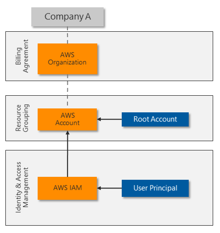
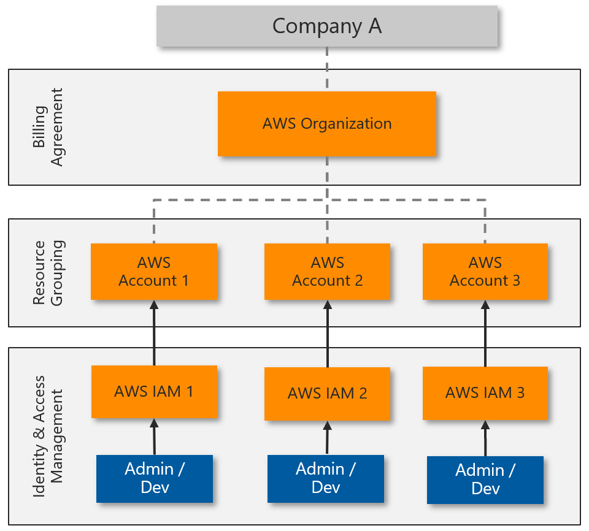
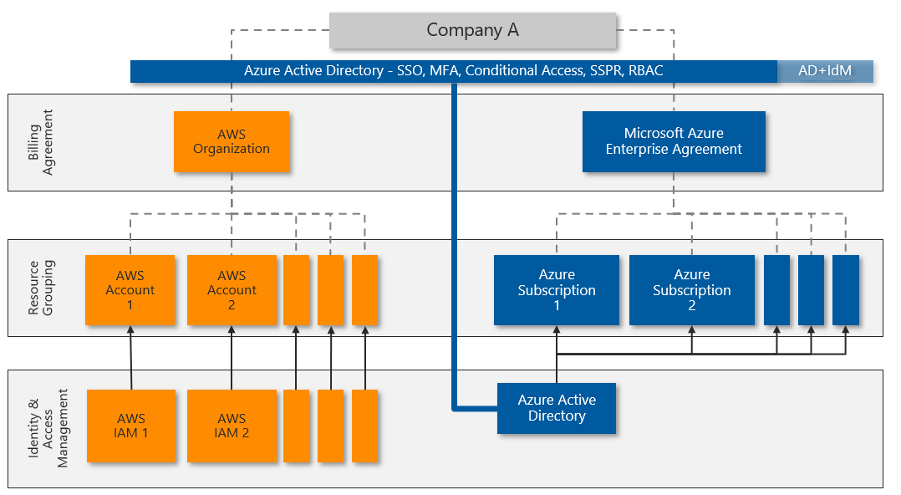
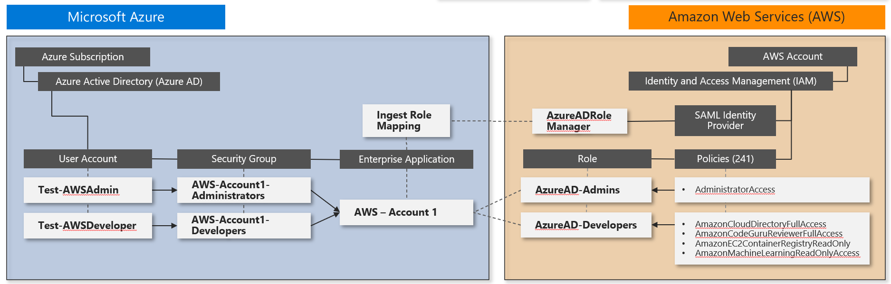
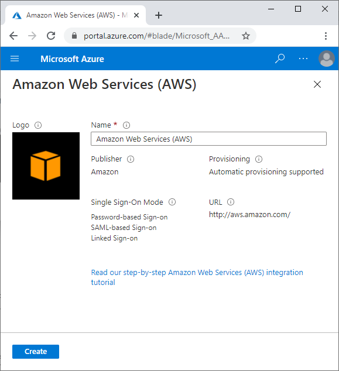

This article provides AWS identity architects, administrators, and security analysts with immediate insights and detailed guidance for deploying Azure AD identity and access solutions for AWS. You can configure and test these Microsoft security solutions without affecting your existing identity providers and AWS account users until you're ready to switch over.

## Architecture

AWS creates a separate *Identity and Access Management (IAM) store* for each account it creates. The following diagram shows the standard setup for an AWS environment with a single AWS account:

The *root user* fully controls the AWS account, and delegates access to other identities. The AWS IAM *principal* provides a unique identity for each role and user that needs to access the AWS account. AWS IAM can protect each root, principal, and user account with a complex password and basic MFA.

Many organizations need more than one AWS account, resulting in *identity silos* that are complex to manage:

To allow centralized identity management and avoid having to manage multiple identities and passwords, most organizations want to use single sign-on for platform resources. Some AWS customers rely on server-based Microsoft Active Directory for SSO integration. Other customers invest in third-party solutions to synchronize or federate their identities and provide SSO.

Azure AD provides centralized identity management with strong SSO authentication. Almost any app or platform that follows common web authentication standards, including AWS, can use Azure AD for identity and access management.

Many organizations already use Azure AD to assign and protect Microsoft 365 or hybrid cloud identities. Employees use their Azure AD identities to access email, files, instant messaging, cloud applications, and on-premises resources. You can quickly and easily integrate Azure AD with your AWS accounts to let administrators and developers sign in to your AWS environments with their existing identities.

The following diagram shows how Azure AD can integrate with multiple AWS accounts to provide centralized identity and access management:

Azure AD offers several capabilities for direct integration with AWS:

- SSO across legacy, traditional, and modern authentication solutions.
- MFA, including integration with several third-party solutions from [Microsoft Intelligent Security Association (MISA)](https://www.microsoft.com/security/business/intelligent-security-association) partners.
- Powerful *Conditional Access* features for strong authentication and strict governance. Azure AD uses Conditional Access policies and risk-based assessments to authenticate and authorize user access to the AWS Management Console and AWS resources.
- Large-scale threat detection and automated response. Azure AD processes over 30 billion authentication requests per day, along with trillions of signals about threats worldwide.
- *Privileged Access Management (PAM)* to enable *Just-In-Time (JIT) provisioning* to specific resources.

### Advanced Azure AD identity management with AWS accounts

Other advanced Azure AD features can provide extra layers of control for the most sensitive AWS accounts. Azure AD Premium P2 licenses include these advanced features:

- **Privileged Identity Management (PIM)** to provide advanced controls for all delegated roles within Azure and Microsoft 365. For example, instead of an administrator always using the Global Admin role, they have permission to activate the role on demand. This permission deactivates after a set time limit (one hour, for example). PIM logs all activations and has other controls that can further restrict the activation capabilities. PIM further protects your identity architecture by ensuring extra layers of governance and protection before administrators can make changes.

  [You can expand PIM to any delegated permission by controlling access to custom groups](/azure/active-directory/privileged-identity-management/concept-pim-for-groups), such as the ones you created for access to AWS roles. For more information about deploying PIM, see [Deploy Azure AD Privileged Identity Management](/azure/active-directory/privileged-identity-management/pim-deployment-plan).

- **Advanced Identity Protection** increases Azure AD sign-in security by monitoring user or session risk. User risk defines the potential of the credentials being compromised, such as the user ID and password appearing in a publicly released breach list. Session risk determines whether the sign-in activity comes from a risky location, IP address, or other indicator of compromise. Both detection types draw on Microsoft's comprehensive threat intelligence capabilities.

  For more information about Advanced Identity Protection, see the [Azure AD Identity Protection security overview](/azure/active-directory/identity-protection/concept-identity-protection-security-overview).

- **Microsoft Defender for Identity** protects identities and services running on Active Directory domain controllers by monitoring all activity and threat signals. Defender for Identity identifies threats based on real-life experience from investigations of customer breaches. Defender for Identity monitors user behavior and recommends attack surface reductions to prevent advanced attacks like reconnaissance, lateral movement, and domain dominance.

  For more information about Defender for Identity, see [What is Microsoft Defender for Identity](/defender-for-identity/what-is).

## Scenario details

Amazon Web Services (AWS) accounts that support critical workloads and highly sensitive information need strong identity protection and access control. AWS identity management is enhanced when combined with Azure Active Directory (Azure AD). Azure AD is a cloud-based, comprehensive, centralized identity and access management solution that can help secure and protect AWS accounts and environments. Azure AD provides centralized *single sign-on (SSO)* and strong authentication through *multi-factor authentication (MFA)* and *Conditional Access* policies. Azure AD supports AWS identity management, role-based identities, and access control.

Many organizations that use AWS already rely on Azure AD for Microsoft 365 or hybrid cloud identity management and access protection. These organizations can quickly and easily use Azure AD with their AWS accounts, often without extra cost. Other, [advanced Azure AD features](./aws-azure-ad-security.yml#advanced-azure-ad-identity-management-with-aws-accounts) like Privileged Identity Management (PIM) and Advanced Identity Protection can help protect the most sensitive AWS accounts.

Azure AD easily integrates with other Microsoft security solutions, like Microsoft Defender for Cloud Apps and Microsoft Sentinel. For more information, see [Defender for Cloud Apps and Microsoft Sentinel for AWS](../../guide/aws/aws-azure-security-solutions.yml). Microsoft security solutions are extensible and have multiple levels of protection. Organizations can implement one or more of these solutions along with other types of protection for a full security architecture that protects current and future AWS deployments.

## Recommendations

### Security

The following principles and guidelines are important for any cloud security solution:

- Ensure that the organization can monitor, detect, and automatically protect user and programmatic access into cloud environments.

- Continually review current accounts to ensure identity and permission governance and control.

- Follow [least privilege](https://en.wikipedia.org/wiki/Principle_of_least_privilege) and [zero trust](https://www.microsoft.com/security/business/zero-trust) principles. Make sure that each user can access only the specific resources they require, from trusted devices and known locations. Reduce the permissions of every administrator and developer to provide only the rights they need for the role they're performing. Review regularly.

- Continuously monitor platform configuration changes, especially if they provide opportunities for privilege escalation or attack persistence.

- Prevent unauthorized data exfiltration by actively inspecting and controlling content.

- Take advantage of solutions you might already own like Azure AD Premium P2 that can increase security without more expense.

#### Basic AWS account security

To ensure basic security hygiene for AWS accounts and resources:

- Review the AWS security guidance at [Best practices for securing AWS accounts and resources](https://aws.amazon.com/premiumsupport/knowledge-center/security-best-practices/).

- Reduce the risk of uploading and downloading malware and other malicious content by actively inspecting all data transfers through the AWS Management Console. Content that uploads or downloads directly to resources within the AWS platform, such as web servers or databases, might need more protection.

- Consider protecting access to other resources, including:
  - Resources created within the AWS account.
  - Specific workload platforms, like Windows Server, Linux Server, or containers.
  - Devices that administrators and developers use to access the AWS Management Console.

#### AWS IAM security

A key aspect of securing the AWS Management Console is controlling who can make sensitive configuration changes. The AWS account root user has unrestricted access. The security team should fully control the root user account to prevent it from signing in to the AWS Management Console or working with AWS resources.

To control the root user account:

- Consider changing the root user sign-in credentials from an individual's email address to a service account that the security team controls.
- Make sure the root user account password is complex, and enforce MFA for the root user.
- Monitor logs for instances of the root user account being used to sign in.
- Use the root user account only in emergencies.
- Use Azure AD to implement delegated administrative access rather than using the root user for administrative tasks.

Clearly understand and review other AWS IAM account components for appropriate mapping and assignments.

- By default, an AWS account has no *IAM users* until the root user creates one or more identities to delegate access. A solution that synchronizes existing users from another identity system, such as Microsoft Active Directory, can also automatically provision IAM users.

- *IAM policies* provide delegated access rights to AWS account resources. AWS provides over 750 unique IAM policies, and customers can also define custom policies.

- *IAM roles* attach specific policies to identities. Roles are the way to administer *role-based access control (RBAC)*. The current solution uses [External Identities](/azure/active-directory/external-identities/) to implement Azure AD identities by assuming IAM roles.

- *IAM groups* are also a way to administer RBAC. Instead of assigning IAM policies directly to individual IAM users, create an IAM group, assign permissions by attaching one or more IAM policies, and add IAM users to the group to inherit the appropriate access rights to resources.

Some *IAM service accounts* must continue to run in AWS IAM to provide programmatic access. Be sure to review these accounts, securely store and restrict access to their security credentials, and rotate the credentials regularly.

## Deploy this scenario

This next section shows you how to deploy Azure AD for single sign-on to an individual AWS account.

### Plan and prepare

To prepare for deployment of Azure security solutions, review and record current AWS account and Azure AD information. If you've more than one AWS account deployed, repeat these steps for each account.

1. In the [AWS Billing Management Console](https://console.aws.amazon.com/billing/home?#/account), record the following current AWS account information:

   - **AWS Account Id**, a unique identifier.
   - **Account Name** or root user.
   - **Payment method**, whether assigned to a credit card or a company billing agreement.
   - **Alternate contacts** who have access to AWS account information.
   - **Security questions** securely updated and recorded for emergency access.
   - **AWS regions** enabled or disabled to comply with data security policy.

1. In the [AWS IAM Management Console](https://console.aws.amazon.com/iam/home#/home), review and record the following AWS IAM components:

   - **Groups** that have been created, including detailed membership and role-based mapping policies attached.
   - **Users** that have been created, including the **Password age** for user accounts, and the **Access key age** for service accounts. Also confirm that MFA is enabled for each user.
   - **Roles**. There are two default service-linked roles, **AWSServiceRoleForSupport** and **AWSServiceRoleForTrustedAdvisor**. Record any other roles, which are custom. These roles link to permission policies, to use for mapping roles in Azure AD.
   - **Policies**. Out-of-the-box policies have **AWS managed**, **Job function**, or **Customer managed** in the **Type** column. Record all other policies, which are custom. Also record where each policy is assigned, from the entries in the **Used as** column.
   - **Identity providers**, to understand any existing Security Assertion Markup Language (SAML) identity providers. Plan how to replace the existing identity providers with the single Azure AD identity provider.

1. In the [Azure Active Directory portal](https://portal.azure.com/#blade/Microsoft_AAD_IAM/ActiveDirectoryMenuBlade/Overview), review the Azure AD tenant:

   - Assess **Tenant information** to see whether the tenant has an Azure AD Premium P1 or P2 license. A P2 license provides [Advanced Azure AD identity management](./aws-azure-ad-security.yml#advanced-azure-ad-identity-management-with-aws-accounts) features.
   - Assess **Enterprise applications** to see whether any existing applications use the AWS application type, as shown by `http://aws.amazon.com/` in the **Homepage URL** column.

#### Plan Azure AD deployment

The Azure AD deployment procedures assume that Azure AD is already configured for the organization, such as for a Microsoft 365 implementation. Accounts can be synchronized from an Active Directory domain, or can be cloud accounts created directly in Azure AD.

#### Plan RBAC

If the AWS installation uses IAM groups and roles for RBAC, you can map the existing RBAC structure to new Azure AD user accounts and security groups.

If the AWS account doesn't have a strong RBAC implementation, start by working on the most sensitive access:

1. Update the AWS account root user.

1. Review the AWS IAM users, groups, and roles that are attached to the IAM policy **AdministratorAccess**.

1. Work through the other assigned IAM policies, starting with policies that can modify, create, or delete resources and other configuration items. You can identify policies in use by looking at the **Used as** column.

#### Plan migration

Azure AD centralizes all authentication and authorization. You can plan and configure user mapping and RBAC without affecting administrators and developers until you're ready to enforce the new methods.

The high-level process for migrating from AWS IAM accounts to Azure AD is as follows. For detailed instructions, see [Deployment](./aws-azure-ad-security.yml#deploy-this-scenario).

1. Map IAM policies to Azure AD roles, and use RBAC to map roles to security groups.

1. Replace each IAM user with an Azure AD user who is a member of the appropriate security groups to sign in and gain appropriate permissions.

1. Test by asking each user to sign in to AWS with their Azure AD account and confirm that they have the appropriate access level.

1. Once the user confirms Azure AD access, remove the AWS IAM user account. Repeat the process for each user until they're all migrated.

For service accounts and programmatic access, use the same approach. Update each application that uses the account to use an equivalent Azure AD user account instead.

Make sure any remaining AWS IAM users have complex passwords with MFA enabled, or an access key that's replaced regularly.

The following diagram shows an example of the configuration steps and final policy and role mapping across Azure AD and AWS IAM:

### Single sign-on integration

Azure AD supports single sign-on integration with AWS SSO. You can connect Azure AD to AWS in one place and centrally govern access across hundreds of accounts and AWS SSO integrated applications. This capability enables seamless Azure AD sign-in experience for users to use the AWS CLI.

The following Microsoft security solution procedure implements SSO for the example roles **AWS Administrators** and **AWS Developers**. Repeat this process for any other roles you need.

This procedure covers the following steps:

1. Create a new Azure AD enterprise application.
2. Configure Azure AD SSO for AWS.
3. Update role mapping.
4. Test Azure AD SSO into AWS Management Console.

The following links provide full detailed implementation steps and troubleshooting:

- [Microsoft tutorial: Azure AD SSO integration with AWS](/azure/active-directory/saas-apps/amazon-web-service-tutorial)
- [AWS tutorial: Azure AD to AWS SSO using the SCIM protocol](https://docs.aws.amazon.com/singlesignon/latest/userguide/azure-ad-idp.html)

### Add an AWS app to your Azure AD enterprise applications

AWS administrators and developers use an enterprise application to sign in to Azure AD for authentication, then redirect to AWS for authorization and access to AWS resources. The simplest method to see the application is by signing in to `https://myapps.microsoft.com`, but you can also publish the unique URL anywhere that provides easy access.

Follow the instructions in [add Amazon Web Services (AWS) from the gallery](/azure/active-directory/saas-apps/amazon-web-service-tutorial#adding-amazon-web-services-aws-from-the-gallery) to set up the enterprise application. These instructions will let you know what AWS app to add to your Azure AD enterprise applications.

If there's more than one AWS account to administer, such as DevTest and Production, use a unique name for the enterprise application that includes an identifier for the company and specific AWS account.

### Configure Azure AD SSO for AWS

Follow the steps below to configure Azure AD SSO for AWS:

   1. On **Azure Portal**, follow the steps on [Configure Azure AD SSO](/azure/active-directory/saas-apps/amazon-web-service-tutorial#configure-azure-ad-sso) to configure the **Enterprise Application** you've created for single sign-on to **AWS**.

   1. On **AWS Console**, follow the steps on [Configure AWS SSO](/azure/active-directory/saas-apps/amazon-web-service-tutorial#configure-aws-single-account-access-sso) to configure your **AWS account** for single sign-on. As part of this configuration, you'll create a new IAM user that acts on behalf of the Azure AD Provisioning agent to allow synchronization of all available **AWS IAM roles** into **Azure AD**. AWS needs this IAM user to map users to roles before they can sign in to the **AWS Management Console**.

- Make it easy to identify the components you create to support this integration. For example, name service accounts with a standard naming convention like "Svc-".
- Be sure to document all new items.
- Make sure any new credentials include complex passwords that you store centrally for secure lifecycle management.

Based on these configuration steps, you can diagram the interactions like this:

On **AWS Console**, follow the steps below to create more roles.

   1. In **AWS IAM**, select **Roles -> Create Role**.

   1. On the **Create** role page, perform the following steps:
       1. Under **Select type of trusted entity**, select **SAML 2.0 federation**.
       1. Under **Choose a SAML 2.0 Provider**, select the SAML provider you created in the previous step.
       1. Select **Allow programmatic and AWS Management Console access**.
       1. Select **Next: Permissions**.

   1. On the **Attach permissions policies** dialog box, select **AdministratorAccess**. Then select **Next: Tags**.
   1. In the **Add Tags** dialog box, leave it blank and select **Next: Review**.
   1. In the **Review** dialog box, perform the following steps:
       - In **Role Name**, enter your role name **(Administrator)**.
       - In **Role Description**, enter the description.
       - Select **Create Role**.

   1. Create another role by following the steps listed above. Name the role **Developer** and give it a few selected permissions of your choice (such as **AmazonS3FullAccess**).

      You've successfully created an **Administrator** and a **Developer** role in **AWS**.

   1. Create the following users and groups in **Azure AD**:
      - **User 1**: Test-AWSAdmin
      - **User 2**: Test-AWSDeveloper
      - **Group 1**: AWS-Account1-Administrators
      - **Group 2**: AWS-Account1-Developers
      - **Add** Test-AWSAdmin as a member of **AWS-Account1-Administrators**
      - **Add** Test-AWSDeveloper as a member of **AWS-Account1-Developers**

   1. Follow the steps on [How to configure role provisioning in AWS Single-Account Access](/azure/active-directory/saas-apps/amazon-web-service-tutorial#how-to-configure-role-provisioning-in-aws-single-account-access) to configure automated role provisioning. It can take up to one hour to complete the first provisioning cycle.

### How to update role mapping

Because you're using two roles, perform these extra steps:

1. Confirm that the provisioning agent can see at least two roles:

   :::image type="content" source="media/see-roles.png" alt-text="Screenshot of the two roles in Azure AD.":::

1. Go to **Users and groups** and select **Add User**.

1. Select **AWS-Account1-Administrators**.

1. Select the associated role.

   :::image type="content" source="media/select-role.png" alt-text="Screenshot of selecting an associated role.":::

1. Repeat the preceding steps for each group-role mapping. Once complete, you should have two Azure AD groups correctly mapped to AWS IAM roles:

   :::image type="content" source="media/group-role-mapping.png" alt-text="Screenshot showing Groups mapped to correct Roles.":::

If you can't see or select a role, go back to the **Provisioning** page to confirm successful provisioning in the Azure AD provisioning agent, and make sure the IAM User account has the correct permissions. You can also restart the provisioning engine to attempt the import again:

:::image type="content" source="media/restart-provisioning.png" alt-text="Screenshot of Restart provisioning in the menu bar.":::

### Test Azure AD SSO into AWS Management Console

Test signing-in as each of the test users to confirm that the SSO works.

1. Launch a new private browser session to ensure that other stored credentials don't conflict with testing.

1. Go to `https://myapps.microsoft.com`, using the Test-AWSAdmin or Test-AWSDeveloper Azure AD user account credentials you created previously.

1. You should see the new icon for the AWS Console app. Select the icon, and follow any authentication prompts:

   :::image type="content" source="media/aws-logo.png" alt-text="Screenshot of the AWS Console app icon.":::

1. Once you're signed into the AWS Console, navigate the features to confirm that this account has the appropriate delegated access.

1. Notice the naming format for the user sign-in session:

   **ROLE / UPN / AWS Account Number**

   You can use this user sign-in session information for tracking user sign-in activity in Defender for Cloud Apps or Microsoft Sentinel.

   :::image type="content" source="media/sign-in-session.png" alt-text="Screenshot of sign-in session information.":::

1. Sign out, and repeat the process for the other test user account to confirm the differences in role mapping and permissions.

### Enable Conditional Access

To create a new Conditional Access policy that requires MFA:

1. In the Azure portal, navigate to **Azure AD** > **Security**, and then select **Conditional Access**.

1. In the left navigation, select **Policies**.

   :::image type="content" source="media/conditional-access.png" alt-text="Screenshot of the Azure AD Conditional Access screen with Policies selected.":::

1. Select **New policy**, and complete the form as follows:
   - **Name**: Enter *AWS Console – MFA*
   - **Users and Groups**: Select the two role groups you created earlier:
     - **AWS-Account1-Administrators**
     - **AWS-Account1-Developers**
   - **Grant**: Select **Require multi-factor authentication**
1. Set **Enable policy** to **On**.

   :::image type="content" source="media/aws-policy.png" alt-text="Screenshot of the filled-out new policy form.":::

1. Select **Create**. The policy takes effect immediately.

1. To test the Conditional Access policy, sign out of the testing accounts, open a new in-private browsing session, and sign in with one of the role group accounts. You see the MFA prompt:

   :::image type="content" source="media/test-policy.png" alt-text="Screenshot of MFA sign-in prompt.":::

1. Complete the MFA setup process. It's best to use the mobile app for authentication, instead of relying on SMS.

   :::image type="content" source="media/additional-verification.png" alt-text="Screenshot of mobile app MFA configuration screen.":::

You might need to create several Conditional Access policies to meet business needs for strong authentication. Consider the naming convention you use when creating the policies to ensure ease of identification and ongoing maintenance. Also, unless MFA is already widely deployed, make sure the policy is scoped to affect only the intended users. Other policies should cover other user groups' needs.

Once you enable Conditional Access, you can impose other controls such as PAM and just-in-time (JIT) provisioning. For more information, see [What is automated SaaS app user provisioning in Azure AD](/azure/active-directory/app-provisioning/user-provisioning).

If you have Defender for Cloud Apps, you can use Conditional Access to configure Defender for Cloud Apps session policies. For more information, see [Configure Azure AD session policies for AWS activities](../../guide/aws/aws-azure-security-solutions.yml#configure-defender-for-cloud-apps-monitoring-policies-for-aws-activities).

## Next steps

- For security guidance from AWS, see [Best practices for securing AWS accounts and resources](https://aws.amazon.com/premiumsupport/knowledge-center/security-best-practices/).
- For the latest Microsoft security information, see [www.microsoft.com/security](https://www.microsoft.com/security).
- For full details of how to implement and manage Azure AD, see [Securing Azure environments with Azure Active Directory](/azure/active-directory/fundamentals/secure-with-azure-ad-introduction).
- [AWS tutorial: Azure AD with IDP SSO](https://docs.aws.amazon.com/singlesignon/latest/userguide/azure-ad-idp.html)
- [Microsoft tutorial: SSO for AWS](/azure/active-directory/saas-apps/amazon-web-service-tutorial)
- [PIM deployment plan](/azure/active-directory/privileged-identity-management/pim-deployment-plan)
- [Identity protection security overview](/azure/active-directory/identity-protection/concept-identity-protection-security-overview)
- [What is Microsoft Defender for Identity?](/defender-for-identity/what-is)
- [Connect AWS to Microsoft Defender for Cloud Apps](/cloud-app-security/connect-aws-to-microsoft-cloud-app-security)
- [How Defender for Cloud Apps helps protect your Amazon Web Services (AWS) environment](/cloud-app-security/protect-aws)

## Related resources

- For in-depth coverage and comparison of Azure and AWS features, see the [Azure for AWS professionals](../../aws-professional/index.md) content set.
- [Security and identity on Azure and AWS](../../aws-professional/security-identity.md)
- [Defender for Cloud Apps and Microsoft Sentinel for AWS](/azure/architecture/guide/aws/aws-azure-security-solutions)
