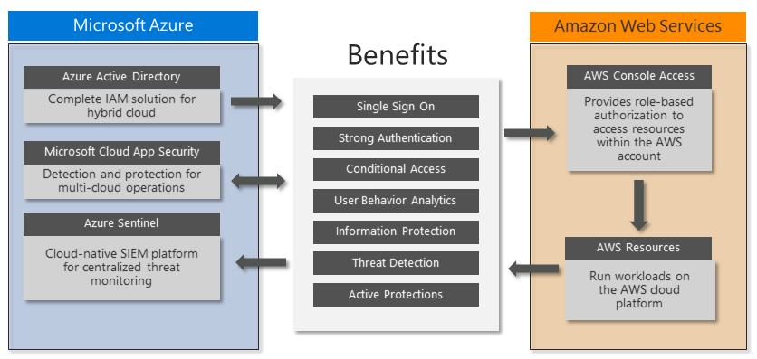

Microsoft offers several security solutions that can help secure and protect Amazon Web Services (AWS) accounts and environments. 

AWS organizations that use Azure Active Directory (Azure AD) for Microsoft 365 or hybrid cloud identity and access protection can quickly and easily [deploy Azure AD for AWS accounts](aws-azure-ad-security.yml), often without additional cost.

Other Microsoft security components can integrate with Azure AD to provide additional security for AWS accounts. Microsoft Cloud App Security (MCAS) backs up Azure AD with session protection and user behavior monitoring. Azure Sentinel integrates with Azure AD and MCAS to detect and automatically respond to threats against AWS environments.

These Microsoft security solutions are extensible and have multiple levels of protection. Organizations can implement one or more of these solutions along with other types of protection for a full security architecture that protects current and future AWS deployments.

This article provides AWS identity architects, administrators, and security analysts with immediate insights and detailed guidance for deploying several Microsoft security solutions.

## Architecture

This diagram summarizes how AWS installations can benefit from key Microsoft security components:

- Azure AD provides centralized *single sign-on (SSO)* and strong authentication through *multi-factor authentication (MFA)* and *Conditional Access*. Azure AD supports AWS role-based identities and authorization for access to AWS resources. For more information and detailed instructions, see [Azure AD identity and access management for AWS](aws-azure-ad-security.yml).

- MCAS integrates with Azure AD Conditional Access to enforce additional restrictions, and monitors and protects sessions after sign-in. MCAS uses *user behavior analytics (UBA)* and other AWS APIs to monitor sessions and users and to support information protection.

- Azure Sentinel integrates with MCAS and AWS to detect and automatically respond to threats. Azure Sentinel monitors the AWS environment for misconfiguration, potential malware, and advanced threats to AWS identities, devices, applications, and data.

### MCAS for visibility and control

Several users or roles making administrative changes can result in *configuration drift* away from intended security architecture and standards. Security standards can also change over time. Security personnel must constantly and consistently detect new risks, evaluate mitigation options, and update security architecture to prevent potential breaches. Security management across multiple public cloud and private infrastructure environments can become burdensome.

[Microsoft Cloud App Security](/cloud-app-security/what-is-cloud-app-security) is a *Cloud Access Security Broker (CASB)* platform with capabilities for *Cloud Security Posture Management (CSPM)*. MCAS can connect to multiple cloud services and applications to collect security logs, monitor user behavior, and impose restrictions that the platforms themselves may not offer.

MCAS provides several capabilities that can integrate with AWS for immediate benefits:

- The MCAS app connector uses several *AWS APIs*, including UBA, to search for configuration issues and threats on the AWS platform.
- *AWS Access Controls* can enforce sign-in restrictions based on application, device, IP address, location, registered ISP, and specific user attributes.
- *Session Controls for AWS* block potential malware uploads or downloads based on Microsoft Threat Intelligence or real-time content inspection.
- Session controls can also use real-time content inspection and sensitive data detection to impose *data loss prevention (DLP)* rules that prevent cut, copy, paste, or print operations.

MCAS is available standalone, or as part of Microsoft Enterprise Mobility + Security E5, which includes Azure AD Premium P2. For more pricing and licensing information, see [Enterprise Mobility + Security pricing options](https://www.microsoft.com/microsoft-365/enterprise-mobility-security/compare-plans-and-pricing).

### Azure Sentinel for advanced threat detection

Threats can come from a wide range of devices, applications, locations, and user types. Data loss prevention requires inspecting content during upload or download, because post-mortem review may be too late. AWS doesn't have native capabilities for device and application management, risk-based conditional access, session-based controls, or inline UBA.

[Azure Sentinel](/azure/sentinel/) is a *Security Information and Event Management (SIEM)* and *Security Orchestration, Automation, and Response (SOAR)* solution that centralizes and coordinates threat detection and response automation for modern security operations. Azure Sentinel can monitor AWS accounts to compare events across multiple firewalls, network devices, and servers. Azure Sentinel combines monitoring data with threat intelligence, analytics rules, and machine learning to discover and respond to advanced attack techniques.

Connect both AWS and MCAS into Azure Sentinel to get MCAS alerts and run additional threat checks using multiple Threat Intelligence feeds. Azure Sentinel can initiate a coordinated response outside of MCAS, integrate with IT Service Management (ITSM) solutions, and retain data long term for compliance purposes.

## Security recommendations

The following principles and guidelines are important for any cloud security solution:

- Ensure that the organization can monitor, detect, and automatically protect user and programmatic access into cloud environments.
  
- Continually review current accounts to ensure identity and permission governance and control.
  
- Follow [least privilege](https://en.wikipedia.org/wiki/Principle_of_least_privilege) and [zero trust](https://www.microsoft.com/security/business/zero-trust) principles. Make sure that each user can access only the specific resources they require, from trusted devices and known locations. Reduce the permissions of every administrator and developer to provide only the rights they need for the role they're performing. Review regularly.
  
- Continuously monitor platform configuration changes, especially if they provide opportunities for privilege escalation or attack persistence.
  
- Prevent unauthorized data exfiltration by actively inspecting and controlling content.
  
- Take advantage of solutions you might already own like Azure AD Premium P2 that can increase security without additional expense.

### Basic AWS account security

To ensure basic security hygiene for AWS accounts and resources:

- Review the AWS security guidance at [Best practices for securing AWS accounts and resources](https://aws.amazon.com/premiumsupport/knowledge-center/security-best-practices/).

- Reduce the risk of uploading and downloading malware and other malicious content by actively inspecting all data transfers through the AWS Management Console. Content that uploads or downloads directly to resources within the AWS platform, such as web servers or databases, might need additional protection.

- Consider protecting access to other resources, including:
  - Resources created within the AWS account.
  - Specific workload platforms, like Windows Server, Linux Server, or containers.
  - Devices that administrators and developers use to access the AWS Management Console.

## Plan and prepare

To prepare for deployment of Azure security solutions, review and record current AWS and Azure AD account information. If you have more than one AWS account deployed, repeat these steps for each account.

1. In the [AWS Billing Management Console](https://console.aws.amazon.com/billing/home?#/account), record the following current AWS account information:
   
   - **AWS Account Id**, a unique identifier.
   - **Account Name** or root user.
   - **Payment method**, whether assigned to a credit card or a company billing agreement.
   - **Alternate contacts** who have access to AWS account information.
   - **Security questions** securely updated and recorded for emergency access.
   - **AWS regions** enabled or disabled to comply with data security policy.
   
1. In the [Azure Active Directory portal](https://portal.azure.com/#blade/Microsoft_AAD_IAM/ActiveDirectoryMenuBlade/Overview), review the Azure AD tenant:
   
   - Assess **Tenant information** to see whether the tenant has an Azure AD Premium P1 or P2 license. A P2 license provides [Advanced Azure AD identity management](aws-azure-ad-security.yml#advanced-azure-ad-identity-management) features.
   - Assess **Enterprise applications** to see whether any existing applications use the AWS application type, as shown by `http://aws.amazon.com/` in the **Homepage URL** column.

## Deploy MCAS

Once you deploy the central management and strong authentication that modern identity and access management require, you can implement MCAS to:
- Collect security data and carry out threat detections for AWS accounts.
- Implement advanced controls to mitigate risk and prevent data loss.

To deploy MCAS, you:

1. Add an MCAS app connector for AWS.
1. Configure MCAS monitoring policies for AWS activities.
1. Configure Azure AD session policies for AWS activities.
1. Test MCAS policies for AWS.

### Add an AWS app connector

1. In the [MCAS portal](https://portal.cloudappsecurity.com), expand **Investigate** and then select **Connected apps**.
   
1. On the **App Connectors** page, select the **+** and then select **Amazon Web Services** from the list.
   
1. Use a unique name for the connector that includes an identifier for the company and specific AWS account, for example *Contoso-AWS-Account1*.

1. Follow the instructions at [Connect AWS to Microsoft Cloud App Security](/cloud-app-security/connect-aws-to-microsoft-cloud-app-security) to create an appropriate AWS IAM user.
   
   1. Define a policy for restricted permissions.
   1. Create a service account to use those permissions on behalf of the MCAS service.
   1. Provide the credentials to the app connector.

The initial connection may take some time, depending on the AWS account log sizes. Upon completion, you see a successful connection confirmation:

:::image type="content" source="media/connect-app.png" alt-text="Screenshot of a successfully completed app connection.":::

### Configure MCAS monitoring policies for AWS activities

Once the app connector is enabled, MCAS shows new templates and options in the policy configuration builder. You can create policies directly from the templates and modify them for your needs, or develop a policy without using the templates.

To implement policies using the templates:

1. In the MCAS left navigation, expand **Control** and then select **Templates**.
   
   :::image type="content" source="media/template-menu.png" alt-text="Screenshot of the MCAS left navigation with Templates selected.":::
   
1. Search for **aws** and review the available policy templates for AWS.
   
   :::image type="content" source="media/policy-template.png" alt-text="Screenshot of the list of available AWS templates in MCAS.":::
   
1. To use a template, select the **+** to the right of the template item.
   
1. Each policy type has different options. Review the configuration and save the policy. Repeat for each of the templates.
   
   :::image type="content" source="media/create-policy.png" alt-text="Screenshot of a file policy configuration screen.":::
   
   To use File policies, make sure the file monitoring setting is enabled in MCAS settings:
   
   :::image type="content" source="media/file-monitoring.png" alt-text="Screenshot showing File monitoring enabled in MCAS settings.":::

As MCAS detects alerts, it displays them on the **Alerts** page in the MCAS portal:

:::image type="content" source="media/alerts.png" alt-text="Screenshot showing alerts in the MCAS portal.":::

### Configure Azure AD session policies for AWS activities

Session policies are a powerful combination of Azure AD Conditional Access policies and MCAS reverse proxy capability that provide real-time suspicious behavior monitoring and control.

1. In Azure AD, create a new Conditional Access policy with the following settings:
   - **Name**: Enter *AWS Console – Session Controls*
   - **Users and Groups**: Select the two role groups you created earlier:
     - **AWS-Account1-Administrators**
     - **AWS-Account1-Developers**
   - **Cloud apps or actions**: Select the enterprise application you created earlier, **Contoso-AWS-Account 1**
   - **Session**: Select **Use Conditional Access App Control**
1. Set **Enable policy** to **On**.
   
   :::image type="content" source="media/session-controls.png" alt-text="Screenshot of the filled-out new policy form for session controls.":::
   
1. Select **Create**.

After you create the Azure AD Conditional Access policy, set up an MCAS Session Policy to control user behavior during AWS sessions.

1. In the MCAS portal, expand **Control** and then select **Policies**.
   
1. On the **Policies** page, select **Create policy** and then select **Session policy** from the list.
   
   :::image type="content" source="media/session-policy.png" alt-text="Screenshot of the Create policy list.":::
   
1. On the **Create session policy** page, under **Policy template**, select **Block upload of potential malware (based on Microsoft Threat Intelligence)**.
   
1. In the **ACTIVITIES** section, modify the activity filter to include **App** equal to **Amazon Web Services**, and remove the default device selection.
   
   :::image type="content" source="media/activity-source.png" alt-text="Screenshot of the Activities section of the Create session policy page.":::
   
1. Review the other settings, and then select **Create**.

### Test MCAS policies for AWS

Test all policies regularly to ensure they're still effective and relevant. Here are a few recommended tests:

- **IAM Policy changes**: This policy should trigger each time you attempt to modify the settings within AWS IAM, such as creating the new IAM policy and account to use in the following Azure Sentinel section.

- **Console sign-in failures**: Any failed attempts to sign in to one of the test accounts trigger this policy. The alert details show that the attempt came from one of the Azure regional datacenters.

- **S3 bucket activity policy**: Attempting to create a new AWS S3 storage account and set it to be publicly available triggers the policy.

- **Malware detection policy**: If you configured malware detection as a session policy, you can test it by uploading a file to an AWS S3 storage account. You can download a safe test file from the [European Institute for Computer Anti-Virus Research (EICAR)](https://www.eicar.org/). The policy should immediately block you from uploading the file, and you should see the alert trigger in the MCAS portal shortly afterwards.

## Deploy Azure Sentinel

Connecting an AWS account and MCAS to Azure Sentinel enables monitoring capabilities that compare events across multiple firewalls, network devices, and servers.

### Enable the Azure Sentinel AWS connector

After you enable the Azure Sentinel Connector for AWS, you can monitor AWS incidents and data ingestion.

As with the MCAS configuration, this connection requires configuring AWS IAM to provide credentials and permissions.

1. In AWS IAM, follow the steps at [Connect Azure Sentinel to AWS CloudTrail](/azure/sentinel/connect-aws).
   
1. To complete the configuration in the Azure portal, under **Azure Sentinel** > **Data connectors**, select the **Amazon Web Services** connector.
   
   :::image type="content" source="media/aws-connector.png" alt-text="Screenshot of the Azure Sentinel Data connectors page showing the Amazon Web Services connector.":::
   
1. Select **Open connector page**.
   
1. Under **Configuration**, enter the Role ARN from the AWS IAM configuration in the **Role to add** field, and select **Add**.
   
1. Select **Next steps**, and select the **AWS Network Activities** and **AWS User Activities** activities to monitor.
   
1. Under **Relevant analytic templates**, select **Create rule** next to the AWS analytic templates you want to enable.
   
1. Set up each rule, and select **Create**.

The following table shows the available rule templates for checking AWS entity behaviors and threat indicators. The rule names describe their purpose, and the potential data sources list the data sources each rule can use.

| Analytic template name                                                 | Data sources                                                           |
|------------------------------------------------------------------------|----------------------------------------------------------------------------------|
| Known IRIDIUM IP                                                       | DNS, Azure Monitor, Cisco ASA, Palo Alto Networks, Azure AD, Azure Activity, AWS |
| Full Admin policy created and then attached to Roles, Users, or Groups | AWS                                                                              |
| Failed AzureAD logons but success logon to AWS Console                 | Azure AD, AWS                                                                    |
| Failed AWS Console logons but success logon to AzureAD                 | Azure AD, AWS                                                                    |
| MFA disabled for a user                                                | Azure AD, AWS                                                                    |
| Changes to AWS Security Group ingress and egress settings              | AWS                                                                              |
| Monitor AWS Credential abuse or hijacking                              | AWS                                                                              |
| Changes to AWS Elastic Load Balancer security groups                   | AWS                                                                              |
| Changes to Amazon VPC settings                                         | AWS                                                                              |
| New UserAgent observed in last 24 hours                                | Microsoft 365, Azure Monitor, AWS                                                |
| Login to AWS Management Console without MFA                            | AWS                                                                              |
| Changes to internet facing AWS RDS Database instances                  | AWS                                                                              |
| Changes made to AWS CloudTrail logs                                    | AWS                                                                              |
| Threat Intelligence map IP entity to AWS CloudTrail                     | Threat Intelligence Platforms, AWS                                              |

Enabled templates have an **IN USE** indicator on the connector details page:

:::image type="content" source="media/templates.png" alt-text="Screenshot showing templates in use on the connector details page.":::

### Monitor AWS incidents

Azure Sentinel creates incidents based on the enabled analyses and detections. Each incident can include one or more events, which reduces the overall number of investigations necessary to detect and respond to potential threats.

Azure Sentinel shows incidents generated by MCAS, if connected, and incidents created by Azure Sentinel. The **Product names** column shows the Incident source.

:::image type="content" source="media/incidents.png" alt-text="Screenshot showing incident source in the Product names column.":::

### Check data ingestion

Check that data is continuously ingested into Azure Sentinel by regularly viewing the connector details. The following graph shows a new connection:

:::image type="content" source="media/data-ingestion.png" alt-text="Screenshot of connector details showing data ingestion.":::

If the data stops ingesting and the graph drops, check the credentials used to connect to the AWS account, and check that AWS CloudTrail can still collect the events.

## See also

- For in-depth coverage and comparison of Azure and AWS features, see the [Azure for AWS professionals](../../aws-professional/index.md) content set.
- For security guidance from AWS, see [Best practices for securing AWS accounts and resources](https://aws.amazon.com/premiumsupport/knowledge-center/security-best-practices/).
- For the latest Microsoft security information, see [www.microsoft.com/security](https://www.microsoft.com/security).
- For full details of how to implement and manage Azure AD, see [Securing Azure environments with Azure Active Directory](https://aka.ms/AzureADSecuredAzure).
- [Azure AD identity and access management for AWS](aws-azure-ad-security.yml).
- [Connect AWS to Microsoft Cloud App Security](/cloud-app-security/connect-aws-to-microsoft-cloud-app-security).
- [How Cloud App Security helps protect your Amazon Web Services (AWS) environment](/cloud-app-security/protect-aws).
- [Connect Azure Sentinel to AWS CloudTrail](/azure/sentinel/connect-aws).