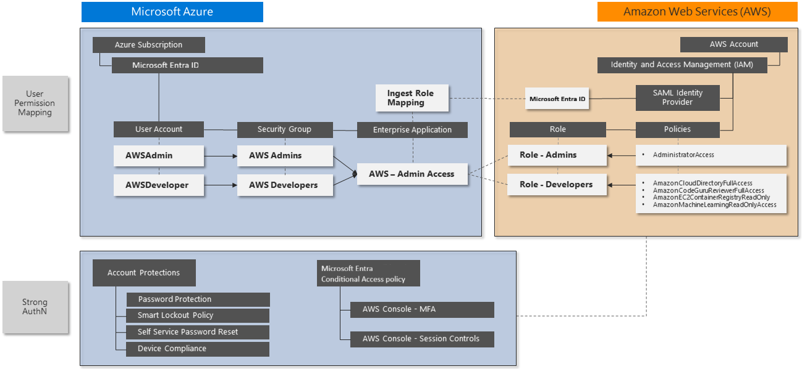

# Azure security for AWS

Amazon Web Services (AWS) accounts that support critical workloads and highly sensitive information need strong protection and security. Many organizations that use AWS also rely on Azure Active Directory (Azure AD) for identity and access protection, like for Microsoft 365 installations. Azure AD can provide beefed up identity protection for AWS accounts without additional cost. Microsoft Cloud App Security (MCAS) backs up Azure AD with session and user behavior monitoring, and Azure Sentinel monitoring can detect additional threats against AWS environments.

This article provides AWS identity architects, administrators, and security analysts with immediate insights and detailed guidance for rapidly adopting these Azure security solutions. You can configure and test these solutions without impacting administrators and developers until you're ready to switch over to the new methods.

Azure security solutions are extensible and have multiple levels of protection for securing access and monitoring user interactions. An organization can implement one or more of these solutions along with other types of protection for a full security architecture to protect current and future AWS deployments.

## Architecture

AWS creates a separate *IAM store* for each account it creates. The following diagram shows the standard setup for an AWS environment with a single AWS account:

The *root account* has full control of the AWS account, and other identities have delegated access. The AWS IAM *user principal* provides a unique identity for each administrator and developer that needs to access the AWS account. IAM can protect each root and user principal account with a complex password and basic *multi-factor authentication (MFA)*.

Many organizations need more than one AWS account, increasing the IAM instances they need to manage. With multiple accounts, management complexity increases exponentially.

To avoid having to manage multiple accounts and passwords and ensure centralized identity management, most organizations want to use *single sign-on (SSO)* for platform resources. Some AWS customers rely on server-based Microsoft Active Directory for SSO integration. Other customers invest in third-party solutions to synchronize or federate their identities and provide SSO.

Azure AD is an integrated identity solution that offers SSO, MFA, Conditional Access policies, and other capabilities for direct integration with AWS. You can quickly deploy Azure AD to let administrators and developers sign in to AWS environments with their existing identities.

The following diagram shows how key Microsoft security components can benefit AWS installations:

- Use Azure AD to gain control of AWS identities and apply additional security to the sign-in process.

- Integrate Azure AD with MCAS to monitor and control session actions after sign-in.

- Configure Azure Sentinel and MCAS to monitor the AWS environment for misconfiguration, potential malware, and advanced threats to AWS identities, devices, applications, and data.

## Components

This security solution uses several capabilities of Azure AD, Microsoft Cloud App Security, and Azure Sentinel.

### Azure AD

Azure AD is a comprehensive, cloud-based *identity and access management (IAM)* solution that provides strong authentication and centralized identity management. Many organizations already use Azure AD to assign and protect Microsoft 365 identities. Employees use their Azure AD identities to access email, files, instant messaging, cloud applications, and on-premises resources. Almost any app or platform that follows common web authentication standards can use Azure AD, including AWS.

Azure AD offers several capabilities for direct integration with AWS:

- SSO across legacy, traditional, and modern authentication solutions.
- MFA, including integration with several third-party solutions from the [Microsoft Intelligent Security Association (MISA)](https://www.microsoft.com/security/business/intelligent-security-association) partners.
- *Conditional Access* policies to define specific access requirements in real time.
- Threat detection and automated response at massive scale. Azure AD processes over 30 billion authentication requests per day, along with trillions of signals about threats worldwide.
- *Privileged Access Management (PAM)* to enable *Just-In-Time (JIT) provisioning* to specific resources.

#### Advanced Azure AD identity protection

This article walks you through implementing Azure AD authentication and Conditional Access policies for access control. Other advanced Azure AD features can provide additional layers of control for sensitive accounts. Azure AD Premium P2 licenses include these advanced features:

- **Privileged Identity Management (PIM)** provides advanced controls for all delegated roles within Azure and Microsoft 365. For example, instead of an administrator always using the Global Admin role, they have permission to activate the role on demand. This permission deactivates after a set time limit, such as one hour. All activations are logged, and additional controls can further restrict the activation capabilities. This feature further protects your identity architecture by ensuring the administrators have additional layers of governance and protection before they can make changes.
  
  You can expand this solution to any delegated permission by controlling access to custom groups, such as the ones you created for access to AWS roles. For more information about deploying PIM, see the [Deploy Azure AD Privileged Identity Management](/azure/active-directory/privileged-identity-management/pim-deployment-plan).

- **Advanced Identity Protection** increases Azure AD sign-in security by monitoring the risk of the user or the session. User Risk defines the potential of the credentials being compromised, such as discovery of the UserId and Password in a publicly released breach list, and Session Risk determines whether the sign-in activity comes from a risky location, IP address, or other indicator of compromise. Both detection types use Microsoft's comprehensive threat intelligence capabilities.
  
  For more information about Advanced Identity Protection, see the [Azure AD Identity Protection security overview](/azure/active-directory/identity-protection/concept-identity-protection-security-overview).

- **Azure Defender for Identity** protects identities and services running on Active Directory domain controllers by monitoring all activity and threat signals. The threats identified are based on real-life experience from investigations of customer breaches. The solution monitors user behavior and recommends attack surface reductions to prevent advanced attacks like reconnaissance, lateral movement, and domain dominance.
  
  For more information about Defender for Identity, see [What is Microsoft Defender for Identity](/defender-for-identity/what-is).

### Microsoft Cloud App Security 

When several users or roles can make administrative changes, there may be some drift away from the intended security architecture and baseline standards. Standards can also change over time. Security practitioners must constantly and consistently detect new risks, evaluate mitigation options, and update security architecture to prevent potential breaches. Security management across multiple public cloud and private infrastructure environments can become burdensome.

MCAS is a *Cloud Access Security Broker (CASB)* platform with capabilities for *Cloud Security Posture Management (CSPM)*. MCAS can connect to multiple cloud services and applications to collect security logs, monitor user behavior, and implement restrictions that the platforms themselves don't offer.

MCAS provides several capabilities that can integrate with AWS for immediate benefits:

- The MCAS app connector uses several AWS APIs to search for configuration issues and threats on the AWS platform, including *user behavior analytics (UBA)*.
- *AWS Access Controls* can enforce sign-in restrictions based on application, device, IP address, location, registered ISP, and specific user attributes.
- *Session Controls for AWS* block potential malware uploads or downloads based on Microsoft Threat Intelligence or real-time content inspection. Session controls can also use real-time content inspection and sensitive data detection to impose *data loss prevention (DLP)* rules that prevent cut, copy, paste, or print operations.

MCAS is available standalone, or as part of Microsoft Enterprise Mobility + Security E5, which includes Azure AD Premium P2. For more pricing and licensing information, see [Enterprise Mobility + Security pricing options](https://www.microsoft.com/microsoft-365/enterprise-mobility-security/compare-plans-and-pricing).

### Azure Sentinel

Threats can come from a wide range of devices, applications, locations, and user types. DLP requires inspecting content during upload or download. Post-mortem review may be too late to prevent data loss. AWS doesn't provide native capabilities for device and application management, risk-based conditional access, session-based controls, or inline UBA.

[Azure Sentinel](/azure/sentinel/) is a *Security Information and Event Management (SIEM)* and *Security Orchestration, Automation, and Response (SOAR)* solution that centralizes and coordinates threat detection and response automation for modern security operations. Connecting an AWS account to Azure Sentinel enables monitoring capabilities that compare events across multiple firewalls, network devices, and servers. Combined with additional threat intelligence, analytics rules, and machine learning, Azure Sentinel helps discover and respond to advanced attack techniques.

Connect both AWS and MCAS into Azure Sentinel to get MCAS alerts and run additional threat checks using multiple Threat Intelligence feeds. Azure Sentinel can initiate a coordinated response outside of MCAS, integrate with IT Service Management (ITSM) solutions, and retain data long term for compliance purposes.

## Migrate to Azure AD

The following principles and guidelines are important for any cloud account security solution:

- Ensure that the organization can monitor, detect, and automatically protect user and programmatic access into cloud environments.
  
- Continually review current accounts to ensure identity and permission governance and control.
  
- Follow *least privilege* and *zero trust* principles. Make sure that each user can only access the specific resources they require, from trusted devices and known locations. Reduce the permissions of every administrator and developer to provide only the rights they need for the role they're performing. Review regularly.
  
- Continuously monitor platform configuration changes, especially if they provide opportunities for privilege escalation or attack persistence.
  
- Prevent unauthorized data exfiltration by actively inspecting and controlling content.
  
- Raise awareness that customers may already own solutions like Azure AD Premium P2 that they can use to increase security without additional expense. Other solutions like MCAS and Azure Sentinel come at a reasonable cost.

Before you deploy any new security solutions, ensure basic security hygiene for your AWS accounts and resources.

- Review the AWS security guidance at [Best practices for securing AWS accounts and resources](https://aws.amazon.com/premiumsupport/knowledge-center/security-best-practices/).

- Reduce the risk of malware and other malicious content upload and download by actively inspecting all data transfers initiated via the AWS Management Console. Content that is uploaded or downloaded directly to resources within the AWS platform, such as web servers or databases, might need additional protection.

- Consider protecting access to other resources, including:
  - Resources created within the AWS account.
  - Specific workload platforms, like Windows Server, Linux Server, or containers.
  - Devices that administrators and developers use to access the AWS Management Console.

### Review AWS IAM components

A key aspect of securing the AWS Management Console is a clear understanding of who can make sensitive configuration changes. Review the following AWS IAM components to minimize risk.

Each AWS account has a single *root user* account owner that has unrestricted access. The security team must fully control the root user account to prevent it being used to sign in to the AWS Management Console. To control the root user:
- Consider changing the root user sign-in credentials from an email address to a service account that the security team controls.
- Make sure the root user account password is extremely complex.
- Enforce MFA for the root user.
- Monitor logs for instances of the root user account being used to sign in.
- Use the root user account only in emergencies.
- Use Azure AD to implement delegated administrative access rather than using the root user for administrative tasks.

By default, an AWS account has no *IAM users* until the root user creates one or more accounts to delegate access. A solution that synchronizes existing accounts from another identity system, such as Microsoft Active Directory, can also automatically provision IAM users. Review the existing IAM users and plan how each one will migrate to Azure AD, including any existing group memberships and role mappings.

*IAM policies* provide delegated access rights to AWS account resources. AWS provides 241 unique IAM policies, and customers can also define custom policies for specific delegations.

*IAM groups* are a way to administer *Role-Based Access Control (RBAC)*. Instead of assigning IAM policies directly to IAM users, you create an IAM group and attach one or more IAM role-based policies. IAM users in the group inherit the appropriate access rights to resources. Review existing groups for appropriate mapping of users, groups, and policies.

*IAM roles* are assumed by programmatic access or can be associated to [External Identities](/azure/active-directory/external-identities/) to implement Azure AD identities. Use roles to administer RBAC for anything other than IAM users. Review all existing IAM roles for appropriate associated IAM policies and membership. AWS provides two default roles: **AWSServiceRoleForSupport** and **AWSServiceRoleForTrustedAdvisor**. All other roles are custom created.

Some *IAM service accounts* continue to run in AWS IAM to provide programmatic access. Be sure to review these accounts, securely store and restrict access to their security credentials, and rotate the credentials regularly.

Review all existing *IAM identity provider* configurations to ensure they're relevant, and plan how to replace them with the single Azure AD identity provider.

### Review and record account information

Assess and record current AWS and Azure AD account information. If you have more than one AWS account deployed, repeat these steps for each account.

1. At [https://console.aws.amazon.com/billing/home?#/account](https://console.aws.amazon.com/billing/home?#/account), record the following current AWS account information:
   
   - **AWS Account ID**, a unique identifier.
   - **Account Name** or root user.
   - **Payment method**, whether assigned to a credit card or a company billing agreement.
   - **Alternative contacts** who have access to AWS account information.
   - **Security questions** securely updated and recorded for emergency access.
   - **AWS Regions** enabled or disabled to comply with data security policy.
   
1. At [https://console.aws.amazon.com/iam/home#/home](https://console.aws.amazon.com/iam/home#/home), review and record the following AWS IAM components:
   
   - **Groups** that have been created, including detailed membership and role-based mapping policies attached.
   - **Users** that have been created, including the **Password age** for user accounts, and the **Access key age** for service accounts. Also confirm that MFA is enabled for each user.
   - **Roles**. There are two default roles, **AWSServiceRoleForSupport** and **AWSSviceRoleForTrustedAdvisor**. Record any other roles, which are custom. These roles are linked to permission policies, and will be used for mapping roles in Azure AD.
   - **Policies**. Out-of-the-box policies have **AWS managed**, **Job function**, or **Customer managed** in the **Type** column. Record all other policies, which are custom. Also record where each policy is assigned, from the entries in the **Used as** column.
   - **Identity providers**, to understand any existing Security Assertion Markup Language (SAML) identity providers.
   
1. At [https://portal.azure.com/#blade/Microsoft_AAD_IAM/ActiveDirectoryMenuBlade/Overview](https://portal.azure.com/#blade/Microsoft_AAD_IAM/ActiveDirectoryMenuBlade/Overview), review the Azure AD tenant to use for IAM integration.
   
   - Assess **Tenant information** to see whether the tenant has an Azure AD Premium P1 or P2 license.
   - Assess **Enterprise applications** to see whether any existing applications use the AWS application type, as shown by `http://aws.amazon.com/` in the **Homepage URL** column.

### Plan RBAC

If the AWS installation already uses IAM Groups and IAM Roles to delegate permissions for human and programmatic access, you can map that existing structure to new Azure AD user accounts and security groups.

If the AWS account doesn't have a strong RBAC implementation, start by working on the most sensitive access:

1. Update the AWS root user for the AWS account.
   
1. Review the AWS IAM Users, Groups, and Roles that are attached to the IAM Policy **AdministratorAccess**.
   
1. Work through the other assigned IAM Policies, starting with policies that can modify, create, or delete resources and other configuration items. You can identify policies in use by looking at the **Used as** column.

### Migrate from AWS IAM Accounts to Azure AD SSO

You can plan and implement user mapping and RBAC without impacting administrators and developers until you're ready to enforce the new methods.

Azure AD centralizes all authentication and authorization. As a final critical step, remove the legacy authentication methods and access.

1. Map the IAM Policies to Azure AD roles, and use RBAC to map the roles to security groups.
   
1. Replace each IAM User with an Azure AD user.
   
1. Make each Azure AD user a member of the appropriate security groups, to ensure they can sign in and gain appropriate permissions.
   
1. Test by asking users to sign in with their Azure AD account and confirm they have the appropriate level of access.
   
1. Once access is confirmed, remove the AWS IAM User account. Repeat the process for each user until they're all converted.

For service accounts and programmatic access, the same approach applies. Update each application using the account to use an equivalent Azure AD user account instead.

Recommendations:

- For easy identification and troubleshooting, make it easy to identify the components you create to support the integration. For example, service accounts should start with a standard naming convention like "SVC-".

- Be sure to document all new items.

- Make sure any new credentials include complex passwords that you store centrally for secure lifecycle management.

- Make sure any remaining AWS IAM Users have very complex passwords and MFA enabled, or an Access Key that is replaced regularly.

## Azure AD for AWS SSO

This procedure assumes that Azure AD is already configured for the organization, such as for a Microsoft 365 implementation. Accounts can be synchronized from an Active Directory domain, or can be cloud accounts created directly in Azure AD.

The following guidance implements SSO for console access to AWS example roles including **AWS Administrators** and **AWS Developers**. Repeat this process for any additional roles you need.

This procedure covers the following steps:

1. Create a new Azure AD enterprise application.
2. Configure and test Azure AD SSO for AWS.
3. Enable Azure AD provisioning to list AWS IAM roles.
4. Test provisioning and update role mapping.
5. Test AAD SSO into AWS Management Console.

The following links provide full detailed implementation steps and troubleshooting:

- [Microsoft Docs tutorial: Azure AD SSO integration with AWS](/azure/active-directory/saas-apps/amazon-web-service-tutorial)
- [AWS tutorial: Azure AD to AWS SSO using the SCIM protocol](https://docs.aws.amazon.com/singlesignon/latest/userguide/azure-ad-idp.html)

### Create a new Azure AD enterprise application

AWS administrators and developers use an enterprise application to sign in to Azure AD for authentication, then redirect to AWS for authorization and secure access to AWS resources. The simplest method to see the application is by signing in to `https://myapps.microsoft.com`, but you can also publish the unique URL anywhere that provides easy access.

Follow the instructions in [Add Amazon Web Services (AWS) from the gallery](/azure/active-directory/saas-apps/amazon-web-service-tutorial#adding-amazon-web-services-aws-from-the-gallery) to set up the enterprise application.

If there's more than one AWS account to administer, such as DevTest and Production, use a unique name for the enterprise application that includes an identifier for the company and specific AWS account.

### Configure and test Azure AD SSO for AWS

1. Follow the steps in [Configure and test Azure AD SSO for AWS](/azure/active-directory/saas-apps/amazon-web-service-tutorial#configure-and-test-azure-ad-sso-for-amazon-web-services-aws) through step 2a, [Create AWS test user](/azure/active-directory/saas-apps/amazon-web-service-tutorial#create-amazon-web-services-aws-test-user). In step 2a, assign a group to access the application, instead of directly adding a user.
   
   You'll create more than one role, so you can't complete these steps until you finish the AWS configuration. However, create the following two Azure AD test users and two Azure AD groups now:
   
   - User 1: Test-AWSAdmin
   - User 2: Test-AWSDeveloper
   - Group 1: AWS-Account1-Administrators
   - Group 2: AWS-Account1-Developers
   
   Don't add these users or groups to the enterprise application yet.
   
1. Follow the steps under [Configure AWS SSO](/azure/active-directory/saas-apps/amazon-web-service-tutorial#configure-amazon-web-services-aws-sso).
   
   1. Repeat steps 7-10 to create two roles and assign different permissions based on their scope of work:
      
      - IAM Role 1: AzureAD-Admins
      - IAM Role 2: AzureAD-Developers
      
   1. In steps 11-20, create a new IAM user to act on behalf of the Azure AD provisioning agent and allow synchronization of all available AWS IAM roles into Azure AD. AWS needs this IAM user to define which users map to which roles before they sign in to the AWS Management Console.
   
   Based on these configuration steps, you can document the interactions like this:
   
   
   
### Test provisioning and update role mapping

Because you're using two roles, carry out the following additional steps:

1. Confirm that the provisioning agent can see at least two roles:
   
   :::image type="content" source="media/see-roles.png" alt-text="Screenshot of the two roles in Azure AD.":::
   
1. Go to **Users and groups** and select **Add User**.
   
1. Select **AWS-Account1-Administrators**.
   
1. Select the associated role.
   
   :::image type="content" source="media/select-role.png" alt-text="Screenshot of selecting an associated role.":::
   
1. Repeat the preceding steps for each group-role mapping. Once complete, you should have two Azure AD groups correctly mapped to AWS IAM roles:
   
   :::image type="content" source="media/group-role-mapping.png" alt-text="Screenshot showing Groups mapped to correct Roles.":::

If you can't see or select a role, go back to the **Provisioning** page to confirm successful provisioning in the Azure AD provisioning agent, and make sure the IAM User account has the correct permissions. You can also restart the provisioning engine to attempt the import again:

:::image type="content" source="media/restart-provisioning.png" alt-text="Screenshot of Restart provisioning in the menu bar.":::

The following diagram shows an example of the configuration steps and final role mapping across Azure AD and AWS IAM:

### Test Azure AD SSO into AWS Management Console

Test signing in as each of the test users to confirm that the SSO works.

1. Launch a new private browser session to ensure other stored credentials don't conflict with testing.
   
1. Go to `https://myapps.microsoft.com`, using the Test-AWSAdmin or Test-AWSDeveloper Azure AD user account credentials you created previously.
   
1. You should see the new icon for the AWS Console app. Select the icon, and follow any additional authentication prompts:
   
   :::image type="content" source="media/aws-logo.png" alt-text="Screenshot of the AWS Console app icon.":::
   
1. Once you're signed into the AWS Console, navigate the features to confirm that this account has the appropriate delegated access.
   
1. Notice the naming format for the user sign-in session:
   
   **ROLE / UPN / AWS Account Number**
   
   The user sign-in session information is useful for tracking user sign-in activity in MCAS or Azure Sentinel.
   
   :::image type="content" source="media/sign-in-session.png" alt-text="Screenshot of sign-in session information.":::
   
1. Sign out, and repeat the process for the other test user account to confirm the differences in role mapping and permissions.

## Azure AD Conditional Access

One of the key benefits of implementing Azure AD is the powerful features available for strong authentication and strict governance policies. Conditional Access policies are enforced when the user attempts to first gain access to the AWS Console application. Azure AD uses both policy-defined controls and risk-based assessments to determine the authentication and authorization process. Once Conditional Access policies are enabled, additional controls such as PAM and JIT provisioning can be enabled.

You may need to create many Conditional Access policies to meet the business needs for strong authentication. Consider the naming convention you use when creating the policies to ensure ease of identification and ongoing maintenance. Also, unless MFA has already been widely deployed, ensure the policy is scoped to only impact the intended users. Other policies should cover wider user groups' needs.

To create a new Conditional Access policy that requires MFA:

1. In the Azure portal, navigate to **Azure AD** > **Security**, and then select **Conditional Access**.
   
1. In the left navigation, select **Policies**. You can use and save the following link as a Favorite: `https://portal.azure.com/#blade/Microsoft_AAD_IAM/ConditionalAccessBlade/Policies`.
   
   :::image type="content" source="media/conditional-access.png" alt-text="Screenshot of the Azure AD Conditional Access screen with Policies selected.":::
   
1. Select **New policy**, and complete the form as follows:
   - **Name**: Enter *AWS Console – MFA*
   - **Users and Groups**: Select the two role groups you created earlier:
     - **AWS-Account1-Administrators**
     - **AWS-Account1-Developers**
   - **Grant**: Select **Require multi-factor authentication**
1. Set **Enable policy** to **On**.
   
   :::image type="content" source="media/aws-policy.png" alt-text="Screenshot of the filled-out new policy form.":::
   
1. Select **Create**. The policy takes effect immediately.
   
1. To test the Conditional Access policy, sign out of the testing accounts, open a new in-private browsing session, and sign in with one of the role group accounts. You see the MFA prompt:
   
   :::image type="content" source="media/test-policy.png" alt-text="Screenshot of MFA sign-in prompt.":::
   
1. Complete the MFA setup process. It's best to use the mobile app for authentication, instead of relying on SMS.
   
   :::image type="content" source="media/additional-verification.png" alt-text="Screenshot of mobile app MFA configuration screen.":::

## MCAS for visibility and control

You implemented the central management and strong authentication that modern identity and access management requires. Now, you can implement MCAS to:
- Collect security data and carry out threat detections for AWS accounts.
- Implement advanced controls to mitigate risk and prevent data loss.

In this section, you:

- Add an app connector for AWS
- Configure MCAS monitoring policies for AWS activities
- Configure Azure AD session policies for AWS activities
- Test MCAS policies for AWS

### Add an AWS app connector

1. In the [MCAS portal](https://portal.cloudappsecurity.com), expand **Investigate** and then select **Connected apps**.
   
1. On the **App Connectors** page, select the **+** and then select **Amazon Web Services** from the list.
   
1. When prompted for a name, use a similar format as in previous sections, for example *Contoso-AWS-Account 1*.

1. Follow the instructions at [Connect AWS to Microsoft Cloud App Security](/cloud-app-security/connect-aws-to-microsoft-cloud-app-security) to create an appropriate AWS IAM user.
   
   1. Define a policy for restricted permissions.
   1. Create a service account to use those permissions on behalf of the MCAS service.
   1. Provide the credentials to the app connector.

The initial connection may take some time, depending on the AWS account log sizes. Upon completion, you see a successful connection confirmation:

:::image type="content" source="media/connect-app.png" alt-text="Screenshot of a successfully completed app connection.":::

### Configure MCAS monitoring policies for AWS activities

Once the app connector is enabled, MCAS shows new templates and options in the policy configuration builder. You can create policies directly from the templates and modify them for your needs, or develop a policy without using the templates.

1. In the MCAS left navigation, expand **Control** and then select **Templates**.
   
   :::image type="content" source="media/template-menu.png" alt-text="Screenshot of the MCAS left navigation with Templates selected.":::
   
1. Review the available templates and search for **AWS**.
   
   :::image type="content" source="media/policy-template.png" alt-text="Screenshot of the list of available AWS templates in MCAS.":::
   
1. To use a template, select the **+** to the right of the template item.
   
1. Each policy type has different options. Review the configuration and save the policy. Repeat for each of the templates.
   
   :::image type="content" source="media/create-policy.png" alt-text="Screenshot of a file policy configuration screen.":::
   
   To use File policies, make sure the file monitoring setting is enabled in MCAS settings:
   
   :::image type="content" source="media/file-monitoring.png" alt-text="Screenshot showing File monitoring enabled in MCAS settings.":::

As MCAS detects alerts, it displays them on the **Alerts** page in the MCAS portal:

:::image type="content" source="media/alerts.png" alt-text="Screenshot showing alerts in the MCAS portal.":::

### Configure Azure AD session policies for AWS activities

Session policies are a powerful combination of Azure AD Conditional Access policies and MCAS reverse proxy capability that provide real-time suspicious behavior monitoring and control.

1. In Azure AD, create a new Conditional Access policy with the following settings:
   - **Name**: Enter *AWS Console – Session Controls*
   - **Users and Groups**: Select the two role groups you created earlier:
     - **AWS-Account1-Administrators**
     - **AWS-Account1-Developers**
   - **Cloud apps or actions**: Select the enterprise application you created earlier, **Contoso – AWS – Account 1**
   - **Session**: Select **Use Conditional Access App Control**
1. Set **Enable policy** to **On**.
   
   :::image type="content" source="media/aws-policy.png" alt-text="Screenshot of the filled-out new policy form for session controls.":::
   
1. Select **Create**.

After you create the Azure AD Conditional Access policy, set up the MCAS Session Policy to control user behavior during AWS sessions.

1. In the MCAS portal, expand **Control** and then select **Policies**.
   
1. On the **Policies** page, select **Create policy** and then select **Session policy** from the list.
   
   :::image type="content" source="media/session-policy.png" alt-text="Screenshot of the Create policy list.":::
   
1. On the **Create session policy** page, under **Policy template**, select **Block upload of potential malware (based on Microsoft Threat Intelligence)**.
   
1. In the **ACTIVITIES** section, modify the activity filter to include **App** equal to **Amazon Web Services**, and remove the default device selection.
   
   :::image type="content" source="media/activity-source.png" alt-text="Screenshot of the Activities section of the Create session policy page.":::
   
1. Review the other settings, and then select **Create**.

### Test MCAS policies for AWS

Test all policies regularly to ensure they're still effective and relevant. Here are a few testing ideas:

- **IAM Policy changes**: This policy triggers each time you attempt to modify the settings within AWS IAM, such as creating the new IAM policy and account to use in the following Azure Sentinel section.

- **Console sign-in failures**: Any failed attempts to sign in to one of the test accounts trigger this policy. The alert details show that the attempt came from one of the Azure regional datacenters.

- **S3 bucket activity policy**: Attempting to create a new AWS S3 storage account and set it to be publicly available triggers the policy.

- **Malware detection policy**: If you configured malware detection as a session policy, you can test it by uploading a file to an AWS S3 storage account. You can download a safe test file from the [European Institute for Computer Anti-Virus Research (EICAR)](https://www.eicar.org/). The policy should immediately block you from uploading the file, and you should see the alert trigger in the MCAS portal shortly afterwards.

## Azure Sentinel for advanced threat detection

Connecting an AWS account and MCAS to Azure Sentinel enables monitoring capabilities that compare events across multiple firewalls, network devices, and servers.

After you enable the Azure Sentinel Connector for AWS, you can monitor AWS incidents and data ingestion.

### Enable the Azure Sentinel Connector for AWS

As with the MCAS configuration, this connection requires configuring AWS IAM to provide credentials and permissions.

1. In AWS IAM, follow the steps at [Connect Azure Sentinel to AWS CloudTrail](/azure/sentinel/connect-aws).
   
1. To complete the configuration in the Azure portal, under **Azure Sentinel** > **Data connectors**, select the **Amazon Web Services** connector.
   
   :::image type="content" source="media/aws-connector.png" alt-text="Screenshot of the Azure Sentinel Data connectors page showing the Amazon Web Services connector.":::
   
1. Select **Open connector page**.
   
1. Under **Configuration**, enter the Role ARN from the AWS IAM configuration in the **Role to add** field, and select **Add**.
   
1. Select **Next steps**, and select the **AWS Network Activities** and **AWS User Activities** activities to monitor.
   
1. Under **Relevant analytic templates**, select **Create rule** next to the AWS analytic templates you want to enable.
   
1. Set up each rule, and select **Create**.

The following table shows the available rule templates for checking AWS entity behaviors and threat indicators. The rule names describe their purpose, and the potential data sources list the data sources each rule can use.

| Analytic template name                                                 | Data sources                                                           |
|------------------------------------------------------------------------|----------------------------------------------------------------------------------|
| Known IRIDIUM IP                                                       | DNS, Azure Monitor, Cisco ASA, Palo Alto Networks, Azure AD, Azure Activity, AWS |
| Full Admin policy created and then attached to Roles, Users, or Groups | AWS                                                                              |
| Failed AzureAD logons but success logon to AWS Console                 | Azure AD, AWS                                                                    |
| Failed AWS Console logons but success logon to AzureAD                 | Azure AD, AWS                                                                    |
| MFA disabled for a user                                                | Azure AD, AWS                                                                    |
| Changes to AWS Security Group ingress and egress settings              | AWS                                                                              |
| Monitor AWS Credential abuse or hijacking                              | AWS                                                                              |
| Changes to AWS Elastic Load Balancer security groups                   | AWS                                                                              |
| Changes to Amazon VPC settings                                         | AWS                                                                              |
| New UserAgent observed in last 24 hours                                | Microsoft 365, Azure Monitor, AWS                                                |
| Login to AWS Management Console without MFA                            | AWS                                                                              |
| Changes to internet facing AWS RDS Database instances                  | AWS                                                                              |
| Changes made to AWS CloudTrail logs                                    | AWS                                                                              |
| Threat Intelligence map IP entity to AWSCloudTrail                     | Threat Intelligence Platforms, AWS                                               |

Enabled templates have an **IN USE** indicator on the connector details page:

:::image type="content" source="media/templates.png" alt-text="Screenshot showing templates in use on the connector details page.":::

### Monitor AWS incidents

Azure Sentinel creates incidents based on the enabled analyses and detections. Each incident can include one or more events, which reduces the overall number of investigations necessary to detect and respond to potential threats.

Azure Sentinel shows incidents generated by MCAS, if connected, and incidents created by Azure Sentinel. The **Product names** column shows the Incident source.

:::image type="content" source="media/incidents.png" alt-text="Screenshot showing incident source in the Product names column.":::

### Regularly check for data ingestion

Ensure that data is continuously ingested into Azure Sentinel by viewing the connector details. The following graph shows a new connection:

:::image type="content" source="media/data-ingestion.png" alt-text="Screenshot of connector details showing data ingestion.":::

If the data stops ingesting and the graph drops, check the credentials used to connect to the AWS account, and check that AWS CloudTrail can still collect the events.

## Next steps

- For the latest Microsoft security information, see [www.microsoft.com/security](https://www.microsoft.com/security).
- For full details of how to implement and manage Azure AD, see [Securing Azure environments with Azure Active Directory](https://aka.ms/AzureADSecuredAzure).
- For security guidance from AWS, see [Best practices for securing AWS accounts and resources](https://aws.amazon.com/premiumsupport/knowledge-center/security-best-practices/).
- [AWS tutorial: Azure AD IDP SSO](https://docs.aws.amazon.com/singlesignon/latest/userguide/azure-ad-idp.html).
- [Microsoft tutorial: SSO for AWS](/azure/active-directory/saas-apps/amazon-web-service-tutorial).
- [PIM deployment plan](/azure/active-directory/privileged-identity-management/pim-deployment-plan).
- [Identity protection security overview](/azure/active-directory/identity-protection/concept-identity-protection-security-overview).
- [What is Microsoft Defender for Identity?](/defender-for-identity/what-is)
- [Connect AWS to Microsoft Cloud App Security](/cloud-app-security/connect-aws-to-microsoft-cloud-app-security).
- [How Cloud App Security helps protect your Amazon Web Services (AWS) environment](/cloud-app-security/protect-aws).
