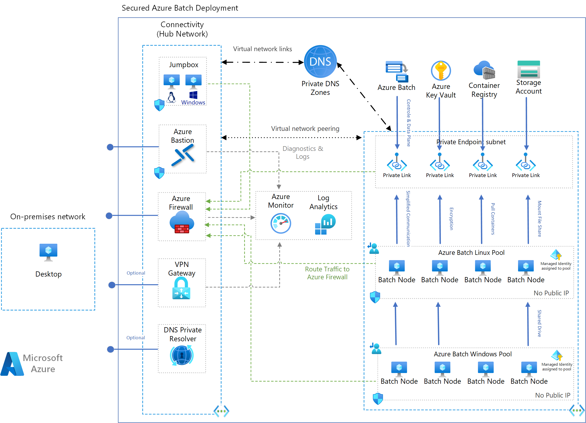

# Reference architecture for FSI workloads using Batch

<!-- From https://learn.microsoft.com/en-us/contribute/architecture-center/guide-templates -->
<!-- https://learn.microsoft.com/en-us/contribute/ -->
<!-- example: https://learn.microsoft.com/en-us/azure/architecture/reference-architectures/containers/aks/baseline-aks -->

This article describes a baseline architecture for running Financial Service Industry (FSI) workloads on Azure using Azure Batch.
A common computing pattern in FSI is to run a large number of compute-intensive simulations on an input dataset
that characterizes a financial instrument or a portfolio of financial instruments. The simulations are typically run in
parallel and the results are aggregated to produce a summary of the portfolio's risk profile. In this article, we describe
a reference architecture for running such simulations on Azure using Azure Batch.

This architecture is not focused on a particular workload, rather it focus on any application that wants to use Azure Batch
to run compute-intensive simulations. Any production deployment architecture will need to be customized to meet the specific
requirements of the workload and business environment. This architecture is intended to be used as to be a starting point
for such customizations for pre-production and production deployments.

The infrastructure-as-code (IaC) source-code for this reference architecture is available
[here](https://github.com/utkarshayachit/azbatch-starter). The included tutorials demonstrate how to deploy this reference
architecture and how to use it to run a sample FSI workload, named `azfinsim`. You can also use the following button
to deploy the resources under your subscription using Azure Portal.

## Architecture

_Download a [Visio file](https://arch-center.azureedge.net/architecture.vsdx) that contains this architecture diagram.
This file must be uploaded to `https://arch-center.azureedge.net/`_

### Network Topology

This architecture uses a hub-and-spoke network topology. The hub and spoke resources are deployed in separate virtual networks
that are connected through virtual network peering. The hub network contains shared resources such as firewalls, vpn gateways,
and jumpboxes. The spoke network contains the Batch service, Batch compute nodes and other service endpoints needed
by the workload e.g. storage accounts, container registry, etc. The spoke network is isolated from the public internet and
can only be accessed from the hub network. The highlights of the network topology are as follows:

* Resources on spoke are isolated from the public internet and can only be accessed from the hub network. This minimizes direct
  exposure of the resources to the public internet.
* All outgoing traffic, including that from the pool compute nodes is routed through a Firewall. This ensures that all
  outgoing traffic is filtered, logged and tracked.
* The Firewall is configured to allow only whitelisted traffic. This ensures that only the whitelisted traffic is allowed
  to go out of the virtual network.
* A VPN gateway can is optionally deployed on the hub network. This allows access to the spoke network from the on-premises network.
  Azure Bastion provides another optional way to connect to the hub network from the public internet. Both provide
  secure ways to connect to the hub network from the public internet.
* Windows and Linux jumpboxes are provided with preinstalled tools to access the resources deployed, submit jobs, and monitor
  their progress. These jumpboxes are deployed on the hub network and can be accessed from the on-premises network using the
  VPN gateway or Azure Bastion.
* All Azure services deployed use private endpoints to ensure that they are accessed over private network instead of accessing
  them through public endpoints. This also helps us to ensure that the services are not accessible from the public internet.
* NSG rules are setup to allow only the required traffic in and out of the virtual network. This helps protect the
  network from malicious attacks and monitor traffic in and out of the network. These rules even restrict the traffic
  between the resources in the virtual network.

#### Hub Virtual Network

The hub virtual network contains resources that allow or monitor traffic in and out of the spoke network. The virtual network
defines following subnets:

1. `GatewaySubnet`: subnet for the VPN gateway, if deployed.
2. `AzureBastionSubnet`: subnet for the Azure Bastion service, if deployed.
3. `AzureFirewallSubnet`: subnet for the Azure Firewall service.
4. `sn-jumpbox`: subnet for the jumpboxes.
5. `sn-dnspr`: subnet delegated to Azure DNS resolver.

#### Spoke Virtual Network

The spoke virtual network contains the Batch service, Batch compute nodes and other service endpoints needed by the workload.
The virtual network defines following subnets:

1. `pool-linux`: subnet for the linux pool.
2. `pool-windows`: subnet for the windows pool.
3. `private-endpoints`: subnet used for private endpoints for Azure services deployed on the spoke network.

The spoke is peered with the hub network. This allows the resources on the spoke network to access the resources on the hub
network. Route tables are setup to ensure that the traffic between the spoke is routed through the Firewall.

### Hub Resources

Let's start by looking at the resources deployed on the hub network. As mentioned above, these are shared resources that enable / filter / monitor
communication between the spoke network and the outside world. The resources deployed on the hub network are as follows:

* [Azure Firewall](https://azure.microsoft.com/services/azure-firewall): provides network-level protection for the network. The firewall is configured
  to allow only specific traffic in and out of the network. This helps protect the network from malicious attacks and monitor traffic in and out of the network.
  The rules are expected to be updated based on the business specific rules and regulations.

* [Azure VPN Gateway](https://azure.microsoft.com/services/vpn-gateway): provides ability to connect to the hub network from the public internet. This provides
  one of two ways for the users on the public internet to connect to the hub network. The other way is to use Azure Bastion service. The VPN gateway is
  assigned a public IP address so that VPN clients can connect to it from the public internet.

* [Azure Bastion](https://azure.microsoft.com/services/azure-bastion): provides ability to connect to the jumpboxes from the public internet. This provides
  one of two ways for the users on the public internet to connect to the jumpboxes. The other way is to use VPN gateway. Azure Bastion is deployed on the
  hub network and is assigned a public IP address so that users can connect to it from the public internet.

* [Linux Jumpbox](https://azure.microsoft.com/services/virtual-machines): a Linux VM with preinstalled tools to access the resources deployed, submit jobs, and
  monitor their progress. The jumpbox is deployed on the hub network and can be accessed from the on-premises network using the VPN gateway or Azure Bastion.

* [Windows Jumpbox](https://azure.microsoft.com/services/virtual-machines): a Windows VM with preinstalled tools to access the resources deployed, submit jobs, and
  monitor their progress. The jumpbox is deployed on the hub network and can be accessed from the on-premises network using the VPN gateway or Azure Bastion.

* [Log Analytics Workspace](https://azure.microsoft.com/services/log-analytics): provides ability to collect logs. Whenever possible, resources deployed are configured
  to save logs to the workspace. The logs are used to monitor the resources and troubleshoot issues.

* [Azure Application Insights](https://learn.microsoft.com/en-us/azure/azure-monitor/app/app-insights-overview?tabs=net): together with Log Analytics Workspace, provides
  performance monitoring and troubleshooting capabilities for the resources deployed.

* [Azure DNS Private Resolver](https://learn.microsoft.com/en-us/azure/dns/dns-private-resolver-overview): provides an inbound endpoint to resolve IPs of private endpoints if queried outside of the provisioned virtual network, e.g. from on-prem resources. Will be deployed if the Azure VPN Gateway is deployed.

### Spoke Resources

Let's now look at the resources deployed on the spoke network. These are the resources intended for executing the computation workloads and all supporting resources.
The resources deployed on the spoke network are as follows:

* [Azure Batch](https://azure.microsoft.com/services/batch): core service that our architecture relies on
  for cloud-native job scheduling and execution. Azure Batch manages the compute resources required,
  schedules the tasks on the compute resources, and monitors the tasks for completion. The Batch service is deployed
  with two pools: a pool named `linux` with linux compute nodes and a pool named `windows` with windows compute nodes.
  Both pools are setup to use `User Subscription` pool allocation mode. This ensures that all resources used internally by the
  Batch service are allocated under the same subscription as the Batch account and hence use the subscription specific quotas
  and policies. The pools are setup use the corresponding subnets on the spoke network, thus they get assigned address space from the
  subnet's address range. It also means that all NSG rules and traffic forwarding rules setup on those subnets are applied to the
  compute nodes as well. The pools is also setup to not assign public IP addresses to the compute nodes. This ensures that the
  compute nodes are not accessible from the public internet directly. To make it easier for workloads on executing on
  compute notes to access shared storage resources, the pools are setup to mount the supported storage resources on the compute nodes
  during initialization. The pools use `User Managed Identity` to authenticate the compute nodes with storage account, container registry,
  and any other resources as they join the Batch pool. This ensures that the compute nodes are authenticated using certificates instead
  of passwords or keys.

* [Azure Key Vault](https://azure.microsoft.com/services/key-vault): stores deployment secrets such as Batch account certificates. These certificates are used
  to authenticate compute node resources as they join the Batch pool. The Key Vault is deployed on the spoke network and is configured to allow access
  only from the Batch service. This ensures that the certificates are not accessible from the public internet.

* [Azure Storage](https://azure.microsoft.com/services/storage): stores input and output data. The deployment creates two storage accounts
  one for blob storage and one for file storage. The blob storage account is mounted on Linux pool using NFS. The file storage account is mounted
  on both Linux and Windows pool using SMB.

* [Azure Container Registry](https://azure.microsoft.com/services/container-registry): stores container images used by the Batch compute nodes. Using
  a private deployment of the container registry helps control access to container images and also provides a more secure way to store container images.
  The container registry is deployed on the spoke network and is configured to allow access only from the Batch service. This ensures that the container
  images are not accessible from the public internet.

* [Azure Managed Identity](https://learn.microsoft.com/en-us/azure/batch/managed-identity-pools): TODO: Verify with Utkarsh, if the final version uses managed identities which are assgined on Azure Batch Pool level.  
  
### Accessing the resources

To submit computation jobs to the Batch service, one needs to connect with the Batch service endpoint to submit jobs and monitor their progress. Since
the Batch service is setup to use private endpoints, it can only be accessed from within the network.
The architecture provides two options for the user to connect to the network to be able to submit jobs to the Batch service:

1. **Use VPN Gateway**. The user can connect to the hub network using a VPN Gateway. When connect to the VPN, the user can submit
   jobs to the Batch service from the local machine directly. This also makes it easier to monitor jobs using Batch Explorer
   installed on the local machine. This will require that the Azure CLI, Batch Explorer and other tools are installed on
   the local machine. Alternatively, once connected to the VPN, the user can use the Linux and/or Windows Jumpboxes to submit
   jobs to the Batch service. This will require that the user has a SSH client and/or RDP client installed on the local machine.

2. **Use Azure Bastion**. Instead of using VPN, the user can use Azure Bastion to log on to the Linux and/or Windows Jumpboxes.
   For this, the user logs on to the Azure portal and then uses Azure Bastion to log on to the jumpbox VM directly from the
   web browser. Once logged on to the jumpbox, the user can submit jobs to the Batch service using the Azure CLI, Batch Explorer
   and other tools installed on the jumpbox.

### Alternatives

<!-- > Use this section to talk about alternative Azure services or architectures that you might consider for this solution. Include the reasons why you might choose these alternatives. Customers find this valuable because they want to know what other services or technologies they can use as part of this architecture.

> What alternative technologies were considered and why didn't we use them? -->

* [Azure Kubernetes Service (AKS)](https://azure.microsoft.com/en-us/products/kubernetes-service). AKS can be used instead
  of Azure Batch service for a similar configuration for containerized applications.

* [Azure CycleCloud](https://azure.microsoft.com/en-us/services/cyclecloud). Azure CycleCloud can be used to manage
 HPC clusters on Azure. Such HPC clusters can be setup to run workloads similar to the ones targeted by this article.

## Contributors

<!-- > (Expected, but this section is optional if all the contributors would prefer to not include it)

> Start with the explanation text (same for every article), in italics. Then include the "Principal authors" list and the "Additional contributors" list (if there are additional contributors) (all in plain text, not italics or bold). Link each contributor's name to the person's LinkedIn profile. After the name, place a pipe symbol ("|") with spaces, and then enter the person's title. We don't include the person's company, MVP status, or links to additional profiles. Implement this format: -->

*This article is maintained by Microsoft. It was originally written by the following contributors.*

<!-- Principal authors: > Only the primary authors. List them alphabetically, by last name. Use this format: Fname Lname. If the article gets rewritten, keep the original authors and add in the new one(s).

 * [Author 1 Name](http://linkedin.com/ProfileURL) | (Title, such as "Cloud Solution Architect")
 * [Author 2 Name](http://linkedin.com/ProfileURL) | (Title, such as "Cloud Solution Architect")
 * > Continue for each primary author (even if there are 10 of them). -->

<!-- Other contributors: > Include contributing (but not primary) authors, major editors (not minor edits), and technical reviewers. List them alphabetically, by last name. Use this format: Fname Lname. It's okay to add in newer contributors.

 * [Contributor 1 Name](http://linkedin.com/ProfileURL) | (Title, such as "Cloud Solution Architect")
 * [Contributor 2 Name](http://linkedin.com/ProfileURL) | (Title, such as "Cloud Solution Architect") -->

Principal authors:

* [Utkarsh Ayachit](https://www.linkedin.com/in/utkarsh-ayachit/) | Principal Program Manager
* [Darko Mocelj](https://www.linkedin.com/in/darko-mocelj/) | EMEA HPC & AI Sr. Technology Specialist

## Next steps

* Bulleted list of third-party and other Microsoft links.
* Links shouldn't include en-us locale unless they don't work without it.
* Links to Microsoft Learn content should be site-relative, for example (/azure/feature/article-name).
* Don't include trailing slash in any links.

## Related resources

* Links to related Azure Architecture Center articles.
* Links should be relative, for example (../../solution-ideas/articles/article-name.yml).
