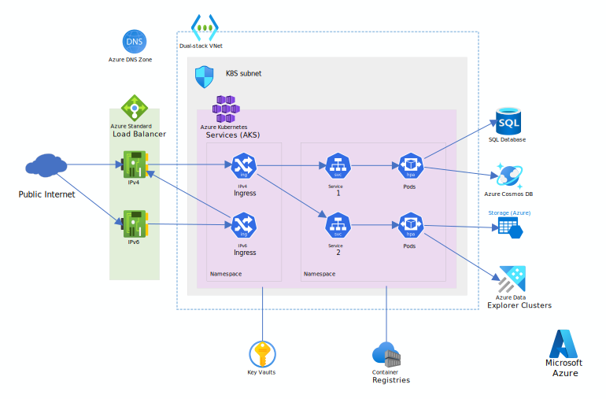

Due to IPv4 address exhaustion problem, IPv6 was introduced in 1995 and made as an Internet Standard in 2017. It's estimated that more than 50% traffic of United States is over IPv6. Unfortunately, the two protocols are not compatible, it means your infrastructure either runs IPv4 network or IPv6 network. This reference architecture details several configurations to enable users to run [Dual-stack kubenet networking AKS](https://learn.microsoft.com/en-us/azure/aks/configure-kubenet-dual-stack?tabs=azure-cli%2Ckubectl) (Preview). 

This architecture builds on the [AKS Baseline architecture](https://learn.microsoft.com/en-us/azure/architecture/reference-architectures/containers/aks/baseline-aks), Microsoft's recommended starting point for AKS infrastructure. The AKS baseline details infrastructural features like Azure Active Directory (Azure AD) workload identity, ingress and egress restrictions, resource limits, and other secure AKS infrastructure configurations. These infrastructural details are not covered in this document. It is recommended that you become familiar with the AKS baseline before proceeding with the dual-stack content.

# Architecture

# Dataflow

This approach is leveraging NAT64 proxy of Ingress Controller to translate external traffic to either IPv4 or IPv6.

## Option 1 - AKS Services running IPv4

- **IPv4 traffic** is directed to the corresponding services in the backend.
- **IPv6 traffic** reached IPv6 Ingress is translated to IPv4 through NAT64, then redirected to IPv4 ingress by Ingress Controller (e.g., Nginx). Once reaching IPv4 ingress, it works as normal IPv4 traffic carrying additional metadata like IPv6 source address if needed.

## Option 2 - AKS Services running IPv6  

Alternatively, AKS main traffic can run on top of IPv6, and IPv4 ingress serves as NAT46 proxy.

# Components

The architecture consists of the following components:

**Dual-stack** [Azure Kubernetes Service](https://learn.microsoft.com/en-us/azure/aks/configure-kubenet-dual-stack?tabs=azure-cli%2Ckubectl) is a managed Kubernetes cluster hosted in the Azure cloud. Azure manages the Kubernetes API service, and you only need to manage the agent nodes. Dual-stack AKS needs to run on Dual-stack Azure Virtual Network.

**Dual-stack** [Azure Virtual Network](https://azure.microsoft.com/services/virtual-network) provides highly secure virtual network environments on top of Azure infrastructure. By default, Azure Virtual Network supports IPv4 only, users need to enable IPv6 as one step in the deployment process.

[Azure Network Security Group](https://learn.microsoft.com/en-us/azure/virtual-network/network-security-groups-overview) filters traffic between Azure resources in an Azure virtual network.

[Azure DNS Zone](https://learn.microsoft.com/en-us/azure/dns/dns-zones-records) provides domain name resolution service for clients. Either IPv4 or IPv6 clients can connect to the same domain name without noticing any difference.

[Azure Standard Load Balancer](https://learn.microsoft.com/en-us/azure/load-balancer/load-balancer-overview) and [Azure Network Interface](https://learn.microsoft.com/en-us/azure/virtual-network/virtual-network-network-interface?tabs=network-interface-portal) are automatically created by AKS after Kubernetes's ingresses are deployed.

[Azure Container Registry](https://learn.microsoft.com/en-us/azure/container-registry/container-registry-intro) stores private container images that can be run in the AKS cluster.

[Azure Key Vault](https://azure.microsoft.com/services/key-vault) stores and manages security keys for AKS services.

# Alternatives

Another approach is for each functional service, there should be 1 IPv6 AKS Service listening to IPv6 Ingress, and 1 IPv4 AKS Service listening o IPv4 Ingress. This helps avoid a NAT64 hop for IPv6 traffic and vice versa.

# Consideration

## Reliability

Consider having AKS deployed across [availability zones](https://learn.microsoft.com/en-us/azure/aks/availability-zones), which help protect applications against planned maintenance events and unplanned outages.

## Security

Security provides assurances against deliberate attacks and the abuse of your valuable data and systems. For more information, see [Overview of the security pillar](https://learn.microsoft.com/en-us/azure/architecture/framework/security/overview).

## Cost Optimization

Use the [Azure pricing calculator](https://azure.microsoft.com/pricing/calculator) to estimate costs. Other considerations are described in the Cost section in [Microsoft Azure Well-Architected Framework](https://learn.microsoft.com/en-us/azure/architecture/framework/cost/overview).

# Next Step

Due to current [limitations](https://learn.microsoft.com/en-us/azure/aks/configure-kubenet-dual-stack?tabs=azure-cli%2Ckubectl#expose-the-workload-via-a-loadbalancer-type-service), traffic has to be proxied to the same IP version before processing. Once the limitations are removed, AKS Service can be created with mode `RequireDualStack` without the need of extra NAT64 proxy.

Once [Azure Application Gateway](https://learn.microsoft.com/en-us/azure/application-gateway/overview-v2) supports dual-stack networking, HTTP client can use it in place of Standard Load Balancer to benefit from its WAF and simplify deployment model.

# Related Resources
Microsoft learning:
- [Protect AKS with Azure Firewall](https://learn.microsoft.com/en-us/azure/firewall/protect-azure-kubernetes-service)

Relevant architectures:
- [AKS baseline cluster](https://learn.microsoft.com/en-us/azure/architecture/reference-architectures/containers/aks/baseline-aks)
- [Microservices architecture on AKS](https://learn.microsoft.com/en-us/azure/architecture/reference-architectures/containers/aks-microservices/aks-microservices)
- [Advanced microservices on AKS](https://learn.microsoft.com/en-us/azure/architecture/reference-architectures/containers/aks-microservices/aks-microservices)
- [AKS baseline for multi-region cluster](https://learn.microsoft.com/en-us/azure/architecture/reference-architectures/containers/aks-multi-region/aks-multi-cluster)
- [Build and deploy apps on AKS](https://learn.microsoft.com/en-us/azure/architecture/example-scenario/apps/devops-with-aks)