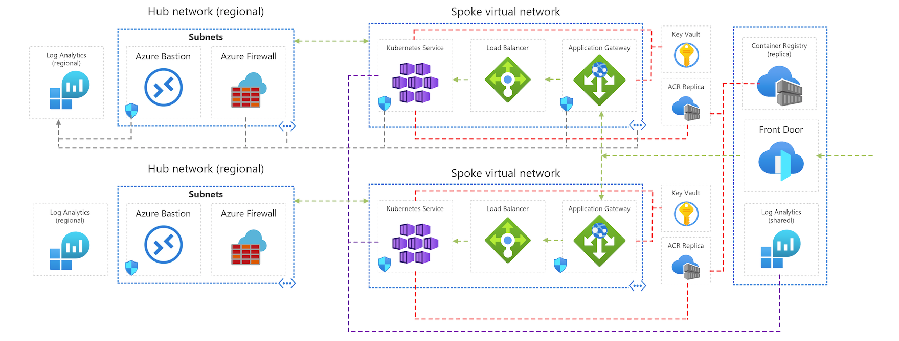

This reference architecture details how to run multiple instances of an Azure Kubernetes Service (AKS) cluster across multiple regions in an active/active and highly available configuration.

This architecture builds on the [AKS Baseline architecture](/azure/architecture/reference-architectures/containers/aks/secure-baseline-aks), Microsoft's recommended starting point for AKS infrastructure. The AKS baseline details infrastructural features like Azure Active Directory (Azure AD) pod identity, ingress and egress restrictions, resource limits, and other secure AKS infrastructure configurations. These infrastructural details are not covered in this document. It is recommended that you become familiar with the AKS baseline before proceeding with the microservices content.

[](images/aks-ha-large.png)

 A reference implementation of this architecture is available on [GitHub](https://github.com/mspnp/aks-baseline-multi-region).

## Components

Many components and Azure services are used in the multi-region AKS reference architecture. Only those with uniqueness to this multi-cluster architecture are listed below. For the remaining, please reference the [AKS Baseline architecture](/azure/architecture/reference-architectures/containers/aks/secure-baseline-aks).

- **Multiple clusters / multiple regions** Multiple AKS clusters are deployed, each in a separate Azure region. During normal operations, network traffic is routed between all regions. If one region becomes unavailable, traffic is routed to a region closest to the user who issued the request.
- **Azure Front Door** Azure Front door is used to load balance and route traffic to each AKS cluster. Azure Front Door allows for layer seven global routing, both of which are required for this reference architecture.
- **Azure Application Gateway** Each cluster in the solution is configured with an Azure Application Gateway instance sitting in front of it. These components are configured as the back ends for the Azure Front Door instance. The cluster networking configuration is fully detailed later in this document.
- **DNS** Azure DNS resolves the Azure Front Door requests to the IP address associated with Application Gateway. 
- **Key store** Azure Key Vault is provisioned in each region for storing sensitive values and keys.
- **Container registry** The container images for the workload are stored in a managed container registry.  In this architecture, a single Azure Container Registry is used for all Kubernetes instances in the cluster. Geo-replication for Azure Container Registry enables replicating images to the selected Azure regions and providing continued access to images even if a region is experiencing an outage.

## Design considerations

Consider the following items when designing a multi-region AKS deployment.

### Azure subscription

This reference architecture is split across several resource groups in a single subscription. This is to replicate the fact that many organizations will split certain responsibilities into specialized subscriptions (e.g. regional hubs/vwan in a Connectivity subscription and workloads in landing zone subscriptions). We expect you to explore this reference architecture within a single subscription, but when you implement this cluster at your organization, you will need to take what you've learned here and apply it to your expected subscription and resource group topology (such as those offered by the Cloud Adoption Framework.) This single subscription, multiple resource group model is for simplicity of demonstration purposes only.

### Cluster design

This reference architecture uses two cloud design patterns. [Geographical Node (geodes)](/azure/architecture/patterns/geodes), where any region can service any request, and [Deployment Stamps](/azure/architecture/patterns/deployment-stamp) where  multiple independent copies of an application or application component are deployed from a single source (deployment template). 

**Geographical Node pattern considerations:**

When selecting geographical regions for each individual AKS cluster, consider utilizing paired Azure regions. Paired regions consist of two regions within the same geography which influence how Azure maintenance is performed. As your cluster scales beyond two regions, continue to plan for regional pair placement for each pair of AKS clusters. For more information on pared regions, see [Azure Paired Regions](/azure/best-practices-availability-paired-regions).

Within each individual region, the members of the AKS node pool are spread across multiple availability zones to help prevent issues due to zonal failures. AKS availability zones are specified during deployment and cannot be updated once deployed. AKS has a limited set of regional support for availability zones, which influences regional cluster placement. For more information on AKS and Availability zones, including a list of supported regions, see [AKS Availability Zones](/azure/aks/availability-zones).

**Deployment stamp considerations**

When managing a multi-region AKS cluster, multiple AKS instances are deployed across multiple regions. Each one of these instances is considerd a stamp. In the event of a regional failure or the need to add more capacity and / or regional presensce for you cludert, you may need to create a new stamp instance. When selecting a process for creating and managing deployment stamps, or individual Kubernetes instances in this case, it is important to conside the following things:

- Select stamp definition technology that allows for generalized configuration such as infrastructure as code
- Provide instance-specific values using a deployment input mechanism such as variables or parameter files
- Select deployment tooling that allows for flexible, repeatable, and idempotent deployment
- In an active/active stamp configuration, consider how traffic is balanced across each stamp
- As stamps are added and removed from the collection, consider capacity and cost concerns
- Consider how to gain visibility and/or monitor the collection of stamps as a single unit

Each of these items is detailed with specific guidance in the following sections of this reference architecture.

### Cluster deployment and configuration

When deploying multiple Kubernetes clusters in highly available and geographically distributed configurations, it is essential to consider the sum of each Kubernetes cluster as a coupled unit. You will want to develop code-driven strategies for automated deployment and configuration to ensure that each Kubernetes instance is as identical as possible. You will want to consider strategies for scaling out and in by adding or removing additional Kubernetes instances. You will want to think through regional failure and ensure that any byproduct of a failure is compensated for in your deployment and configuration plan.

#### Deployment

You have many options for deploying an Azure Kubernetes Service cluster. The Azure portal, Azure CLI, Azure PowerShell module are all decent options for deploying individual or non-coupled AKS clusters. These tools, however, can present some challenges when working with many tightly coupled AKS clusters. For example, using the Azure portal opens the opportunity for miss-configuration due to missed steps. As well, the deployment and configuration of many clusters using the portal is a timely process requiring the focus of one or more engineers. While you can construct a repeatable and automated process using the command line tools, the onus of things like idempotency, deployment failure control, and failure recovery is on you and the scripts you build. 

We recommend using infrastructure as code solutions, such and Azure Resource Manager templates, Bicep templates or Terraform configurations. Infrastructure as code solutions will provide an automated, scalable, and idempotent deployment solution. This reference architecture includes an ARM Template for the solutions shared services and then another for the AKS clusters + regional services. Using infrastructure as code, a deployment stamp can be defined with generalized configurations such as networking, authorization, and diagnostics. A deployment parameter file can be provided with regional-specific values. With this configuration, a single template can be used to deploy an identical stamp across any region.

_Example parameter file used to deploy an AKS cluster into the centralus region. Multiple parameter files can be provided, one for each region into which an ASK instance needs to be created._

```json
{
    "$schema": "https://schema.management.azure.com/schemas/2019-04-01/deploymentParameters.json#",
    "contentVersion": "1.0.0.0",
    "parameters": {
      "location": {
        "value": "centralus"
      },
      "targetVnetResourceId": {
        "value": "<cluster-spoke-vnet-resource-id>"
      },
      "appInstanceId": {
        "value": "04"
      },
      "clusterAdminAadGroupObjectId": {
        "value": "<azure-ad-aks-admin-group-object-id>"
      },
      "k8sControlPlaneAuthorizationTenantId": {
        "value": "<tenant-id-with-user-admin-permissions>"
      },
      "clusterInternalLoadBalancerIpAddress": {
        "value": "10.244.4.4"
      },
      "logAnalyticsWorkspaceId": {
        "value": "<log-analytics-workspace-id>"
      },
      "containerRegistryId": {
        "value": "<container-registry-id>"
      },
      "acrPrivateDnsZonesId": {
        "value": "<acrPrivateDns-zones-id>"
      }
    }
  }
```

Once the cluster stamp has been defined, you have many options for deploying individual or multiple stamp instances. Our recommendation is to use modern continuous integration technology such as GitHub Actions or Azure DevOps Pipelines. The benefit of continuous integration based deployment solutions include:

- Code-based deployments that allow for stamps to be added and removed using code
- Integrated testing capabilities
- Integrated environment and staging capabilities
- Integrated secrets management solutons 
- Integration with code / deployment source control
- Deployment history and logging

_The following is an example from the included GitHub Action demonstrating the deployment of an individual AKS cluster. In this example, the Azure CLI activity is used to deploy the stamp ARM template, providing region-specific values found in the region-specific parameters file._

```yaml
- name: Azure CLI - Deploy AKS cluster - Region 1
    id: aks-cluster-region1
    if: success() && env.DEPLOY_REGION1 == 'true'
    uses: Azure/cli@v1.0.0
    with:
    inlineScript: |
        az group create --name rg-bu0001a0042-03 --location eastus2
        az deployment group create --resource-group rg-bu0001a0042-03 \
        --template-file "cluster-stamp.json" \
            --parameters @azuredeploy.parameters.eastus2.json \
            appGatewayListenerCertificate=${{ secrets.APP_GATEWAY_LISTENER_REGION1_CERTIFICATE_BASE64 }} \
            aksIngressControllerCertificate=${{ secrets.AKS_INGRESS_CONTROLLER_CERTIFICATE_BASE64 }}
```

#### Configuration

Once each Kubernetes instance or stamp has been deployed, cluster components such as ingress controllers, identity solutions, and application components need to be deployed and configured. You will also need to consider applying security, access, and governance policies across the cluster.

Similar to deployment, these configurations can become challenging to manage across several Kubernetes instances manually. Instead, consider the following options for configuration and policy at scale.

**GitOps Pipelines**

Instead of manually configuring Kubertnets components, consider using automated tooling to apply configurations to a Kubernetes cluster as these configurations are checked into a source repository. This process is often referred to as GitOps, and a popular GitOps solution for Kubernetes is Flux. 

GitOps and Flux are detailed in more depth in the [AKS Baseline Reference Architecture](/azure/architecture/reference-architectures/containers/aks/secure-baseline-aks#cluster-cicd). The important note here is that using a GitOps based approach to configuration helps ensure that each Kubernetes instance, int the multi-region cluster is configured similarly without bespoke effort.  

**Azure Policy**

< add content >

### Avalibility / Failover

< add content >

| Application Component | Supporting service | Interface | Documentation |
|---|---|---|---|
| Application pods regional | Deployment / ReplicaSet | Kubernetes Deployment API | [Kubernetes docs](https://kubernetes.io/docs/concepts/workloads/controllers/replicaset/) |
| Application pods global (pod) | Horizontal Pod Autoscaler | Kubernetes HPA API | [Kubernetes docs](https://kubernetes.io/docs/tasks/run-application/horizontal-pod-autoscale/) |
| Application pods global (node pools) | AKS cluster autoscaler  | AKS API | [AKS docs](/azure/aks/cluster-autoscaler) |
| AKS node pool regional (zonal failure) | Azure Availability Zones | Availability Zones API | [AKS docs](/azure/aks/availability-zones) |
| AKS node pools global (regional failure) | Azure Front Door | Azure Front Door API | [Front Door docs](/azure/frontdoor/) |

#### Scale considerations

Adjacent to responding to failure, you must make sure that your network and compute resources are right-sized to absorb any sudden increase in traffic due to region failover. For example, when using Azure CNI, make sure you have a subnet that can support all Pod IPs with a spiked traffic load.

### Cluster management

- Consideration related to management (overview)
- Issues with manual management
- Options and benefit for automated management and configuration (GitOps)

### Traffic management

In this architecture, the traffic flows over the internet at several points. The receiving service only accepts and forwards TLS-encrypted traffic for maximum security. For example, The spoke network only accepts TLS encrypted traffic coming from the internet. Within the spoke, the cluster only accepts TLS encrypted traffic from the gateway.

You will need multiple certificates depending on how many TLS termination points you want to have. 

The flow is replicated in both regions.


**1:** The user sends a request to a domain name (https://multicluster-fd-2vgfhderl7kec.azurefd.net). This domain is associated with the frontend host. The Azure Front Door instance validates the request against WAF policies, selects the fastest back-end (based on health and latency), and uses public DNS to resolve the back-end IP address (Azure Application Gateway instance).

**Data protection**

User data must be encrypted to make sure that the traffic between the client browser and Azure Front Door cannot be inspected or changed. It's encrypted with a wildcard certificate (*azurefd.net) issued for all subdomains of Azure Front Door. This is the first TLS/SSL termination point.

**Network security**

Enable Web application firewall (WAF) on Azure Front Door. The WAF policies use a set of rules to check the incoming traffic and allows or blocks the traffic. That initial security check protects the backend against common threats from the internet.

**2:** Front Door forwards the request to the selected backend: Application Gateway that serves as the entry point for the region. The traffic flows over the internet.

**Data protection**

Because the data is sent over the internet, Front Door encrypts it. This encryption makes sure unsafe traffic isn't introduced to the gateway. Azure Front Door only accepts certificates signed by a certificate authority (CA). 

**Network security**

Application Gateway has an integrated web application firewall (WAF) and inspects all inbound traffic.

Have rules that only allow Azure Application Gateway to accept traffic from Azure Front Door. To set the rules you need IP address for Front door. One way is to configure WAF rules in  Application Gateway. That requires manual set up of Front Door IP addresses, which can be cumbersome. The recommended approach is to use network security group (NSG) rules on the subnet that has Application Gateway. The rules can filter inbound (or outbound) traffic based on properties such as Source, Port, Destination. The Source property allows you to set a built-in service tag that indicates IP addresses for an Azure resource. This abstraction makes it easier to configure and maintain the rule and keep track of IP addresses. 

**3:** Application Gateway routes the traffic to its backend pool, which is the FDQN of the internal load balancer deployed as part of the cluster's ingress resources. 

**Data protection**

As an added security measure you can re-encrypt this traffic to make sure unsafe traffic doesn’t flow into the cluster subnet. 

Application Gateway uses SSL ciphers to create a secure connection to the AKS cluster. 

**Network security**

Application Gateway is deployed in a subnet of virtual network that hosts the cluster. It's not exposed to public traffic.

**4:** The internal load balancer forwards the traffic to the workload pods. The load balancer decrypts traffic and this is the final TLS termination point. From here on, traffic to the pods is over HTTP. 

### Shared resources

- Shared resource considerations (overview)
- Container Registry
- Log Analytics
- Azure Front Door

### Cluster access / security

#### Cluster access

- Access considerations (overview)
- Considerations related to one vs. multiple access control groups

#### Certificates

Front Door doesn't use self-signed certificates even in Dev/Test environments. To enable HTTPS traffic, you need to create your TLS/SSLcertificate that is signed by a certificate authority (CA).

This architecture uses [Certbot](https://certbot.eff.org/) to create a Let's Encrypt Authority X3 certificate. Certbot is a free, open-source software tool. It generates certificates for manually administrated websites. To check the validity of the website, Cerbot sends request to the domain. Respond to that request to acknowledge that you own the domain. If that validation is successful, a certificate is generated.

For information about other CAs supported by Front Door, see [Allowed certificate authorities for enabling custom HTTPS on Azure Front Door](/azure/frontdoor/front-door-faq#what-certificates-are-supported-on-azure-front-door-).

### Data and state

- Detail that state is not considered in the RI
- Options and considerations for state

### Cost considerations

- TDB