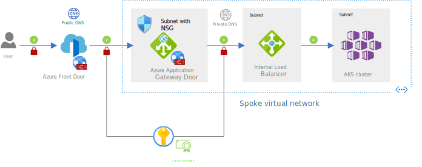

This reference architecture shows how to run an Azure Kubernetes Service (AKS) cluster in multiple regions to achieve high availability. 

## Architecture

This architecture builds on the baseline AKS cluster. Here are the main differences.

**Multiple regions**

The AKS cluster is deployed in each region. During normal operations, network traffic is routed to all regions. If one region becomes unavailable, traffic is routed to a region that is closest to the user who issued the request. This architecture uses two regions. 

**Load balancers**

Load balancers route traffic and distribute load to optimize resource use. The requirements of this architecture are:

- Global routing. The load balancer must distribute traffic across all regions. It must fail over to another region (closest to the user) if one region fails. It should check the health of the workload and fail over as quickly as possible. So, the service must support high availability features such as fast failover, caching, and so on.
- Layer 7 routing. The baseline AKS cluster only accepts HTTPS traffic. The load balancer needs to support layer 7 capabilities such as SSL offload. 

The baseline AKS cluster has Azure Application Gateway as the entry point. Even though it has Layer 7 capabilities, it's no longer sufficient in this architecture as the primary entry point because of the global routing requirement. Among other choices, Azure Traffic Manager is a global load balancer but it operates at Layer 4. We chose Azure Front Door because meets both requirements. 

> [!NOTE]
> 
> The other load balancers in the baseline AKS cluster remain unchanged. 
> - Application Gateway to secure internet-facing entry point to the cluster with a web application firewall (WAF). It receives traffic from Azure Front Door over the internet. Application Gateway in conjuction with Front Door can handle complex load-balancing at different levels.
> - Internal load balancer to route traffic within the virtual network.
> - Kubernetes ingress controller that runs in the cluster to route traffic between the pods that runs the workload and supporting services.

**DNS**

Azure DNS resolves the Azure Front Door requests to the IP address associated with Application Gateway. 

**Key store**

Azure Key Vault is provisioned in each region.  

**Container registry**

The container images for the workload are stored in a managed container registry. There's a single instance. Geo-replication for Azure Container Registry  is enabled. It will automatically replicate images to the selected Azure regions, and will provide continued access to images even if a region were experiencing an outage.

## Ingress traffic flow

In this architecture, the traffic flows over the internet at several points. The receiving service only accepts and forwards TLS-encrypted traffic for maximum security. For example, The spoke network only accepts TLS encrypted traffic coming from the internet. Within the spoke, the cluster only accepts TLS encrypted traffic from the gateway.

You will need multiple certificates depending on how many TLS termination points you want to have. 

The flow is replicated in both regions.

**Terminology**

- Frontend host: The entity that receives the request from the client over the public internet. This is Azure Front Door.
- Backends: The receiver of the request. In this architecture, there are several backends. For example, Azure Application Gateway hosts are backends to Azure Front Door. The internal load balancer, which is in the virtual network that hosts the AKS cluster, is a backend to Application Gateway. 
- Backend pool: A collection of FQDNs for the backends.

1. The user sends a request to a domain name (multicluster-fd-2vgfhderl7kec.azurefd.net). Only HTTPS traffic is allowed.

    The domain is associated with the frontend host. It does these tasks:
    - Validates against WAF policies. 
    - Selects the fastest backend in the available backend pool based on health and latency checks.  
    - Uses a public DNS to resolve the selected backend host name to an IP address. That address is the public IP address of the Azure Application Gateway instance. 

    **Data protection**

    User data must be encrypted to make sure that the traffic between the client browser and Azure Front Door cannot be inspected or changed. It's encrypted with a wildcard certificate (*azurefd.net) issued for all subdomains of Azure Front Door.

    This is the first TLS/SSL termination point.

    **Network security**

    Enable Web application firewall (WAF) on Azure Front Door. The WAF policies use a set of rules to check the incoming traffic and allows or blocks the traffic. That initial security check protects the backend against common threats from the internet.

    > [!TIP]
    >
    > The reference implementation enables WAF in prevention mode and uses Azure-managed rule sets. For denied traffic, the response is 403 (Forbidden).

2. Front Door forwards the request to the selected backend:  Application Gateway that serves as the entry point for the region. The traffic flows over the internet.

    **Data protection**

    Because the data is sent over the internet, Front Door encrypts it. This encryption makes sure unsafe traffic isn't introduced to the gateway. Azure Front Door only accepts certificates signed by a certificate authority (CA). 

    > [!TIP]
    >
    >The reference implementation uses Let's Encrypt Authority X3 certificate for Azure Front Door. For details about to create this certificate, see <!--link> .

    Application Gateway does TLS handshake and is the second TLS/SSL termination point.

    > [!TIP]
    >
    >The reference implementation selects SSL ciphers for TLS version 1.2. A client with an older certificate is denied. The choice governs the use of newer certificates to make sure they are up to date from a security perspective.

    **Network security**

    Application Gateway has an integrated web application firewall (WAF) and inspects all inbound traffic.

    Have rules that only allow Azure Application Gateway to accept traffic from Azure Front Door. To set the rules you need IP address for Front door. One way is to configure WAF rules in  Application Gateway. That requires manual set up of Front Door IP addresses, which can be cumbersome. The recommended approach is to use network security group (NSG) rules on the subnet that has Application Gateway. The rules can filter inbound (or outbound) traffic based on properties such as Source, Port, Destination. The Source property allows you to set a built-in service tag that indicates IP addresses for an Azure resource. This abstraction makes it easier to configure and maintain the rule and keep track of IP addresses. 

    > [!TIP]
    >
    >The reference implementation defines an NSG rule that allows Azure Application Gateway to only receive HTTPS traffic from  Azure Front Door. It uses the AzureFrontDoor.Backend service tag to indicate the source of traffic. 

3. Application Gateway routes the traffic to its backend pool, which is the FDQN of the internal load balancer deployed as part of the cluster's ingress resources. 

    **Data protection**

    As an added security measure you can re-encrypt this traffic to make sure unsafe traffic doesn’t flow into the cluster subnet. 
 
    Application Gateway uses SSL ciphers to create a secure connection to the AKS cluster. 

    > [!TIP]
    >
    >In this reference implementation, Azure Application Gateway  re-encrypts the traffic with another certificate.   

    **Network security**

    Application Gateway is deployed in a subnet of virtual network that hosts the cluster. It's not exposed to public traffic.

4. The internal load balancer forwards the traffic to the workload pods. 

    The load balancer decrypts traffic and this is the final TLS termination point. From here on, traffic to the pods is over HTTP. 

## Secret management

Encrypting and decrypting traffic is part of the regular flow. A single request can require multiple certificates.

Store the encryption keys and certificates in a managed key store, such as Azure Key Vault and make sure the secrets are readily available. In this architecture, 

> [!TIP]
>
>In this reference implementation, Azure Key Vault is provisioned in each region and stays next to the cluster. The baseline architecture uses private links to connect to the key vault.

Certificates are not reused between regions. Each Key Vault stores secrets unique to that region. Also, wildcard certificates are not recommended.

### Health checks

Before forwarding requests to the backends, each forwarding service checks the health of the backend pool through health probes.

Azure Front Door periodically sends probe request to backends for these purposes:
- Check the health of the backends. You can optimize cost by not requesting the message body in the response. For more information, see [How Front Door determines backend health](/azure/frontdoor/front-door-health-probes#how-front-door-determines-backend-health).
- Determine the fastest available backend by measuring latency of each request.

Azure Application Gateway uses health probes to check the availability of the backend in the allow list.

## Azure Front Door certificate 
To enable HTTPS traffic, you need to create your TLS/SSLcertificate that is signed by a certificate authority (CA). Front Door doesn't use self-signed certificates even in Dev/Test environments. 

This architecture uses Certbot to create a Let's Encrypt Authority X3 certificate. Certbot is a free, open-source software tool. It generates certificates for on manually administrated websites. To check the validity of the website, Cerbot sends request to the domain. Respond to that request to acknowledge that you own the domain. If that validation is successful, a certificate is generated.

For step-by-step instructions, see [Valid Certificate Generation for an Azure domain with your subdomain](https://github.com/mspnp/aks-secure-baseline/blob/multi-cluster/certificate-generation/README.md).

For information about other CAs supported by Front Door, see [Allowed certificate authorities for enabling custom HTTPS on Azure Front Door](/azure/frontdoor/front-door-troubleshoot-allowed-ca).

## Failover

## Monitor operations
LA workspace

## Cost considerations
Front Door
- uses HEAD for health probes so that during health checks, response body is not checked. There are cost benefits to doing this. 

Double region deployment

ACR geo replication