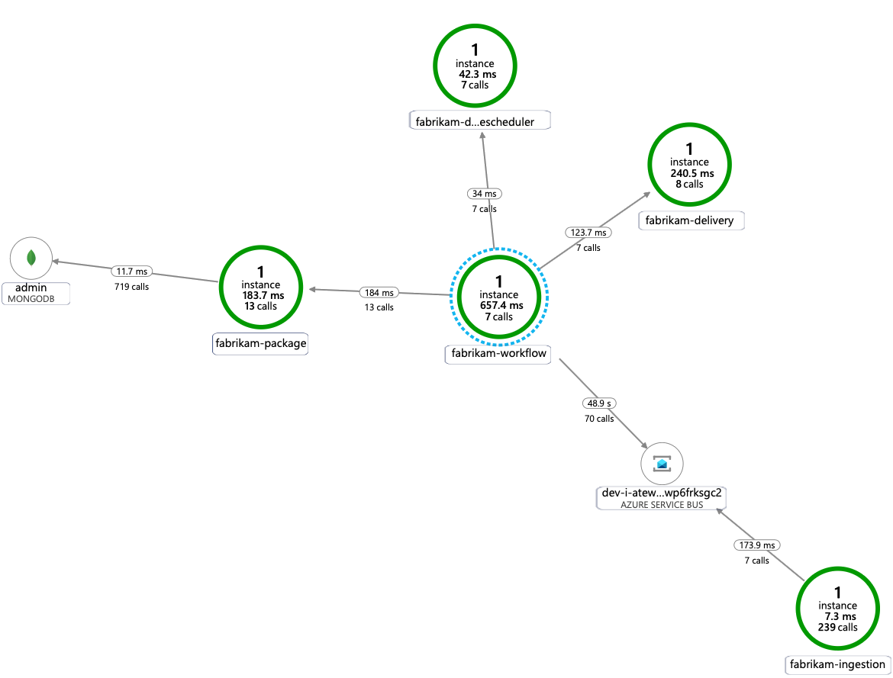

This reference architecture details several configurations to consider when running microservices on Azure Kubernetes Services. Topics include configuring network policies, pod autoscaling, and distributed tracing across a microservice-based application.

This architecture builds on the [AKS Baseline architecture](/azure/architecture/reference-architectures/containers/aks/baseline-aks), Microsoft's recommended starting point for AKS infrastructure. The AKS baseline details infrastructural features like Azure Active Directory (Azure AD) workload identity, ingress and egress restrictions, resource limits, and other secure AKS infrastructure configurations. These infrastructural details are not covered in this document. It is recommended that you become familiar with the AKS baseline before proceeding with the microservices content.

 A reference implementation of this architecture is available on [GitHub](https://github.com/mspnp/aks-fabrikam-dronedelivery).

## Architecture

:::image type="content" border="false" source="images/aks-production-deployment.png" alt-text="Network diagram showing the hub-spoke network with two peered virtual networks and the Azure resources this implementation uses." lightbox="images/aks-production-deployment.png":::

*Download a [Visio file](https://arch-center.azureedge.net/aks-microservices-advanced-production-deployment.vsdx) of this architecture.*

If you would prefer to start with a more basic microservices example on AKS, see [Microservices architecture on AKS](./aks-microservices.yml).

### Workflow

This request flow implements the [Publisher-Subscriber](../../../patterns/publisher-subscriber.yml), [Competing Consumers](../../../patterns/competing-consumers.yml), and [Gateway Routing](../../../patterns/gateway-routing.yml) cloud design patterns. The messaging flow proceeds as follows:

1. An HTTPS request is submitted to schedule a drone pickup. The requests pass through Azure Application Gateway into the ingestion web application, which runs as an in-cluster microservice in AKS.

1. The ingestion web application produces a message and sends it to the Service Bus message queue.

1. The backend system assigns a drone and notifies the user. The workflow:

   - Consumes message information from the Service Bus message queue.
   - Sends an HTTPS request to the Delivery microservice, which passes data to Azure Cache for Redis external data storage.
   - Sends an HTTPS request to the Drone Scheduler microservice.
   - Sends an HTTPS request to the Package microservice, which passes data to MongoDB external data storage.

1. An HTTPS GET request is used to return delivery status. This request passes through the Application Gateway into the Delivery microservice.

1. The delivery microservice reads data from Azure Cache for Redis.

### Components

This architecture uses the following Azure components:

**[Azure Kubernetes Service](https://azure.microsoft.com/services/kubernetes-service)** is an Azure offering that provides a managed Kubernetes cluster. When using AKS, the Kubernetes API server is managed by Azure. The Kubernetes nodes or node pools are accessible and can be managed by the cluster operator.

The AKS infrastructure features used in this architecture include:

  - [System and user node pool separation](/azure/aks/use-system-pools#system-and-user-node-pools)
  - [AKS-managed Azure AD for role-based access control (RBAC)](/azure/aks/managed-aad)
  - [Azure AD workload identity](/azure/aks/workload-identity-overview)
  - [Azure Policy Add-on for AKS](/azure/aks/use-pod-security-on-azure-policy)
  - [Azure Container Networking Interface (CNI)](/azure/aks/configure-azure-cni)
  - [Azure Monitor container insights](/azure/azure-monitor/insights/container-insights-overview)

**[Azure Virtual Networks](https://azure.microsoft.com/services/virtual-network)** are isolated and highly secure environments for running virtual machines (VMs) and applications. This reference architecture uses a peered hub-spoke virtual network topology. The hub virtual network holds the Azure firewall and Azure Bastion subnets. The spoke virtual network holds the AKS system and user node pool subnets and the Azure Application Gateway subnet.

**[Azure Private Link](https://azure.microsoft.com/services/private-link)** allocates specific private IP addresses to access Azure Container Registry and Key Vault from [Private Endpoints](/azure/private-link/private-endpoint-overview) within the AKS system and user node pool subnet.

**[Azure Application Gateway](https://azure.microsoft.com/services/application-gateway)** with web application firewall (WAF) exposes HTTP(S) routes to the AKS cluster and load balances web traffic to the web application. This architecture uses [Azure Application Gateway Ingress Controller](https://github.com/Azure/application-gateway-kubernetes-ingress) (AGIC) as the Kubernetes ingress controller.

**[Azure Bastion](https://azure.microsoft.com/services/azure-bastion)** provides secure remote desktop protocol (RDP) and secure shell (SSH) access to VMs in the virtual networks by using a secure socket layer (SSL), without the need to expose the VMs through public IP addresses.

**[Azure Firewall](https://azure.microsoft.com/services/azure-firewall)** is a network security service that protects all the Azure Virtual Network resources. The firewall allows only approved services and fully qualified domain names (FQDNs) as egress traffic.

**External storage and other components:**

**[Azure Key Vault](https://azure.microsoft.com/services/key-vault)** stores and manages security keys for AKS services.

**[Azure Container Registry](https://azure.microsoft.com/services/container-registry)** stores private container images that can be run in the AKS cluster. AKS authenticates with Container Registry using its Azure AD managed identity. You can also use other container registries like Docker Hub.

**[Azure Cosmos DB](https://azure.microsoft.com/services/cosmos-db)** stores data using the open-source [Azure Cosmos DB for MongoDB](/azure/cosmos-db/mongodb-introduction). Microservices are typically stateless and write their state to external data stores. Azure Cosmos DB is a NoSQL database with open-source APIs for MongoDB and Cassandra.

**[Azure Service Bus](https://azure.microsoft.com/services/service-bus/)** offers reliable cloud messaging as a service and simple hybrid integration. Service Bus supports asynchronous messaging patterns that are common with microservices applications.

**[Azure Cache for Redis](https://azure.microsoft.com/services/cache)** adds a caching layer to the application architecture to improve speed and performance for heavy traffic loads.

**[Azure Monitor](https://azure.microsoft.com/services/monitor)** collects and stores metrics and logs, including application telemetry and Azure platform and service metrics. You can use this data to monitor the application, set up alerts and dashboards, and perform root cause analysis of failures.

**Other operations support system (OSS) components:**

**[Helm](https://helm.sh/)**, a package manager for Kubernetes that bundles Kubernetes objects into a single unit that you can publish, deploy, version, and update.

**[Azure Key Vault Secret Store CSI provider](https://github.com/Azure/secrets-store-csi-driver-provider-azure)**, gets secrets stored in Azure Key Vault and uses the [Secret Store CSI driver](https://github.com/kubernetes-sigs/secrets-store-csi-driver) interface to mount them into Kubernetes pods.

**[Flux](https://fluxcd.io)**, an open and extensible continuous delivery solution for Kubernetes, powered by the GitOps Toolkit.

## Scenario details

The example [Fabrikam Drone Delivery Shipping App](https://github.com/mspnp/aks-fabrikam-dronedelivery) shown in the preceding diagram implements the architectural components and practices discussed in this article. In this example, Fabrikam, Inc., a fictitious company, manages a fleet of drone aircraft. Businesses register with the service, and users can request a drone to pick up goods for delivery. When a customer schedules a pickup, the backend system assigns a drone and notifies the user with an estimated delivery time. While the delivery is in progress, the customer can track the drone's location with a continuously updated ETA.

### Potential use cases

This solution is ideal for the aircraft, aerospace, and aviation industries.

## Recommendations

Implement these recommendations when deploying advanced AKS microservices architectures.

### Application Gateway Ingress Controller (AGIC)

API [Gateway Routing](../../../patterns/gateway-routing.yml) is a general [microservices design pattern](https://microservices.io/patterns/apigateway.html). An API gateway acts as a reverse proxy that routes requests from clients to microservices. The Kubernetes *ingress* resource and the *ingress controller* handle most API gateway functionality by:

Routing client requests to the correct backend services provides a single endpoint for clients and help decouple clients from services.
- Aggregating multiple requests into a single request to reduce chatter between the client and the backend.
- Offloading functionality like SSL termination, authentication, IP restrictions, and client rate-limiting or throttling from the backend services.

The state of the AKS cluster is translated to Application Gateway-specific configuration and applied via Azure Resource Manager.

External ingress controllers simplify traffic ingestion into AKS clusters, improve safety and performance, and save resources. This architecture uses the [Azure Application Gateway Ingress Controller (AGIC)](/azure/application-gateway/ingress-controller-overview) for ingress control. Using Application Gateway to handle all traffic eliminates the need for an extra load balancer. Because pods establish direct connections against Application Gateway, the number of required hops is reduced, which results in better performance.

Application Gateway has built-in autoscaling capabilities, unlike in-cluster ingress controllers that must be scaled out if they consume an undesired amount of compute resources. Application Gateway can perform layer-7 routing and SSL termination and has end-to-end Transport Layer Security (TLS) integrated with a built-in *web application firewall (WAF)*.

For the [AGIC](https://azure.github.io/application-gateway-kubernetes-ingress/) ingress option, you must enable [CNI networking](/azure/aks/configure-azure-cni) when you configure the AKS cluster because Application Gateway is deployed into a subnet of the AKS virtual network. Multi-tenant workloads, or a single cluster that supports development and testing environments, could require more ingress controllers.

### Zero-trust network policies

Network policies specify how AKS pods are allowed to communicate with each other and with other network endpoints. By default, all ingress and egress traffic is allowed to and from pods. When designing how your microservices communicate with each other and with other endpoints, consider following a *zero trust principle* where access to any service, device, application, or data repository requires explicit configuration.

One strategy in implementing a zero-trust policy is to create a network policy that denies all ingress and egress traffic to all pods within the target namespace. The following example shows a 'deny all policy' that would apply to all pods located in the backend-dev namespace.

```yaml
apiVersion: networking.k8s.io/v1
kind: NetworkPolicy
metadata:
  name: default-deny-all
  namespace: backend-dev
spec:
  podSelector: {}
  policyTypes:
  - Ingress
  - Egress
```

Once a restrictive policy is in place, begin to define specific network rules to allow traffic into and out of each pod in the microservice. In the following example, the network policy is applied to any pod in the backend-dev namespace with a label that matches *app.kubernetes.io/component: backend*. The policy denies any traffic unless sourced from a pod with a label that matches *app.kubernetes.io/part-of: dronedelivery*.

```yaml
apiVersion: networking.k8s.io/v1
kind: NetworkPolicy
metadata:
  name: package-v010-dev-np-allow-ingress-traffic
  namespace: backend-dev
spec:
  podSelector:
    matchLabels:
      app.kubernetes.io/component: backend
  ingress:
  - from:
    - podSelector:
        matchLabels:
          app.kubernetes.io/part-of: dronedelivery
    ports:
    - port: 80
      protocol: TCP
```

For more information on Kubernetes network policies and additional examples of potential default policies, see [Network Policies in the Kubernetes documentation](https://kubernetes.io/docs/concepts/services-networking/network-policies).

### Resource quotas

Resource quotas are a way for administrators to reserve and limit resources across a development team or project. You can set resource quotas on a namespace and use them to set limits on:

- Compute resources, such as CPU and memory, or GPUs.
- Storage resources, including the number of volumes or amount of disk space for a given storage class.
- Object count, such as the maximum number of secrets, services, or jobs that can be created.

Once the cumulative total of resource requests or limits passes the assigned quota, no further deployments are successful.

Resource quotas ensure that the total set of pods assigned to the namespace can't exceed the resource quota of the namespace. The front end can't starve the backend services for resources or vice-versa.

When you define resource quotas, all pods created in the namespace must provide limits or requests in their pod specifications. If they don't provide these values, the deployment is rejected.

The following example shows a pod spec that sets resource quota requests and limits:

```yml
requests:
  cpu: 100m
  memory: 350Mi
limits:
  cpu: 200m
  memory: 500Mi
```

For more information about resource quotas, see:
- [Enforce resource quotas](/azure/aks/operator-best-practices-scheduler#enforce-resource-quotas)
- [Resource quotas](https://kubernetes.io/docs/concepts/policy/resource-quotas/)

### Autoscaling

Kubernetes supports *autoscaling* to increase the number of pods allocated to a deployment or increase the nodes in the cluster to increase the total compute resources available. Autoscaling is a self-correcting autonomous feedback system. Although you can scale pods and nodes manually, autoscaling minimizes the chances of services becoming resource-starved at high loads. An autoscaling strategy must take both pods and nodes into account.

#### Cluster autoscaling

The *cluster autoscaler* (CA) scales the number of nodes. Suppose pods can't be scheduled because of resource constraints; the cluster autoscaler provisions more nodes. You define a minimum number of nodes to keep the AKS cluster and your workloads operational and a maximum number of nodes for heavy traffic. The CA checks every few seconds for pending pods or empty nodes and scales the AKS cluster appropriately.

The following example shows the CA configuration from the ARM template:

```json
"autoScalerProfile": {
    "scan-interval": "10s",
    "scale-down-delay-after-add": "10m",
    "scale-down-delay-after-delete": "20s",
    "scale-down-delay-after-failure": "3m",
    "scale-down-unneeded-time": "10m",
    "scale-down-unready-time": "20m",
    "scale-down-utilization-threshold": "0.5",
    "max-graceful-termination-sec": "600",
    "balance-similar-node-groups": "false",
    "expander": "random",
    "skip-nodes-with-local-storage": "true",
    "skip-nodes-with-system-pods": "true",
    "max-empty-bulk-delete": "10",
    "max-total-unready-percentage": "45",
    "ok-total-unready-count": "3"
},
```
The following lines in the ARM template set example minimum and maximum nodes for the CA:

```json
"minCount": 2,
"maxCount": 5,
```

#### Pod autoscaling

The *Horizontal Pod Autoscaler (HPA)* scales pods based on observed CPU, memory, or custom metrics. To configure horizontal pod scaling, you specify target metrics and the minimum and the maximum number of replicas in the Kubernetes deployment pod spec. Load test your services to determine these numbers.

CA and HPA work well together, so enable both autoscaler options in your AKS cluster. HPA scales the application, while CA scales the infrastructure.

The following example sets resource metrics for HPA:

```yaml
apiVersion: autoscaling/v2beta2
kind: HorizontalPodAutoscaler
metadata:
  name: delivery-hpa
spec:
  scaleTargetRef:
    apiVersion: apps/v1
    kind: Deployment
    name: delivery
  minReplicas: 2
  maxReplicas: 5
  metrics:
    - type: Resource
      resource:
        name: cpu
        targetAverageUtilization: 60
```

HPA looks at actual resources consumed or other metrics from running pods, but the CA provisions nodes for pods that aren't scheduled yet. Therefore, CA looks at the requested resources, as specified in the pod spec. Use load testing to fine-tune these values.

### Health probes

Kubernetes load balances traffic to pods that match a label selector for a service. Only pods that started successfully and are healthy receive traffic. If a container crashes, Kubernetes removes the pod and schedules a replacement.

In Kubernetes, a pod can expose two types of health probe:

- The *liveness probe* tells Kubernetes whether a pod started successfully and is healthy.
- The *readiness probe* tells Kubernetes whether a pod is ready to accept requests.

The liveness probes handle pods that are still running but are unhealthy and should be recycled. For example, if a container serving HTTP requests hangs, the container doesn't crash, but it stops serving requests. The HTTP liveness probe stops responding, which informs Kubernetes to restart the pod.

Sometimes, a pod might not be ready to receive traffic, even though the pod started successfully. For example, the application running in the container might be performing initialization tasks. The readiness probe indicates whether the pod is ready to receive traffic.

Microservices should expose endpoints in their code that facilitate health probes, with delay and timeout tailored specifically to the checks they perform. The [HPA formula](https://kubernetes.io/docs/tasks/run-application/horizontal-pod-autoscale/#algorithm-details) keys almost exclusively off the Ready phase on a pod, so it's critical that health probes exist and are accurate.

### Monitoring

In a microservices application, *Application Performance Management (APM)* monitoring is critical for detecting anomalies, diagnosing issues, and quickly understanding the dependencies between services. [Application Insights](/azure/azure-monitor/app/app-insights-overview), which is part of Azure Monitor, provides APM monitoring for live applications written in .NET Core, Node.js, Java, and many other application languages.

Application Insights:

- Logs HTTP requests, including latency and result code.
- Enables distributed tracing by default.
- Includes an operation ID in traces, so you can match all traces for a particular operation.
- Often includes additional contextual information in traces.

To contextualize services telemetry with the Kubernetes world, integrate Azure Monitor telemetry with AKS to collect metrics from controllers, nodes, and containers, as well as container and node logs. If you're using .NET, the [Application Insights for Kubernetes](https://github.com/microsoft/ApplicationInsights-Kubernetes) library enriches Application Insights telemetry with image, container, node, pod, label, and replica set information.

The following diagram shows an example of the application dependency map that Application Insights generates for an AKS microservices telemetry trace:



For more information on options for instrumenting common languages for application insights integration, see [Application monitoring for Kubernetes](/azure/azure-monitor/app/kubernetes-codeless).

## Considerations

These considerations implement the pillars of the Azure Well-Architected Framework, which is a set of guiding tenets that can be used to improve the quality of a workload. For more information, see [Microsoft Azure Well-Architected Framework](/azure/architecture/framework).

### Scalability

Consider the following points when planning for scalability.

- Don't combine autoscaling and imperative or declarative management of the number of replicas. Users and an autoscaler both attempting to modify the number of replicas may cause unexpected behavior. When HPA is enabled, reduce the number of replicas to the minimum number you want to be deployed.

- A side-effect of pod autoscaling is that pods may be created or evicted frequently, as scale-out and scale-in events happen. To mitigate these effects:

  - Use readiness probes to let Kubernetes know when a new pod is ready to accept traffic.
  - Use pod disruption budgets to limit how many pods can be evicted from a service at a time.

- You can't change the VM size after creating a cluster, so do initial capacity planning to choose an appropriate VM size for the agent nodes when you create the cluster.

- Multi-tenant or other advanced workloads might have node pool isolation requirements that demand more and likely smaller subnets. For more information about creating node pools with unique subnets, see [Add a node pool with a unique subnet](/azure/aks/use-multiple-node-pools). Organizations have different standards for their hub-spoke implementations. Be sure to follow your organizational guidelines.

### Manageability

Consider the following points when planning for manageability.

- Manage the AKS cluster infrastructure via an automated deployment pipeline. The [reference implementation](https://github.com/mspnp/aks-fabrikam-dronedelivery) for this architecture provides a [GitHub Actions](https://help.github.com/actions) workflow that you can reference when building your pipeline.

- The workflow file deploys the infrastructure only, not the workload, into the already-existing virtual network and Azure AD configuration. Deploying infrastructure and workload separately lets you address distinct lifecycle and operational concerns.

- Consider your workflow as a mechanism to deploy to another region if there is a regional failure. Build the pipeline so that you can deploy a new cluster in a new region with parameter and input alterations.

### Security

Security provides assurances against deliberate attacks and the abuse of your valuable data and systems. For more information, see [Overview of the security pillar](/azure/architecture/framework/security/overview).

Consider the following points when planning for security.

- An AKS pod authenticates itself by using a *workload identity* stored in Azure AD. Using a workload identity is preferable because it doesn't require a client secret.

- With managed identities, the executing process can quickly get Azure Resource Manager OAuth 2.0 tokens; there is no need for passwords or connection strings. In AKS, you can assign identities to individual pods by using [Azure Active Directory (Azure AD) workload identity](/azure/aks/workload-identity-overview).

- Each service in the microservice application should be assigned a unique workload identity to facilitate least-privileged RBAC assignments. You should only assign identities to services that require them.

- In cases where an application component requires Kubernetes API access, ensure that application pods are configured to use a service account with appropriately scoped API access. For more information on configuring and managing Kubernetes service account, see [Managing Kubernetes Service Accounts](https://kubernetes.io/docs/reference/access-authn-authz/service-accounts-admin/).

- Not all Azure services support data plane authentication using Azure AD. To store credentials or application secrets for those services, for third-party services, or for API keys, use Azure Key Vault. Azure Key Vault provides centralized management, access control, encryption at rest, and auditing of all keys and secrets.

- In AKS, you can mount one or more secrets from Key Vault as a volume. The pod can then read the Key Vault secrets just like a regular volume. For more information, see the [secrets-store-csi-driver-provider-azure](https://github.com/Azure/secrets-store-csi-driver-provider-azure) project on GitHub.

### Cost optimization

Cost optimization is about looking at ways to reduce unnecessary expenses and improve operational efficiencies. For more information, see [Overview of the cost optimization pillar](/azure/architecture/framework/cost/overview).

- The [Cost section in the Microsoft Azure Well-Architected Framework](/azure/architecture/framework/cost/overview) describes cost considerations. Use the [Azure pricing calculator](https://azure.microsoft.com/pricing/calculator) to estimate costs for your specific scenario.

- AKS has no costs associated with deployment, management, and operations of the Kubernetes cluster. You only pay for the VM instances, storage, and networking resources the cluster consumes. Cluster autoscaling can significantly reduce the cost of the cluster by removing empty or unused nodes.

- To estimate the cost of the required resources, see the [Container Services calculator](https://azure.microsoft.com/pricing/calculator/?service=kubernetes-service).

## Next steps

- [Introduction to Azure Kubernetes Service](/azure/aks/intro-kubernetes)
- [What is Azure Virtual Networks?](/azure/virtual-network/virtual-networks-overview)
- [What is Azure Private Link?](/azure/private-link/private-link-overview)
- [What is Azure Application Gateway?](/azure/application-gateway/overview)
- [What is Azure Bastion?](/azure/bastion/bastion-overview)
- [About Azure Key Vault](/azure/key-vault/general/overview)
- [Introduction to Azure Container Registry](/azure/container-registry/container-registry-intro)
- [Welcome to Azure Cosmos DB](/azure/cosmos-db/introduction)
- [Azure Monitor overview](/azure/azure-monitor/overview)

## Related resources

- [Baseline architecture for an Azure Kubernetes Service (AKS) cluster](/azure/architecture/reference-architectures/containers/aks/baseline-aks)
- [Design, build, and operate microservices on Azure with Kubernetes](../../../microservices/index.yml)
- [Microservices architecture on AKS](./aks-microservices.yml)
- [Monitor a microservices architecture in AKS](../../../microservices/logging-monitoring.yml)
- [Performance tuning scenario: Distributed business transactions](../../../performance/distributed-transaction.yml)
- [Building a CI/CD pipeline for microservices on Kubernetes](../../../microservices/ci-cd-kubernetes.yml)
