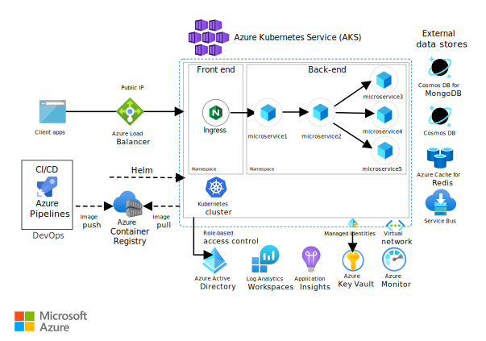
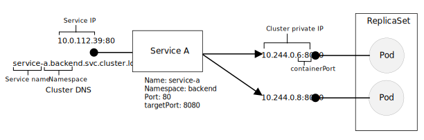

This reference architecture shows a microservices application deployed to Azure Kubernetes Service (AKS). It describes a basic AKS configuration that can be the starting point for most deployments. This article assumes basic knowledge of Kubernetes. The article focuses mainly on the infrastructure and DevOps considerations of running a microservices architecture on AKS. For guidance on how to design microservices, see [Building microservices on Azure](../../../microservices/index.yml).

 A reference implementation of this architecture is available on [GitHub][ri].

## Architecture

*Download a [Visio file][visio-download] of this architecture.*

If you would prefer to see a more advanced microservices example that is built upon the [AKS Baseline architecture](https://github.com/mspnp/aks-secure-baseline), see [Advanced Azure Kubernetes Service (AKS) microservices architecture](./aks-microservices-advanced.yml)

## Workflow

The architecture consists of the following components.

**Azure Kubernetes Service** (AKS). AKS is a managed Kubernetes cluster hosted in the Azure cloud. Azure manages the Kubernetes API service, and you only need to manage the agent nodes.

**Virtual network**. By default, AKS creates a virtual network into which agent nodes are connected. You can create the virtual network first for more advanced scenarios, which lets you control things like subnet configuration, on-premises connectivity, and IP addressing. For more information, see [Configure advanced networking in Azure Kubernetes Service (AKS)](/azure/aks/configure-advanced-networking).

**Ingress**. An ingress server exposes HTTP(S) routes to services inside the cluster. For more information, see the section [API Gateway](#api-gateway) below.

**Azure Load Balancer**. After creating an AKS cluster, the cluster is ready to use the load balancer. Then, once the NGINX service is deployed, the load balancer will be configured with a new public IP that will front your ingress controller. This way, the load balancer routes internet traffic to the ingress.

**External data stores**. Microservices are typically stateless and write state to external data stores, such as Azure SQL Database or Azure Cosmos DB.

**Azure Active Directory**. AKS uses an Azure Active Directory (Azure AD) identity to create and manage other Azure resources such as Azure load balancers. Azure AD is also recommended for user authentication in client applications.

**Azure Container Registry**. Use Container Registry to store private Docker images, which are deployed to the cluster. AKS can authenticate with Container Registry using its Azure AD identity. AKS doesn't require Azure Container Registry. You can use other container registries, such as Docker Hub.  Just ensure your container registry matches or exceeds the service level agreement (SLA) for your workload.

**Azure Pipelines**. Azure Pipelines are part of the Azure DevOps Services and run automated builds, tests, and deployments. You can also use third-party CI/CD solutions such as Jenkins.

**Helm**. Helm is a package manager for Kubernetes, a way to bundle and generalize Kubernetes objects into a single unit that can be published, deployed, versioned, and updated.

**Azure Monitor**. Azure Monitor collects and stores metrics and logs, application telemetry, and platform metrics for the Azure services. Use this data to monitor the application, set up alerts, dashboards, and perform root cause analysis of failures. Azure Monitor integrates with AKS to collect metrics from controllers, nodes, and containers.

## Considerations

### Design

This reference architecture is focused on microservices architectures, although many of the recommended practices apply to other workloads running on AKS.

#### Microservices

A microservice is a loosely coupled, independently deployable unit of code. Microservices typically communicate through well-defined APIs and are discoverable through some form of service discovery. The service should always be reachable even when the pods move around. The Kubernetes **Service** object is a natural way to model microservices in Kubernetes.

#### API gateway

API gateways are a general [microservices design pattern](https://microservices.io/patterns/apigateway.html). An *API gateway* sits between external clients and the microservices. It acts as a reverse proxy, routing requests from clients to microservices. It may also perform various cross-cutting tasks such as authentication, SSL termination, and rate-limiting. For more information, see:

- [Using API gateways in microservices](../../../microservices/design/gateway.yml)
- [Choosing a gateway technology](../../../microservices/design/gateway.yml#choosing-a-gateway-technology)

In Kubernetes, the functionality of an API gateway is primarily handled by an **Ingress controller**. The considerations are described in the [Ingress](#ingress) section.

#### Data storage

In a microservices architecture, services should not share data storage solutions. Each service should manage its own data set to avoid hidden dependencies among services. Data separation helps avoid unintentional coupling between services, which can happen when services share the same underlying data schemas. Also, when services manage their own data stores, they can use the right data store for their particular requirements.

For more information, see [Designing microservices: Data considerations](../../../microservices/design/data-considerations.yml).

Avoid storing persistent data in local cluster storage because that ties the data to the node. Instead, use an external service such as Azure SQL Database or Azure Cosmos DB. Another option is to mount a persistent data volume to a solution using Azure Disks or Azure Files.

For more information, see [Storage options for application in Azure Kubernetes Service](/azure/aks/concepts-storage).

#### Service object

The Kubernetes **Service** object provides a set of capabilities that match the microservices requirements for service discoverability:

- IP address. The Service object provides a static internal IP address for a group of pods (ReplicaSet). As pods are created or moved around, the service is always reachable at this internal IP address.

- Load balancing. Traffic sent to the service's IP address is load balanced to the pods.

- Service discovery. Services are assigned internal DNS entries by the Kubernetes DNS service. That means the API gateway can call a backend service using the DNS name. The same mechanism can be used for service-to-service communication. The DNS entries are organized by namespace, so if your namespaces correspond to bounded contexts, then the DNS name for a service will map naturally to the application domain.

The following diagram shows the conceptual relation between services and pods. The actual mapping to endpoint IP addresses and ports is done by kube-proxy, the Kubernetes network proxy.

### Ingress

In Kubernetes, the **Ingress controller** might implement the API gateway pattern. In that case, **Ingress** and **Ingress controller** work in conjunction to provide these features:

- Route client requests to the right backend services. This routing provides a single endpoint for clients, and helps to decouple clients from services.

- Aggregate multiple requests into a single request, to reduce chattiness between the client and the backend.

- Offload functionality from the backend services, such as SSL termination, authentication, IP restrictions, or client rate limiting (throttling).

Ingress abstracts the configuration settings for a proxy server. You also need an Ingress controller, which provides the underlying implementation of the Ingress. There are Ingress controllers for Nginx, HAProxy, Traefik, and Azure Application Gateway, among others.

The Ingress resource can be fulfilled by different technologies. To work together, they need to be deployed as the Ingress controller inside the cluster. It operates as the edge router or reverse proxy. A reverse proxy server is a potential bottleneck or single point of failure, so always deploy at least two replicas for high availability.

Often, configuring the proxy server requires complex files, which can be hard to tune if you aren't an expert. So, the Ingress controller provides a nice abstraction. The Ingress controller also has access to the Kubernetes API, so it can make intelligent decisions about routing and load balancing. For example, the Nginx ingress controller bypasses the kube-proxy network proxy.

On the other hand, if you need complete control over the settings, you may want to bypass this abstraction and configure the proxy server manually. For more information, see [Deploying Nginx or HAProxy to Kubernetes](../../../microservices/design/gateway.yml#deploying-nginx-or-haproxy-to-kubernetes).

> [!NOTE]
> For AKS, you can also use Azure Application Gateway, using the [Application Gateway Ingress Controller](/azure/application-gateway/ingress-controller-overview) (AGIC). Azure Application Gateway can perform layer-7 routing and SSL termination. It also has built-in support for web application firewall (WAF). If your AKS cluster is using [CNI networking](/azure/aks/configure-azure-cni/), Application Gateway can be deployed into a subnet of the cluster's virtual network or can be deployed in different virtual network from AKS virtual network, however, the two virtual networks must be peered together. AGIC also supports the Kubenet network plugin. When using Kubenet mode, the ingress controller needs to manage a route table in the Application Gateway's subnet to direct traffic to pod IPs. For more information, see [How to setup networking between Application Gateway and AKS](https://azure.github.io/application-gateway-kubernetes-ingress/how-tos/networking/).

For information about load-balancing services in Azure, see [Overview of load-balancing options in Azure](../../../guide/technology-choices/load-balancing-overview.yml).

#### TLS/SSL encryption

In common implementations, the Ingress controller is used for SSL termination. So, as part of deploying the Ingress controller, you need to create a TLS certificate. Only use self-signed certificates for dev/test purposes. For more information, see 
[Create an HTTPS ingress controller and use your own TLS certificates on Azure Kubernetes Service (AKS)](/azure/aks/ingress-own-tls).

For production workloads, get signed certificates from trusted certificate authorities (CA). For information about generating and configuring [Let's Encrypt](https://letsencrypt.org/) certificates, see [Create an ingress controller with a static public IP address in Azure Kubernetes Service (AKS)](/azure/aks/ingress-static-ip).

You may also need to rotate your certificates as per the organization's policies. For information, see, [Rotate certificates in Azure Kubernetes Service (AKS)](/azure/aks/certificate-rotation).

#### Namespaces

Use namespaces to organize services within the cluster. Every object in a Kubernetes cluster belongs to a namespace. By default, when you create a new object, it goes into the `default` namespace. But it's a good practice to create namespaces that are more descriptive to help organize the resources in the cluster.

First, namespaces help prevent naming collisions. When multiple teams deploy microservices into the same cluster, with possibly hundreds of microservices, it gets hard to manage if they all go into the same namespace. In addition, namespaces allow you to:

- Apply resource constraints to a namespace, so that the total set of pods assigned to that namespace cannot exceed the resource quota of the namespace.

- Apply policies at the namespace level, including RBAC and security policies.

For a microservices architecture, considering organizing the microservices into bounded contexts, and creating namespaces for each bounded context. For example, all microservices related to the "Order Fulfillment" bounded context could go into the same namespace. Alternatively, create a namespace for each development team.

Place utility services into their own separate namespace. For example, you might deploy Elasticsearch or Prometheus for cluster monitoring, or Tiller for Helm.

#### Health probes

Kubernetes defines two types of health probe that a pod can expose:

- Readiness probe: Tells Kubernetes whether the pod is ready to accept requests.

- Liveness probe: Tells Kubernetes whether a pod should be removed and a new instance started.

When thinking about probes, it's useful to recall how a service works in Kubernetes. A service has a label selector that matches a set of (zero or more) pods. Kubernetes load balances traffic to the pods that match the selector. Only pods that started successfully and are healthy receive traffic. If a container crashes, Kubernetes kills the pod and schedules a replacement.

Sometimes, a pod may not be ready to receive traffic, even though the pod started successfully. For example, there may be initialization tasks, where the application running in the container loads things into memory or reads configuration data. To indicate that a pod is healthy but not ready to receive traffic, define a readiness probe.

Liveness probes handle the case where a pod is still running, but is unhealthy and should be recycled. For example, suppose that a container is serving HTTP requests but hangs for some reason. The container doesn't crash, but it has stopped serving any requests. If you define an HTTP liveness probe, the probe will stop responding and that informs Kubernetes to restart the pod.

Here are some considerations when designing probes:

- If your code has a long startup time, there is a danger that a liveness probe will report failure before the startup completes. To prevent this probe failure, use the `initialDelaySeconds` setting, which delays the probe from starting.

- A liveness probe doesn't help unless restarting the pod is likely to restore it to a healthy state. You can use a liveness probe to mitigate against memory leaks or unexpected deadlocks, but there's no point in restarting a pod that's going to immediately fail again.

- Sometimes readiness probes are used to check dependent services. For example, if a pod has a dependency on a database, the probe might check the database connection. However, this approach can create unexpected problems. An external service might be temporarily unavailable for some reason. That will cause the readiness probe to fail for all the pods in your service, causing all of them to be removed from load balancing, and thus creating cascading failures upstream. A better approach is to implement retry handling within your service, so that your service can recover correctly from transient failures.

#### Resource constraints

Resource contention can affect the availability of a service. Define resource constraints for containers, so that a single container cannot overwhelm the cluster resources (memory and CPU). For non-container resources, such as threads or network connections, consider using the [Bulkhead Pattern](../../../patterns/bulkhead.yml) to isolate resources.

Use resource quotas to limit the total resources allowed for a namespace. That way, the front end can't starve the backend services for resources or vice-versa.

### Security

#### Role-based access control (RBAC)

Kubernetes and Azure both have mechanisms for role-based access control (RBAC):

- Azure RBAC controls access to resources in Azure, including the ability to create new Azure resources. Permissions can be assigned to users, groups, or service principals. (A service principal is a security identity used by applications.)

- Kubernetes RBAC controls permissions to the Kubernetes API. For example, creating pods and listing pods are actions that can be authorized (or denied) to a user through Kubernetes RBAC. To assign Kubernetes permissions to users, you create *roles* and *role bindings*:

  - A Role is a set of permissions that apply within a namespace. Permissions are defined as verbs (get, update, create, delete) on resources (pods, deployments, etc.).

  - A RoleBinding assigns users or groups to a Role.

  - There's also a ClusterRole object, which is like a Role but applies to the entire cluster, across all namespaces. To assign users or groups to a ClusterRole, create a ClusterRoleBinding.

AKS integrates these two RBAC mechanisms. When you create an AKS cluster, you can configure it to use Azure AD for user authentication. For details on how to set this up, see [Integrate Azure Active Directory with Azure Kubernetes Service](/azure/aks/aad-integration).

Once this is configured, a user who wants to access the Kubernetes API (for example, through kubectl) must sign in using their Azure AD credentials.

By default, an Azure AD user has no access to the cluster. To grant access, the cluster administrator creates RoleBindings that refer to Azure AD users or groups. If a user doesn't have permissions for a particular operation, it will fail.

If users have no access by default, how does the cluster admin have permission to create the role bindings in the first place? An AKS cluster actually has two types of credentials for calling the Kubernetes API server: cluster user and cluster admin. The cluster admin credentials grant full access to the cluster. The Azure CLI command `az aks get-credentials --admin` downloads the cluster admin credentials and saves them into your kubeconfig file. The cluster administrator can use this kubeconfig to create roles and role bindings.

Instead of managing Kubernetes cluster Role and RoleBinding objects natively in Kubernetes, it is preferred to use [Azure RBAC for Kubernetes Authorization](/azure/aks/manage-azure-rbac). This allows for the unified management and access control across Azure Resources, AKS, and Kubernetes resources. These Azure RBAC role assignments can target the cluster or namespaces within the cluster for more fine-grained access control. Azure RBAC supports a limited set of default permissions, and you can combine it with the native Kubernetes mechanism of managing Role and RoleBindings to support advanced or more granular access patterns. When enabled, Azure AD principals will be validated exclusively by Azure RBAC while regular Kubernetes users and service accounts are exclusively validated by Kubernetes RBAC.

Because the cluster admin credentials are so powerful, use Azure RBAC to restrict access to them:

- The "Azure Kubernetes Service Cluster Admin Role" has permission to download the cluster admin credentials. Only cluster administrators should be assigned to this role.

- The "Azure Kubernetes Service Cluster User Role" has permission to download the cluster user credentials. Non-admin users can be assigned to this role. This role doesn't give any particular permissions on Kubernetes resources inside the cluster &mdash; it just allows a user to connect to the API server.

When you define your RBAC policies (both Kubernetes and Azure), think about the roles in your organization:

- Who can create or delete an AKS cluster and download the admin credentials?
- Who can administer a cluster?
- Who can create or update resources within a namespace?

It's a good practice to scope Kubernetes RBAC permissions by namespace, using Roles and RoleBindings, rather than ClusterRoles and ClusterRoleBindings.

Finally, there's the question of what permissions the AKS cluster has to create and manage Azure resources, such as load balancers, networking, or storage. To authenticate itself with Azure APIs, the cluster uses an Azure AD service principal. If you don't specify a service principal when you create the cluster, one is created automatically. However, it's a good security practice to create the service principal first and assign the minimal RBAC permissions to it. For more information, see [Service principals with Azure Kubernetes Service](/azure/aks/kubernetes-service-principal).

#### Secrets management and application credentials

Applications and services often need credentials that allow them to connect to external services such as Azure Storage or SQL Database. The challenge is to keep these credentials safe and not leak them.

For Azure resources, one option is to use managed identities. The idea of a managed identity is that an application or service has an identity stored in Azure AD, and uses this identity to authenticate with an Azure service. The application or service has a Service Principal created for it in Azure AD, and authenticates using OAuth 2.0 tokens. The executing process code can transparently get the token to use. That way, you don't need to store any passwords or connection strings. You can use managed identities in AKS by assigning Azure AD identities to individual pods, using [Azure AD workload identities](/azure/aks/workload-identity-overview) (preview).

Currently, not all Azure services support authentication using managed identities. For a list, see [Azure services that support Azure AD authentication](/azure/active-directory/managed-identities-azure-resources/services-support-msi).

Even with managed identities, you'll probably need to store some credentials or other application secrets, whether for Azure services that don't support managed identities, third-party services, API keys, and so on. Here are some options for storing secrets securely:

- Azure Key Vault. In AKS, you can mount one or more secrets from Key Vault as a volume. The volume reads the secrets from Key Vault. The pod can then read the secrets just like a regular volume. For more information, see the [Use the Azure Key Vault Provider for Secrets Store CSI Driver in an AKS cluster](/azure/aks/csi-secrets-store-driver).

    The pod authenticates itself by using either a workload identity or by using a user or system-assigned managed identity. See [Provide an identity to access the Azure Key Vault Provider for Secrets Store CSI Driver](/azure/aks/csi-secrets-store-identity-access) for more considerations.

- HashiCorp Vault. Kubernetes applications can authenticate with HashiCorp Vault using Azure AD managed identities. See [HashiCorp Vault speaks Azure Active Directory](https://open.microsoft.com/2018/04/10/scaling-tips-hashicorp-vault-azure-active-directory/). You can deploy Vault itself to Kubernetes, consider running it in a separate dedicated cluster from your application cluster.

- Kubernetes secrets. Another option is simply to use Kubernetes secrets. This option is the easiest to configure but has some challenges. Secrets are stored in etcd, which is a distributed key-value store. AKS [encrypts etcd at rest](https://github.com/Azure/kubernetes-kms#azure-kubernetes-service-aks). Microsoft manages the encryption keys.

Using a system like HashiCorp Vault or Azure Key Vault provides several advantages, such as:

- Centralized control of secrets.
- Ensuring that all secrets are encrypted at rest.
- Centralized key management.
- Access control of secrets.
- Auditing

#### Container and Orchestrator security

These are recommended practices for securing your pods and containers:

- **Threat monitoring:** Monitor for threats using [Microsoft Defender for Containers](/azure/defender-for-cloud/defender-for-containers-introduction) (or 3rd party capabilities). If you're hosting containers on a VM, use [Microsoft Defender for servers](/azure/security-center/defender-for-servers-introduction) or a 3rd party capability. Additionally, you can integrate logs from [Container Monitoring solution in Azure Monitor](/azure/azure-monitor/insights/containers) to [Microsoft Sentinel](/azure/sentinel/) or an existing SIEM solution.

- **Vulnerability monitoring:** Continuously monitor images and running containers for known vulnerabilities using [Microsoft Defender for Cloud](/azure/security-center/container-security) or a 3rd party solution available through the Azure Marketplace.
- **Automate image patching** using [ACR Tasks](/azure/container-registry/container-registry-tasks-overview), a feature of Azure Container Registry. A container image is built up from layers. The base layers include the OS image and application framework images, such as ASP.NET Core or Node.js. The base images are typically created upstream from the application developers, and are maintained by other project maintainers. When these images are patched upstream, it's important to update, test, and redeploy your own images, so that you don't leave any known security vulnerabilities. ACR Tasks can help to automate this process.
- **Store images in a trusted private registry** such as Azure Container Registry or Docker Trusted Registry. Use a validating admission webhook in Kubernetes to ensure that pods can only pull images from the trusted registry.
- **Apply Least Privilege** principle
  - Don't run containers in privileged mode. Privileged mode gives a container access to all devices on the host.
  - When possible, avoid running processes as root inside containers. Containers do not provide complete isolation from a security standpoint, so it's better to run a container process as a non-privileged user.

### DevOps

This reference architecture provides an [Azure Resource Manager template](/azure/azure-resource-manager/templates/overview) for provisioning the cloud resources, and its dependencies. With the use of [Azure Resource Manager templates][arm-template] you can use [Azure DevOps Services](/azure/devops/user-guide/services) to provision different environments in minutes, for example to replicate production scenarios. This allows you to save cost and provision load testing environment only when needed.

Consider following the workload isolation criteria to structure your ARM template, a workload is typically defined as an arbitrary unit of functionality; you could, for example, have a separate template for the cluster and then other for the dependant services. Workload isolation enables DevOps to perform continuous integration and continuous delivery (CI/CD), since every workload is associated and managed by its corresponding DevOps team.

### Deployment (CI/CD) considerations

Here are some goals of a robust CI/CD process for a microservices architecture:

- Each team can build and deploy the services that it owns independently, without affecting or disrupting other teams.
- Before a new version of a service is deployed to production, it gets deployed to dev/test/QA environments for validation. Quality gates are enforced at each stage.
- A new version of a service can be deployed side by side with the previous version.
- Sufficient access control policies are in place.
- For containerized workloads, you can trust the container images that are deployed to production.

To learn more about the challenges, see [CI/CD for microservices architectures](../../../microservices/ci-cd.yml).

For specific recommendations and best practices, see [CI/CD for microservices on Kubernetes](../../../microservices/ci-cd-kubernetes.yml).

### Cost optimization

Use the [Azure pricing calculator][azure-pricing-calculator] to estimate costs. Other considerations are described in the Cost section in [Microsoft Azure Well-Architected Framework][aaf-cost].

Here are some points to consider for some of the services used in this architecture.

#### Azure Kubernetes Service (AKS)

There are no costs associated for AKS in deployment, management, and operations of the Kubernetes cluster. You only pay for the virtual machines instances, storage, and networking resources consumed by your Kubernetes cluster.

To estimate the cost of the required resources please see the [Container Services calculator][aks-Calculator].

#### Azure Load balancer

You're charged only for the number of configured load-balancing and outbound rules. Inbound NAT rules are free. There's no hourly charge for the Standard Load Balancer when no rules are configured.

For more information, see [Azure Load Balancer Pricing][az-lb-pricing].

#### Azure Pipelines

This reference architecture only uses Azure Pipelines. Azure offers the Azure Pipeline as an individual Service. You're allowed a free Microsoft-hosted job with 1,800 minutes per month for CI/CD and one self-hosted job with unlimited minutes per month, extra jobs have charges. For more information, [see Azure DevOps Services Pricing](https://azure.microsoft.com/pricing/details/devops/azure-devops-services).

#### Azure Monitor

For Azure Monitor Log Analytics, you're charged for data ingestion and retention. For more information, see [Azure Monitor Pricing][az-monitor-pricing].

## Deploy this scenario

To deploy the reference implementation for this architecture, follow the steps in the [GitHub repo][ri-deploy].

> [!div class="nextstepaction"]
> [AKS Microservices Reference Implementation](https://github.com/mspnp/microservices-reference-implementation)

## Next steps

- [Service principals with Azure Kubernetes Service](/azure/aks/kubernetes-service-principal)
- [Microsoft Defender for Containers](/azure/defender-for-cloud/defender-for-containers-introduction) 
- [Microsoft Defender for servers](/azure/security-center/defender-for-servers-introduction) 
- [Container Monitoring solution in Azure Monitor](/azure/azure-monitor/insights/containers) 
- [Microsoft Sentinel](/azure/sentinel/) or an existing SIEM solution.
- [Microsoft Defender for Cloud](/azure/security-center/container-security) or a 3rd party solution available through the Azure Marketplace.
- [ACR Tasks](/azure/container-registry/container-registry-tasks-overview)

## Related resources

- To work through a more advanced microservices example, see [Advanced Azure Kubernetes Service (AKS) microservices architecture](./aks-microservices-advanced.yml)
- To learn about monitoring this architecture, see [Monitoring a microservices architecture in Azure Kubernetes Service (AKS)](../../../microservices/logging-monitoring.yml).
- To learn how we measured the performance of this application, see [Performance tuning scenario: Distributed business transactions](../../../performance/distributed-transaction.yml).
- [CI/CD for microservices architectures](../../../microservices/ci-cd.yml)
- [CI/CD for microservices on Kubernetes](../../../microservices/ci-cd-kubernetes.yml) 

[ri]: https://github.com/mspnp/microservices-reference-implementation
[ri-deploy]: https://github.com/mspnp/microservices-reference-implementation/blob/main/deployment.md
[visio-download]: https://arch-center.azureedge.net/aks-reference-architecture.vsdx
[aaf-cost]: /azure/architecture/framework/cost/overview
[azure-pricing-calculator]: https://azure.microsoft.com/pricing/calculator
[DevOps-pricing]: https://azure.microsoft.com/pricing/details/devops/azure-devops-services
[AppGatewayPricing]: https://azure.microsoft.com/pricing/details/application-gateway
[aks-Calculator]: https://azure.microsoft.com/pricing/calculator/?service=kubernetes-service
[az-lb-pricing]: https://azure.microsoft.com/pricing/details/load-balancer
[az-monitor-pricing]: https://azure.microsoft.com/pricing/details/monitor
