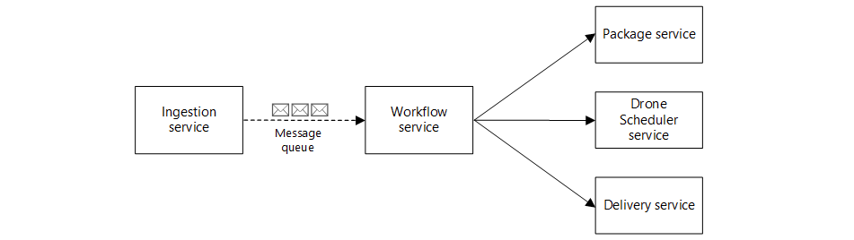

This reference implementation shows a set of best practices for building and running a microservices architecture on Microsoft Azure, using Kubernetes.

## Scenario

​Fabrikam, Inc. (a fictional company) is starting a drone delivery service. The company manages a fleet of drone aircraft. Businesses register with the service, and users can request a drone to pick up goods for delivery. When a customer schedules a pickup, a backend system assigns a drone and notifies the user of an estimated delivery time. While the delivery is in progress, the customer can track the drone's location with a continuously updated ETA.

The Drone Delivery application is a sample application that consists of several microservices. Because it's a sample, the functionality is simulated, but the APIs and microservices interactions are intended to reflect real-world design patterns.



- **Ingestion service**: receives client requests and buffers them.
- **Third-party Transportation service**: manages third-party transportation options. - is this the queue?
- **Package service**: manages packages.
- **Scheduler service**: dispatches client requests and manages the delivery workflow.
- **Delivery service**: manages deliveries that are scheduled or in transit.

## Reference deployment

This deployment creates an Azure Kubernetes Service (AKS) cluster, an Azure Container Registry instance, and the supporting infrastructure for the drone delivery application. This deployment takes up to 25 minutes. It is recommended that the deployment button is used to initiate the deployment from the Azure portal. Once the deployment has  completed, return back to this guide to deploy the drone application.

We have also include Azure CLI and PowerShell commands that can be used to deploy the infrastructure. If using cloud shell, be aware that the session may time out before the deployment has completed. If using these commands, we recommend doing so on your own development system to avoid an unexpected shell time out.

#### [Azure portal](#tab/portal)

Use the following button to deploy the reference using the Azure portal.

[](https://portal.azure.com/#create/Microsoft.Template/uri/https%3A%2F%2Fraw.githubusercontent.com%2Fmspnp%2Fsamples%2Fmaster%2Fsolutions%2Fazure-hub-spoke%2Fazuredeploy.json)


#### [Azure CLI](#tab/cli)

Use the following command to create a resource group for the deployment. Click the **Try it** button to use an embedded shell.

```azurecli
az group create --name hub-spoke --location eastus
```

Run the following command to deploy the hub and spoke network configuration, VNet peerings between the hub and spoke, and a Bastion host

```azurecli
az deployment group create --resource-group hub-spoke \
    --template-uri https://raw.githubusercontent.com/mspnp/samples/master/solutions/azure-hub-spoke/azuredeploy.json
```

#### [PowerShell](#tab/powershell)

Use the following command to create a resource group for the deployment. Click the **Try it** button to use an embedded shell.

```azurepowershell
New-AzResourceGroup -Name hub-spoke -Location eastus
```

Run the following command to deploy the hub and spoke network configuration, VNet peerings between the hub and spoke, and a Bastion host

```azurepowershell
New-AzResourceGroupDeployment -ResourceGroupName hub-spoke `
    -TemplateUri https://raw.githubusercontent.com/mspnp/samples/master/solutions/azure-hub-spoke/azuredeploy.json
```
--- 

## Prepare Kubernetes environment

```azurecli-interactive
az aks install-cli
```

```azurecli-interactive
az aks get-credentials --resource-group=$RESOURCE_GROUP --name=$CLUSTER_NAME
```

```azurecli-interactive
kubectl create namespace backend-dev
```

```azurecli-interactive
# install helm client side
curl -L https://git.io/get_helm.sh | bash -s -- -v v2.17.0

# setup tiller in your cluster
kubectl apply -f $K8S/tiller-rbac.yaml
helm init --service-account tiller
```

```azurecli-interactive
# Acquire Instrumentation Key
export AI_NAME=$(az deployment group show -g $RESOURCE_GROUP -n $DEV_DEPLOYMENT_NAME --query properties.outputs.appInsightsName.value -o tsv)
export AI_IKEY=$(az resource show \
                    -g $RESOURCE_GROUP \
                    -n $AI_NAME \
                    --resource-type "Microsoft.Insights/components" \
                    --query properties.InstrumentationKey \
                    -o tsv)

# add RBAC for AppInsights
kubectl apply -f k8s/k8s-rbac-ai.yaml
```

## Configure AAD pod identity and key vault flexvol infrastructure

Instal the AAD POD identity Helm Chart.

```azuercli-interactive
helm install aad-pod-identity/aad-pod-identity --set=installCRDs=true --set nmi.allowNetworkPluginKubenet=true --name aad-pod-identity --namespace kube-system --version 3.0.3
```

Install flexvol.

```azuercli-interactive
kubectl create -f https://raw.githubusercontent.com/Azure/kubernetes-keyvault-flexvol/master/deployment/kv-flexvol-installer.yaml
```

## Install ingress controller

```azuercli-interactive
helm install stable/nginx-ingress --name nginx-ingress-dev --namespace ingress-controllers --set rbac.create=true --set controller.ingressClass=nginx-dev --version 1.24.7
```

Obtain the load balancer ip address and assign a domain name.

```azurecli-interactive
until export INGRESS_LOAD_BALANCER_IP=$(kubectl get services/nginx-ingress-dev-controller -n ingress-controllers -o jsonpath="{.status.loadBalancer.ingress[0].ip}" 2> /dev/null) && test -n "$INGRESS_LOAD_BALANCER_IP"; do echo "Waiting for load balancer deployment" && sleep 20; done
export INGRESS_LOAD_BALANCER_IP_ID=$(az network public-ip list --query "[?ipAddress!=null]|[?contains(ipAddress, '$INGRESS_LOAD_BALANCER_IP')].[id]" --output tsv)
export EXTERNAL_INGEST_DNS_NAME="${RESOURCE_GROUP}-ingest-dev"
export EXTERNAL_INGEST_FQDN=$(az network public-ip update --ids $INGRESS_LOAD_BALANCER_IP_ID --dns-name $EXTERNAL_INGEST_DNS_NAME --query "dnsSettings.fqdn" --output tsv)
```

Create a self-signed certificate for TLS.

```azurecli-interactive
openssl req -x509 -nodes -days 365 -newkey rsa:2048 -out ingestion-ingress-tls.crt -keyout ingestion-ingress-tls.key -subj "/CN=${EXTERNAL_INGEST_FQDN}/O=fabrikam"
```

## Setup cluster resource quota

```azurecli-interactive
kubectl apply -f k8s/k8s-resource-quotas-dev.yaml
```

## Deploy the Delivery service

Extract resource details from deployment.

```azurecli-interactive
export COSMOSDB_NAME=$(az deployment group show -g $RESOURCE_GROUP -n $DEV_DEPLOYMENT_NAME --query properties.outputs.deliveryCosmosDbName.value -o tsv) && \
export DATABASE_NAME="${COSMOSDB_NAME}-db" && \
export COLLECTION_NAME="${DATABASE_NAME}-col" && \
export DELIVERY_KEYVAULT_URI=$(az deployment group show -g $RESOURCE_GROUP -n $DEV_DEPLOYMENT_NAME --query properties.outputs.deliveryKeyVaultUri.value -o tsv)
```

Build the Delivery service.

```azurecli-interactive
export DELIVERY_PATH=$PROJECT_ROOT/src/shipping/delivery
```

Build and publish the container image.

```azurecli-interactive
az acr build -r $ACR_NAME -t $ACR_SERVER/delivery:0.1.0 ./src/shipping/delivery/.
```

Deploy the Delivery service.

```azurecli-interactive
# Extract pod identity outputs from deployment
export DELIVERY_PRINCIPAL_RESOURCE_ID=$(az deployment group show -g $RESOURCE_GROUP -n $IDENTITIES_DEPLOYMENT_NAME --query properties.outputs.deliveryPrincipalResourceId.value -o tsv) && \
export DELIVERY_PRINCIPAL_CLIENT_ID=$(az identity show -g $RESOURCE_GROUP -n $DELIVERY_ID_NAME --query clientId -o tsv)
export DELIVERY_INGRESS_TLS_SECRET_NAME=delivery-ingress-tls

# Deploy the service
helm install charts/delivery/ \
     --set image.tag=0.1.0 \
     --set image.repository=delivery \
     --set dockerregistry=$ACR_SERVER \
     --set ingress.hosts[0].name=$EXTERNAL_INGEST_FQDN \
     --set ingress.hosts[0].serviceName=delivery \
     --set ingress.hosts[0].tls=true \
     --set ingress.hosts[0].tlsSecretName=$DELIVERY_INGRESS_TLS_SECRET_NAME \
     --set ingress.tls.secrets[0].name=$DELIVERY_INGRESS_TLS_SECRET_NAME \
     --set ingress.tls.secrets[0].key="$(cat ingestion-ingress-tls.key)" \
     --set ingress.tls.secrets[0].certificate="$(cat ingestion-ingress-tls.crt)" \
     --set identity.clientid=$DELIVERY_PRINCIPAL_CLIENT_ID \
     --set identity.resourceid=$DELIVERY_PRINCIPAL_RESOURCE_ID \
     --set cosmosdb.id=$DATABASE_NAME \
     --set cosmosdb.collectionid=$COLLECTION_NAME \
     --set keyvault.uri=$DELIVERY_KEYVAULT_URI \
     --set reason="Initial deployment" \
     --set tags.dev=true \
     --namespace backend-dev \
     --name delivery-v0.1.0-dev \
     --dep-up

# Verify the pod is created
helm status delivery-v0.1.0-dev
```

Deploy the Delivery service.

Extract resource details from deployment.

```azurecli-interactive
export COSMOSDB_NAME=$(az deployment group show -g $RESOURCE_GROUP -n $DEV_DEPLOYMENT_NAME --query properties.outputs.packageMongoDbName.value -o tsv)
```

Build the Package service.

```azurecli-interactive
az acr build -r $ACR_NAME -t $ACR_SERVER/package:0.1.0 ./src/shipping/package/.
```

Deploy the Package service.

```azurecli-interactive
# Create secret
# Note: Connection strings cannot be exported as outputs in ARM deployments
export COSMOSDB_CONNECTION=$(az cosmosdb keys list --type connection-strings --name $COSMOSDB_NAME --resource-group $RESOURCE_GROUP --query "connectionStrings[0].connectionString" -o tsv | sed 's/==/%3D%3D/g') && \
export COSMOSDB_COL_NAME=packages

# Deploy service
helm install charts/package/ \
     --set image.tag=0.1.0 \
     --set image.repository=package \
     --set ingress.hosts[0].name=$EXTERNAL_INGEST_FQDN \
     --set ingress.hosts[0].serviceName=package \
     --set ingress.hosts[0].tls=false \
     --set secrets.appinsights.ikey=$AI_IKEY \
     --set secrets.mongo.pwd=$COSMOSDB_CONNECTION \
     --set cosmosDb.collectionName=$COSMOSDB_COL_NAME \
     --set dockerregistry=$ACR_SERVER \
     --set reason="Initial deployment" \
     --set tags.dev=true \
     --namespace backend-dev \
     --name package-v0.1.0-dev \
     --dep-up

# Verify the pod is created
helm status package-v0.1.0-dev
```

Deploy the Workflow service.

Extract resource details from deployment.

```azurecli-interactive
export WORKFLOW_KEYVAULT_NAME=$(az deployment group show -g $RESOURCE_GROUP -n $DEV_DEPLOYMENT_NAME --query properties.outputs.workflowKeyVaultName.value -o tsv)
```

Build the workflow service.

```azurecli-interactive
az acr build -r $ACR_NAME -t $ACR_SERVER/workflow:0.1.0 ./src/shipping/workflow/.
```

Create and set up pod identity.

```azurecli-interactive
# Extract outputs from deployment and get Azure account details
export WORKFLOW_PRINCIPAL_RESOURCE_ID=$(az deployment group show -g $RESOURCE_GROUP -n $IDENTITIES_DEPLOYMENT_NAME --query properties.outputs.workflowPrincipalResourceId.value -o tsv) && \
export WORKFLOW_PRINCIPAL_CLIENT_ID=$(az identity show -g $RESOURCE_GROUP -n $WORKFLOW_ID_NAME --query clientId -o tsv)
export SUBSCRIPTION_ID=$(az account show --query id --output tsv)
export TENANT_ID=$(az account show --query tenantId --output tsv)
```

Deploy the Workflow service.

```azurecli-interactive
# Deploy the service
helm install charts/workflow/ \
     --set image.tag=0.1.0 \
     --set image.repository=workflow \
     --set dockerregistry=$ACR_SERVER \
     --set identity.clientid=$WORKFLOW_PRINCIPAL_CLIENT_ID \
     --set identity.resourceid=$WORKFLOW_PRINCIPAL_RESOURCE_ID \
     --set keyvault.name=$WORKFLOW_KEYVAULT_NAME \
     --set keyvault.resourcegroup=$RESOURCE_GROUP \
     --set keyvault.subscriptionid=$SUBSCRIPTION_ID \
     --set keyvault.tenantid=$TENANT_ID \
     --set reason="Initial deployment" \
     --set tags.dev=true \
     --namespace backend-dev \
     --name workflow-v0.1.0-dev \
     --dep-up

# Verify the pod is created
helm status workflow-v0.1.0-dev
```

Deploy the Ingestion service

Extract resource details from deployment.

```azurecli-interactive
export INGESTION_QUEUE_NAMESPACE=$(az deployment group show -g $RESOURCE_GROUP -n $DEV_DEPLOYMENT_NAME --query properties.outputs.ingestionQueueNamespace.value -o tsv) && \
export INGESTION_QUEUE_NAME=$(az deployment group show -g $RESOURCE_GROUP -n $DEV_DEPLOYMENT_NAME --query properties.outputs.ingestionQueueName.value -o tsv)
export INGESTION_ACCESS_KEY_NAME=$(az deployment group show -g $RESOURCE_GROUP -n $DEV_DEPLOYMENT_NAME --query properties.outputs.ingestionServiceAccessKeyName.value -o tsv)
export INGESTION_ACCESS_KEY_VALUE=$(az servicebus namespace authorization-rule keys list --resource-group $RESOURCE_GROUP --namespace-name $INGESTION_QUEUE_NAMESPACE --name $INGESTION_ACCESS_KEY_NAME --query primaryKey -o tsv)
```

Build the Ingestion service

```azurecli-interactive
az acr build -r $ACR_NAME -t $ACR_SERVER/ingestion:0.1.0 ./src/shipping/ingestion/.
```

Deploy the Ingestion service

```azurecli-interactive
# Set secreat name
export INGRESS_TLS_SECRET_NAME=ingestion-ingress-tls

# Deploy service
helm install charts/ingestion/ \
     --set image.tag=0.1.0 \
     --set image.repository=ingestion \
     --set dockerregistry=$ACR_SERVER \
     --set ingress.hosts[0].name=$EXTERNAL_INGEST_FQDN \
     --set ingress.hosts[0].serviceName=ingestion \
     --set ingress.hosts[0].tls=true \
     --set ingress.hosts[0].tlsSecretName=$INGRESS_TLS_SECRET_NAME \
     --set ingress.tls.secrets[0].name=$INGRESS_TLS_SECRET_NAME \
     --set ingress.tls.secrets[0].key="$(cat ingestion-ingress-tls.key)" \
     --set ingress.tls.secrets[0].certificate="$(cat ingestion-ingress-tls.crt)" \
     --set secrets.appinsights.ikey=${AI_IKEY} \
     --set secrets.queue.keyname=IngestionServiceAccessKey \
     --set secrets.queue.keyvalue=${INGESTION_ACCESS_KEY_VALUE} \
     --set secrets.queue.name=${INGESTION_QUEUE_NAME} \
     --set secrets.queue.namespace=${INGESTION_QUEUE_NAMESPACE} \
     --set reason="Initial deployment" \
     --set tags.dev=true \
     --namespace backend-dev \
     --name ingestion-v0.1.0-dev \
     --dep-up

# Verify the pod is created
helm status ingestion-v0.1.0-dev
```

Deploy DroneScheduler service

Extract resource details from deployment

```azurecli-interactive
export DRONESCHEDULER_KEYVAULT_URI=$(az deployment group show -g $RESOURCE_GROUP -n $DEV_DEPLOYMENT_NAME --query properties.outputs.droneSchedulerKeyVaultUri.value -o tsv)
export DRONESCHEDULER_COSMOSDB_NAME=$(az deployment group show -g $RESOURCE_GROUP -n $DEV_DEPLOYMENT_NAME --query properties.outputs.droneSchedulerCosmosDbName.value -o tsv) && \
export ENDPOINT_URL=$(az cosmosdb show -n $DRONESCHEDULER_COSMOSDB_NAME -g $RESOURCE_GROUP --query documentEndpoint -o tsv) && \
export AUTH_KEY=$(az cosmosdb keys list -n $DRONESCHEDULER_COSMOSDB_NAME -g $RESOURCE_GROUP --query primaryMasterKey -o tsv) && \
export DATABASE_NAME="invoicing" && \
export COLLECTION_NAME="utilization"
```

Build the dronescheduler services

```azurecli-interactive
export DRONE_PATH=$PROJECT_ROOT/src/shipping/dronescheduler
```

Create and set up pod identity.

```azurecli-interactive
# Extract outputs from deployment
export DRONESCHEDULER_PRINCIPAL_RESOURCE_ID=$(az deployment group show -g $RESOURCE_GROUP -n $IDENTITIES_DEPLOYMENT_NAME --query properties.outputs.droneSchedulerPrincipalResourceId.value -o tsv) && \
export DRONESCHEDULER_PRINCIPAL_CLIENT_ID=$(az identity show -g $RESOURCE_GROUP -n $DRONESCHEDULER_ID_NAME --query clientId -o tsv)
```

Build and publish the container image.

```azurecli-interactive
az acr build -r $ACR_NAME -f ./src/shipping/dronescheduler/Dockerfile -t $ACR_SERVER/dronescheduler:0.1.0 ./src/shipping/.
```

Deploy the dronescheduler service:

```azurecli-interactive
# Deploy the service
helm install charts/dronescheduler/ \
     --set image.tag=0.1.0 \
     --set image.repository=dronescheduler \
     --set dockerregistry=$ACR_SERVER \
     --set ingress.hosts[0].name=$EXTERNAL_INGEST_FQDN \
     --set ingress.hosts[0].serviceName=dronescheduler \
     --set ingress.hosts[0].tls=false \
     --set identity.clientid=$DRONESCHEDULER_PRINCIPAL_CLIENT_ID \
     --set identity.resourceid=$DRONESCHEDULER_PRINCIPAL_RESOURCE_ID \
     --set keyvault.uri=$DRONESCHEDULER_KEYVAULT_URI \
     --set cosmosdb.id=$DATABASE_NAME \
     --set cosmosdb.collectionid=$COLLECTION_NAME \
     --set reason="Initial deployment" \
     --set tags.dev=true \
     --namespace backend-dev \
     --name dronescheduler-v0.1.0-dev \
     --dep-up

# Verify the pod is created
helm status dronescheduler-v0.1.0-dev
```

## Validate the application is running

You can send delivery requests and check their statuses using curl.

### Send a request

Since the certificate used for TLS is self-signed, the request disables TLS validation using the '-k' option.

```bash
curl -X POST "https://$EXTERNAL_INGEST_FQDN/api/deliveryrequests" --header 'Content-Type: application/json' --header 'Accept: application/json' -k -d '{
   "confirmationRequired": "None",
   "deadline": "",
   "dropOffLocation": "drop off",
   "expedited": true,
   "ownerId": "myowner",
   "packageInfo": {
     "packageId": "mypackage",
     "size": "Small",
     "tag": "mytag",
     "weight": 10
   },
   "pickupLocation": "my pickup",
   "pickupTime": "2019-05-08T20:00:00.000Z"
 }' > deliveryresponse.json
```

### Check the request status

```bash
DELIVERY_ID=$(cat deliveryresponse.json | jq -r .deliveryId)
curl "https://$EXTERNAL_INGEST_FQDN/api/deliveries/$DELIVERY_ID" --header 'Accept: application/json' -k
```