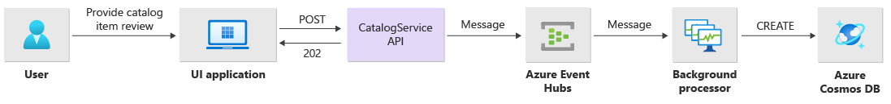

# Application design considerations for mission-critical workloads

The Azure Mission-critical reference architecture considers a simple web shop catalog workflow where end users can browse through a catalog of items, see details of an item, and post ratings and comments for items. Although fairly straight forward, this application enables the Reference Implementation to demonstrate the asynchronous processing of requests and how to achieve high throughput within a solution. The application's design also focuses on reliability and resiliency.

## Application composition

The application consists of four components:

1. **User interface (UI) application** - Single-page application accessed by end users is hosted in Azure Storage Account's static website hosting.
1. **API application** (`CatalogService`) - .NET Core REST API called by the UI application, but available for other potential client applications.
1. **Worker application** (`BackgroundProcessor`) - .NET Core background worker, which processes write requests to the database by listening to new events on the message bus. This component does not expose any APIs.
1. **Health check application** (`HealthCheck`) - Used to report the health of the application by checking if critical components (database, messaging bus) are working.



The API, worker and health check applications are referred to as **workload** and hosted as containers in a dedicated AKS namespace (called `workload`). There's **no direct communication** between the pods, they're **stateless** and able to **scale independently**.

TODO: diagram detailing the components in the cluster

There are additional supporting components running on the cluster:

1. **Ingress controller** - Nginx in a container is used to incoming requests to the workload and load balance between pods. It has a public IP address.
1. **Cert manager** - Jetstack's `cert-manager` is used to auto-provision SSL/TLS certificates (using Let's Encrypt) for ingress rules.
1. **CSI secrets driver** - To securely read secrets such as connection strings from Azure Key Vault, the open-source Azure Key Vault Provider for Secrets Store CSI Driver is used.
1. **Monitoring agent** - The default OMSAgent configuration is adjusted to reduce the amount of monitoring data sent to the Log Analytics workspace.

### Database connection

No state is persisted within stamps and Cosmos DB serves as the main data store for the application.

The application has the following **data access characteristics**:

- Read pattern:
  - Point reads, e.g. fetching a single record. These use item ID and partition key directly for maximum optimization (1 RU per request).
  - List reads, e.g. getting catalog items to display in a list. `FeedIterator` with limit on number of results is used.
- Write pattern:
  - Small writes e.g. requests which usually insert a single or a very small number of records in a transaction.
- Designed to handle high traffic from end-users with the ability to scale to handle traffic demand in the order of millions of users.
- Small payload or dataset size - usually in order of KB.
- Low response time (in order of milliseconds).
- Low latency (in order of milliseconds).

[Azure Cosmos DB](https://azure.microsoft.com/services/cosmos-db/) was chosen as the main database as it provides the ability of **multi-region writes**: each stamp can write to the Cosmos DB replica in the same region with Cosmos DB internally handling data replication and synchronization between regions.

> [!TIP]
> For applications that prioritize availability before performance **single-region write and multi-region read** with *Strong consistency* level are recommended.

Data model of the Mission-critical reference implementation is designed so that it doesn't require features offered by traditional relational databases (i.e. foreign keys, strict row/column schema, views, etc.) and is fully compatible with the NoSQL nature of Cosmos DB. **SQL API** is used, because it's feature rich and supports all capabilities of the database engine.

> [!NOTE]
> New applications should use the Cosmos DB SQL API. For legacy applications that already use another NoSQL protocol (Mongo DB) the migration to Cosmos DB SQL API should be at least evaluated.

Cosmos DB is configured as follows:

- **Consistency level** is set to the default *Session consistency* as the most widely used level for single region and globally distributed applications. Azure Mission-critical does not use weaker consistency with higher throughput because the asynchronous nature of write processing doesn't require low latency on database write.

- **Partition key** is set to `/id` for all collections. This decision is based on the usage pattern which is mostly *"writing new documents with random GUID as ID"* and *"reading wide range of documents by ID"*. Providing the application code maintains its ID uniqueness, new data will be evenly distributed into partitions by Cosmos DB, enabling virtually infinite scale.

- **Indexing policy** is configured on collections to optimize queries. To optimize RU cost and performance a custom indexing policy is used and this only indexes properties used in query predicates. For example, the application doesn't use the comment text field as a filter in queries and so it was excluded from the custom indexing policy.

```
// Example of setting indexing policy in Terraform:

indexing_policy {

  excluded_path {
    path = "/description/?"
  }

  excluded_path {
    path = "/comments/text/?"
  }

  included_path {
    path = "/*"
  }

}
```

All workload components use the Cosmos DB .NET Core SDK to communicate with the database. The SDK includes robust logic to maintain database connections and handle failures. The configuration is as follows:

- Uses **Direct connectivity mode** (default for .NET SDK v3) as this offers better performance because there are fewer network hops compared to Gateway mode which uses HTTP.
- **`EnableContentResponseOnWrite`** is set to **`false`** to prevent the Cosmos DB client from returning the document from Create, Upsert, Patch and Replace operations to reduce network traffic and because this is not needed for further processing on the client.
- **Custom serialization** is used to set the JSON property naming policy to `JsonNamingPolicy.CamelCase` (to translate .NET-style properties to standard JSON-style and vice-versa) and the default ignore condition to ignore properties with null values when serializing (`JsonIgnoreCondition.WhenWritingNull`).
- **Application region** is set to the region of the stamp, because the application is using multi-region writes.

```csharp
//
// CosmosDbService.cs
//
CosmosClientBuilder clientBuilder = new CosmosClientBuilder(sysConfig.CosmosEndpointUri, sysConfig.CosmosApiKey)
    .WithConnectionModeDirect()
    .WithContentResponseOnWrite(false)
    .WithRequestTimeout(TimeSpan.FromSeconds(sysConfig.ComsosRequestTimeoutSeconds))
    .WithThrottlingRetryOptions(TimeSpan.FromSeconds(sysConfig.ComsosRetryWaitSeconds), sysConfig.ComsosMaxRetryCount)
    .WithCustomSerializer(new CosmosNetSerializer(Globals.JsonSerializerOptions));

if (sysConfig.AzureRegion != "unknown")
{
    clientBuilder = clientBuilder.WithApplicationRegion(sysConfig.AzureRegion);
}

_dbClient = clientBuilder.Build();
```

## Identity and access management

On the application level this reference architecture uses a simple authentication scheme based on API keys for some restricted operations, such as creating new catalog items or deleting comments. More advanced scenarios such as user authentication and user roles are not in scope.

### Managed identities

**Managed identities should be used** to access Azure resources from the AKS cluster. The reference implementation is using managed identity of the AKS agent pool ("Kubelet identity") to access the global Azure Container Registry and stamp Azure Key Vault.

Example of assigning the `AcrPull` role to the Kubelet identity in Terraform (stamp deployment):

```
resource "azurerm_role_assignment" "acrpull_role" {
  scope                = data.azurerm_container_registry.global.id
  role_definition_name = "AcrPull"
  principal_id         = azurerm_kubernetes_cluster.stamp.kubelet_identity.0.object_id
}
```

https://docs.microsoft.com/azure/aks/use-managed-identity

### Secrets

Each deployment stamp has its dedicated instance of Azure Key Vault. Some parts of the workload still use **keys** to access Azure resources (e.g. Cosmos DB) - those are created during deployment and stored in Key Vault with Terraform. With the exception of end-to-end environments for developers, **no human operator ever interacts with these secrets** as they're generated automatically and handled in Terraform. In addition, Key Vault access policies are configured in a way that **no user accounts are permitted to access** secrets.

> [!NOTE]
> This workload doesn't use certificates, but the same principles would apply.

The [**Azure Key Vault Provider for Secrets Store**](https://docs.microsoft.com/azure/aks/csi-secrets-store-driver) is used in order for the application to consume secret. The CSI driver loads keys from Azure Key Vault and mounts them into individual pods' as files.

```yml
apiVersion: secrets-store.csi.x-k8s.io/v1
kind: SecretProviderClass
metadata:
  name: azure-kv
spec:
  provider: azure
  parameters:
    usePodIdentity: "false"
    useVMManagedIdentity: "true"
    userAssignedIdentityID: {{ .Values.azure.managedIdentityClientId | quote }}
    keyvaultName: {{ .Values.azure.keyVaultName | quote }}
    tenantId: {{ .Values.azure.tenantId | quote }}
    objects: |
      array:
        {{- range .Values.kvSecrets }}
        - |
          objectName: {{ . | quote }}
          objectAlias: {{ . | lower | replace "-" "_" | quote }}
          objectType: secret
        {{- end }}
```

The reference implementation uses Helm in conjunction with Azure DevOps Pipelines to deploy the CSI driver containing all key names from Azure Key Vault. The driver is also responsible to renew secrets if they change in Key Vault.

On the consuming end, both .NET applications use the built-in capability to read configuration from files (`AddKeyPerFile`):

```csharp
//
// Program.cs
// using Microsoft.Extensions.Configuration;
//
public static IHostBuilder CreateHostBuilder(string[] args) =>
    Host.CreateDefaultBuilder(args)
    .ConfigureAppConfiguration((context, config) =>
    {
        // Load values from k8s CSI Key Vault driver mount point.
        config.AddKeyPerFile(directoryPath: "/mnt/secrets-store/", optional: true, reloadOnChange: true);
        
        // More configuration if needed...
    })
    .ConfigureWebHostDefaults(webBuilder =>
    {
        webBuilder.UseStartup<Startup>();
    });
```

The combination of CSI driver's auto reload and `reloadOnChange: true` ensures that when keys change in Key Vault new values will make it to AKS. **This alone doesn't guarantee secret rotation in the application** though - the reference implementation uses singleton Cosmos DB client instance which means that pod restart is necessary for the app to apply the change.

> For secret rotation procedures see the ops article..... (link)

## Configuration

**All application runtime configuration is stored in Azure Key Vault** - this applies to both secrets (e.g. Cosmos DB API key) and non-sensitive settings (e.g. Cosmos DB database name). Using Key Vault for runtime configuration simplifies the overall implementation by removing dependency on another configuration store (i.e. Azure App Configuration).

As mentioned earlier, **Key Vaults are only populated by Terraform deployment** - required values are either sourced directly from Terraform (such as database connection strings) or passed through as Terraform variables from the deployment pipeline.

**Infrastructure and deployment configuration** of individual environments (e2e, int, prod) is stored in variable files and made part of the source code repository. This has two benefits:

1. All changes in environment sizing, number of instances etc. are tracked and need to go through deployment pipelines before being applied to the environment.
1. Individual e2e environments can be configured differently, because deployment is based on code in a branch.

One exception are **sensitive values** for pipelines, which aren't stored in source files, but rather as secrets in Azure DevOps variable groups.

## Asynchronous messaging

In order to achieve high responsiveness for all operations, Azure Mission-critical reference implementation uses the [Queue-Based Load leveling pattern](https://docs.microsoft.com/azure/architecture/patterns/queue-based-load-leveling) combined with [Competing Consumers pattern](https://docs.microsoft.com/azure/architecture/patterns/competing-consumers) where multiple producer instances (`CatalogService` in our case) generate messages which are then asynchronously processed by consumers (`BackgroundProcessor`). This allows the API to accept the request and return to the caller quickly whilst the more demanding database write operation is processed separately. This asynchronous approach provides reliability and resiliency through the decoupling of dependencies between the components.

The reference architecture uses **Azure Event Hubs** as the message queue between the API service and background worker. It was chosen because it's capable of handling higher throughput than Azure Service Bus (with the tradeoff of missing functionality). There are interfaces in code, which enable the use of other messaging services if required. **ASP.NET Core API** is used to implement the producer REST API, and **.NET Core Worker Service** is used to implement the consumer service.

Every message needs to contain the `action` metadata property which directs the route of processing:

```csharp
// `action` is a string:
//  - AddCatalogItem
//  - AddComment
//  - AddRating
//  - DeleteObject
switch (action)
{
    case Constants.AddCatalogItemActionName:
        await AddCatalogItemAsync(messageBody);
        break;
    case Constants.AddCommentActionName:
        await AddItemCommentAsync(messageBody);
        break;
    case Constants.AddRatingActionName:
        await AddItemRatingAsync(messageBody);
        break;
    case Constants.DeleteObjectActionName:
        await DeleteObjectAsync(messageBody);
        break;
    default:
        _logger.LogWarning("Unknown event, action={action}. Ignoring message", action);
        break;
}
```

Besides standard user flow messages (database CRUD operations),there are also health check messages identified by the `HEALTHCHECK=TRUE` metadata value. Currently health check messages are dropped and not processed further.

If a message isn't a health check and doesn't contain `action`, it's also dropped.

> [!IMPORTANT]
> Messaging queue is not intended to be used as a persistent data store for an long periods of time. The Event Hubs service supports [Capture feature](https://docs.microsoft.com/azure/event-hubs/event-hubs-capture-enable-through-portal) which allows an Event Hub to automatically write a copy of messages to a linked Azure Storage account. This keeps utilization in-check but it also serves as a mechanism to backup messages.

### Write operations

Write operations, such as *post rating and post comment* are processed asynchronously. The API first sends a message with all relevant information, such as type of action and comment data, to the message queue and immediately returns `HTTP 202 (Accepted)` with additional `Location` header for the create operation.

Messages from the queue are then processed by `BackgroundProcessor` instances which handle the actual database communication for write operations. `BackgroundProcessor` scales in and out dynamically based on message volume on the queue.


The Azure EventHub Processor library in `BackgroundProcessor` uses Azure Blob Storage to manage partition ownership, load balance between different worker instances and to track progress using checkpoints. **Writing the checkpoints to the blob storage does not happen after every event** as this would add a prohibitively expensive delay for every message. Instead the checkpoint writing happens on a timer-loop (configurable duration with a current setting of 10 seconds):

```csharp
while (!stoppingToken.IsCancellationRequested)
{
    await Task.Delay(TimeSpan.FromSeconds(_sysConfig.BackendCheckpointLoopSeconds), stoppingToken);
    if (!stoppingToken.IsCancellationRequested && !checkpointEvents.IsEmpty)
    {
        string lastPartition = null;
        try
        {
            foreach (var partition in checkpointEvents.Keys)
            {
                lastPartition = partition;
                if (checkpointEvents.TryRemove(partition, out ProcessEventArgs lastProcessEventArgs))
                {
                    if (lastProcessEventArgs.HasEvent)
                    {
                        _logger.LogDebug("Scheduled checkpointing for partition {partition}. Offset={offset}", partition, lastProcessEventArgs.Data.Offset);
                        await lastProcessEventArgs.UpdateCheckpointAsync();
                    }
                }
            }
        }
        catch (Exception e)
        {
            _logger.LogError(e, "Exception during checkpointing loop for partition={lastPartition}", lastPartition);
        }
    }
}
```

### Read operations

Read operations are processed directly by the API and immediately return data back to the user.


There is no back channel which communicates to the client if the operation completed successfully. The client application has to proactively poll the API to for updates.

### Failure analysis

TODO

- Use case: Sender crashes after messages goes to event hubs
- Use case: Receiver crashes after writing to DB
- DLQ management

## Instrumentation

Azure Mission-critical reference implementation uses Azure Log Analytics for logs and metrics of all workload and infrastructure components, and Azure Application Insights for all application monitoring data. The workload implements **full end-to-end tracing** of requests coming from the API, through Event Hubs, to Cosmos DB.

Key principles of instrumentation:

1. Workload components don't rely only on *stdout* (console) logging, although it can be used for immediate troubleshooting of a failing pod.
1. Workload components send logs, metrics and additional telemetry to stamp's log system - Application Insights backed by Log Analytics Workspace.
1. Structured logging is used, instead of plain text.
1. Event correlation is in place to ensure end-to-end transaction view. Every API response contains **Operation ID** for traceability.

> [!IMPORTANT]
> Stamp monitoring resources are deployed to a separate monitoring resource group and have different lifecycle than the stamp itself. See (LINK TO application platform?) for more details.


### Application monitoring

The `BackgroundProcessor` component uses the `Microsoft.ApplicationInsights.WorkerService` NuGet package to get out-of-the-box instrumentation from the application. Also, Serilog is used for all logging inside the application with Azure Application Insights configured as a sink (next to the console sink). Only when needed to track additional metrics, a `TelemetryClient` instance for Application Insights is used directly.

```csharp
//
// Program.cs
//
public static IHostBuilder CreateHostBuilder(string[] args) =>
    Host.CreateDefaultBuilder(args)
    .ConfigureServices((hostContext, services) =>
    {
        Log.Logger = new LoggerConfiguration()
                            .ReadFrom.Configuration(hostContext.Configuration)
                            .Enrich.FromLogContext()
                            .WriteTo.Console(outputTemplate: "[{Timestamp:yyyy-MM-dd HH:mm:ss.fff zzz} {Level:u3}] {Message:lj} {Properties:j}{NewLine}{Exception}")
                            .WriteTo.ApplicationInsights(hostContext.Configuration[SysConfiguration.ApplicationInsightsConnStringKeyName], TelemetryConverter.Traces)
                            .CreateLogger();
    }
```


To demonstrate practical request traceability, every API request (successful or not) returns the Correlation ID header to the caller. With this identifier the **application support team is able to search Application Insights** and get a detailed view of the full transaction.

```csharp
//
// Startup.cs
//
app.Use(async (context, next) =>
{
    context.Response.OnStarting(o =>
    {
        if (o is HttpContext ctx)
        {
            // ... code omitted for brevity
            context.Response.Headers.Add("X-Server-Location", sysConfig.AzureRegion);
            context.Response.Headers.Add("X-Correlation-ID", Activity.Current?.RootId);
            context.Response.Headers.Add("X-Requested-Api-Version", ctx.GetRequestedApiVersion()?.ToString());
        }
        return Task.CompletedTask;
    }, context);
    await next();
});
```

> [!NOTE]
> The Application Insights SDK has adaptive sampling enabled by default. That means that not every request is sent to the cloud and searchable by ID. The reference implementation has **adaptive sampling disabled in production environment**.

### Kubernetes monitoring

Besides the use of diagnostic settings to send AKS logs and metrics to Log Analytics, AKS is also configured to use **Container Insights**. Enabling Container Insights deploys the OMSAgentForLinux via a Kubernetes DaemonSet on each of the nodes in AKS clusters. The OMSAgentForLinux is capable of collecting additional logs and metrics from within the Kubernetes cluster and sends them to its corresponding Log Analytics workspace. This contains more granular data about pods, deployments, services and the overall cluster health.


TODO: AKS OMS agent config...

## Health monitoring

- Health service
- Health and readiness probes

## Scalability

Individual workload services should be able to scale out independently (insert why? from reliability perspective). In this design the services are packaged and deployed by using Helm charts to each stamp. They are configured to have the expected requests and limits and a pre-configured auto-scaling (HPA) rule in place. (what is preconfigured? like built-in?) 

The scaling requirements depend on the functionality of the service. Some services have a direct impact on end user is  expected to be able to scale out automatically to provide a positive user experience and performance at any time.

In this reference architecture, the `CatalogService` has at least 3 instances per cluster to spread automatically across three Availability Zones per Azure Region. Each instance requests one CPU core and a given amount of memory based on upfront load testing. Each instance is expected to serve approximately 250 requests per second based on a standardized usage pattern. `CatalogService` has a 3:1 relationship to `Ingress`.

In other cases, the service might not have negative impact on user experience but may cause performance bottlenecks. For instance, the `BackgroundProcessor` service is a background worker that should be able  to<ask Martin what the requirement is>. It can scale between 3 and 32 instances, which matches the maximum number of event hub partitions. The ratio between `CatalogService` and `BackgroundProcessor` is around 10:1.

There are also overall scalability considerations that are applicable to all workload services to prevent availability issues and ensure that the service is always available. For example, supporting services like the `HealthService` and `Ingress` are configured with minimum of three replicas.  The instances are automatically spread across nodes and therefore also across Availability Zones.

In addition, each component of the workload has [Pod Disruption Budgets (PDBs)](/azure/aks/operator-best-practices-scheduler#plan-for-availability-using-pod-disruption-budgets) configured to ensure that a minimum number of instances is always available.

The actual minimum and maximum number of pods for each component should be determined through load testing, while still respecting the ratios defined in this section.


The CatalogService application is packaged and deployed as a Helm chart. The chart is stored in the `src/app/charts` directory. It offers a set of parameters that can be used to customize the deployment (see `values.yaml` for all).

| Parameter | Description |
| --- | --- |
| scale.minReplicas | Minimum number of replicas to deploy |
| scale.maxReplicas | Maximum number of replicas to deploy |
| networkPolicy.enabled | Whether to enable network policies |
| networkPolicy.egressRange | Allowed egress range - defaults to `0.0.0.0/0` |


----
----

DUMP ZONE


## Load testing

Follow the principles outlined in [Performance testing](/azure/architecture/framework/scalability/performance-test) to determine your specific load testing needs.


## Service discoverablity
- Service object and ClusterIP
- Cluster DNS
- Service-to-service communication through APIs

## Networking path within the cluster
- Load balancing
- Ingress to service
- Network policies


## Scalability
- Independent scaling
    - HPA
- How to determine scale values


The `CatalogService` as well as the `BackgroundProcessor` workload component can scale in and out individually. Both services are stateless, packaged as and deployed via Helm charts to each of the (regional) stamps, have proper requests and limits in place and have a pre-configured auto-scaling (HPA) rule in place.

`CatalogService` performance has a direct impact on the end user experience. The service is expected to be able to scale out automatically to provide a positive user experience and performance at any time.

The `CatalogService` has at least 3 instances per cluster to spread automatically across three Availability Zones per Azure Region. Each instance requests one CPU core and a given amount of memory based on upfront load testing. Each instance is expected to serve ~250 requests/second based on a standardized usage pattern. `CatalogService` has a 3:1 relationship to the nginx-based Ingress controller.

The `BackgroundProcessor` service has very different requirements and is considered a background worker which has no direct impact on the user experience. As such, `BackgroundProcessor` has a different auto-scaling configuration than `CatalogService` and it can scale between 2 and 32 instances (which matches the max. no. of EventHub partitions). The ratio between `CatalogService` and `BackgroundProcessor` is around 20:2.

All workload components as well as supporting services like the `HealthService` and dependencies like `ingress-nginx` are configured with at least 3 or in case of the `HealthService` 2 instances (replicas) per cluster. This is supposed to prevent certain availability issues and to ensure that the service is always available. The instances are automatically spread across nodes and therefore also across Availability Zones.

In addition to that, each component of the workload including dependencies like `ingress-nginx` has [Pod Disruption Budgets (PDBs)](/azure/aks/operator-best-practices-scheduler#plan-for-availability-using-pod-disruption-budgets) configured to ensure that a minimum number of instances is always available.
