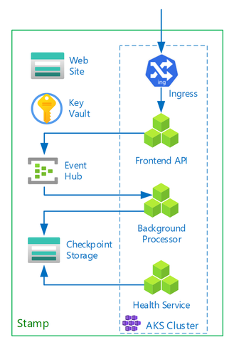
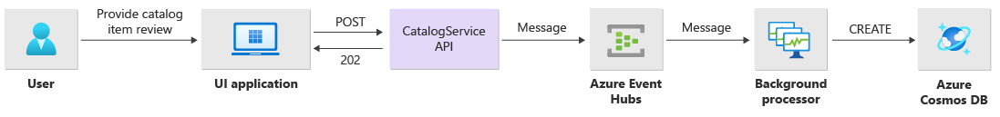
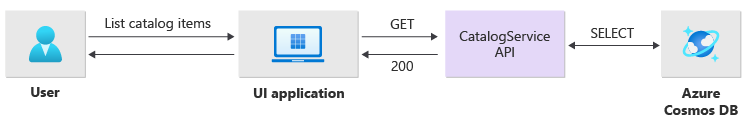
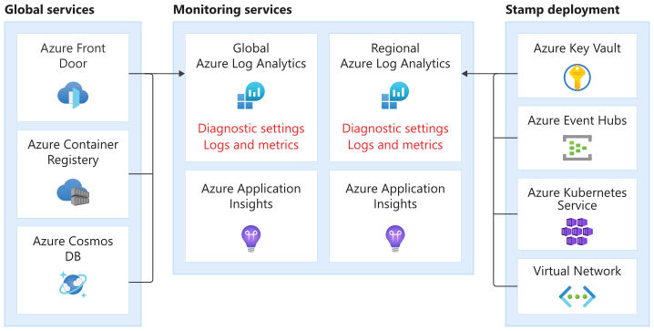
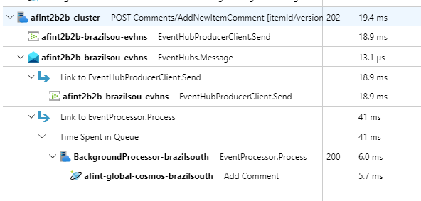
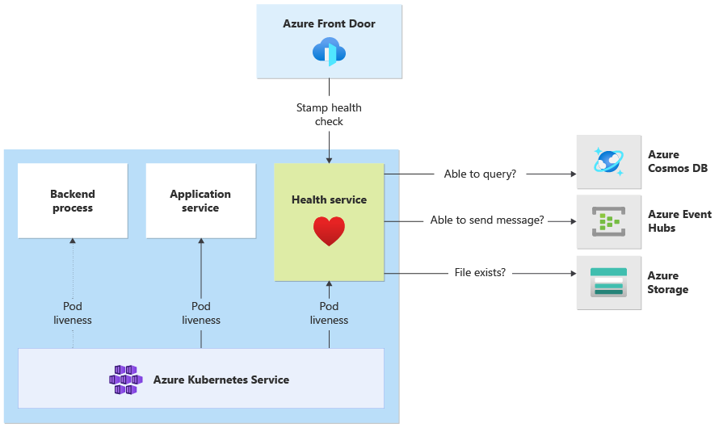

# Application design considerations for mission-critical workloads

The [baseline mission critical reference architecture](/azure/architecture/reference-architectures/containers/aks-mission-critical/mission-critical-intro) illustrates a highly reliable workload through a simple online catalog application. The end users can browse through a catalog of items, see details of an item, and post ratings and comments for items. This article focuses on reliability and resiliency aspects of a mission-critical application, such as asynchronous processing of requests and how to achieve high throughput within a solution. 

> [!IMPORTANT]
>  The guidance is backed by a production-grade [reference implementation](https://github.com/Azure/Mission-Critical-Online) which showcases mission critical application development on Azure. This implementation can be used as a basis for further solution development in your first step towards production.

## Application composition

For high-scale mission critical applications, it's essential to **optimize the architecture for end-to-end scalability and resilience**. This state can be achieved through separation of components into functional units that can operate independently. Apply this separation at all levels on the application stack, allowing each part of the system to scale independently and meet changes in demand.

An example of that approach is shown in the implementation. The application uses stateless API endpoints, which decouple long-running write requests asynchronously through a messaging broker. The workload is composed in a way that the whole AKS cluster and other dependencies in the stamp can be deleted and recreated at any time. The main components are: 

- **User interface (UI):** single-page web application accessed by end users is hosted in Azure Storage Account's static website hosting.
- **API** (`CatalogService`): REST API called by the UI application, but available for other potential client applications.
- **Worker** (`BackgroundProcessor`): background worker, which processes write requests to the database by listening to new events on the message bus. 
This component does not expose any APIs.
- **Health service API** (`HealthService`): used to report the health of the application by checking if critical components (database, messaging bus) are working.


The API, worker, and health check applications are referred to as **workload** and hosted as containers in a dedicated AKS namespace (called `workload`). There's **no direct communication** between the pods. The pods are **stateless** and able to **scale independently**.



There are other supporting components running in the cluster:

1. **Ingress controller**: Nginx Ingress Controller is used to route incoming requests to the workload and load balance between pods. It is exposed through Azure Load Balancer with a public IP address (but only accessed through Azure Front Door).
1. **Cert manager**: Jetstack's `cert-manager` is used to auto-provision SSL/TLS certificates (using Let's Encrypt) for the ingress rules.
1. **CSI secrets driver**: Azure Key Vault Provider for Secrets Store CSI is used to securely read secrets such as connection strings from Azure Key Vault.
1. **Monitoring agent**: The default OMSAgent configuration is adjusted to reduce the amount of monitoring data sent to the Log Analytics workspace.

## Database connection

Due to the ephemeral nature of deployment stamps, avoid persisting state within the stamp as much as possible. State should be persisted in an externalized data store. To support the reliability SLO, that data store needs to be resilient. It's recommended that you use managed (PaaS) services combined with native SDK libraries that automatically handle timeouts, disconnects and other failure states.

In the reference implementation, **Azure Cosmos DB** serves as the main data store for the application. [Azure Cosmos DB](/azure/cosmos-db/) was chosen because it provides **multi-region writes**. Each stamp can write to the Azure Cosmos DB replica in the same region with Azure Cosmos DB internally handling data replication and synchronization between regions. **Azure Cosmos DB for NoSQL** is used because it supports all capabilities of the database engine.

For more information, see [Data platform for mission-critical workloads](./mission-critical-data-platform.md#database).

> [!NOTE]
> New applications should use Azure Cosmos DB for NoSQL. For legacy applications that use another NoSQL protocol, evaluate the migration path to Azure Cosmos DB.

> [!TIP]
> For mission-critical applications that prioritize availability over performance, **single-region write and multi-region read** with *Strong consistency* level are recommended.

In this architecture, there's a need to store state temporarily in the stamp for Event Hubs checkpointing. **Azure Storage** is used for that purpose.

All workload components use the Azure Cosmos DB .NET Core SDK to communicate with the database. The SDK includes robust logic to maintain database connections and handle failures. Here are some key configuration settings:

- Uses **Direct connectivity mode**. This is the default setting for .NET SDK v3 because it offers better performance. There are fewer network hops compared to Gateway mode which uses HTTP.
- **Return content response on write** is disabled to prevent the Azure Cosmos DB client from returning the document from Create, Upsert, Patch and Replace operations to reduce network traffic. Also, this is not needed for further processing on the client.
- **Custom serialization** is used to set the JSON property naming policy to `JsonNamingPolicy.CamelCase` to translate .NET-style properties to standard JSON-style and vice-versa. The default ignore condition ignores properties with null values during serialization (`JsonIgnoreCondition.WhenWritingNull`).
- **Application region** is set to the region of the stamp, which enables the SDK to find the closest connection endpoint (preferably within the same region).

```csharp
//
// /src/app/AlwaysOn.Shared/Services/CosmosDbService.cs
//
CosmosClientBuilder clientBuilder = new CosmosClientBuilder(sysConfig.CosmosEndpointUri, sysConfig.CosmosApiKey)
    .WithConnectionModeDirect()
    .WithContentResponseOnWrite(false)
    .WithRequestTimeout(TimeSpan.FromSeconds(sysConfig.ComsosRequestTimeoutSeconds))
    .WithThrottlingRetryOptions(TimeSpan.FromSeconds(sysConfig.ComsosRetryWaitSeconds), sysConfig.ComsosMaxRetryCount)
    .WithCustomSerializer(new CosmosNetSerializer(Globals.JsonSerializerOptions));

if (sysConfig.AzureRegion != "unknown")
{
    clientBuilder = clientBuilder.WithApplicationRegion(sysConfig.AzureRegion);
}

_dbClient = clientBuilder.Build();
```

## Asynchronous messaging

Loose coupling allows services to be designed in a way that **a service doesn't have dependency on other services**. The *loose* aspect allows a service to operate independently. The *coupling* aspect allows for inter-service communication through well-defined interfaces. In the context of a mission critical application, it facilitates high-availability by preventing downstream failures from cascading to frontends or different deployment stamps.

Key characteristics:

- Services aren't constrained to use the same compute platform, programming language, or operating system.
- Services scale independently.
- Downstream failures don't affect client transactions.
- Transactional integrity is more difficult to maintain, because data creation and persistence happens in separate services. This is also a challenge across messaging and persistence services, as described in [this guidance on idempotent message processing](/azure/architecture/reference-architectures/containers/aks-mission-critical/mission-critical-data-platform#idempotent-message-processing).
- End-to-end tracing requires more complex orchestration.

Using well-known design patterns, such as [Queue-Based Load leveling pattern](/azure/architecture/patterns/queue-based-load-leveling) and [Competing Consumers pattern](/azure/architecture/patterns/competing-consumers), is highly recommended. These patterns help in load distribution from the producer to the consumers and asynchronous processing by consumers. For example, the worker allows the API to accept the request and return to the caller quickly while processing a database write operation separately.

**Azure Event Hubs** is used as the message broker between the API and worker.

> [!IMPORTANT]
> The message broker is not intended to be used as a persistent data store for long periods of time. The Event Hubs service supports [capture feature](/azure/event-hubs/event-hubs-capture-enable-through-portal) which allows an event hub to automatically write a copy of messages to a linked Azure Storage account. This keeps utilization in-check but it also serves as a mechanism to backup messages.

### Implementation details for write operations

Write operations, such as *post rating and post comment* are processed asynchronously. The API first sends a message with all relevant information, such as type of action and comment data, to the message queue and immediately returns `HTTP 202 (Accepted)` with additional `Location` header of the to-be-created object.

Messages in the queue are then processed by `BackgroundProcessor` instances which handle the actual database communication for write operations. `BackgroundProcessor` scales in and out dynamically based on message volume on the queue. The scale out limit of processor instances is defined by the [maximum number of Event Hubs partitions](/azure/event-hubs/event-hubs-quotas#basic-vs-standard-vs-premium-vs-dedicated-tiers) (which is 32 for Basic and Standard tiers, 100 for Premium tier and 1024 for Dedicated tier).



The Azure EventHub Processor library in `BackgroundProcessor` uses Azure Blob Storage to manage partition ownership, load balance between different worker instances, and to track progress using checkpoints. **Writing the checkpoints to the blob storage does not occur after every event** because this would add a prohibitively expensive delay for every message. Instead, the checkpoint writing occurs on a timer-loop (configurable duration with a current setting of 10 seconds):

```csharp
while (!stoppingToken.IsCancellationRequested)
{
    await Task.Delay(TimeSpan.FromSeconds(_sysConfig.BackendCheckpointLoopSeconds), stoppingToken);
    if (!stoppingToken.IsCancellationRequested && !checkpointEvents.IsEmpty)
    {
        string lastPartition = null;
        try
        {
            foreach (var partition in checkpointEvents.Keys)
            {
                lastPartition = partition;
                if (checkpointEvents.TryRemove(partition, out ProcessEventArgs lastProcessEventArgs))
                {
                    if (lastProcessEventArgs.HasEvent)
                    {
                        _logger.LogDebug("Scheduled checkpointing for partition {partition}. Offset={offset}", partition, lastProcessEventArgs.Data.Offset);
                        await lastProcessEventArgs.UpdateCheckpointAsync();
                    }
                }
            }
        }
        catch (Exception e)
        {
            _logger.LogError(e, "Exception during checkpointing loop for partition={lastPartition}", lastPartition);
        }
    }
}
```

If the processor application encounters an error or is stopped before processing the message, then:

- **Another instance will pick up the message for reprocessing**, because it wasn't properly checkpointed in Storage.
- **If the previous worker managed to persist the document** in the database before failing, a conflict will happen (because the same ID and partition key is used) and the processor can safely ignore the message, as it has been already persisted.
- **If the previous worker was terminated before writing to the database**, new instance will repeat the steps and finalize persistence.

### Implementation details for read operations

Read operations are processed directly by the API and immediately return data back to the user.



There is no back channel that communicates to the client if the operation completed successfully. The client application has to proactively poll the API to for updates of the item specified in the `Location` HTTP header.

## Scalability

Individual workload components should scale out independently because each has different load patterns. The scaling requirements depend on the functionality of the service. Some services have a direct impact on end user and are expected to be able to scale out aggressively to provide fast response for a positive user experience and performance at any time.

In the implementation, the services are packaged as Docker containers and deployed by using Helm charts to each stamp. They are configured to have the expected Kubernetes requests and limits and a pre-configured auto-scaling rule in place. The `CatalogService` and the `BackgroundProcessor` workload component can scale in and out individually, both services are stateless.

End users interact directly with the `CatalogService`, so this part of the workload must respond under any load. There are at least 3 instances per cluster to spread across three Availability Zones in an Azure region. AKS horizontal pod autoscaler (HPA) takes care of automatically adding more pods if needed and Azure Cosmos DB auto-scale is able to dynamically increase and reduce RUs available for the collection. Together, the `CatalogService` and Azure Cosmos DB form a **scale unit** within a stamp.

HPA is deployed with a Helm chart with configurable maximum and minimum number of replicas. The values are configured as:

During a load test it was identified that each instance is expected to handle ~250 requests/second with a standard usage pattern.

The `BackgroundProcessor` service has very different requirements and is considered a background worker which has limited impact on the user experience. As such, `BackgroundProcessor` has a different auto-scaling configuration than `CatalogService` and it can scale between 2 and 32 instances (this limit should be based on the number of partitions used in the Event Hubs - there's no benefit in having more workers than partitions).

|Component           |`minReplicas`  |`maxReplicas`      |
|--------------------|---------------|-------------------|
|CatalogService      |3              |20                 |
|BackgroundProcessor |2              |32                  |

In addition to that, each component of the workload including dependencies like `ingress-nginx` has [Pod Disruption Budgets (PDBs)](/azure/aks/operator-best-practices-scheduler#plan-for-availability-using-pod-disruption-budgets) configured to ensure that a minimum number of instances is always available when changes are rolled out on clusters.

```yml
#
# /src/app/charts/healthservice/templates/pdb.yaml
# Example pod distribution budget configuration.
#
apiVersion: policy/v1
kind: PodDisruptionBudget
metadata:
  name: {{ .Chart.Name }}-pdb
spec:
  minAvailable: 1
  selector:
    matchLabels:
      app: {{ .Chart.Name }}
```

> [!NOTE]
> The actual minimum and maximum number of pods for each component should be determined through load testing and can differ per workload.

## Instrumentation

Instrumentation is an important mechanism in evaluating performance bottle necks and health issues that workload components can introduce in the system. Each component should emit sufficient information through metrics and trace logs to help quantify decisions. Here are some key considerations for instrumenting your application.

- Send logs, metrics and additional telemetry to the stamp's log system. 
- Use structured logging instead of plain text so that information can be queried.
-  Implement event correlation to ensure end-to-end transaction view. In the RI, every API response contains **Operation ID** as an HTTP header for traceability.
- Don't rely only on *stdout* (console) logging. However, these logs can be used for immediate troubleshooting of a failing pod.

This architecture implements distributed tracing with Application Insights backed by Log Analytics Workspace for all application monitoring data. Azure Log Analytics is used for logs and metrics of all workload and infrastructure components. The workload implements **full end-to-end tracing** of requests coming from the API, through Event Hubs, to Azure Cosmos DB.


> [!IMPORTANT]
> Stamp monitoring resources are deployed to a separate monitoring resource group and have different lifecycle than the stamp itself. For more information, see [Monitoring data for stamp resources](/azure/architecture/reference-architectures/containers/aks-mission-critical/mission-critical-app-platform#monitoring-data-for-stamp-resources).



### Implementation details for application monitoring

The `BackgroundProcessor` component uses the `Microsoft.ApplicationInsights.WorkerService` NuGet package to get out-of-the-box instrumentation from the application. Also, Serilog is used for all logging inside the application with Azure Application Insights configured as a sink (next to the console sink). Only when needed to track additional metrics, a `TelemetryClient` instance for Application Insights is used directly.

```csharp
//
// /src/app/AlwaysOn.BackgroundProcessor/Program.cs
//
public static IHostBuilder CreateHostBuilder(string[] args) =>
    Host.CreateDefaultBuilder(args)
    .ConfigureServices((hostContext, services) =>
    {
        Log.Logger = new LoggerConfiguration()
                            .ReadFrom.Configuration(hostContext.Configuration)
                            .Enrich.FromLogContext()
                            .WriteTo.Console(outputTemplate: "[{Timestamp:yyyy-MM-dd HH:mm:ss.fff zzz} {Level:u3}] {Message:lj} {Properties:j}{NewLine}{Exception}")
                            .WriteTo.ApplicationInsights(hostContext.Configuration[SysConfiguration.ApplicationInsightsConnStringKeyName], TelemetryConverter.Traces)
                            .CreateLogger();
    }
```



To demonstrate practical request traceability, every API request (successful or not) returns the Correlation ID header to the caller. With this identifier the **application support team is able to search Application Insights** and get a detailed view of the full transaction.

```csharp
//
// /src/app/AlwaysOn.CatalogService/Startup.cs
//
app.Use(async (context, next) =>
{
    context.Response.OnStarting(o =>
    {
        if (o is HttpContext ctx)
        {
            // ... code omitted for brevity
            context.Response.Headers.Add("X-Server-Location", sysConfig.AzureRegion);
            context.Response.Headers.Add("X-Correlation-ID", Activity.Current?.RootId);
            context.Response.Headers.Add("X-Requested-Api-Version", ctx.GetRequestedApiVersion()?.ToString());
        }
        return Task.CompletedTask;
    }, context);
    await next();
});
```

> [!NOTE]
> The Application Insights SDK has adaptive sampling enabled by default. That means that not every request is sent to the cloud and searchable by ID. Mission-critical application teams need to be able to reliably trace every request, therefore **the reference implementation has adaptive sampling disabled in production environment**.

### Kubernetes monitoring implementation details

Besides the use of diagnostic settings to send AKS logs and metrics to Log Analytics, AKS is also configured to use **Container Insights**. Enabling Container Insights deploys the OMSAgentForLinux via a Kubernetes DaemonSet on each of the nodes in AKS clusters. The OMSAgentForLinux is capable of collecting additional logs and metrics from within the Kubernetes cluster and sends them to its corresponding Log Analytics workspace. This contains more granular data about pods, deployments, services and the overall cluster health.

Extensive logging can negatively affect cost while providing no benefit. For this reason, **stdout log collection and Prometheus scraping is disabled** for the workload pods in the Container Insights configuration, because all traces are already captured through Application Insights - generating duplicate records.

```yaml
#
# /src/config/monitoring/container-azm-ms-agentconfig.yaml
# This is just a snippet showing the relevant part.
#
[log_collection_settings]
    [log_collection_settings.stdout]
        enabled = false

        exclude_namespaces = ["kube-system"]
```

See the [full configuration file](https://github.com/Azure/Mission-Critical-Online/blob/ae62624a9aaf3e5673ec39bdfadb25a257278dde/src/config/monitoring/container-azm-ms-agentconfig.yaml) for reference.

## Health monitoring

Application monitoring and observability are commonly used to quickly identify issues with a system and inform the [health model](/azure/architecture/framework/mission-critical/mission-critical-health-modeling) about the current application state. Health monitoring, surfaced through *health endpoints* and used by *health probes* provides information, which is immediately actionable - typically instructing the main load balancer to take the unhealthy component out of rotation.

In the architecture, health monitoring is applied at these levels:

- Workload pods running on AKS. These pods have health and liveness probes, therefore AKS is able to manage their lifecycle.
- **Health service** is a dedicated component on the cluster. Azure Front Door is configured to probe health services in each stamp and remove unhealthy stamps from load balancing automatically.

### Health service implementation details

`HealthService` is a workload component that is running along other components (`CatalogService` and `BackgroundProcessor`) on the compute cluster. It provides a REST API that is called by Azure Front Door health check to determine the availability of a stamp. Unlike basic liveness probes, health service is a more complex component which adds the state of dependencies in addition to its own.



If the AKS cluster is down, the health service won't respond, rendering the workload unhealthy. When the service is running, it performs periodic checks against critical components of the solution. All checks are done **asynchronously and in parallel**. If any of them fail, the whole stamp will be considered unavailable.

> [!WARNING]
> Azure Front Door health probes can generate significant load on the health service, because requests come from multiple PoP locations. To prevent overloading the downstream components, appropriate caching needs to take place.

The health service is also used for explicitly configured URL ping tests with each stamp's Application Insights resource.

For more details about the `HealthService` implementation, see [Application Health Service](./mission-critical-health-modeling.md#application-health-service).
