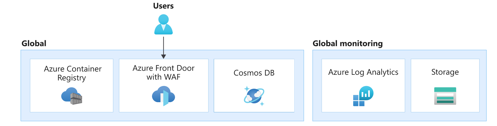
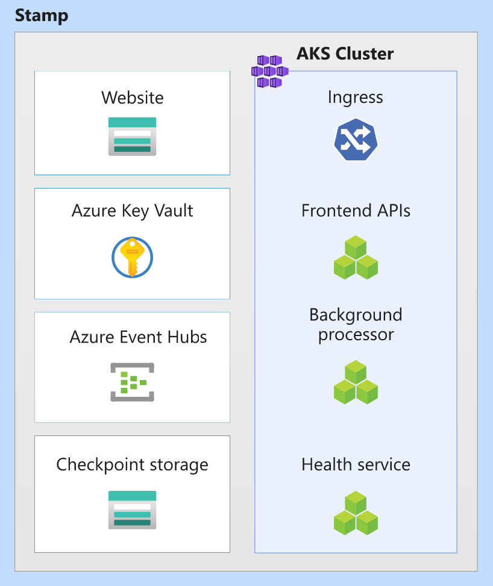
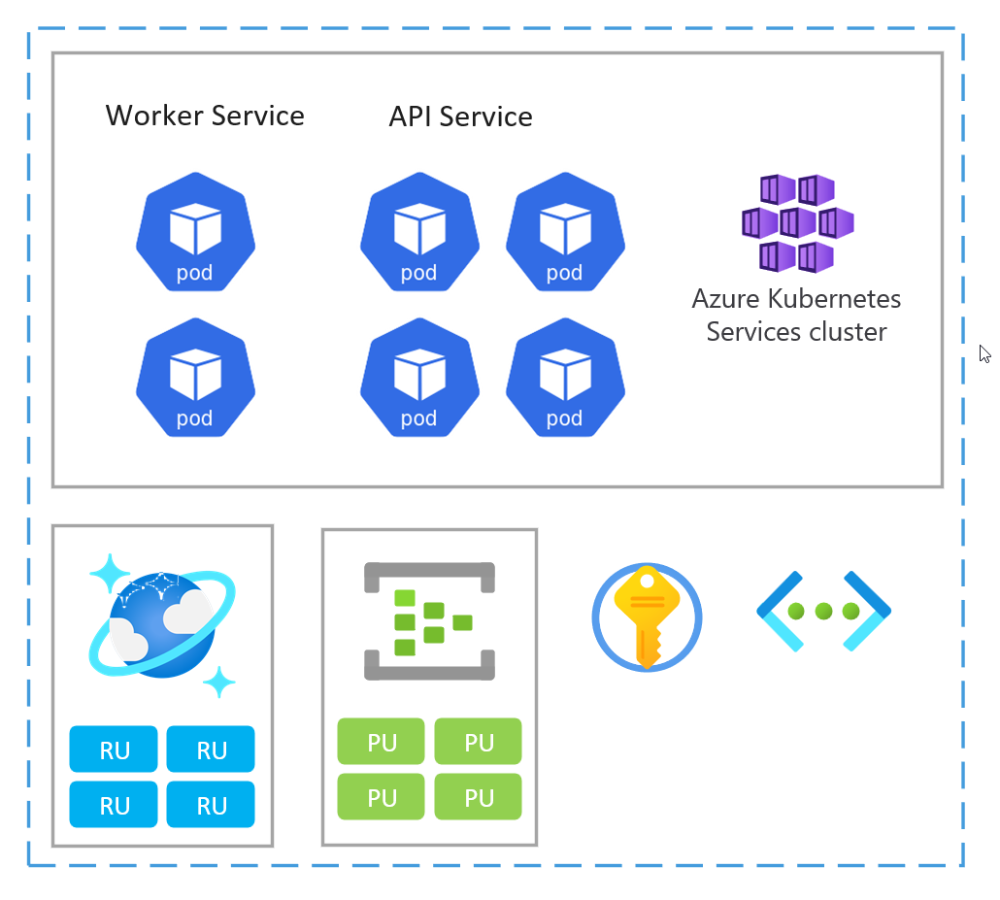

A key design area of any mission critical architecture is the application platform. Platform refers to the infrastructure components and Azure services that must be provisioned to support the application. Here are some overarching recommendations.

-	Design in layers. Choose the right set of services, their configuration, and the application-specific dependencies. This layered approach helps in creating segmentation that's useful in defining roles and functions, and assigning appropriate privileges. This approach also makes the deployment more manageable. 

-	A mission-critical application must be highly reliable and resistant to datacenter and regional failures. Building _zonal and regional redundancy_ in an active-active configuration is the main strategy. As you choose Azure services for your application's platform, consider their Availability Zones support and deployment & operational patterns to use multiple Azure regions.

-	Use _scale units_ to handle increased load. Scale units allow you to logically group services and independently scale each unit within the architecture. Use your capacity model and expected performance to define the required scale of a unit. Factor in duplication of resources that are required for side-by-side deployments.

In this architecture, the application platform consists of global, deployment stamp, and regional resources. The regional resources are provisioned as part of a deployment stamp. Each stamp equates to a scale unit and, in case it becomes unhealthy, can be entirely replaced.

The resources in each layer have distinct characteristics:

|Characteristics|Considerations|
|---|---|
|Lifetime|What is the expected lifetime of resource, relative to other resources in the solution? Should the resource outlive or share the lifetime with the entire system or region, or should it be temporary?|
|State|What impact will persisted state at this layer have on reliability or manageability? |
|Reach|Is the resource required to be globally distributed? Can the resource communicate with other resources, globally or in regions?|
|Dependencies|What's the dependency on other resources, globally or in other regions?|
|Scale limits|What is the expected throughput for that resource at that layer? How much scale is provided by the resource to fit that demand? |
|Availability/disaster recovery|What's the impact on availability or disaster at this layer? Would it cause a systemic outage or only localized capacity or availability issue?|

## Global resources

Certain resources in this architecture are shared by resources deployed in regions. In this architecture, they are used to distribute traffic across multiple regions, store permanent state for the whole application, and cache global static data.

|Characteristics|Layer Considerations|
|---|---|
|Lifetime|These resources are expected to be long living. Their lifetime spans the life of the system or longer. Often the resources are managed with in-place data and control plane updates, assuming they support zero-downtime update operations.|
|State| Because these resources exist for at least the lifetime of the system, this layer is often responsible for storing global, geo-replicated state.|
|Reach|The resources should be globally distributed. It’s recommended that these resources communicate with regional or other resources with low latency and the desired consistency.|
|Dependencies|The resources should avoid dependencies on regional resources because their unavailability can be a cause of global failure. For example, certificates or secrets kept in a single vault could have global impact if there is regional failure where the vault is located.|
|Scale limits|Often these resources are singleton instances in the system, and as such they should be able to scale such that they can handle throughput of the system as a whole.|
|Availability/disaster recovery|Because regional and stamp resources can consume global resources or are fronted by them, it's critical that global resources are configured with high availability and disaster recovery for the health of the whole system. |

In this architecture, global layer resources are [Azure Front Door](/azure/frontdoor/), [Azure Cosmos DB](/azure/cosmos-db/), [Azure Container Registry](/azure/container-registry/), and [Azure Log Analytics](/azure/azure-monitor/) for storing logs and metrics from other global layer resources.

### Global load balancer

Azure Front Door is used as the only entry point for user traffic. If Front Door becomes unavailable, the entire system is at risk. Azure guarantees that Azure Front Door will deliver the requested content without error 99.99% of the time. For more details, see [Front Door service limits](/azure/azure-resource-manager/management/azure-subscription-service-limits#azure-front-door-standard-and-premium-tier-service-limits).

The Front Door instance sends traffic to the configured backend services, such as the compute cluster and frontend. Backend misconfigurations can lead to outages. To avoid outages due to misconfigurations, you should extensively test your Front Door settings.

Another common error is missing SSL certificate that can prevent users from using the front end. Mitigation might require manual intervention. For example, you might choose to roll back to the previous configuration and re-issue the certificate, if possible. Regardless, expect unavailability while changes take effect.

Front Door offers many additional capabilities besides global traffic routing. An important capability is the Web Application Firewall (WAF), because Front Door is able to inspect traffic which is passing through. When configured in the _Prevention_ mode, it will block suspicious traffic before even reaching any of the backends.

For information about Front Door capabilities, see [Frequently asked questions for Azure Front Door](/azure/frontdoor/front-door-faq).

For other considerations about global distribution of traffic, see [Misson critical guidance in Well-architected Framework: Global routing](/azure/architecture/framework/mission-critical/mission-critical-networking-connectivity#global-traffic-routing).

### Container Registry

Azure Container Registry is used to store Open Container Initiative (OCI) artifacts, specifically helm charts and container images. It doesn't participate in the request flow and is only accessed periodically. So, a single resource instance can be considered. Container registry is required to exist before stamp resources are deployed and shouldn't have dependency on regional layer resources.

Enable zone redundancy and geo-replication of registries so that runtime access to images is fast and resilient to failures. In case of unavailability, the instance can then fail over to replica regions and requests are automatically re-routed to another region. Expect transient errors in pulling images until failover is complete.

Failures can also occur if images are deleted inadvertently, new compute nodes will not be able to pull images, but existing nodes can still use cached images. The primary strategy for disaster recovery is redeployment. The artifacts in a container registry can be regenerated from pipelines. Container registry must be able to withstand many concurrent connections to support all of your deployments.

It’s recommended that you use the Premium SKU to enable geo replication. The zone redundancy feature ensures resiliency and high availability within a specific region. In case of a regional outage, replicas in other regions are still available for data plane operations. With this SKU you can restrict access to the registry through private endpoints. Not only does this feature restrict access to your application, but also ensures that all of the potential throughput is only reserved for that application.

For more details, see [Best practices for Azure Container Registry](/azure/container-registry/container-registry-best-practices).

### Database

It's recommended that all state is stored globally in a database separated from regional stamps. Build redundancy by deploying the database across regions. For mission-critical workloads, data consistency should be the primary concern. Also, in case of a failure, write requests to the database should still be functional.

Data replication in an active-active configuration is strongly recommended. The application should be able to instantly connect with another region. All instances should be able to handle read _and_ write requests.

This architecture uses Azure Cosmos DB with SQL API. Multi-master write is enabled with replicas deployed to every region in which a stamp is deployed. Each stamp can write locally and Cosmos DB handles data replication and synchronization between the stamps. The consistency level is set to _Session_, which offers a reasonable tradeoff for latency, availability and consistency guarantees for this specific application. It's important to understand that _Strong_ consistency level is not available for multi-master write databases.

Zone redundancy is also enabled within each replicated region.

For details on multi-region writes, see [Configure multi-region writes in your applications that use Azure Cosmos DB](/azure/cosmos-db/sql/how-to-multi-master).

> For other data considerations, see [Misson critical guidance in Well-architected Framework: Data platform considerations](/azure/architecture/framework/mission-critical/mission-critical-data-platform).

### Global monitoring

Azure Log Analytics is used to store diagnostic logs from all global resources. It's recommended that you restrict daily quota on storage especially on environments that are used for load testing. Also, set retention policy. These restrictions will prevent any overspend that is incurred by storing data that is not needed beyond a limit.

### Considerations for foundational services

The system is likely to use other critical platform services that can cause the entire system to be at risk, such as Azure DNS and Azure Active Directory (AD). Unavailability of those services is unlikely. Azure DNS guarantees 100% availability SLA for valid DNS requests. Azure Active Directory guarantees at least 99.9% uptime. Still, you should be aware of the impact in the event of a failure.

Taking hard dependency on foundational services is inevitable because many Azure services depend on them. Expect disruption in the system if they are unavailable. For instance:

- Azure Front Door uses Azure DNS to reach the backend and other global services.
- Azure Container Registry uses Azure DNS to fail over requests to another region.

In both cases, both Azure services will be impacted if Azure DNS is unavailable. Name resolution for user requests from Front Door will fail; Docker images won't be pulled from the registry. Using an external DNS service as backup will not mitigate the risk because many Azure services don't allow such configuration and rely on internal DNS. Expect full outage.

Similarly, Azure AD is used for control plane operations such as creating new AKS nodes, pulling images from Container Registry, or accessing Key Vault on pod startup. If Azure AD is unavailable, existing components should not affected, but overall performance may be degraded. For example, new pods or AKS nodes added while Azure AD is unavailable won't be functional. Consider scaling in during this time and expect decreased user experience.

## Deployment stamp resources

In this architecture, the deployment stamp deploys the workload and provisions resources that participate in completing business transactions. A stamp typically corresponds to a deployment to an Azure region. Although, a region can have more than one stamp.

|Characteristics|Considerations|
|---|---|
|Lifetime|The resources are expected to have a short life span (ephemeral) with the intent that they can get added and removed dynamically while regional resources outside the stamp continue to persist. The ephemeral nature is needed to provide more resiliency, scale, and proximity to users. |
|State| Because stamps are ephemeral and can be destroyed at any time, a stamp should be stateless as much as possible.|
|Reach|Can communicate with regional and global resources. However, communication with other regions or other stamps should be avoided. In this architecture, there isn't a need for these resources to be globally distributed.|
|Dependencies| The stamp resources must be independent. That is, they should not rely on other stamps or components in other regions. They are expected to have regional and global dependencies.  The main shared component is the database layer and container registry. This component requires synchronization at runtime.|
|Scale limits|Throughput is established through testing. The throughput of the overall stamp is limited to the least performant resource. Stamp throughput needs to take into account the estimated high-level of demand and any failover as the result of another stamp in the region becoming unavailable.|
|Availability/disaster recovery|Because of the temporary nature of stamps, disaster recovery is done by redeploying the stamp. If resources are in an unhealthy state, the stamp, as a whole, can be destroyed and redeployed. |

In this architecture, stamp resources are [Azure Kubernetes Service](/azure/aks/), [Azure Event Hubs](/azure/event-hubs/), [Azure Key Vault](/azure/key-vault/), and [Azure Blob Storage](/azure/storage/blobs/).

### Scale unit

A stamp can also be considered as a scale unit (SU). All components and services within a given stamp are configured and tested to serve requests in a given range. Here are some scaling and availability considerations when choosing Azure services in a unit:

- Evaluate capacity relations between all resources in a scale unit. For example, to handle 100 incoming requests, 5 ingress controller pods and 3 catalog service pods and 1000 RUs in Cosmos DB would be needed. So, when autoscaling the ingress pods, expect scaling of the catalog service and cosmos RUs given those ranges.

- Load test the services to determine a range within which requests will be served. Based on the results configure minimum and maximum instances and target metrics. When the target is reached, you can choose to automate scaling of the entire unit.

  **Scalability requirements**

  | Metric | max |
  | --- | --- |
  | Users | 25k |
  | New requests/sec. | 200 |

  This definition is used to evaluate the capabilities of a unit on a regular basis, which later then needs to be translated into a capacity model. This influences the configuration:

  **Configuration**
  
  | Component | min | max |
  | --- | --- | --- |
  | AKS nodes | 3 | 12 |
  | Ingress controller replicas | 3 | 24 |
  | Service replicas | 3 | 24 |
  | Worker replicas | 3 | 12 |
  | Event Hub throughput units | 1 | 10 |
  | Cosmos DB RUs | 4000 | 40000 |

  Each scale unit is deployed into an Azure region and is therefore primarily handling traffic from that given area (although it can take over traffic from other regions when needed). This geographic spread will likely result in load patterns and business hours that might vary from region to region and as such, every SU is designed to scale-in/-down when idle.

- The Azure subscription scale limits and quotas must support the capacity and cost model set by the business requirements. Also check the limits of individual services in consideration. For more information, see [Azure service limits](/azure/azure-resource-manager/management/azure-subscription-service-limits).

- Choose services that support availability zones to build redundancy. This might limit your technology choices. See [Availability Zones](https://docs.microsoft.com/azure/availability-zones/az-region) for details.

> For other considerations about the size of a unit, and combination of resources, see [Misson critical guidance in Well-architected Framework: Scale-unit architecture](https://docs.microsoft.com/azure/architecture/framework/mission-critical/mission-critical-application-design#scale-unit-architecture).

### Compute cluster

To containerize the workload, each stamp needs to run a compute cluster. In this architecture, Azure Kubernetes Service (AKS) is chosen because Kubernetes is the most popular compute platform for modern, containerized applications.

The lifetime of the AKS cluster is bound to the ephemeral nature of the stamp. The cluster is stateless and doesn't have persistent volumes. It uses ephemeral OS disks instead of managed disks because they aren't expected to receive application or system-level maintenance.

To increase reliability, the cluster is configured to use all three availability zones in a given region. This makes it possible for the cluster to use [AKS Uptime SLA](https://docs.microsoft.com/azure/aks/uptime-sla) that guarantees 99.95% SLA availability of the AKS control plane.

Other factors such as scale limits, compute capacity, subscription quota can also impact reliability. If there isn't enough capacity or limits are reached, scale out and scale up operations will fail but existing compute is expected to function.

The cluster only uses the default node pool to run the simple workload, but autoscaling is enabled to let the node pool automatically scale out if needed, which improves reliability. For complex workloads, multiple node pools are necessary, allowing the system resources and applications to run in separate node pools. When using multiple node pools, all node pools should be autoscaled.  

At the pod level, the Horizontal Pod Autoscaler (HPA) scales pods based on configured CPU, memory, or custom metrics. Load test the components of the workload to establish a baseline for the autoscaler and HPA values.

The cluster is also configured for automatic node image upgrades and to scale appropriately during those upgrades. This scaling allows for zero downtime while upgrades are being performed. If the cluster in one stamp fails during an upgrade, other clusters in other stamps shouldn't be affected, but upgrades across stamps should occur at different times to maintain availability. Also, cluster upgrades are automatically rolled across the nodes so that they aren't unavailable at the same time.

Some components such as cert-manager and ingress-nginx require container images from external container registries. If those repositories or images are unavailable, new instances on new nodes (where the image is not cached) might not be able to start. This risk could be mitigated by importing these images to own Azure Container Registry.

Observability is critical in this architecture because stamps are ephemeral. Diagnostic settings are configured to store all log and metric data in a regional Log Analytics workspace. Also, AKS Container Insights is enabled through an in-cluster OMS Agent. This agent allows the cluster to send monitoring data to the Log Analytics workspace.

> For other considerations about the compute cluster, see [Misson critical guidance in Well-architected Framework: Container Orchestration and Kubernetes](/azure/architecture/framework/mission-critical/mission-critical-application-platform#container-orchestration-and-kubernetes).

### Key Vault

Azure Key Vault is used to store global secrets such as connection strings to the database and stamp secrets such as the Event Hubs connection string.

This architecture uses a [Secrets Store CSI driver](/azure/aks/csi-secrets-store-driver) in the compute cluster to get/set secrets from Key Vault. Secrets are needed when new pods are spawned. If Key Vault is unavailable, new pods might not get started. As a result there might be disruption; scale out operations can be impacted, updates can fail, new deployments can't be executed.

Key Vault has a limit on the number of operations. Due to the automatic update of secrets, the limit can be reached if there are many pods. You can choose to decrease the frequency of updates to avoid this situation.

For other considerations on secret management, see [Misson critical guidance in Well-architected Framework: Data integrity protection](/azure/architecture/framework/mission-critical/mission-critical-security#data-integrity-protection).

### Event Hubs

The only stateful service in the stamp is the message broker, Azure Event Hubs, which stores requests for a short period. The broker serves the need for buffering and reliable messaging. The processed requests are persisted in the global database.

In this architecture, Standard SKU is used and zone redundancy is enabled for high availability.

Event Hubs health is verified by the HealthService component running on the compute cluster. It performs periodic checks against various resources. This is useful in detecting unhealthy conditions. For example, if messages cannot be sent to the event hub, the stamp  would be unusable for any write operations. HealthService should automatically detect this condition and report unhealthy state to Front Door, which will take the stamp out of rotation.

For scalability, enabling auto-inflate through a Terraform variable is recommended.

> For other considerations about messaging, see [Misson critical guidance in Well-architected Framework: Asynchronous messaging](/azure/architecture/framework/mission-critical/mission-critical-application-platform#asynchronous-messaging).

### Storage accounts

In this architecture two storage accounts are provisioned. Both accounts are deployed in zone-redundant mode (ZRS).

One account is used Event Hubs checkpointing. If this account is not responsive, the stamp won't be able to process messages from Event Hubs and might even impact other services in the stamp. This condition is periodically checked by the HealthService, which is one of the application components running in the compute cluster.

The other is used to host the UI single-page application. If serving of the static web site has any issues, Front Door will detect the issue and won't send traffic to this storage account. During this time, Front Door can use cached content.

For more information about recovery, see [Disaster recovery and storage account failover](/azure/storage/common/storage-disaster-recovery-guidance).

## Regional resources

A system can have resources that are deployed in region but outlive the stamp resources. In this architecture, observability data for stamp resources are stored in regional data stores.

|Characteristic|Consideration|
|---|---|
|Lifetime|The resources share the lifetime of the region and out live the stamp resources.|
|State| State stored in a region cannot live beyond the lifetime of the region. If state needs to be shared across regions, consider using a global data store.|
|Reach|The resources don't need to be globally distributed. Direct communication with other regions should be avoided at all cost. |
|Dependencies| The resources can have dependencies on global resources, but not on stamp resources because stamps are meant to be short lived. |
|Scale limits|Determine the scale limit of regional resources by combining all stamps within the region.|
|Availability/disaster recovery|Coming Soon! |

### Monitoring data for stamp resources

Deploying monitoring resources is a typical example for regional resources. In this architecture, each region has an individual Log Analytics workspace configured to store all log and metric data emitted from stamp resources. Because regional resource outlive stamp resources, data is available even when the stamp is deleted.

[Azure Log Analytics](/azure/azure-monitor/logs/log-analytics-overview) and [Azure Application Insights](/azure/azure-monitor/app/app-insights-overview) are used to store logs and metrics from the platform. It's recommended that you restrict daily quota on storage especially on environments that are used for load testing. Also, set retention policy to store all data. These restrictions will prevent any overspend that is incurred by storing data that is not needed beyond a limit.

Similarly, Application Insights is also deployed as a regional resource to collect all application monitoring data.

> For design recommendations about monitoring, see [Misson critical guidance in Well-architected Framework: Health modeling](/azure/architecture/framework/mission-critical/mission-critical-health-modeling#design-recommendations-1).

## Next

Deploy the reference implementation to get a full understanding of reources and their configuration.

> [!div class="nextstepaction"]
> [Implementation: Mission-Critical Online](https://github.com/Azure/Mission-Critical-Online)