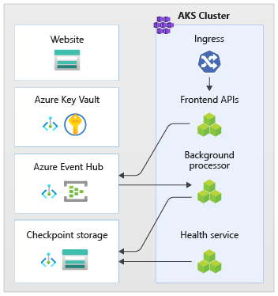

This architecture provides guidance for designing a mission critical workload on Azure. It uses cloud-native capabilities to maximize reliability and operational effectiveness. It applies the design methodology for [Well-Architected mission-critical workloads](/azure/architecture/framework/mission-critical/mission-critical-overview) to an internet-facing application, where the workload is accessed over a public endpoint and does not require private network connectivity to other company resources.

> [!IMPORTANT]
>  The guidance is backed by a production-grade [example implementation](https://github.com/Azure/Mission-Critical-Online) which showcases mission critical application development on Azure. This implementation can be used as a basis for further solution development in your first step towards production.

## Reliability tier

Reliability is a relative concept, and for a workload to be appropriately reliable, it should reflect the business requirements surrounding it, including Service Level Objectives (SLO) and Service Level Agreements (SLA), to capture the percentage of time the application should be available.

This architecture targets an SLO of 99.99%, which corresponds to a permitted annual downtime of 52 minutes and 35 seconds. All encompassed design decisions are therefore intended to accomplish this target SLO.

> [!TIP]
> To define a realistic SLO, it's important to understand the SLA of all Azure components within the architecture. These individual numbers should be aggregated to determine a [composite SLA](/azure/architecture/framework/resiliency/business-metrics#composite-slas) which should align with workload targets.
>
> Refer to [Well-Architected mission-critical workloads: Design for business requirements](/azure/architecture/framework/mission-critical/mission-critical-design-methodology#1design-for-business-requirements).

## Key design strategies

Many factors can affect the reliability of an application, such as the ability to recover from failure, regional availability, deployment efficacy, and security. This architecture applies a set of overarching design strategies intended to address these factors and ensure the target reliability tier is achieved.

- **Redundancy in layers**

    - Deploy to _multiple regions in an active-active model_. The application is distributed across two or more Azure regions that handle active user traffic. 

    - Utilize _Availability Zones (AZs)_ for all considered services to maximize availability within a single Azure region, distributing components across physically separate data centers inside a region.

    - Choose resources that support _global distribution_.

    > Refer to [Well-Architected mission-critical workloads: Global distribution](/azure/architecture/framework/mission-critical/mission-critical-application-design#global-distribution).
    
- **Deployment stamps**
    
    Deploy a regional stamp as a _scale unit_ where a logical set of resources can be independently provisioned to keep up with the changes in demand. Each stamp also applies multiple nested scale units, such as the Frontend APIs and Background processors which can scale in and out independently.

    > Refer to [Well-Architected mission-critical workloads: Scale-unit architecture](/azure/architecture/framework/mission-critical/mission-critical-application-design#scale-unit-architecture).
    
- **Reliable and repeatable deployments**    
    
    - Apply the _principle of Infrastructure as code (IaC)_ using technologies, such as Terraform, to provide version control and a standardized operational approach for infrastructure components.

    - Implement _zero downtime blue/green deployment pipelines_. Build and release pipelines must be fully automated to deploy stamps as a single operational unit, using blue/green deployments with continuous validation applied.

    - Apply _environment consistency_ across all considered environments, with the same deployment pipeline code across production and pre-production environments. This eliminates risks associated with deployment and process variations across environments.

    - Have _continuous validation_ by integrating automated testing as part of DevOps processes, including synchronized load and chaos testing, to fully validate the health of both the application code and underlying infrastructure.

    > Refer to [Well-Architected mission-critical workloads: Deployment and testing](/azure/architecture/framework/mission-critical/mission-critical-deployment-testing).
    
- **Operational insights**

    - Have _federated workspaces for observability data_. Monitoring data for global resources and regional resources are stored independently. A centralized observability store isn't recommended to avoid a single point of failure. Cross-workspace querying is used to achieve a unified data sink and single pane of glass for operations. 

    - Construct a _layered health model_ that maps application health to a traffic light model for contextualizing. Health scores are calculated for each individual component and then aggregated at a user flow level and combined with key non-functional requirements, such as performance, as coefficients to quantify application health.

    > Refer to [Well-Architected mission-critical workloads: Health modeling](/azure/architecture/framework/mission-critical/mission-critical-health-modeling).    

## Architecture

:::image type="content" border="false" source="./images/mission-critical-architecture-online.png" alt-text="Diagram that shows mission critical online." lightbox="./images/mission-critical-architecture-online.png":::

*Download a [Visio file](https://arch-center.azureedge.net/mission-critical-intro.vsdx) of this architecture.

The components of this architecture can be broadly categorized in this manner. For product documentation about Azure services, see [Related resources](#related-resources). 

### Global resources

The global resources are long living and share the lifetime of the system. They have the capability of being globally available within the context of a multi-region deployment model. 

Here are the high-level considerations about the components. For detailed information about the decisions, see [**Global resources**](/azure/architecture/reference-architectures/containers/aks-mission-critical/mission-critical-app-platform#global-resources).

#### Global load balancer

A global load balancer is critical for reliably routing traffic to the regional deployments with some level of guarantee based on the availability of backend services in a region. Also, this component should have the capability of inspecting ingress traffic, for example through web application firewall. 

**Azure Front Door** is used as the global entry point for all incoming client HTTP(S) traffic, with **Web Application Firewall (WAF)** capabilities applied to secure Layer 7 ingress traffic. It uses TCP Anycast to optimize routing using the Microsoft backbone network and allows for transparent failover in the event of degraded regional health. Routing is dependent on custom health probes that check the composite heath of key regional resources. Azure Front Door also provides a built-in content delivery network (CDN) to cache static assets for the website component. 

Another option is Traffic Manager, which is a DNS based Layer 4 load balancer. However, failure is not transparent to all clients since DNS propagation must occur.

> Refer to [Well-Architected mission-critical workloads: Global traffic routing](/azure/architecture/framework/mission-critical/mission-critical-networking-connectivity#global-traffic-routing).

#### Database

All state related to the workload is stored in an external database, **Azure Cosmos DB for NoSQL**. This option was chosen because it has the feature set needed for performance and reliability tuning, both in client and server sides. It's highly recommended that the account has multi-master write enabled.

> [!NOTE]
> While a multi-region-write configuration represents the gold standard for reliability, there is a significant trade-off on cost, which should be properly considered.

The account is replicated to each regional stamp and also has zonal redundancy enabled. Also, autoscaling is enabled at the container-level so that containers automatically scale the provisioned throughput as needed.

For more information, see [Data platform for mission-critical workloads](./mission-critical-data-platform.md#database).

> Refer to [Well-Architected mission-critical workloads: Globally distributed multi-write datastore](/azure/architecture/framework/mission-critical/mission-critical-data-platform#globally-distributed-multi-write-datastore).

#### Container registry

**Azure Container Registry** is used to store all container images. It has geo-replication capabilities that allow the resources to function as a single registry, serving multiple regions with multi-master regional registries.

As a security measure, only allow access to required entities and authenticate that access. For example, in the implementation, admin access is disabled. So, the compute cluster can pull images only with Azure Active Directory role assignments.  

> Refer to [Well-Architected mission-critical workloads: Container registry](/azure/architecture/framework/mission-critical/mission-critical-deployment-testing#container-registry).

### Regional resources

The regional resources are provisioned as part of a _deployment stamp_ to a single Azure region. These resources share nothing with resources in another region. They can be independently removed or replicated to additional regions. They, however, share [global resources](#global-resources) between each other. 

In this architecture, a unified deployment pipeline deploys a stamp with these resources. 

Here are the high-level considerations about the components. For detailed information about the decisions, see [**Regional stamp resources**](/azure/architecture/reference-architectures/containers/aks-mission-critical/mission-critical-app-platform#deployment-stamp-resources).

#### Frontend

This architecture uses a single page application (SPA) that send requests to backend services. An advantage is that the compute needed for the website experience is offloaded to the client instead of your servers. The SPA is hosted as a **static website in an Azure Storage Account**.

Another choice is Azure Static Web Apps, which introduces additional considerations, such as how the certificates are exposed, connectivity to a global load balancer, and other factors.

Static content is typically cached in a store close to the client, using a content delivery network (CDN), so that the data can be served quickly without communicating directly with backend servers. It's a cost-effective way to increase reliability and reduce network latency. In this architecture, the **built-in CDN capabilities of Azure Front Door** are used to cache static website content at the edge network.

#### Compute cluster

The backend compute runs an application composed of three microservices and is stateless. So, containerization is an appropriate strategy to host the application. **Azure Kubernetes Service (AKS)** was chosen because it meets most business requirements and Kubernetes is widely adopted across many industries. AKS supports advanced scalability and deployment topologies. The AKS [Uptime SLA tier](/azure/aks/uptime-sla) is highly recommended for hosting mission critical applications because it provides availability guarantees for the Kubernetes control plane. 

Azure offers other compute services, such as Azure Functions and Azure App Services. Those options offload additional management responsibilities to Azure at the cost of flexibility and density. 

> [!NOTE] 
>  Avoid storing state on the compute cluster, keeping in mind the ephemeral nature of the stamps. As much as possible, persist state in an external database to keep scaling and recovery operations lightweight. For example in AKS, pods change frequently. Attaching state to pods will add the burden of data consistency.

> Refer to [Well-Architected mission-critical workloads: Container Orchestration and Kubernetes](/azure/architecture/framework/mission-critical/mission-critical-application-platform#container-orchestration-and-kubernetes).

#### Regional message broker

To optimize performance and maintain responsiveness during peak load, the design uses asynchronous messaging to handle intensive system flows. As a request is quickly acknowledged back to the frontend APIs, the request is also queued in a message broker. These messages are subsequently consumed by a backend service that, for instance, handles a write operation to a database. 

The entire stamp is stateless except at certain points, such as this message broker. Data is queued in the broker for a short period of time. The message broker must guarantee at least once delivery. This means messages will be in the queue, if the broker becomes unavailable after the service is restored. However, it's the consumer's responsibility to determine whether those messages still need processing. The queue is drained after the message is processed and stored in a global database.

In this design, **Azure Event Hubs** is used. An additional Azure Storage account is provisioned for checkpointing. Event Hubs is the recommended choice for use cases that require high throughput, such as event streaming.

For use cases that require additional message guarantees, Azure Service Bus is recommended. It allows for two-phase commits with a client side cursor, as well as features such as a built-in dead letter queue and deduplication capabilities.

For more information, see [Messaging services for mission-critical workloads](./mission-critical-data-platform.md#messaging-services).

> Refer to [Well-Architected mission-critical workloads: Loosely coupled event-driven architecture](/azure/architecture/framework/mission-critical/mission-critical-application-design#loosely-coupled-event-driven-architecture).

#### Regional secret store

Each stamp has its own **Azure Key Vault** that stores secrets and configuration. There are common secrets such as connection strings to the global database but there is also information unique to a single stamp, such as the Event Hubs connection string. Also, independent resources avoid a single point of failure.

> Refer to [Well-Architected mission-critical workloads: Data integrity protection](/azure/architecture/framework/mission-critical/mission-critical-security#data-integrity-protection).

### Deployment pipeline

Build and release pipelines for a mission-critical application must be fully automated. Therefore no action should need to be performed manually. This design demonstrates fully automated pipelines that deploy a validated stamp consistently every time. Another alternative approach is to only deploy rolling updates to an existing stamp.  

#### Source code repository

**GitHub** is used for source control, providing a highly available git-based platform for collaboration on application code and infrastructure code.

#### Continuous Integration/Continuous Delivery (CI/CD) pipelines

Automated pipelines are required for building, testing, and deploying a mission workload in preproduction _and_ production environments. **Azure Pipelines** is chosen given its rich tool set that can target Azure and other cloud platforms. 

Another choice is GitHub Actions for CI/CD pipelines. The added benefit is that source code and the pipeline can be collocated. However, Azure Pipelines was chosen because of the richer CD capabilities. 

> Refer to [Well-Architected mission-critical workloads: DevOps processes](/azure/architecture/framework/mission-critical/mission-critical-operational-procedures#devops-processes).

#### Build Agents

**Microsoft-hosted build agents** are used by this implementation to reduce complexity and management overhead. Self-hosted agents can be used for scenarios that require a hardened security posture.  

> [!NOTE] 
>  The use of self-hosted agents is demonstrated in the [Mission Critical - Connected](https://aka.ms/mission-critical-connected) reference implementation.

### Observability resources

Operational data from application and infrastructure must be available to allow for effective operations and maximize reliability. This reference provides a baseline for achieving holistic observability of an application.

#### Unified data sink 

- **Azure Log Analytics** is used as a unified sink to store logs and metrics for all application and infrastructure components. 
- **Azure Application Insights** is used as an Application Performance Management (APM) tool to collect all application monitoring data and store it directly within Log Analytics.

:::image type="content" border="false" source="./images/mission-critical-monitoring-resources.png" alt-text="Diagram that shows the monitoring resources." lightbox="./images/mission-critical-monitoring-resources.png":::

Monitoring data for global resources and regional resources should be stored independently. A single, centralized observability store isn't recommended to avoid a single point of failure. Cross-workspace querying is used to achieve a single pane of glass.

In this architecture, monitoring resources within a region must be independent from the stamp itself, because if you tear down a stamp, you still want to preserve observability. Each regional stamp has its own dedicated Application Insights and Log Analytics Workspace. The resources are provisioned per region but they outlive the stamps.

Similarly, data from shared services such as, Azure Front Door, Azure Cosmos DB, and Container Registry are stored in dedicated instance of Log Analytics Workspace. 

#### Data archiving and analytics

Operational data that isn't required for active operations are exported from Log Analytics to Azure Storage Accounts for both data retention purposes and to provide an analytical source for AIOps, which can be applied to optimize the application health model and operational procedures.

> Refer to [Well-architected mission critical workloads: Predictive action and AI operations](/azure/architecture/framework/mission-critical/mission-critical-health-modeling#predictive-action-and-ai-operations-aiops).

## Request and processor flows

This image shows the request and background processor flow of the reference implementation.

:::image type="content" source="./images/request-flow.png" alt-text="Diagram of the request flow." lightbox="./images/request-flow.png":::

The description of this flow is in the following sections.

### Website request flow

1. A request for the web user interface is sent to a global load balancer. For this architecture, the global load balancer is Azure Front Door.

2. The WAF Rules are evaluated. WAF rules positively affect the reliability of the system by protecting against a variety of attacks such as cross-site scripting (XSS) and SQL injection. Azure Front Door will return an error to the requester if a WAF rule is violated and processing stops. If there are no WAF rules violated, Azure Front Door continues processing.

3. Azure Front Door uses routing rules to determine which backend pool to forward a request to. [How requests are matched to a routing rule](/azure/frontdoor/front-door-route-matching). In this reference implementation, the routing rules allow Azure Front Door to route UI and frontend API requests to different backend resources. In this case, the pattern "/*" matches the UI routing rule. This rule routes the request to a backend pool that contains storage accounts with static websites that host the Single Page Application (SPA). Azure Front Door uses the Priority and Weight assigned to the backends in the pool to select the backend to route the request. [Traffic routing methods to origin](/azure/frontdoor/routing-methods). Azure Front Door uses health probes to ensure that requests aren't routed to backends that aren't healthy. The SPA is served from the selected storage account with static website.

    > [!NOTE]
    > The terms **backend pools** and **backends** in Azure Front Door Classic are called **origin groups** and **origins** in Azure Front Door Standard or Premium Tiers.  

4. The SPA makes an API call to the Azure Front Door frontend host. The pattern of the API request URL is "/api/*".

### Frontend API request flow

5. The WAF Rules are evaluated like in step 2.

6. Azure Front Door matches the request to the API routing rule by the "/api/*" pattern. The API routing rule routes the request to a backend pool that contains the public IP addresses for NGINX Ingress Controllers that know how to route requests to the correct service in Azure Kubernetes Service (AKS). Like before, Azure Front Door uses the Priority and Weight assigned to the backends to select the correct NGINX Ingress Controller backend.

7. For GET requests, the frontend API performs read operations on a database. For this reference implementation, the database is a global Azure Cosmos DB instance. Azure Cosmos DB has several features that makes it a good choice for a mission critical workload including the ability to easily configure multi-write regions, allowing for automatic failover for reads and writes to secondary regions. The API uses the client SDK configured with retry logic to communicate with Azure Cosmos DB. The SDK determines the optimal order of available Azure Cosmos DB regions to communicate with based on the ApplicationRegion parameter.

8. For POST or PUT requests, the Frontend API performs writes to a message broker. In the reference implementation, the message broker is Azure Event Hubs. You can choose Service Bus alternatively. A handler will later read messages from the message broker and perform any required writes to Azure Cosmos DB. The API uses the client SDK to perform writes. The client can be configured for retries.

## Background processor flow

9. The background processors process messages from the message broker. The background processors use the client SDK to perform reads. The client can be configured for retries.

10. The background processors perform the appropriate write operations on the global Azure Cosmos DB instance. The background processors use the client SDK configured with retry to connect to Azure Cosmos DB. The client's preferred region list could be configured with multiple regions. In that case, if a write fails, the retry will be done on the next preferred region.

## Design areas

We suggest you explore these design areas for recommendations and best practice guidance when defining your mission-critical architecture.

|Design area|Description|
|---|---|
|[Application design](mission-critical-app-design.md)|Design patterns that allow for scaling, and error handling.|
|[Application platform](mission-critical-app-platform.md)|Infrastructure choices and mitigations for potential failure cases.|
|[Data platform](mission-critical-data-platform.md)|Choices in data store technologies, informed by evaluating required volume, velocity, variety, and veracity characteristics.|
|[Networking and connectivity](/azure/architecture/reference-architectures/containers/aks-mission-critical/mission-critical-networking)|Network considerations for routing incoming traffic to stamps.|
|[Health modeling](mission-critical-health-modeling.md)|Observability considerations through customer impact analysis correlated monitoring to determine overall application health.|
|[Deployment and testing](mission-critical-deploy-test.md)|Strategies for CI/CD pipelines and automation considerations, with incorporated testing scenarios, such as synchronized load testing and failure injection (chaos) testing.|
|[Security](/azure/architecture/framework/mission-critical/mission-critical-security)|Mitigation of attack vectors through Microsoft Zero Trust model.|
|[Operational procedures](/azure/architecture/framework/mission-critical/mission-critical-operational-procedures)|Processes related to deployment, key management, patching and updates.|

** Indicates design area considerations that are specific to this architecture.

## Related resources

For product documentation on the Azure services used in this architecture, see these articles. 
- [Azure Front Door](/azure/frontdoor/)
- [Azure Cosmos DB](/azure/cosmos-db/)
- [Azure Container Registry](/azure/container-registry/)
- [Azure Log Analytics](/azure/azure-monitor/)
- [Azure Key Vault](/azure/key-vault/)
- [Azure Service Bus](/azure/service-bus-messaging/)
- [Azure Kubernetes Service](/azure/aks/)
- [Azure Application Insights](/azure/azure-monitor/)
- [Azure Event Hubs](/azure/event-hubs/)
- [Azure Blob Storage](/azure/storage/blobs/)

## Deploy this architecture

Deploy the reference implementation to get a complete understanding of considered resources, including how they are operationalized in a mission-critical context. It contains a deployment guide intended to illustrate a solution-oriented approach for mission-critical application development on Azure.

> [!div class="nextstepaction"]
> [Implementation: Mission-Critical Online](https://github.com/Azure/Mission-Critical-Online)

## Next steps

If you want to extend the baseline architecture with network controls on ingress and egress traffic, see this architecture. 

> [!div class="nextstepaction"]
> [Architecture: Mission-critical baseline with network controls](./mission-critical-network-architecture.yml)

> [!div class="nextstepaction"]
> [Implementation: Mission-Critical Connected](https://github.com/Azure/Mission-Critical-Connected)
