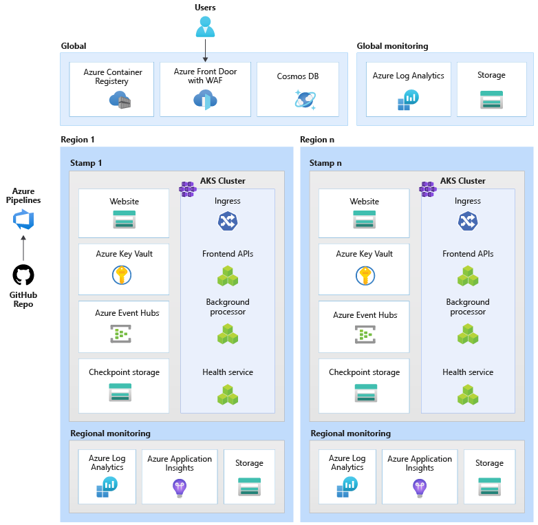
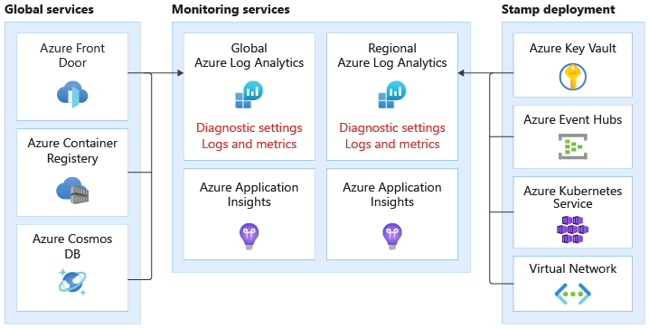

This reference architecture describes the design decisions for a mission critical workload on Azure, with focus on maximum reliability and operational effectiveness. 

## Path to production

The architecture guidance references an [example implementation](https://github.com/Azure/Mission-Critical-Online) only for illustrative purposes. It shows a simplified architecture that is still reliable and can be considered as your first step toward production. The example workload contains a microservices application that doesn't require direct connectivity to other resources of an organization. The application is accessed over a public endpoint. It's hosted in an Azure Kubernetes Service (AKS) cluster and uses other Azure-native platform capabilities.

>  [Mission-Critical open source project](http://github.com/azure/mission-critical)

As the next step, refer to the [Mission-Critical Connected](https://github.com/Azure/Mission-Critical-Connected) reference implementation that extends the implementation with added security measures. This implementation is not referenced in this architecture. For solution guidance, see [Reference Implementation - Solution Guide](https://github.com/Azure/Mission-Critical-Connected/blob/main/docs/reference-implementation/README.md).

## Business requirements and availability targets

Ultimately all design decisions will depend on the business requirements and the Service Level Agreement (SLA) and Service Level Objective (SLO). Both are percentage figures represents the amount of time in a month when the application is available. This architecture targets availability of 99.95%.

To define a realistic SLO it's important to understand the SLAs of the individual Azure components. Cloud services rely on each other and can potentially fail at the same time, therefore, their availability numbers need to be combined into a composite SLA.

Composite SLA is calculated as individual SLAs multiplied with each other. For example, 

Composite SLA = (SLA DNS × SLA Cosmos DB × SLA Front Door × SLA Active Directory)

Composite SLA = 1 × 0.99999 × 0.9999 × 0.9999 = 0.99979 = 99.979%

After accounting for deployment and application outages, this architecture targets a final SLO of 99.95%.

## Architecture

Several factors can affect an application's reliability. The application's ability to recover from performance bottlenecks, regional availability, deployment efficacy, and security are common areas that should be analyzed holistically.

Some design choices in this architecture address those factors. For example, the design supports,
- Global distribution of resources to build redundancy. 
- A _scale unit_ approach where a logical set of resources can be independently deployed to keep up with the changes in demand. 

The components of this architecture can be broadly categorized in this manner. For product documentation about Azure services, see [Related resources](#related-resources). 

### Global resources
The global resources are non-ephemeral and have the capability of being globally replicated in an active-active configuration. 

#### Global load balancer

A global load balancer is needed to route traffic to the regional deployments with some level of guarantee based on the availability of backend services in a region. Also, this component should have the capability of inspecting ingress traffic, for example through web application firewall. 

**Azure Front Door** fulfills those requirements. It allows for Layer 7 global routing, such as SSL offload, web application firewall, and others. You can configure routing rules to allow or deny incoming traffic. It has health probes that check the availability of resources provisioned in a region before routing traffic. It also has built-in content delivery network (CDN) to cache static assets. 

Another option is Traffic Manager. It uses DNS to route traffic at Layer 4. However in this architecture, the capability to route HTTP(S) traffic is required.

#### Database

All state related to the workload is stored in an external database, **Azure Cosmos DB** with SQL API. The account is replicated to each regional stamp and also has zonal redundancy enabled. It's highly recommended that the account has multi-master write enabled.  

Also, enable autoscaling at the container-level so that containers automatically scale the provisioned throughput as needed.

#### Container registry

**Azure Container Registry** is used to store all container images. The offering has geo-replication capabilities that allow the resources to function as a single registry, serving multiple regions with multi-master regional registries.

As a security measure, only allow access to required entities and authenticate that access. For example, in the implementation, admin access is disabled. The compute cluster can pull images only with Azure Active Directory role assignments.  

### Regional resources
The regional resources are deployed as part of a _stamp_ to one Azure region. These resources share nothing with resources in another region. They can be independently removed or replicated to additional regions. They, however share [global resources](#global-resources) between each other. 

In this architecture, a unified deployment pipeline deploys a stamp with these resources. 

#### Frontend

This architecture uses a single page app (SPA) that send requests to backend services. An advantage is that the compute needed for the website experience is offloaded to the client instead of your servers managing site activity. If there's a transient error, SPA can reduce the impact by using service to buffer requests. This reduces a failure point on the backend servers. The SPA is hosted as a **static website in an Azure Storage Account**. 

Another choice is Azure Static Web Apps. As with any PaaS offering, there's reduced complexity but restrictions in flexibility. There are additional considerations, such as how the certificates are exposed, connectivity to global load balancer, and other factors.

Static content is typically cached in a store closer to the client so that the data can be served quickly without reaching the backend servers. It's a cost-effective way to increase reliability and reduce network latency. A content delivery network (CDN) can provide that caching layer. In this design, built-in CDN with Azure Front Door is used. 

#### Compute cluster

Several factors affect your compute choice. What is the acceptable tradeoff between control and ease of management? Is the platform conducive to application composition? Does the service have networking, identity capabilities, scale limits that meet business requirements? Are there built-in availability features? 

In this architecture, the backend compute runs an application composed of three microservices and is stateless. So, containerization is an appropriate strategy to host the application. **Azure Kubernetes Service (AKS)** was chosen because it meets most business requirements and Kubernetes is widely adopted across many industries. AKS supports advanced scalability and deployment topologies. The AKS Uptime SLA tier is highly recommended for hosting mission critical applications because it provides availability guarantees for the Kubernetes control plane. 

Azure offers other compute services such as Azure Functions, Azure App Services. However, those options are suitable for workloads where offloading compute management to Azure is preferred. 

> [!NOTE] 
>  Avoid storing state on the compute cluster, keeping in mind the ephemeral nature of the stamps. As much as possible, persist state in an external database to keep scaling and recovery operations lightweight. For example in AKS, pods change frequently. Attaching state to pods will add the burden of data consistency.

#### Message broker

To achieve high responsiveness even during peak load, the design uses asynchronous messaging for long-running requests. As a request is quickly acknowledged back to the frontend APIs, the request is also queued in a message broker. The messages are consumed by a backend service that, for instance, handles write to a database. 

The entire stamp is stateless except for certain points, such as the message broker. Data is queued in the broker for a short period. The queue is drained after the message is processed and stored in a global database. 

In this design, **Azure Event Hubs** is used with additional Azure Storage account for checkpointing purposes. After messages are in the queue, Event Hubs guarantees at least once delivery. This means even if Event Hubs becomes unavailable, messages will be in the queue after the service is restored. However, it's the consumers responsibility to determine whether the message still needs processing. Some strategies are discussed in !coming soon!. 
    
Another choice is Azure Serice Bus that offers reliable messaging features such as a built-in dead letter queue and deduping capabilities. 

#### Managed secret store

Each stamp has its own **Azure Key Vault** that stores secrets and configuration. There are common secrets such as connection strings to the global database but there's also information unique to a stamp, such as the Event Hubs connection string. Also, independent resources avoid a single point of failure.     

### Deployment pipeline

Build and release pipelines for a mission critical application should be fully automated. No action should be done manually. This design demonstrates fully automated pipelines that deploy a clean stamp, every time. Another approach is to only deploy updates to an existing stamp. There might be added complexities that should be tested in a preproduction environment.  

#### Source code repository

A code sharing platform that is highly available. **GitHub** is a popular choice. 

#### Continuous Integration/Continuous Delivery (CI/CD) pipelines

Automated pipelines is required for building, testing, and deploying a mission workload in preproduction _and_ production environments. **Azure Pipelines** is chosen given its rich tool set that can target Azure and other cloud platforms. 

Another choice is GitHub Actions as the CI pipeline. The added benefit is that source code and pipeline can be colocated. However, Azure Pipelines was chosen because of the richer CD capabilities. 

#### Build Agents

Remove any management burden on the developers for maintenance tasks. So, **Microsoft-hosted build agents** are preferred over self-hosted agents, for reduced complexity and overhead.  

### Observability resources

Monitoring data from application and the infrastructure must be always be available for processing and analysis. The implementation provides a baseline that gives you holistic observability of the system. 

- **Azure Log Analytics** is used to store logs and metrics for all application and infrastructure components. 
- **Azure Application Insights** is used to collect all application monitoring data.

Monitoring data for global resources and regional resources should be stored independently. A single, centralized observability store isn't recommended to avoid a single point of failure. Cross-workspace querying is used to still achieve a single pane of glass.

In this architecture, data from shared services such as,  Azure Front Door, Cosmos DB, Container Registry are stored in dedicated instance of Log Analytics Workspace.

Similarly, monitoring resources per stamp must be independent. If you tear down a stamp, you still want to preserve observability. Each regional stamp has its own dedicated Application Insights and Log Analytics Workspace. The resources are provisioned per region but they outlive the stamps. 

## Request flow

!coming soon!
- image
- complete request flow of a business transaction.

## Related resources

For product documentation on the Azure services used in this architecture, see these articles. 
- [Azure Front Door](/azure/frontdoor/)
- [Azure Cosmos DB](/azure/cosmos-db/)
- [Azure Container Registry](/azure/container-registry/)
- [Azure Log Analytics](/azure/azure-monitor/)
- [Azure Key Vault](/azure/key-vault/)
- [Azure Kubernetes Service](/azure/aks/)
- [Azure Application Insights](/azure/azure-monitor/)
- [Azure Event Hubs](/azure/event-hubs/)
- [Azure Blob Storage](/azure/storage/blobs/)

## Next

Deploy the reference implementation to get a full understanding of reources and their configuration. 

> [!div class="nextstepaction"]
> [Implementation: Mission-Critical Online](https://github.com/Azure/Mission-Critical-Online)